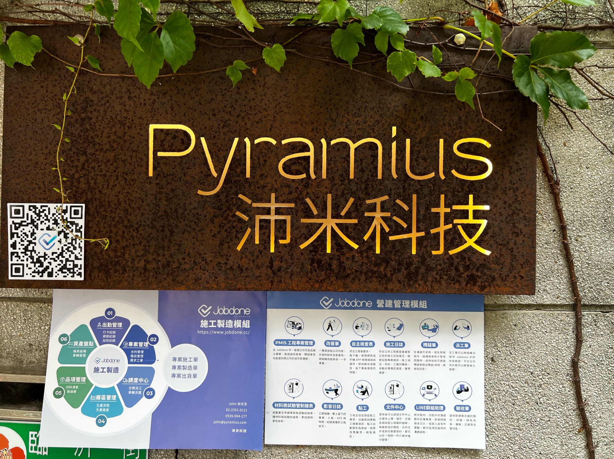
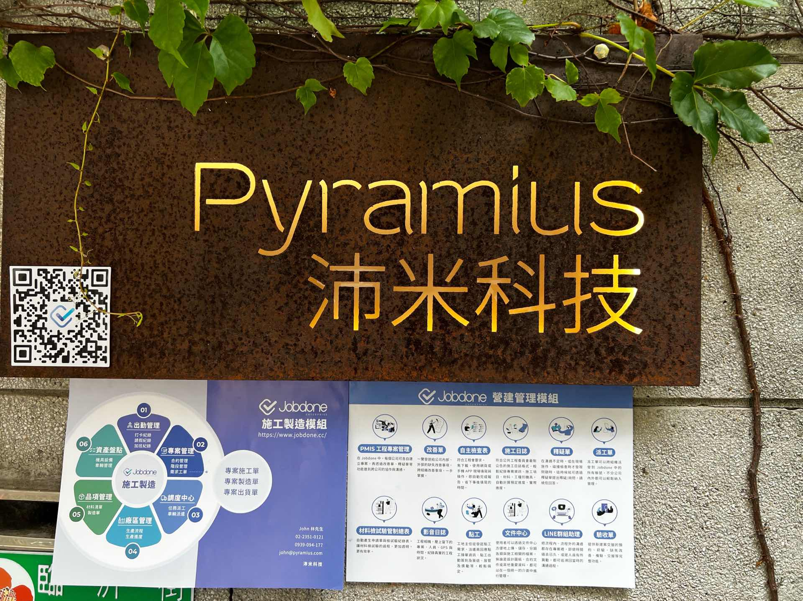

# APP拍照壓縮比

Jobdone的照片可以來自您的手機相簿、APP直接拍照。

若您使用APP拍照，在APP中可以設定所有照片的「壓縮比」、「是否同時存入相簿」、以及「預設浮水印設定」。

因為儲存空間以及上傳下載容量的問題，照片的檔案大小可能會是您在意的。我們提供了三種壓縮方式：

* 原圖
* 標準
* 效能

非常建議您以及您的員工選擇效能的壓縮，壓縮後會有一點點的細節損失，但是以現代手機的強大拍照功能，這個損失幾乎不影響到照片的使用，

***

以iPhone的原始格式為例，我們用手機的原生相機，拍一張HEIC的照片，用Apple自已的壓縮HEIC大小約為**3.2MB**。這一張HEIC若轉為PNG，檔案大小會變成**18.6MB**，如下圖：

***

如果您在Jobdone App中選擇原圖，拍照後會存為JPG，大小約為**11.53MB**，效果如下圖：

***

而若您選擇標準壓縮，拍照後的JPG大小會是**949KB**，效果如下圖：

***

最後，建議您選擇效能壓縮，拍照後的JPG大小會是**322KB**，效果如下圖：

!!! info
    您可以下載後放大比較，用不同電腦下載後，看到的檔案大小數字可能會略有不同。

