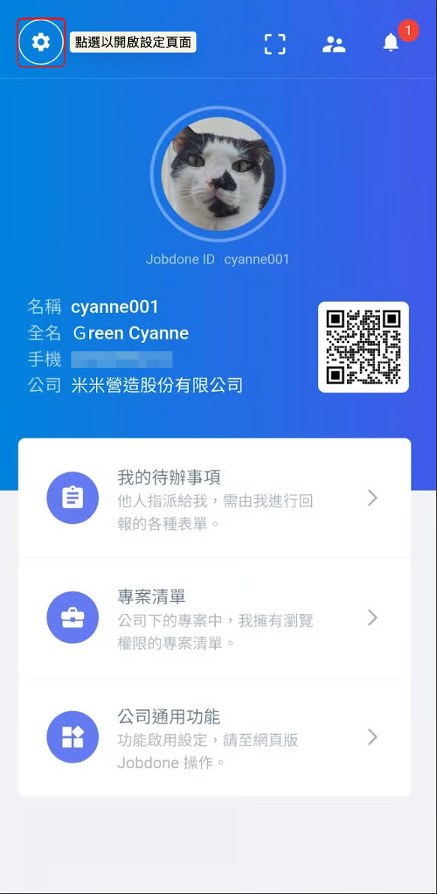
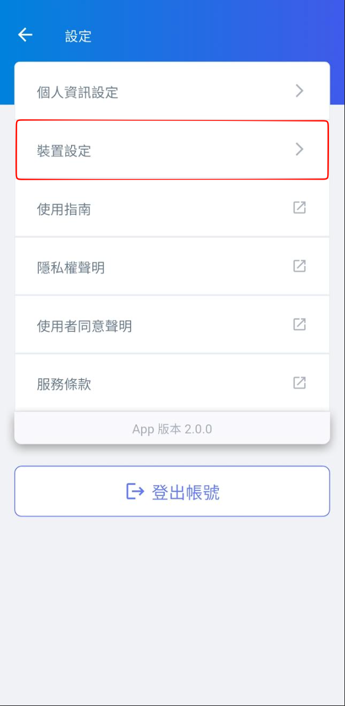
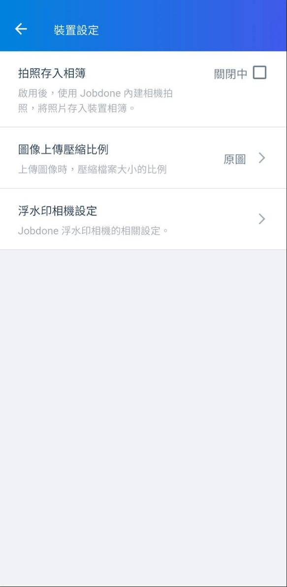
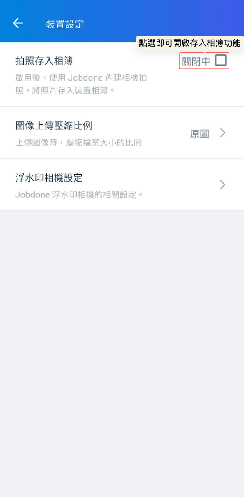
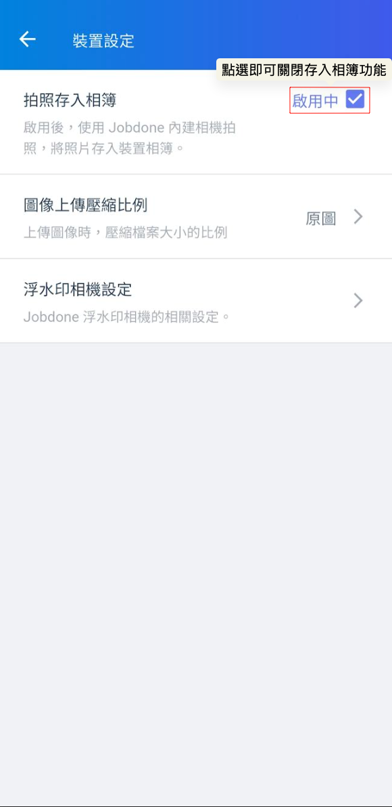
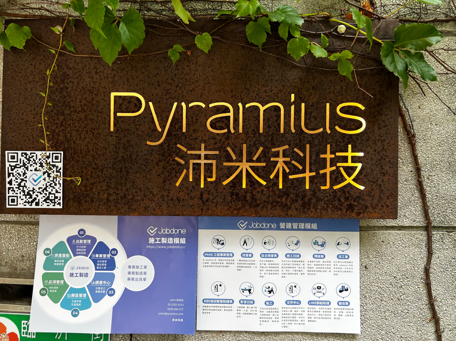
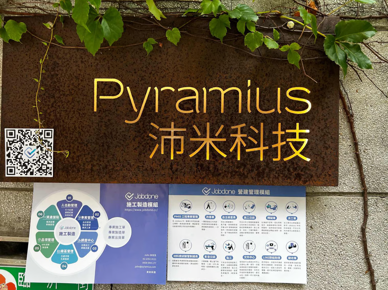
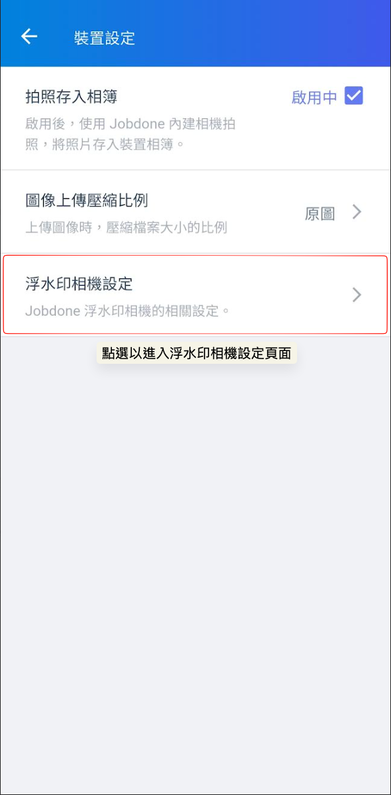
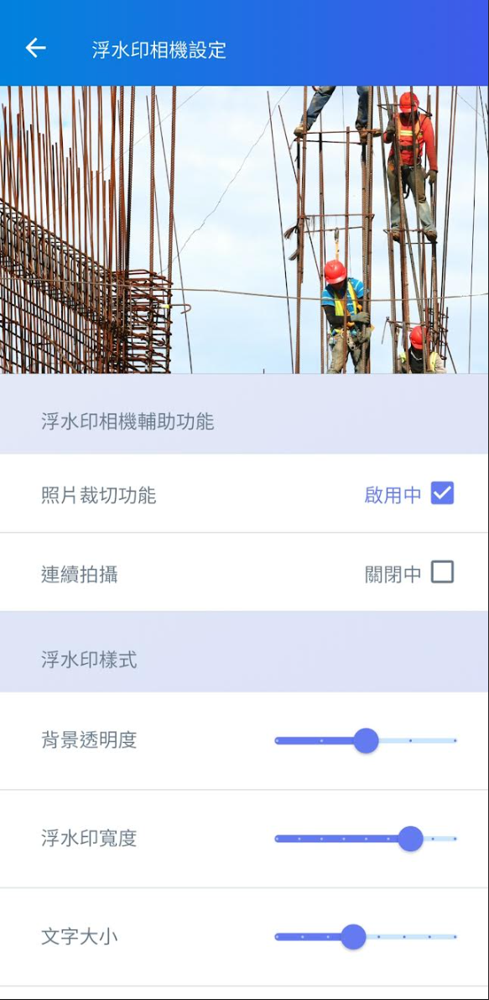
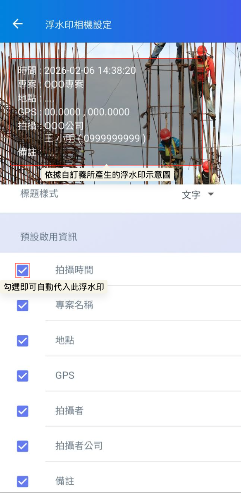

# 裝置設定

### 01｜裝置設定 

系統針對圖片的拍攝及儲存有精細的設定，包含**拍照存入相簿**、**圖像壓縮比例**、**浮水印相機設定**。

開啟 App 主畫面後，請點選左上方的  圖示進入系統設定頁面，並選取 。

  

#### 01 - 1｜拍照存入相簿

在使用 App 端功能拍攝圖片時，針對拍攝照片的儲存邏輯，系統提供了高度的隱私與空間管理彈性。您可以根據個人的使用習慣或手機容量狀況，透過系統設定決定照片的流向。

當您使用 Jobdone 內建相機功能或『專案浮水印相機』（標註時間、座標、專案資訊等）進行拍攝時，可於設定中切換以下模式：



開啟此功能後，透過系統拍攝的每一張工程照片，除了會上傳至 Jobdone 雲端外，亦會自動同步儲存一份副本至您的手機原生相簿中。

> 實務效益：方便您在離線模式下，或是透過通訊軟體（如 Line）快速分享照片給協力廠商，且即便日後刪除雲端紀錄，手機仍保有原始檔備份。



若關閉此功能，拍攝的照片將僅存在於 Jobdone App 內部與雲端伺服器，不會佔用手機相簿的空間。

> 實務效益：營建工程照片動輒數千張，此模式能有效避免個人相簿被大量施工照片（如鋼筋、泥作、垃圾清理等）佔據，保持個人手機空間的純淨，並減緩手機容量爆滿的可能性。



 

***

在裝置設定中，您可以針對現場拍攝與資料傳輸的效率進行深度自定義。除了決定照片是否同步存入手機相簿外，還包含以下核心設定：

#### 01 - 2｜圖像上傳壓縮比例

您可以根據案場的網路環境（如地下室收訊較弱）調整上傳品質。選擇較高的壓縮比可大幅提升上傳速度並節省流量；若需保留極高精細度（如裂縫觀測），則可調低壓縮比以維持影像原真。

值得一提的是，即使在設定中選擇了『效能』模式（最大化壓縮），Jobdone 的圖像處理引擎仍能保持極佳的視覺辨識度。

有關壓縮比詳細說明，請參閱 ➙ [App拍照壓縮比](app-pai-zhao-ya-suo-bi)

  

***

#### 01 - 3｜浮水印相機設定

針對營建現場高頻率的拍照需求，您可以預先配置相機行為：

!!! info
    #### 📸 工程相機補充說明
    
    * **預設資訊顯示：**&#x7576;您啟用工程相機時，系統會自動帶入您在『裝置設定』中勾選的預設啟用資訊（如專案名稱、施工日期、經緯度座標等）。這意味著每次開啟相機時，這些數位標籤會自動浮現於取景畫面上，確保每張照片都能帶到精準的現況資訊。
    * **拍攝時隨時修改：**&#x96D6;然系統提供了預設值，但在變幻莫測的施工現場，您仍保有最高的調整權限。在拍攝過程中，若需要隱藏某個浮水印資訊，或需要額外標註（如隱蔽工程驗收），您可以直接在相機介面上進行即時修改。



開啟後，可在拍攝時針對照片進行裁切處理，方便聚焦於特定的施工細節。



開啟後，無需反覆進出快門，適合針對連續工序或大面積區域快速紀錄。



在裝置設定中，您可以針對浮水印的呈現進行微調，確保數位標籤既能清晰辨識，又不干擾照片本身的細節：

* 背景透明度：調整浮水印文字後方底色的透明程度。
* 浮水印寬度：設定浮水印在畫面中所佔據的寬度比例。
* 文字大小：依照您的檢視需求縮放標記文字。

> **實務應用**
>
> 1. 若拍攝背景較為雜亂，可調低透明度（增加底色）以突顯文字內容，



您可以自定義浮水印呈現的資訊（如：專案名稱、拍攝時間、地點、GPS、拍攝者等），確保每張照片都具備標準化的數位標籤。



  

