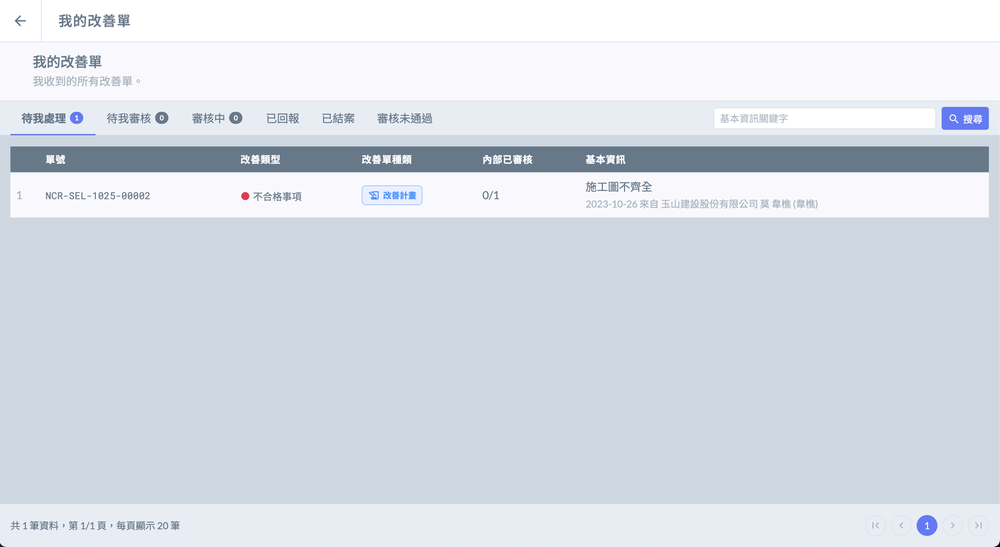
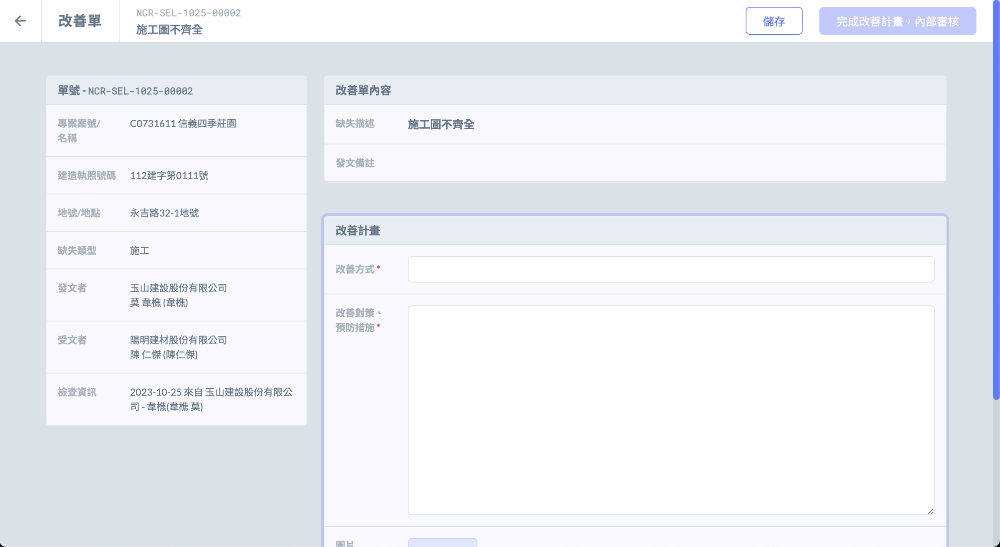
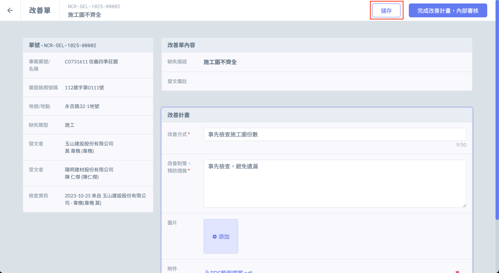
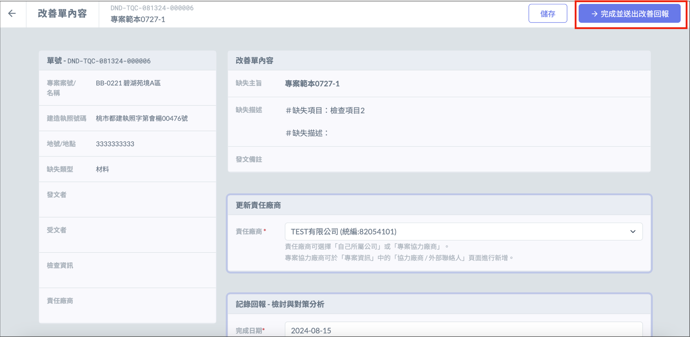
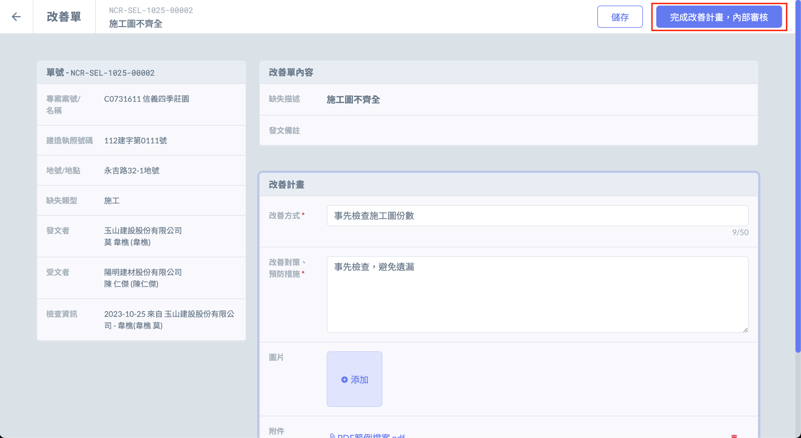
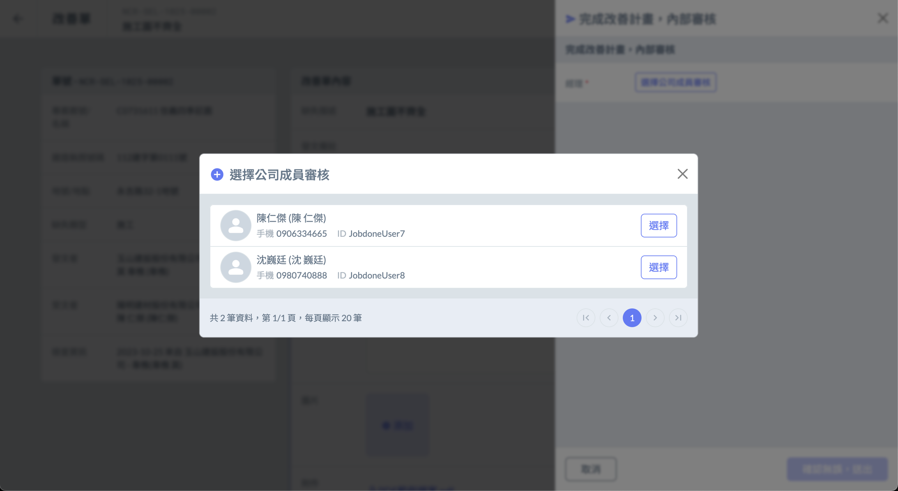

# 填寫改善單

---

# 網頁版

## 進入改善單

- 使用者登入帳號後，在左側選單點選 「 我的改善單 」 進入改善單列表。

## 改善單填寫

- 進入改善單列表後，點選改善單，填寫改善計畫／改善回報。

## 填寫完畢

- 若改善單不會馬上送出，可點選 「 儲存 」 暫不發送。

- 若改善單不需內部審核，可直接點選 「 完成並送出改善回報 」 。

- 若改善單須經內部審核

1. 點選 「 完成改善計畫，內部審核 」 ，即可選擇審核人，送出後開始進行內部審核。
2. 內部審核通過後，即可送出改善計畫／改善回報給發文方。

---

# App

## 進入改善單

- 登入App後，進入 「 我的待辦事項 」 ，在 「 待我處理 」 分頁中可查看未處理的改善單。

  

## 改善單填寫

- 點選 「 完整資訊 」 可查看該張改善單的相關資訊。

  

- 點選 「 編輯 」  按鈕，即可填寫改善計畫／改善回報相關資訊。

  

## 填寫完畢後

- 若改善單需送交內部審核

1. 點選 「 填寫完成 」 及可送交內部審核。

    
  

1. 提交內部審核後的改善單可在 「 審核中 」 查看，如須修改改善單，可點選 「修改內容」 將改善單從內部審核流程退回修改。

  

- 如不須內部審核，可直接送出改善計畫／改善回報給發文方。

- 已送出回報給發文者的改善單可在 「已回報」 分頁中查看。

