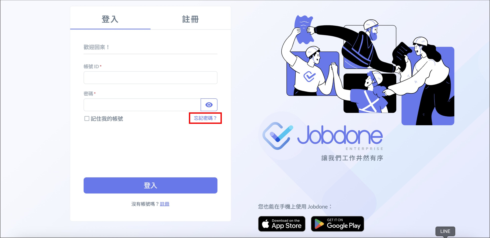
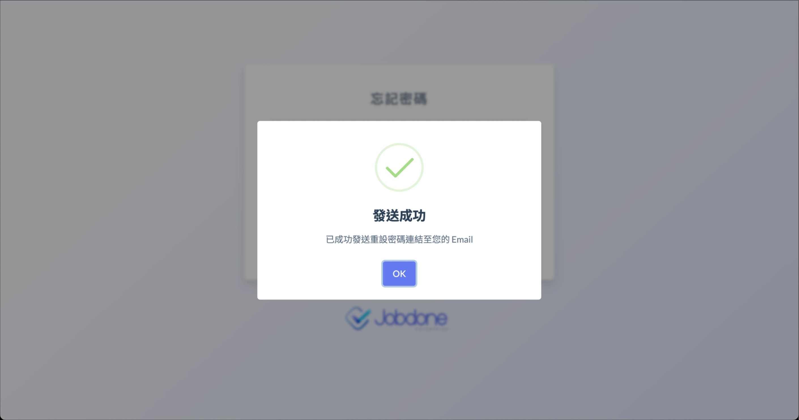
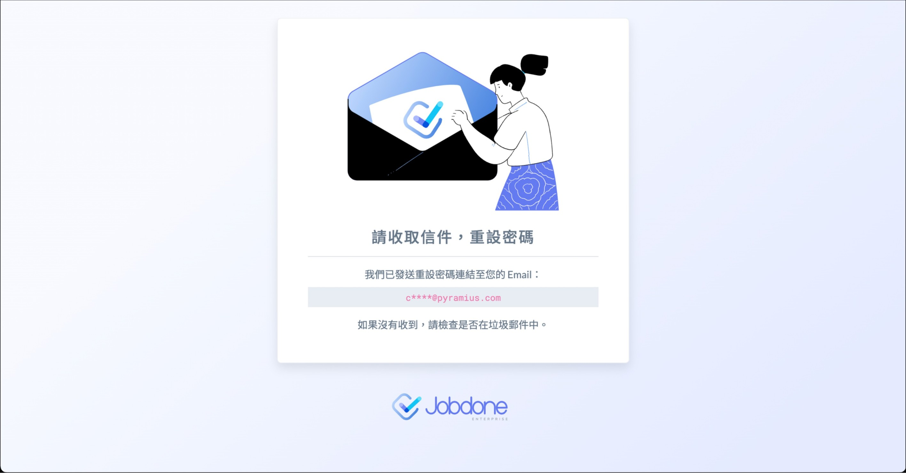
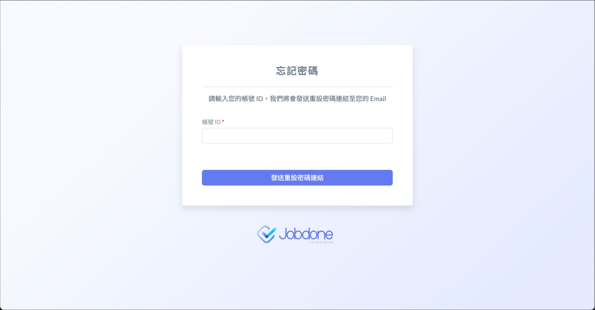

# 忘記密碼

Jobdone的帳號所有權屬於個人，所以若忘記密碼公司是沒辦法幫您重設的！

您可以使用 「 忘記密碼 」 功能找回密碼，僅能由網頁進行，請按下列步驟操作：

!!! warning
    請注意：使用 「 忘記密碼 」 功能需使用註冊時帳號時填寫的電子信箱。

***

#### 一、點選 「 忘記密碼 」 按鈕。

#### 二、輸入**帳號ID** 並按下 **「 發送重設密碼連結 」。**

#### 三、發送成功後，按照系統提示至信箱重新點擊連結設定新密碼。

#### 四、點擊連結，進入重設密碼頁面設定新密碼。

#### 五、重設密碼成功後，即可使用新密碼登入。

