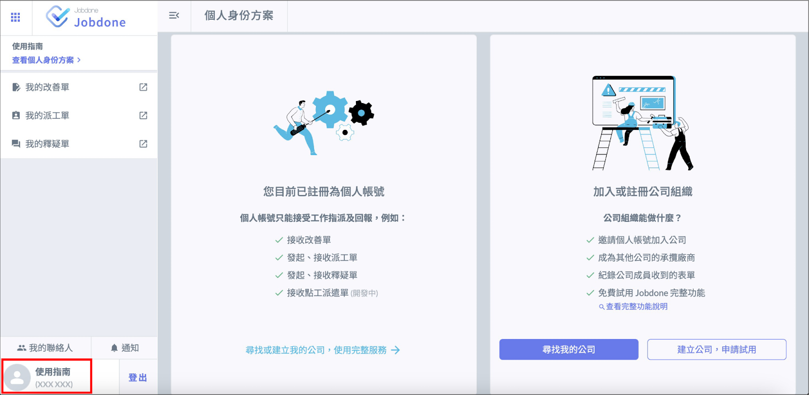
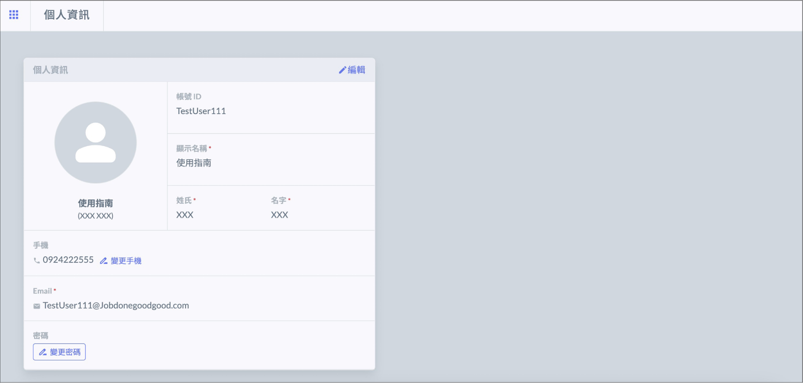
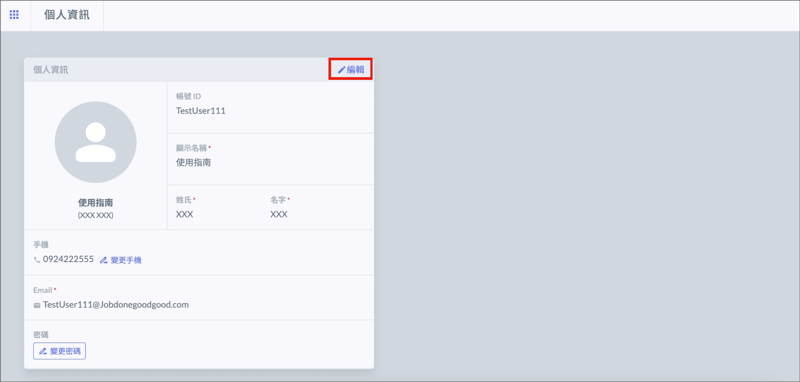
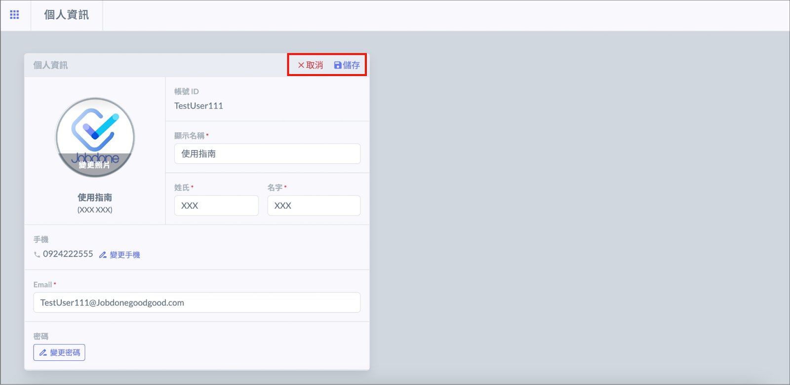
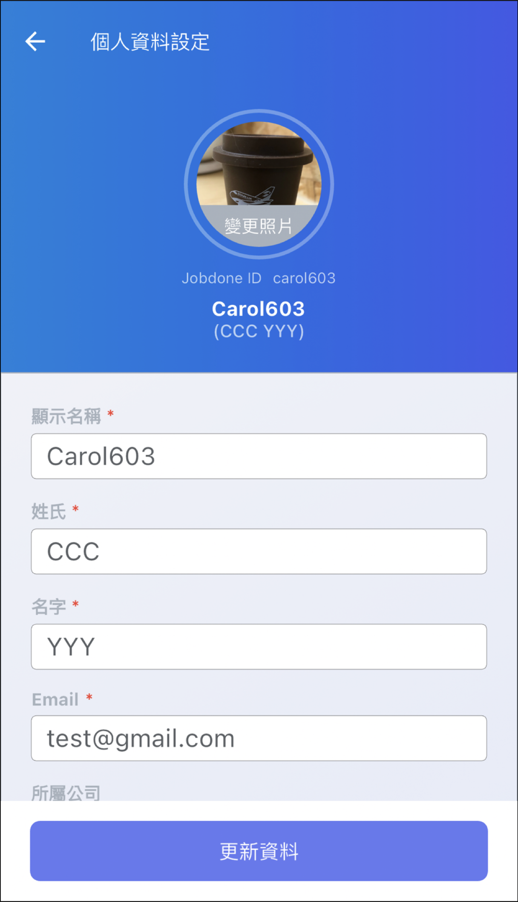

# 個人資料

!!! info
    個人資料是由帳號擁有者自行建立及更新，建議您填寫可容易辨識的名稱及頭像，讓其他人更容易找到您。

## 網頁版

#### 一、登入後，點選左下角進入個人資訊頁面。

#### 二、點選右上角 「 編輯 」 即可修改個人資訊。

#### 三、修改完成後，按下右上角 「 儲存 」 即可變更資訊；按下 「 取消 」 ，則可恢復原來的資訊。

**請注意：如需變更手機，需重新驗證**[**手機號碼**](../sign_up#er-yan-zheng-shou-ji)。

## APP

#### 一、進入 APP 後，點選左上角的齒輪符號 。

\

#### 二、點選 「 個人資訊設定 」 。

\
 

#### 三、編輯完成後，按下 「 更新資料 」 即可儲存。

\
\
\

