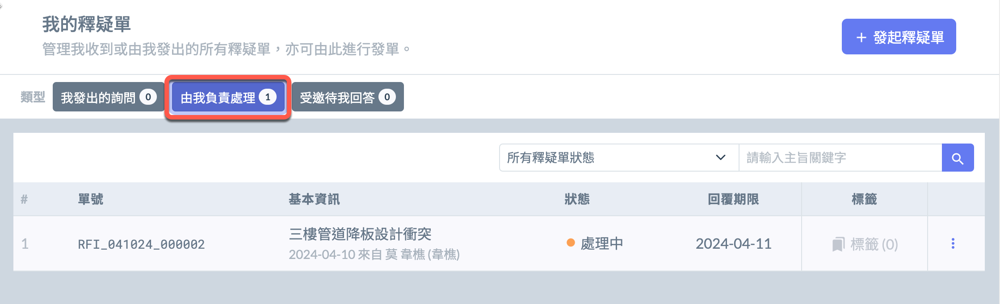
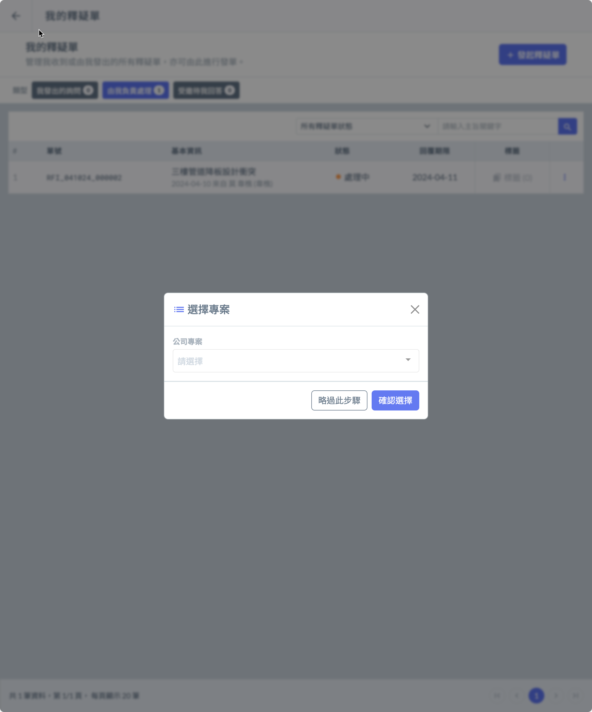
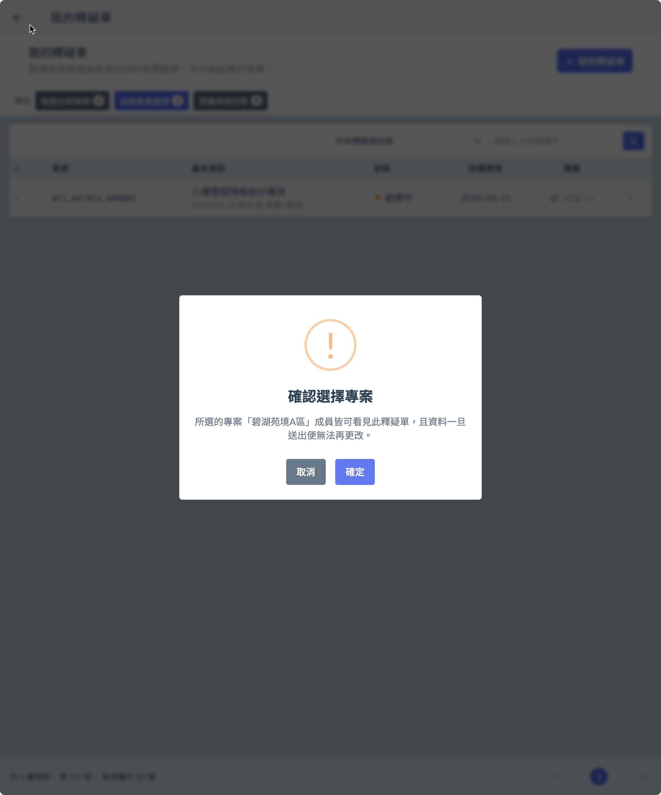
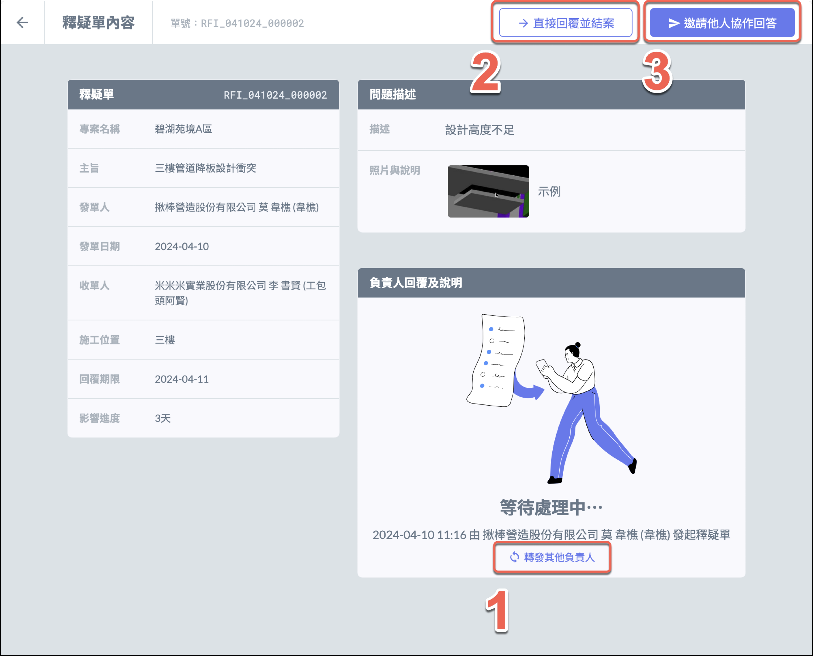
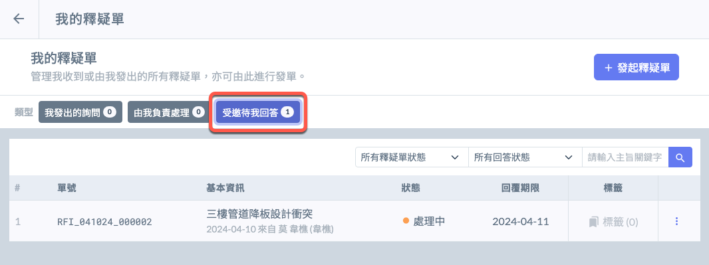
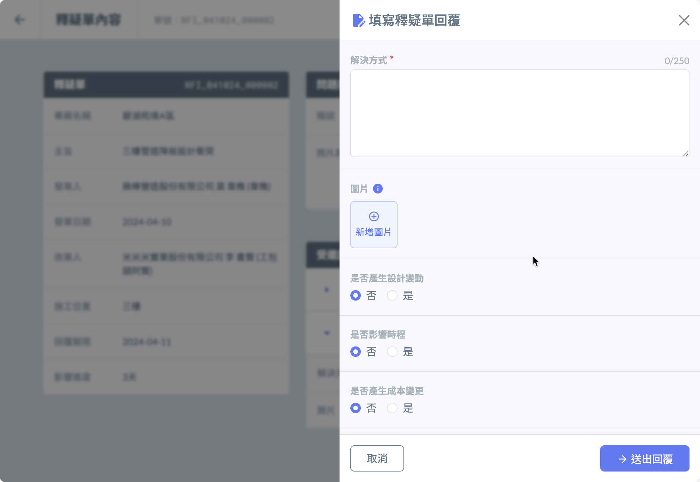

# 釋疑單回覆

1. 收到釋疑單後，可以在 「 由我負責處理 」 的標籤中看到該釋疑單。

2. 打開釋疑單後，請先選擇該釋疑單所屬專案。

**注意：務必要先選擇該問題所屬專案，才能將該釋疑單紀錄到專案下；若問題無所屬專案，則不須選擇。**

 

3. 收到的釋疑單後，可進行以下動作：

* **轉發其他負責人**

若收單人判斷該問題應由專案下的其他工程師負責，可直接將釋疑單轉發給負責人。

* **直接回覆並結案**

收單人直接答覆釋疑單中的問題，則該張釋疑單即結案。

* **邀請他人協作回答**

若收單人判斷該問題需要其他人參與回覆，此時責任人就會鎖定在自已，並可以邀請專案外或公司外的其他人員參與回答，也可以發出邀請多位人員協作回答。

4. 受邀回答者可以在 「 受邀待我回答 」 的標籤中看到該釋疑單，打開釋疑單後可在右上角點選 「 + 填寫回覆 」 作答。

5. 當有受邀者完成回答，負責人可以隨時在他的畫面看到回覆的結果。在任何時候負責人都可選擇 「 直接回覆並結案 」 或 「 再邀請其它人協作回答 」，也可以參考其它人的回答作出總結，並回覆原提問人。

6. 原提問人收到回覆後，即結束該釋疑單流程。若依然對回答有疑問，需另外再發起新的釋疑單。
