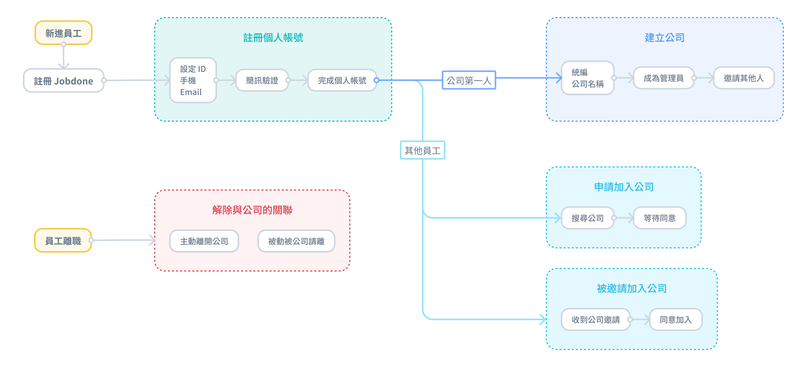
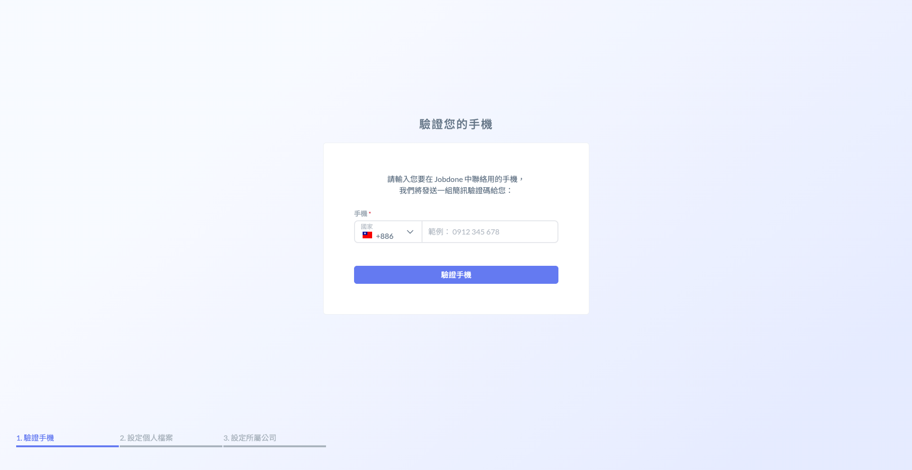
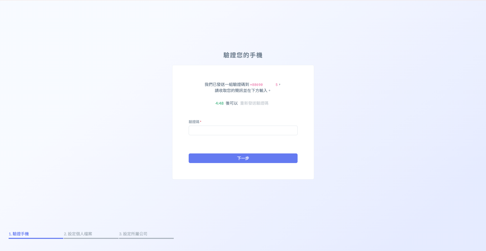
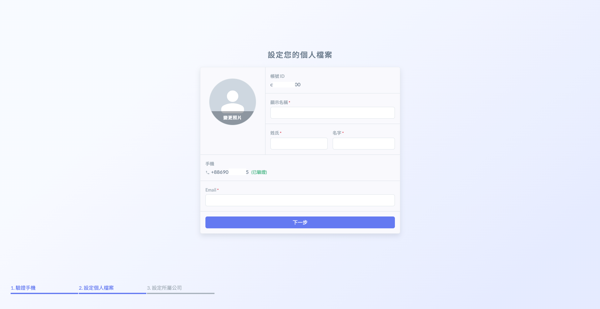
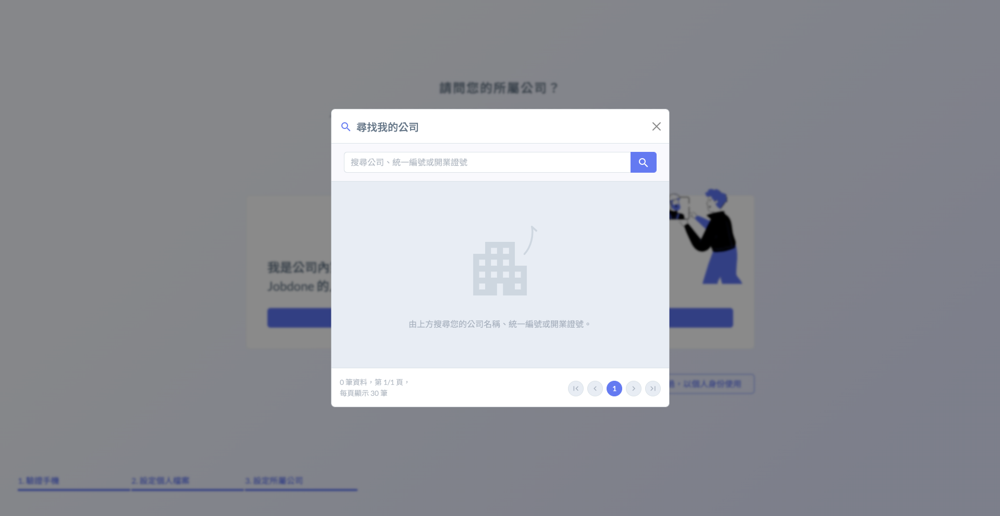

# 註冊

Sign Up

!!! info
    使用網頁版或 APP 都可以註冊個人帳號。
    
    
    若要同時建立公司資料，請使用網頁版。

Jobdone 的帳號是屬於個人所擁有，您可以自行設定顯示名稱、ID、Email 等基本資料。您需要先建立個人帳號，才能建立或申請加入一個公司。

# 簡易流程圖

# 網頁版

### 一、建立帳號 ID 與密碼

- 進入[註冊頁面](https://jobdone.cc/Index)，建立帳號ID與密碼。

### 二、驗證手機

- 輸入手機號碼，並接收系統發送的驗證碼。

若無法收到驗證簡訊，請關閉 Whoscall 等類型的的阻擋軟體再嘗試。

### 三、設定個人檔案

- 請輸入您的個人資料。

!!! warning
    提醒您：請務必填寫有效的個人信箱，忘記密碼才能重新設定。

### 四、設定所屬公司

建立公司

- 如果您是公司第一個使用者，需要為公司建立資料，請點選 「 建立公司 」 。

尋找我的公司

- 如果您的公司已經正在使用系統，請點選「尋找我的公司」，以便申請加入。

不需要使用公司功能

- 如果您打算以個人身份使用，請點選 「 略過，以個人身份使用 」 。

### 五、註冊成功

- 完成註冊個人帳號後，如果您已申請加入您的公司，可在畫面上看到申請狀態，所見畫面如下：

- 如果您已建立／加入公司，畫面如下：

- 如果您以個人身份加入，畫面顯示如下：

---

# APP 註冊

!!! info
    APP **僅能註冊個人帳號**，如註冊後需加入公司組織，請參考

### 一、開始註冊

- 開啟 APP 點選註冊按鈕，設定帳號 ID 與密碼。

  

### 二、手機驗證

- 輸入手機號碼，並接收系統發送的驗證碼。

若無法收到驗證簡訊，請關閉 Whoscall 等類型的的阻擋軟體再嘗試。

### 三、設定個人檔案

### 四、註冊成功

