# 影音日誌

影音日誌能以 「 日 」 為單位，紀錄影片及照片，並提供**分項工程**、**施工項目**、**材料**、**建地結構**與**備註**等相關註記，讓日後查閱更加清楚便利。

## 網頁版 

### 啟用影音日誌 

由此專案的專案經理，於專案基本資料中啟用影音日誌功能。

!!! info
    編輯專案基本資料僅能在網頁版操作。

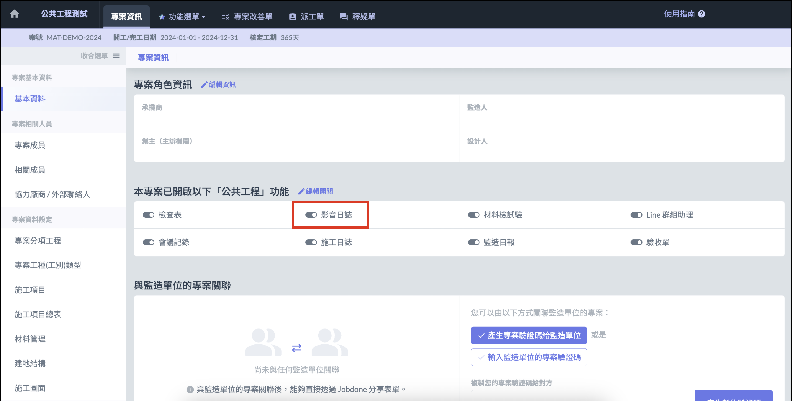

### 後台瀏覽

點選進入影音日誌後，可進入後台瀏覽，顯示模式可分為 「 **紀錄列表 」** 及 「 **影音一覽 」**，選擇列表內容即可查看詳細內容，也可以編輯或刪除相關資訊。

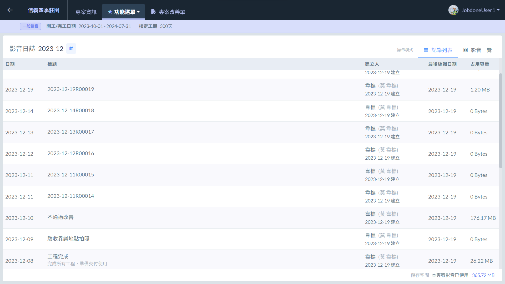

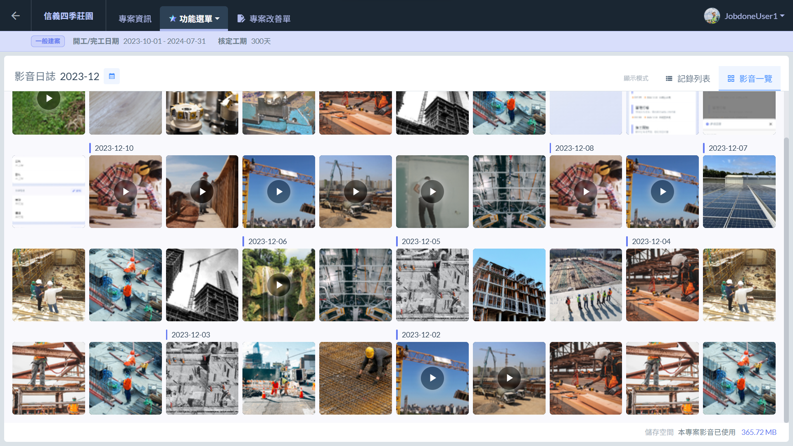

***

## APP

### 設定拍照存入相簿 

登入 APP 後，點選左上角 「 設定 」 圖示，點選 「 裝置設定 」，即可設定是否將照片存入相簿中。

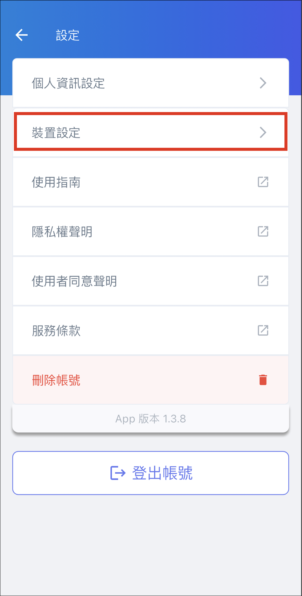 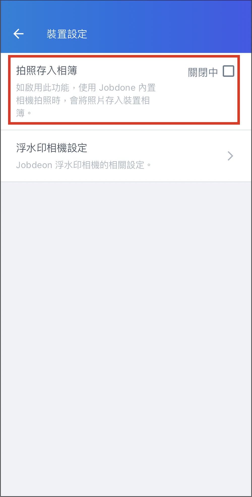

### 新增紀錄 

進入專案後選擇影音日誌功能，點選下方的 「 新增日誌 」 選擇日期，並選擇 「 開始記錄 」，即可開始填寫紀錄內容。開始紀錄後，紀錄將立即生成並佔用紀錄流水號。

!!! info
    影音日誌的 「 新增日誌 」 僅能在 APP 進行，且需開啟手機 APP 使用拍攝相片及錄製影片權限。

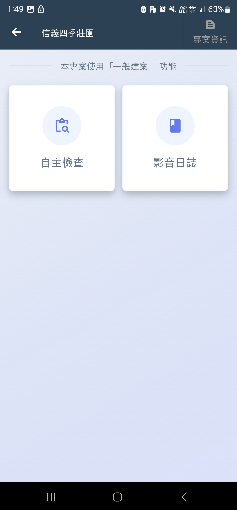 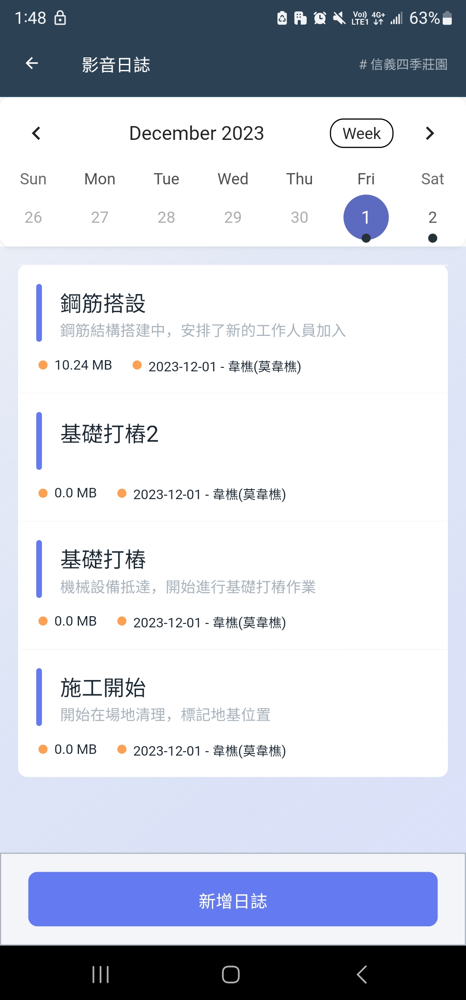 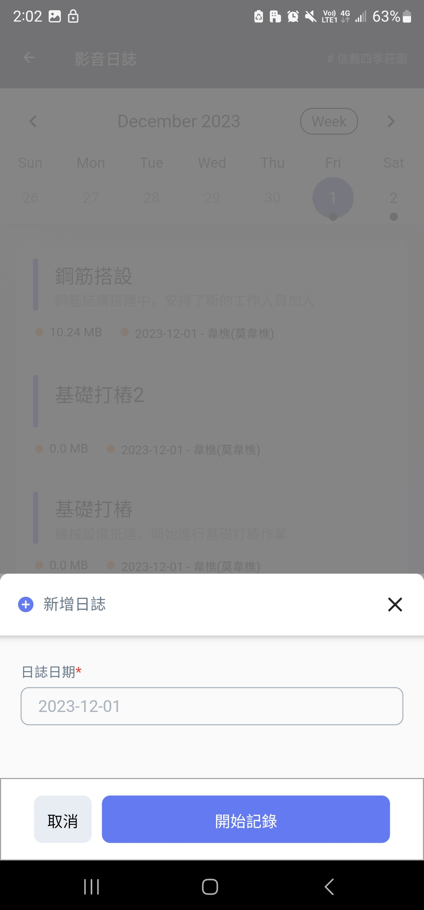 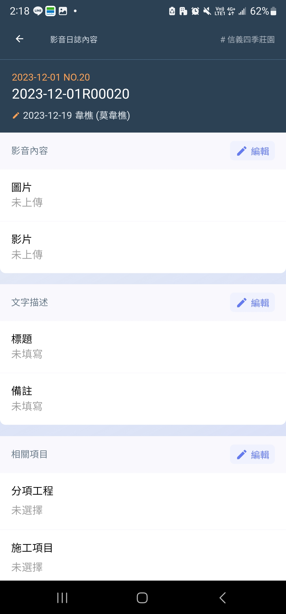

### 工程相機 ( 帶專案浮水印 ） 

拍照專案資訊浮水印。資訊包括案名、座標、拍攝人等。\
浮水印另外提供備註(可填寫例如檢查標準、檢查結果)功能，點選"**點選編輯**"即可進行填寫。(下方圖例2與)

!!! info
    如需 **橫向拍照 ( 浮水印轉向 )**，需**開啟手機自動轉向功能**。

 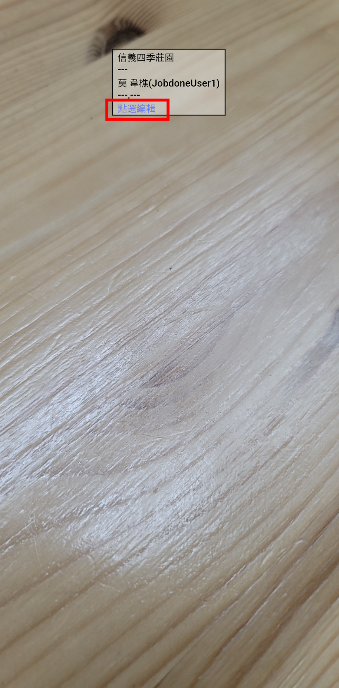 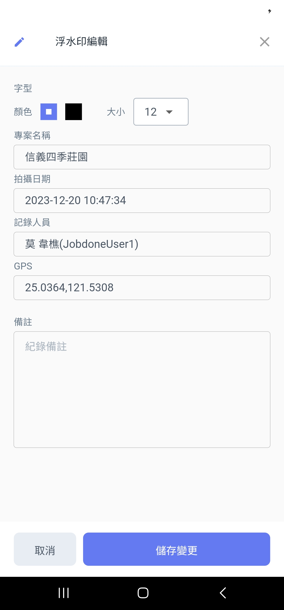

