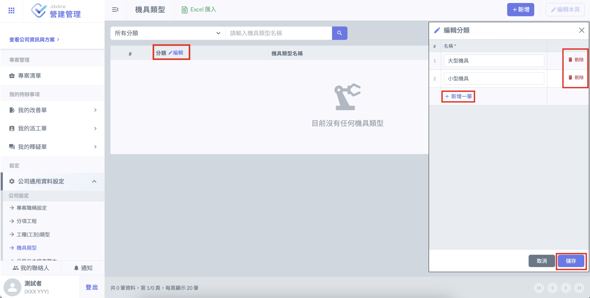
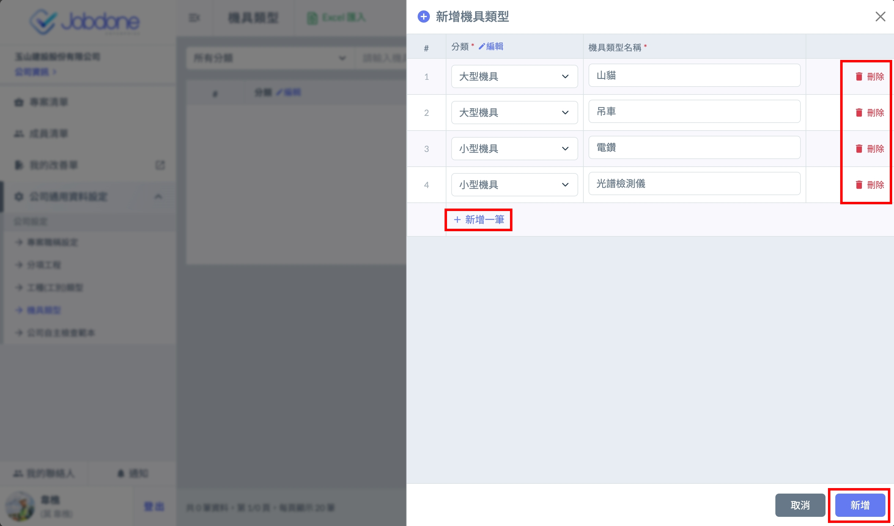
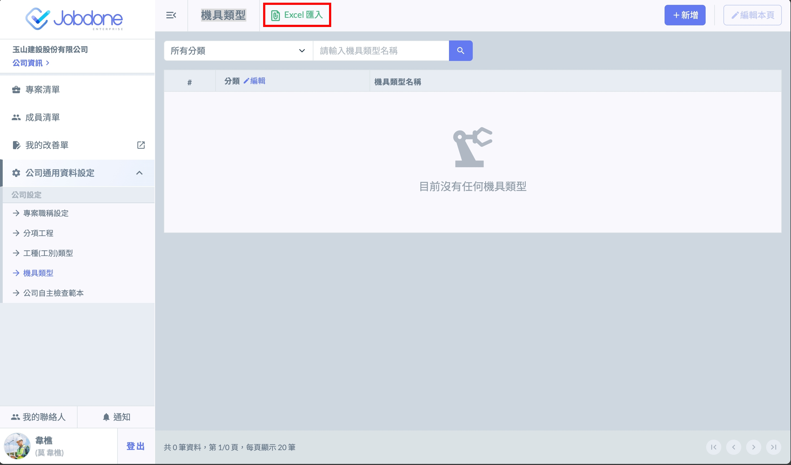

# 新增機具類型

## 手動新增

### 設定分類（須先完成） 

手動新增須先設定分類，用來管理機具類型 類型，點擊分類旁的 「 編輯 」 新增分類。

### 填寫機具類型 

點選右上角 「 新增 」 按鈕， 點擊 「 新增一筆 」，選擇分類後即可填寫填寫機具類型。

***

## **匯入Excel 檔案** 

!!! warning
    檔案匯入功能僅可以在沒有任何機具類型的情況下使用。

機具類型可使用指定格式的 Excel 批次匯入，點擊 「 Excel 匯入 」 按鈕開啟檔案匯入功能。

### 下載並匯入 Excel 模板 

點選下載 「 機具類型 Excel 模版 」，使用模版填妥資料，上傳檔案後點選 「 匯入 」 即可批次匯入機具類型資料。

