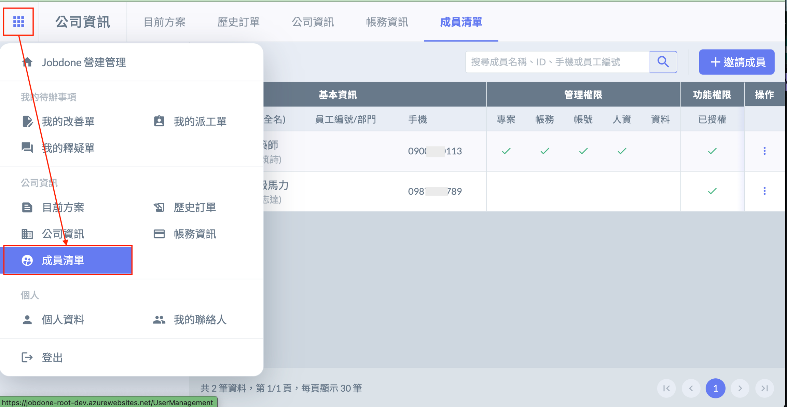
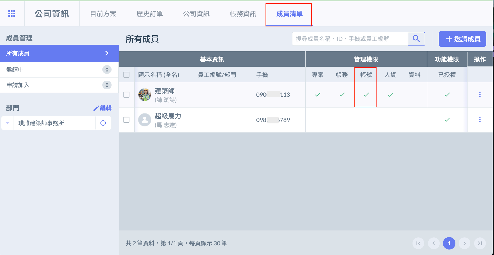
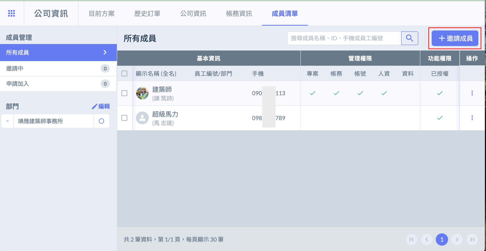
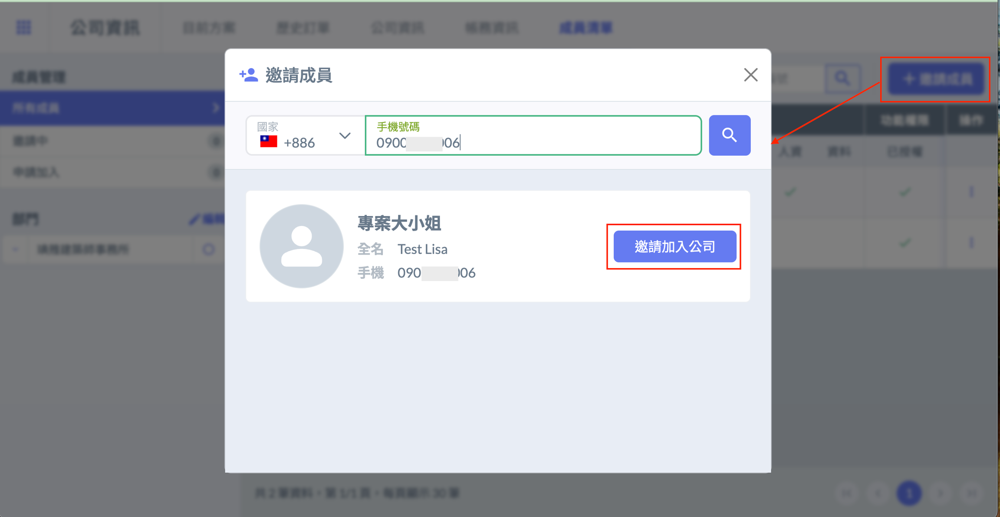
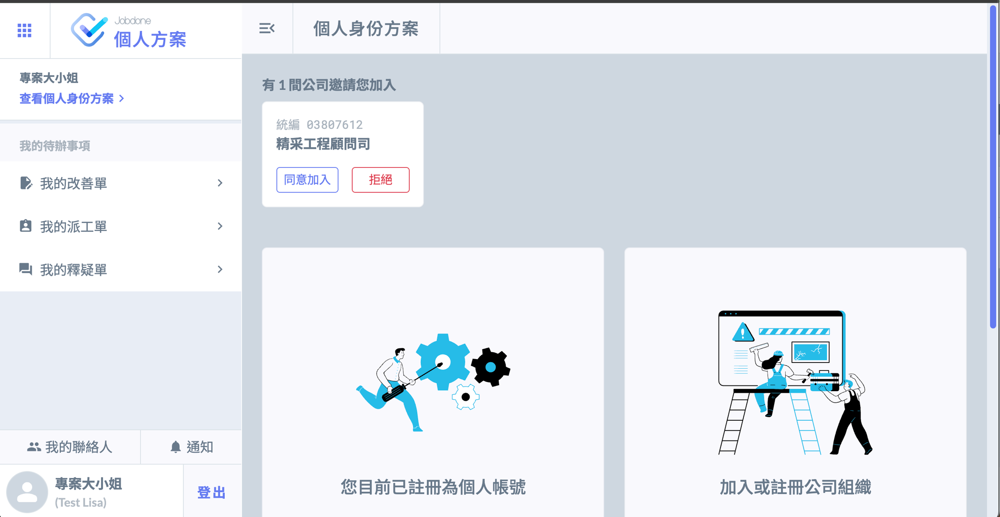

# 加入公司

Join a Company

---

# 加入公司

加入公司成員分為 「 公司主動邀請 」 與 「 成員提交申請 」 ，兩者都只能以網頁進行操作。

## 公司主動邀請

### 1. 確認帳號管理權限

以公司成員的帳號登入後，進入 「 成員清單 」 頁面，確認自己是否有 「 帳號管理權限 」。

### 2. 邀請成員

點選右上角 「 邀請成員 」 輸入邀請對象電話後發出邀請，成員同意後即可加入公司。

## 成員提交申請

### 1. 尋找我的公司

欲加入的成員點擊 「 尋找我的公司 」 ，即可使用公司名稱、統一編號、開業證號搜尋並申請加入公司。

### 2. 公司審核同意

公司登入有帳號管理權限的帳號，進入成員清單頁面，點選申請加入，可查看申請加入公司的使用者列表，並允許或拒絕加入申請。

## APP

!!! info
    在App上可操作 「[申請加入公司]()」、「[同意／拒絕邀請]()」 與 「[主動離開公司]()」

## 申請加入公司

## 操作步驟

1. 點選首頁公司欄位的「＋」號，並點選 「尋找我的公司」。
  

或是點選左上設定按鈕，進入個人資訊設定頁面，點選 「加入公司」。
  

2. 找到公司後，點選 「申請加入」。
  

3. 申請加入後，如須取消，可點選 「取消申請」。

4. 公司接受／拒絕申請後，App將收到通知。
  

## 同意／拒絕邀請

## 同意

進入公司邀請／申請加入頁面頁面後，可同意公司邀請。
  

## 拒絕

點選 「拒絕邀請」，即可拒絕該公司的邀請。
  
