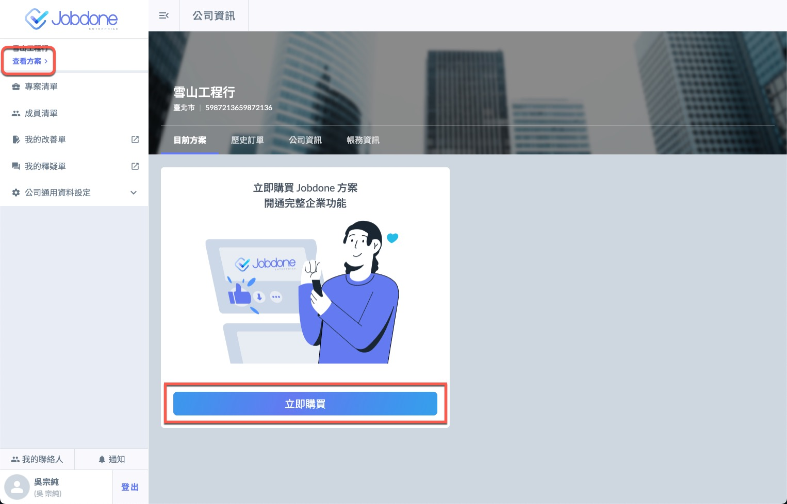
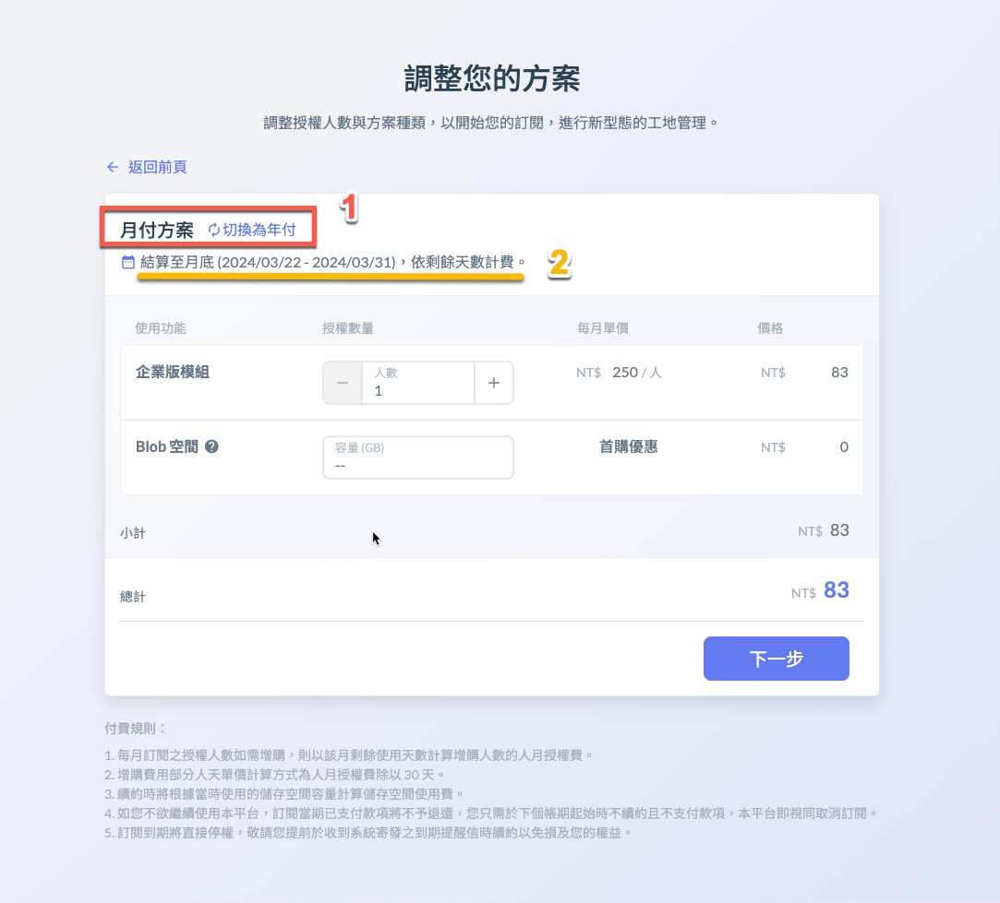
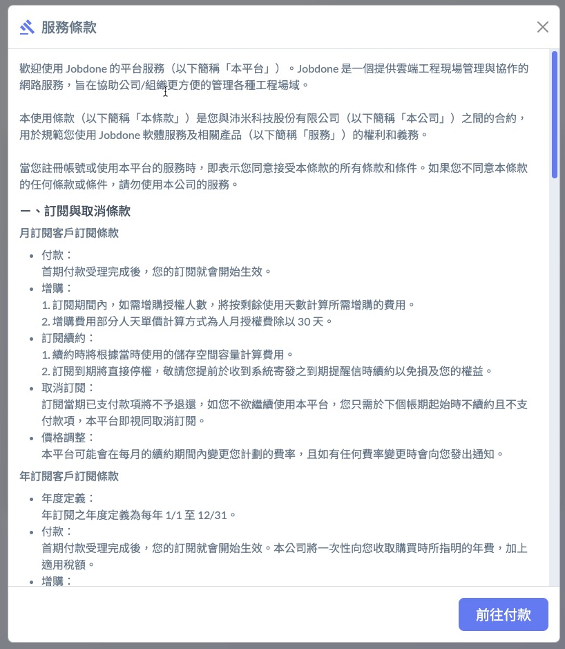

# 付費流程

Jobdone 的費用是以 「 授權數 (License) 」 跟 「 檔案容量 (Capacity) 」 計費。

!!! info
    購買授權後，請至成員清單進行[指派授權](../member#zhi-pai-shou-quan)

1. 登入具備公司 「 帳務 」 的權限後，點選 「 查看公司資訊與方案 」。
2. 在目前方案的頁面點選 「 立即購買 」。

3. 選擇月付或年付方案。以圖中的示例，本月的費用系統會自動以到月底的剩餘天數計算所需的金額。

!!! warning
    請注意：公司只能統一採用月付或年付，更換方案須等合約季度到期。

4. 請填入您的帳務資訊，並閱讀 「 服務條款 」

5. 接下來您會連結到綠界的第三方信用卡支付網頁，請依照畫面說明完成付款程序。

