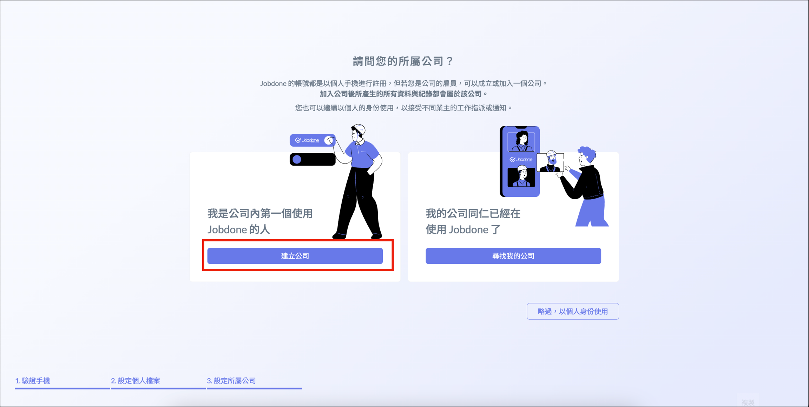
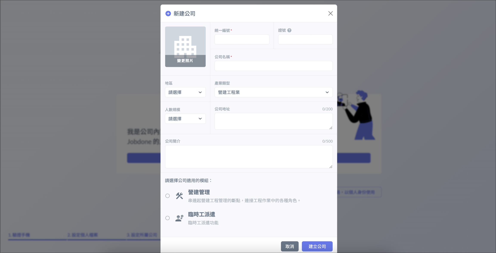
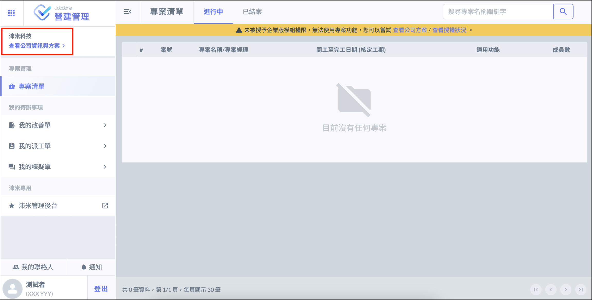
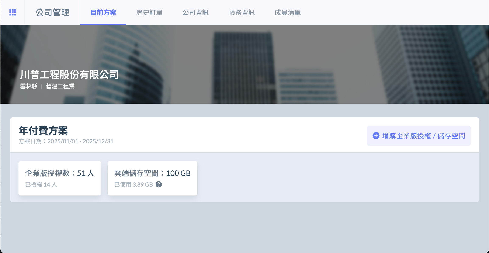

Register a Company
# 建立公司

註冊個人帳號後，若您是公司第一位使用 Jobdone 的用戶，可點選 「 建立公司 」 ，輸入相關資料並選擇[適用模組]()後，即可建立公司。

!!! danger
    每個統編只能創建一個公司資料，您必須獲得公司的授權才可建立公司，切勿以他人公司的名義任意登記。若經發現或申訴，平台方有權逕行刪除。

# 查看公司資訊

!!! info
    公司資料僅能以網頁方式查看與編輯。

登入後，點選左上角 「 查看公司資訊及方案 」，可進一步查看公司的詳細資料，分為 「 目前方案 」、「 公司資訊 」、「 成員清單 」

- 目前方案

目前方案可以查看公司的**授權數**及 **Blob 空間**，以及**方案到期日**。

- 公司資訊

公司資訊可以查看公司目前使用的**功能模組**以及**詳細資料**。

- 成員清單

成員清單可查看公司**所有成員**及**授權狀況**。

