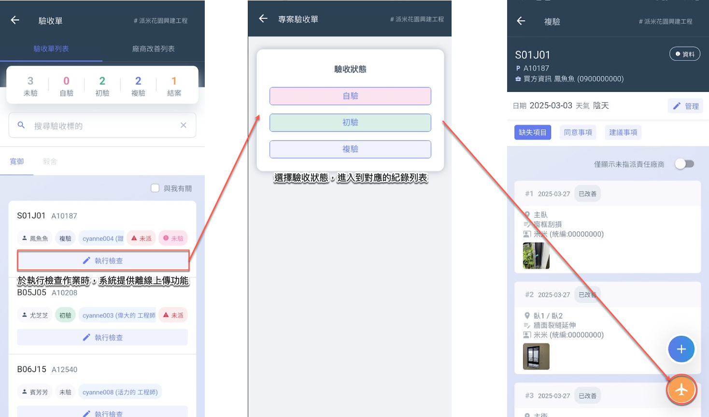
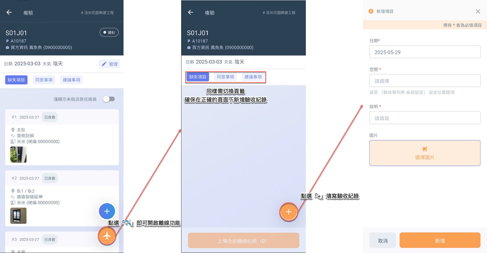
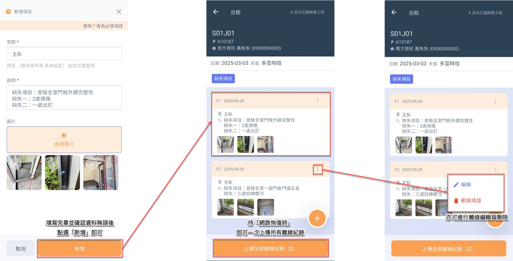
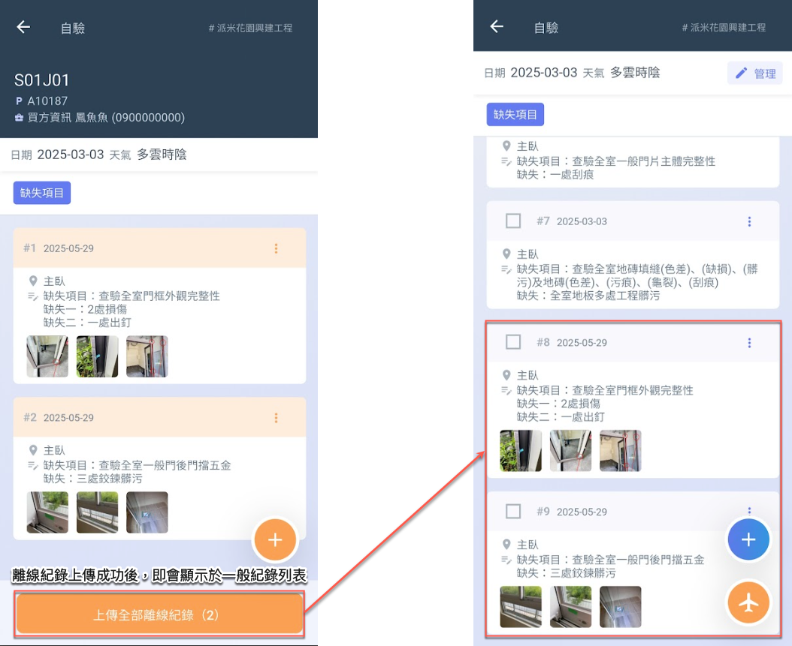

# 離線上傳

為因應現場網路不穩定或無訊號等情況，系統提&#x4F9B;**「離線上傳」**&#x529F;能，讓使用者即使在無網路環境下，仍可順利填寫驗收紀錄。使用者可於離線狀態下完成各項缺失紀錄、照片上傳與必要資訊填寫，系統將暫存所有資料至本機裝置中。

待裝置重新連接網路後，使用者可手動觸發或由系統自動偵測網路恢復，並一次性上傳所有待傳紀錄，確保資料完整無遺。

!!! tip
    此功能特別適用於地處偏遠、地下空間或高樓層電波遮蔽等網路不穩定之環境，提升驗收作業的持續性與便利性。

***

## 01｜在哪使用離線上傳？

離線上傳功能可於執行驗收檢查時使用，協助使用者在無網路連線的情況下，順利完成紀錄填寫與後續上傳作業。

***

## 02｜離線功能

### 02 - 1｜新增紀錄

進入檢查工作頁面後，點選右下角的『』按鈕，即可開啟離線上傳功能。

進入離線上傳頁面後，再次點選右下角的『』，即可開始新增驗收紀錄項目。

***

### 02 - 2｜上傳紀錄

完成驗收紀錄填寫並確認無誤後，點&#x9078;**「新增」**&#x5373;可將資料暫存至離線紀錄列表中。

待網路恢復後，點選頁面下方&#x7684;**「上傳全部離線紀錄」**，即可一次性上傳所有離線資料。\
此外，離線紀錄亦支援編輯與刪除功能 (如最右圖所示)。

當紀錄成功上傳後，該筆資料將自動顯示於一般狀態下的驗收紀錄列表中。

