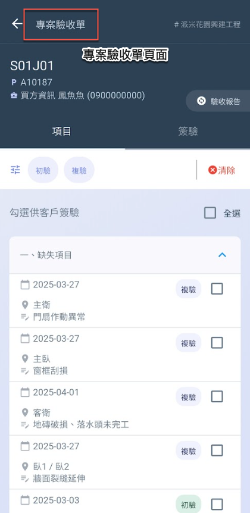
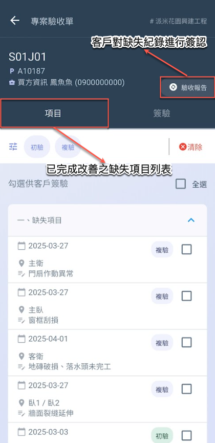
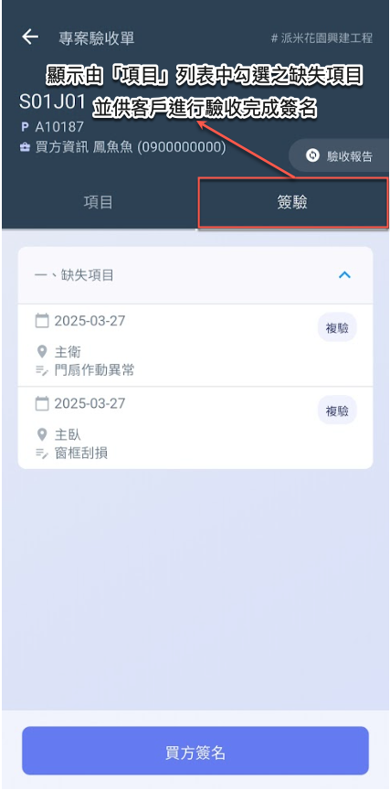

# 專案驗收單

當驗收人員完成現場驗收紀錄作業後，即可進&#x5165;**「專案驗收單」**&#x529F;能進行後續處理。

透&#x904E;**「驗收報告」**&#x529F;能，使用者可將所紀錄之驗收項目 (如缺失項目、同意事項、建議事項等) 彙整為報告，提交給客戶簽收確認。該報告可作為驗收流程中正式文件依據，確保雙方認列紀錄內容。

此外，系統將統整並顯示所有經專案工程師確認已完成改善的項目 (即已核可項目)。針對這些項目，使用者可透過手動勾選方式，挑選出實際已完成改善的缺失，進一步呈送客戶進行最終驗收簽認。

!!! tip
    此流程有助於系統性地掌握缺失處理與最終驗收情形，確保工程項目收尾階段之紀錄具備可追溯性與完整性。

## 01｜如何進入專案驗收單？

!!! warning
    進入驗收單列表後，系統預設僅顯&#x793A;**「與我有關」**&#x4E4B;驗收標的。如需查看所有標的，請取消該選項的勾選狀態。

   

