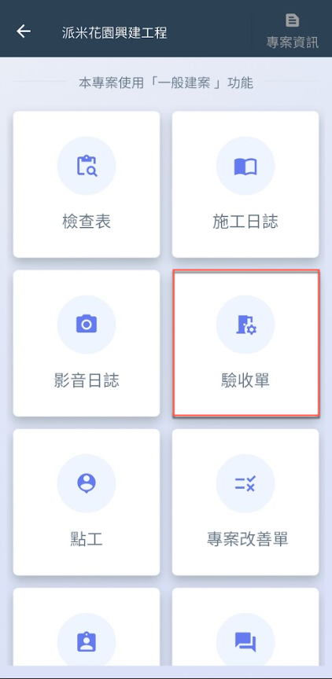
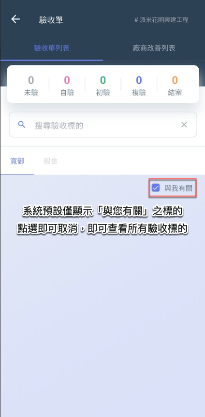
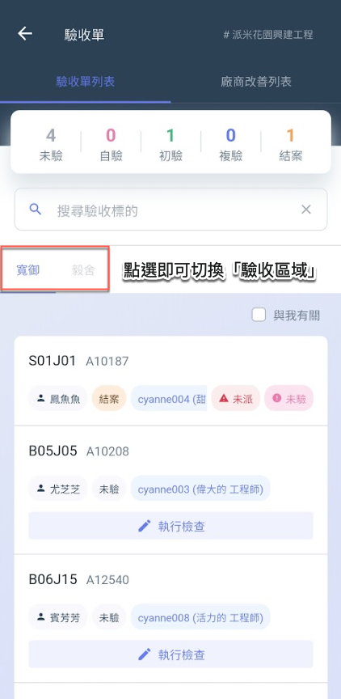
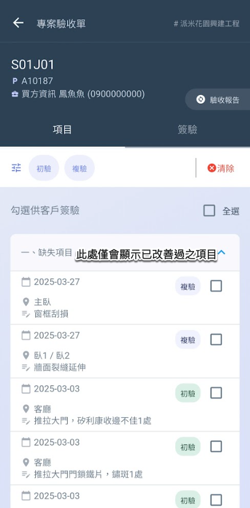
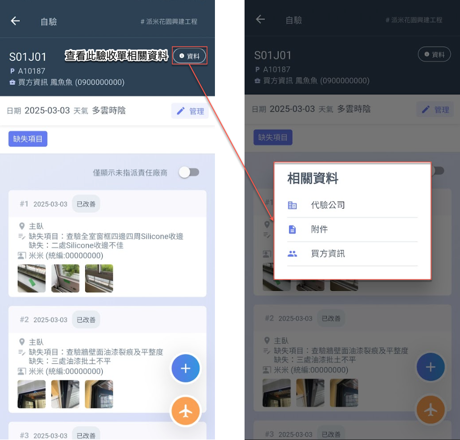
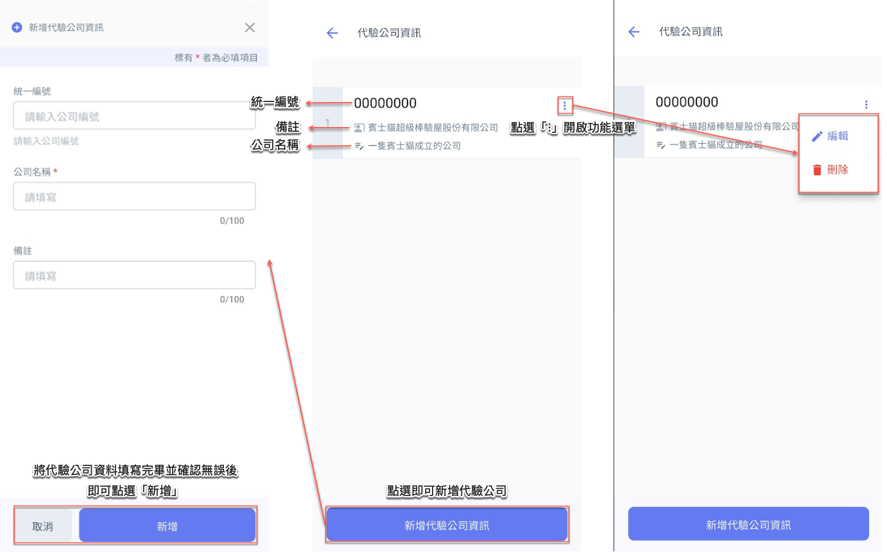
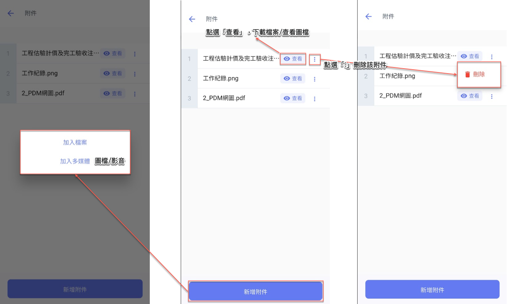
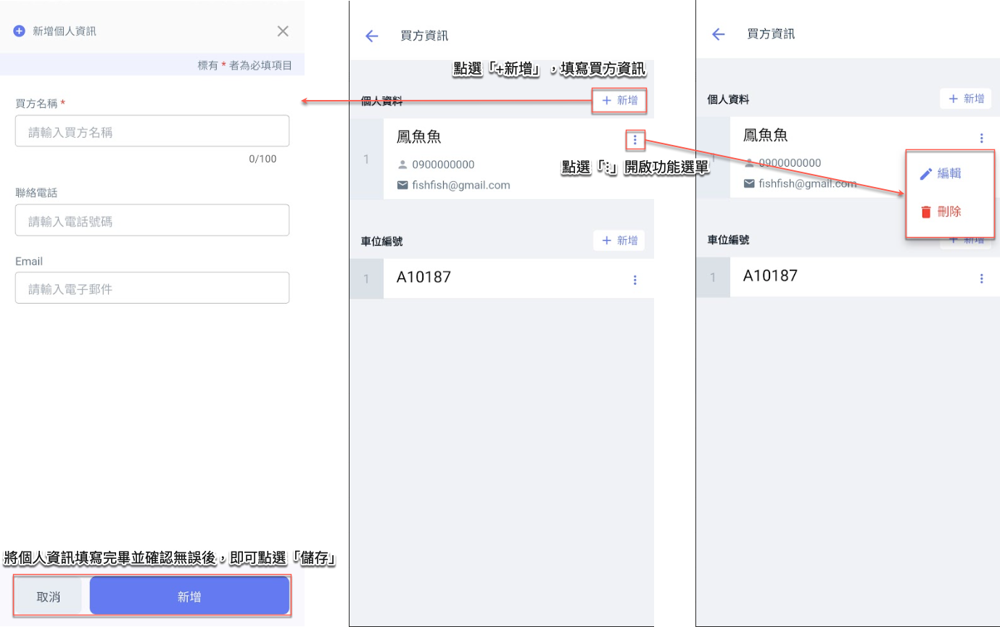
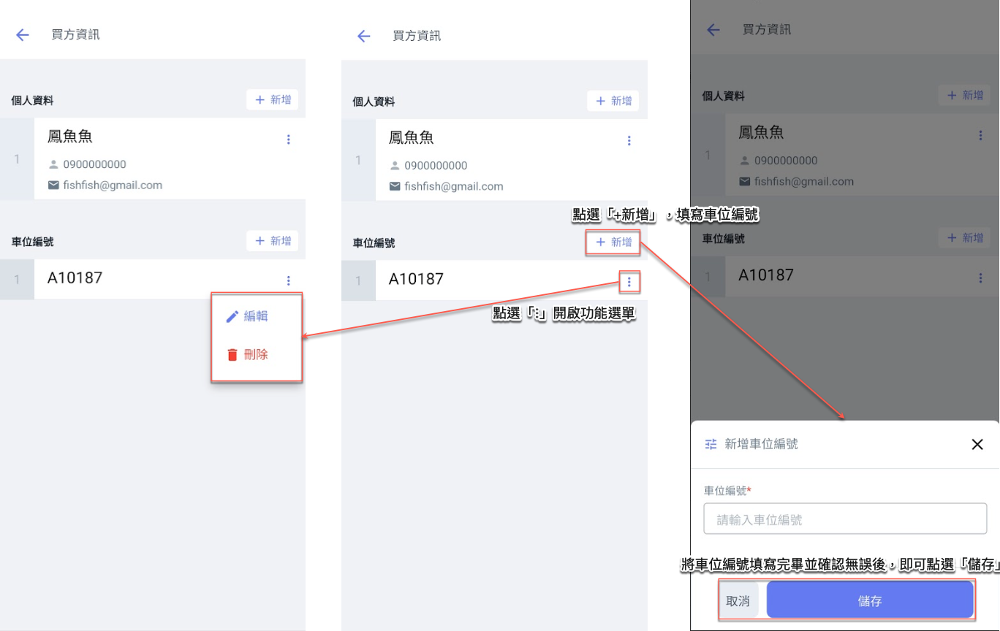
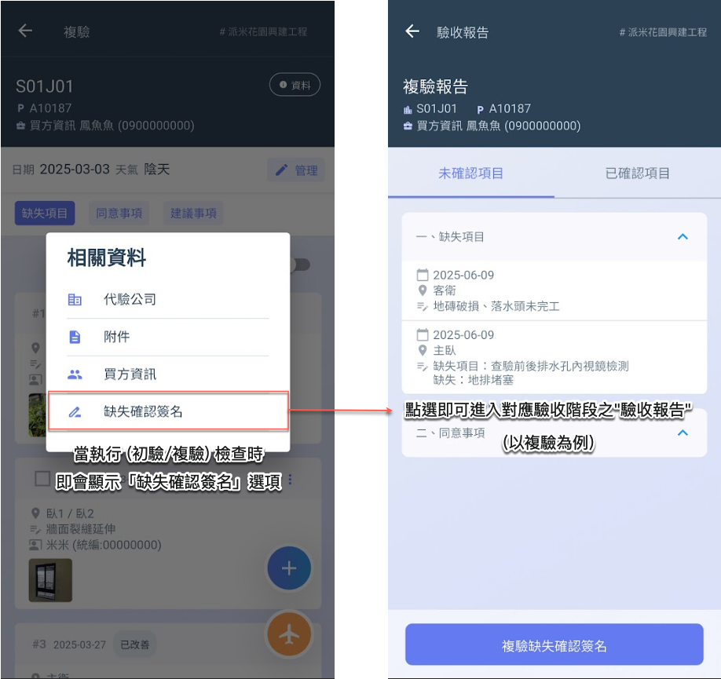

# APP 版

## 01｜如何進入驗收單？

進入驗收單功能後，即可查看各驗收區域下之驗收標的 (圖三)。

如圖四，點選欲查看之標的，即可進入其專案驗收單 (此處之缺失項目欄位，僅會顯&#x793A;**「已改善」**&#x4E4B;驗收缺失)

!!! warning
    請注意，系統預設僅顯&#x793A;**「與我有關」**&#x4E4B;驗收標的。您可取消此篩選條件，以查看所有驗收標的。

   

***

## 02｜相關資料 (代驗公司、附件、買方資訊)

開始執行檢查作業後，點選右上角之「資料」按鈕，即可開啟檢查相關資料視窗。\
該視窗將顯示以下資訊，協助您完整掌握本次檢查背景：

* **代驗公司資訊**：代為執行檢查之協力單位。
* **附件資料**：檢查相關文件、圖說、照片等上傳附件。
* **買方資訊**：本案買方基本資料與聯絡方式。

!!! tip
    此功能便於現場人員於執行檢查時，快速查閱所需資訊並確認檢查對象與交付條件。

***

### 02 - 1｜代驗公司

點選<kbd><mark style="color:purple;">**新增代驗公司資訊**<mark style="color:purple;"></kbd>後，即可開始新增相關公司資訊。請依下列欄位填寫：

* **統一編號**（選填）
* **公司名稱**（必填）
* **備註**（可填寫公司聯絡人、檢查範圍等補充資訊）

資料填寫完畢並確認無誤後，請點選<kbd><mark style="color:purple;">**新增**<mark style="color:purple;"></kbd>，系統即會將該筆代驗公司資料儲存。

於欲編輯或刪除之代驗公司右側，點&#x9078;**「******⋮******」**&#x958B;啟功能選單，即可選擇下列操作：



修改統一編號、公司名稱或備註內容。確認修改內容後點選「儲存」，即完成更新。



點選後立即刪除，且刪除後將無法復原，請謹慎操作。



***

### 02 - 2｜附件

進入附件頁面後，點選下方的<kbd><mark style="color:purple;">**新增附件**<mark style="color:purple;"></kbd>，即可選擇：**加入檔案** / **加入多媒體**。

於已建立之附件右側：

* 點選<kbd><mark style="color:purple;">**👁️查看**<mark style="color:purple;"></kbd>可下載檔案或預覽圖片
* 點&#x9078;**「******⋮******」**&#x5373;可選擇<kbd><mark style="color:red;">**刪除**<mark style="color:red;"></kbd>功能

***

### 02 - 3｜買方資訊

#### 02 - 3 - 1｜個人資料

進入買方資訊頁面後，點選「個人資料」欄位右側的<kbd><mark style="color:purple;">**＋新增**<mark style="color:purple;"></kbd>按鈕，即可開啟新增視窗。請輸入欲新增之個人資料，填寫完畢並確認無誤後，點選「儲存」即可完成新增。

於已建立之個人資料右側，點選「**⋮**」按鈕，即可開啟操作選單，選擇<kbd><mark style="color:purple;">**🖊️編輯**<mark style="color:purple;"></kbd>以修改內容，或選擇<kbd><mark style="color:red;">**🗑️刪除**<mark style="color:red;"></kbd>以移除該筆資料。

***

#### 02 - 3 - 2｜車位編號

進入買方資訊頁面後，點選「車位編號」欄位右側的<kbd><mark style="color:purple;">**＋新增**<mark style="color:purple;"></kbd>按鈕，即可開啟新增視窗。請輸入欲新增之車位編號，填寫完畢並確認無誤後，點選「儲存」即可完成新增。

於已建立之車位編號右側，點選「**⋮**」按鈕，即可開啟操作選單，選擇<kbd><mark style="color:purple;">**🖊️編輯**<mark style="color:purple;"></kbd>以修改內容，或選擇<kbd><mark style="color:red;">**🗑️刪除**<mark style="color:red;"></kbd>以移除該筆資料。

***

### 02 - 4｜缺失確認簽名

若執行檢查之驗收階段為初驗或複驗，則會顯示『<kbd><mark style="color:purple;">**缺失確認簽名**<mark style="color:purple;"></kbd>』按鈕，點選後即可進入對應的驗收報告。

有關缺失確認簽名之詳細操作流程，請參閱 ➙ [report](../../bc/acceptance/app/acceptance-form-list/project-acceptance-form/report "mention")

