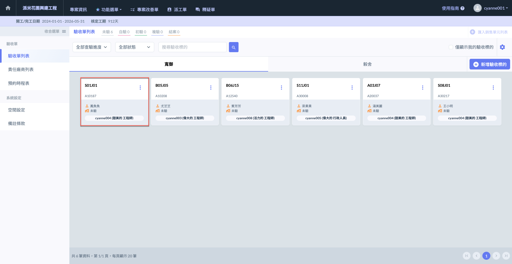
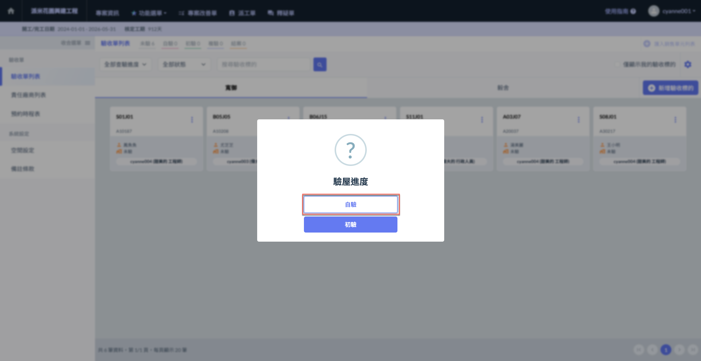
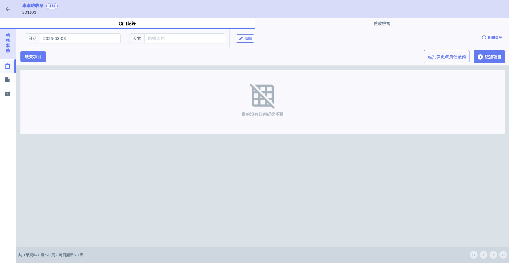
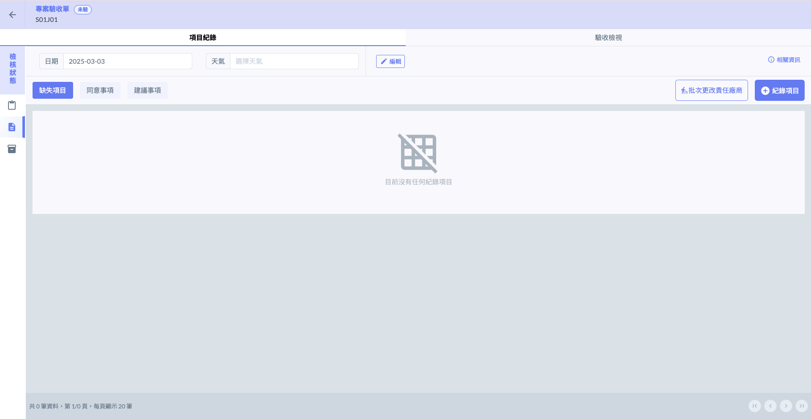

# 專案驗收單

## 01｜進入專案驗收單

如圖一，點選欲執行驗收作業的標的後，即會進入(圖二)所示畫面。請選擇對應的驗收進度(自驗/初驗)。

 

選擇進度後，即可進入驗收單內部，並開始執行驗收作業。以下為選擇進度之範例(自驗&初驗)。

!!! tip
    您也可以直接於驗收單內部切換驗收進度(包含自驗、初驗與複驗)。其中，**複驗進度僅可於驗收單內部進行選擇**。

 

 

