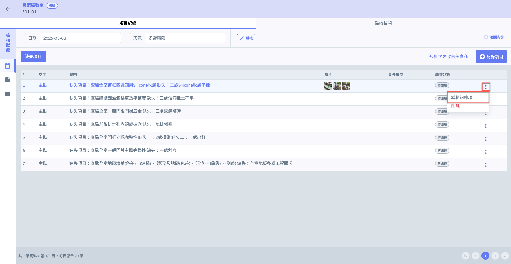
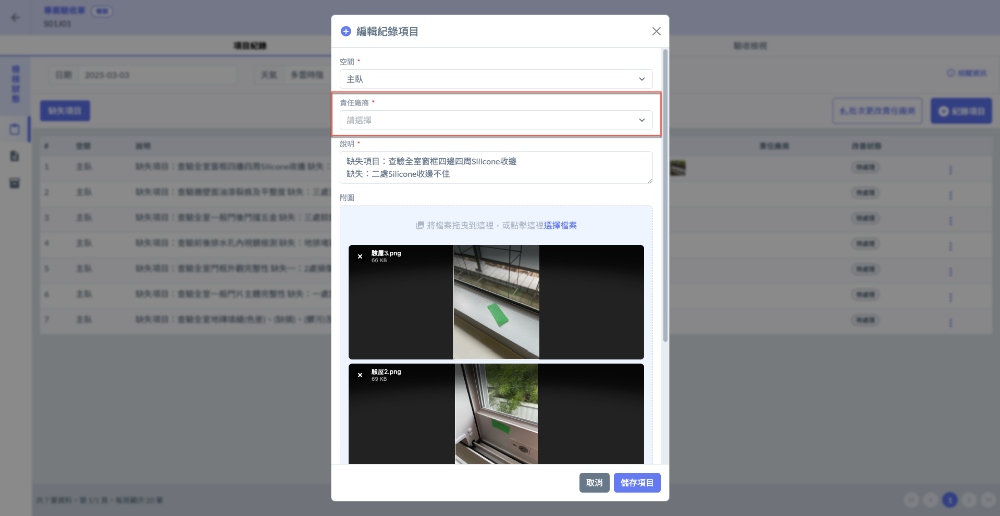
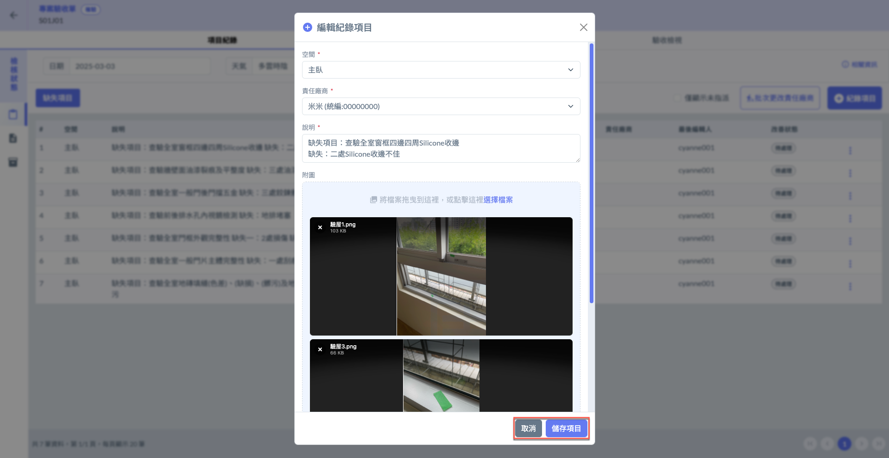
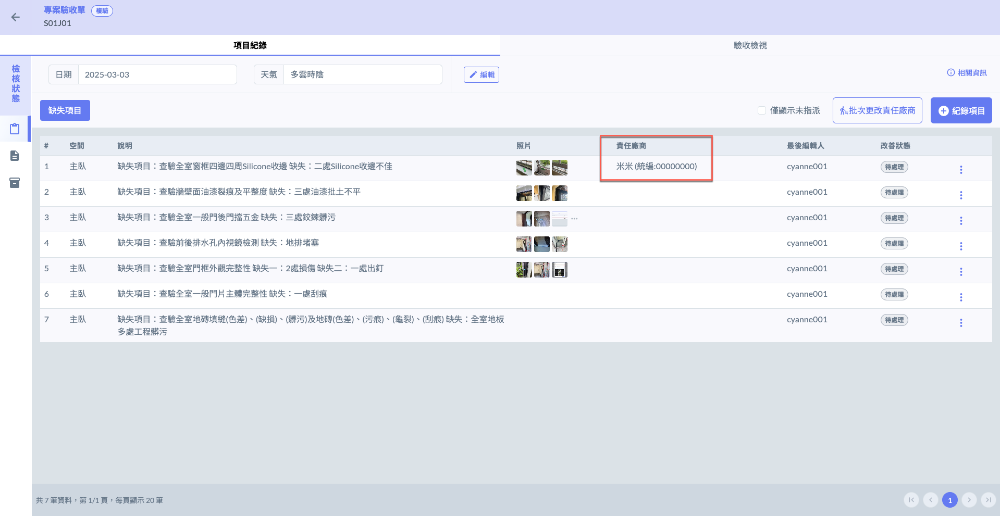
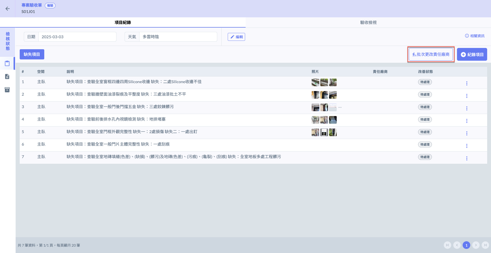
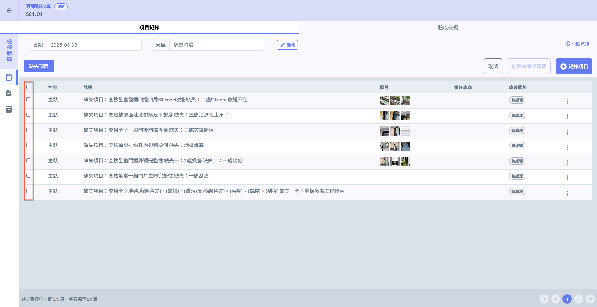
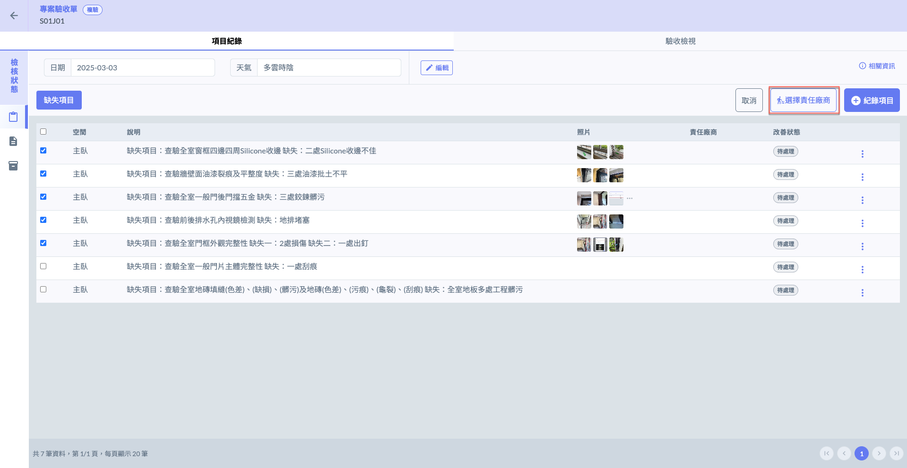
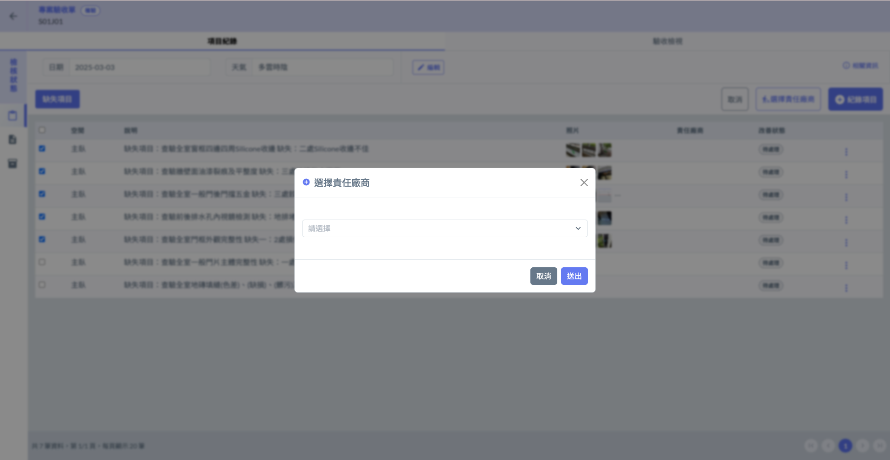
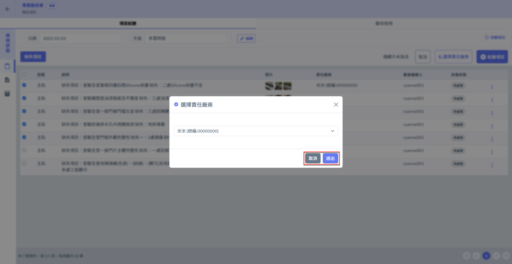
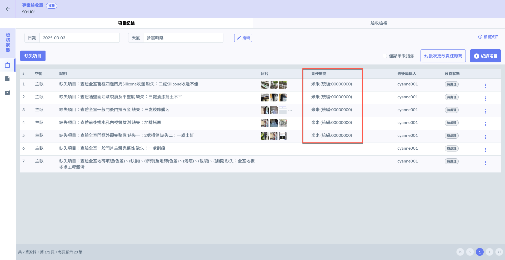

# 確認缺失歸屬

當缺失紀錄完成後，您可針對各個缺失將其歸屬於責任廠商下，以利改善作業與驗收流程的進行。

系統提供**個別指定責任廠商**及**批次選擇責任廠商**兩種方式，為各驗收缺失確認責任歸屬。

!!! warning
    僅<kbd>**缺失項目**</kbd>可選擇責任廠商，<kbd>**同意事項**</kbd>及<kbd>**建議事項**</kbd>無法。

## 01｜個別指定責任廠商

於任一檢核狀態之<kbd>**缺失項目**</kbd>，點選各驗收缺失紀錄右側&#x4E4B;**「編輯紀錄項目」**&#x529F;能後，即可為該筆缺失紀錄指定對應之責任廠商。

!!! info
    「責任廠商」欄位雖標示&#x6709;**「******\*******」**&#x7B26;號，但其並**非必填欄位**，僅作為**提示使用者可填寫此資訊**之標示，方便後續進行責任歸屬與缺失追蹤管理。

 

確認廠商欄位資料無誤後，點&#x9078;**「儲存項目」**&#x5373;可保留修改資料，完成畫面如(圖四)。

 

***

## 02｜批次更改責任廠商

於任一檢核狀態之<kbd>**缺失項目**</kbd>頁籤，點選右上角&#x4E4B;**「批次更改責任廠商」**，即可同時對多筆驗收缺失確認責任歸屬。

如圖六紅框圈選處，於點&#x9078;**「批次更改責任廠商」**&#x5F8C;，您即可勾選欲操作的驗收缺失項目。

 

如圖七，勾選項目後，再次點選右上角&#x4E4B;**「選擇責任廠商」**&#x5373;可為缺失指定責任廠商。

 

選取廠商並確認無誤後，點&#x9078;**「送出」**&#x5373;完成各驗收缺失項目之責任歸屬，完成畫面如(圖十)。

 

