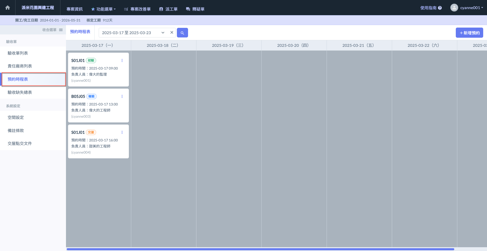
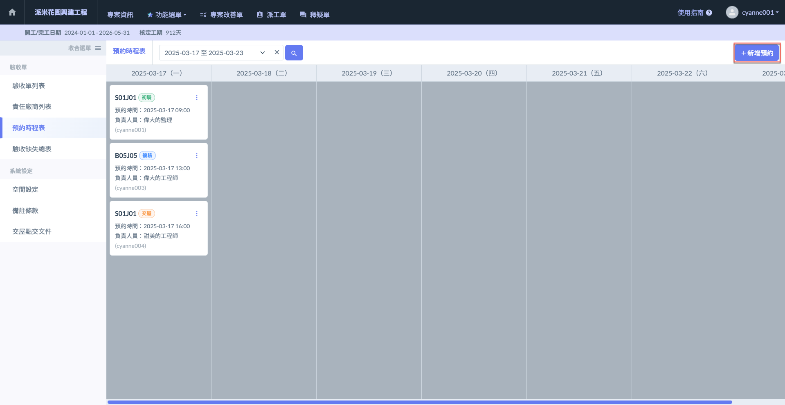
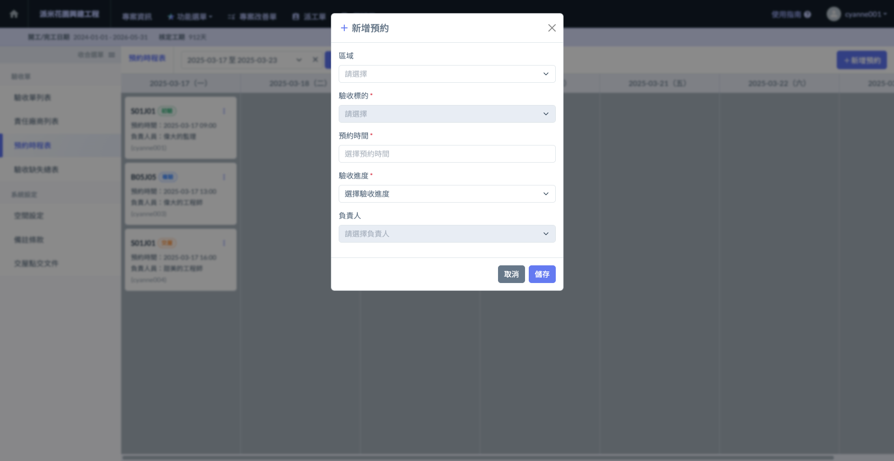
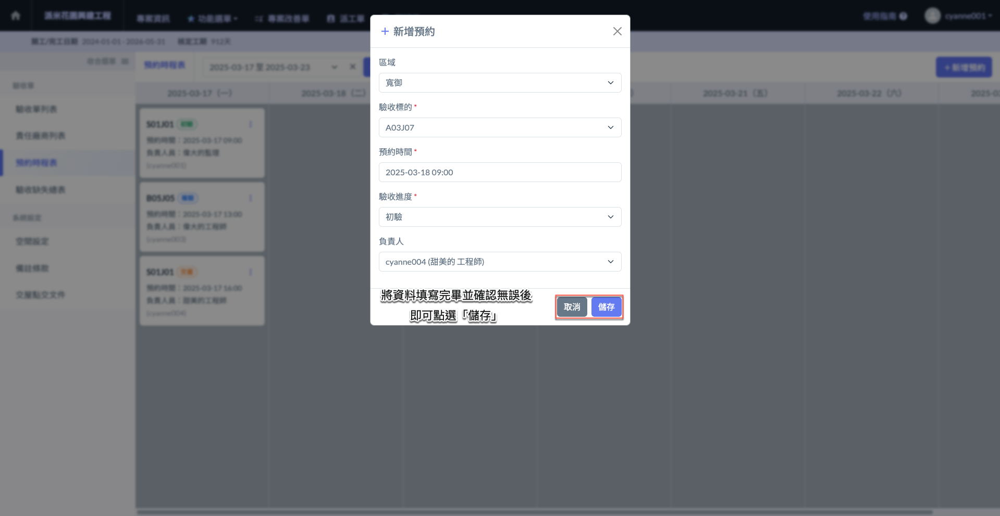
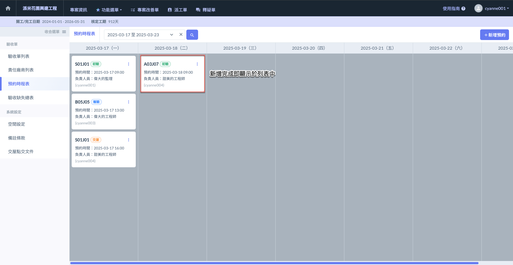
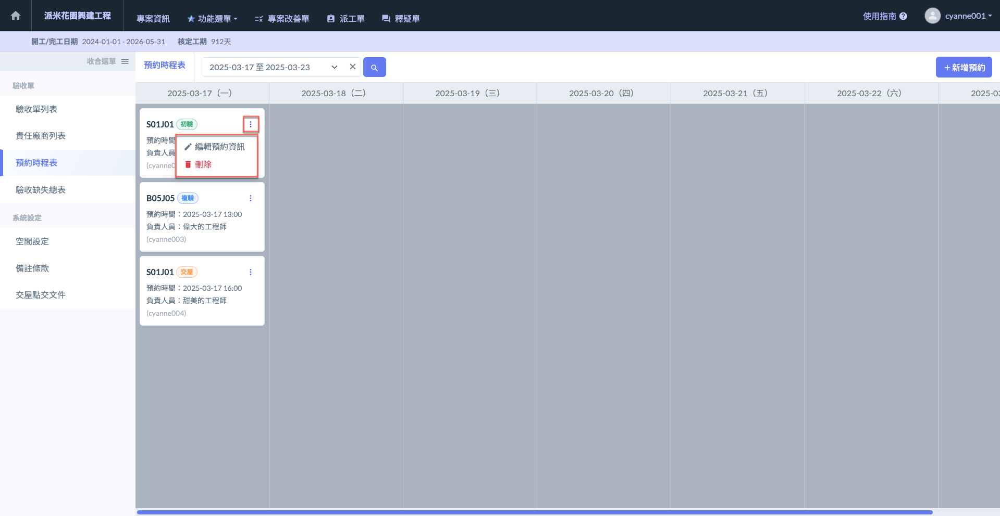
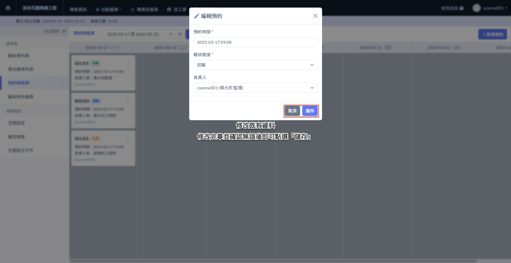
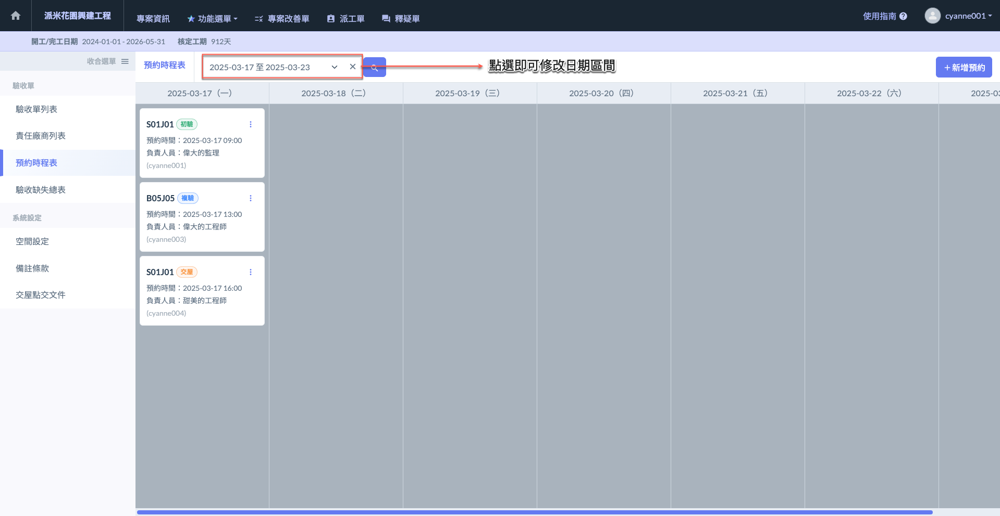
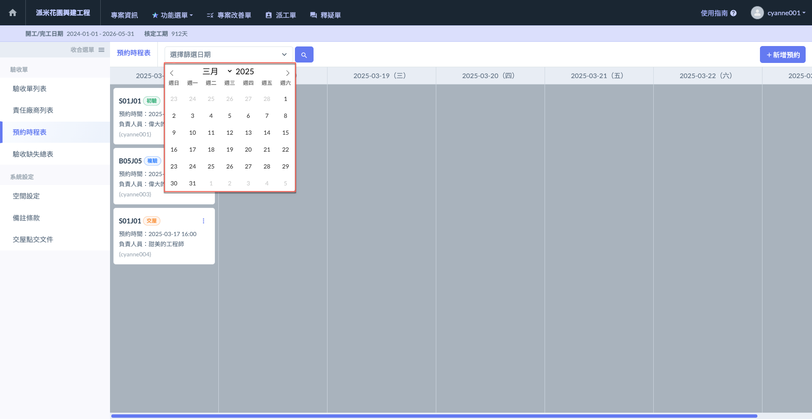

# 預約時程表

驗收單&#x7684;**「預約時程表」**&#x529F;能旨在幫助使用者精確規劃和管理未來的驗收任務。此功能允許使用者在系統中預定各項驗收標的的時間，並可選擇對應的負責人以及驗收進度。系統會以每7天為一個顯示區間，呈現該時段內所有已排定的驗收預約，方便使用者全面掌握各項驗收工作安排。這樣的設計使得使用者能夠清晰規劃驗收工作，並確保所有工作按時、高效地進行。

***

## 01｜新增預約

進入預約時程表頁面後，如(圖一)紅框圈選處，點&#x9078;**「+新增預約」**。即可開啟(圖二)視窗開始填寫預約資料。

資料包括：區域及其下驗收標的、預約時間、驗收進度及負責人等。

 項目說明

**負責人：**&#x57F7;行此驗收工作之人員，僅能選擇該專案內部之成員。

**驗收進度：**&#x5206;為初驗、複驗及交屋三個階段。

!!! warning
    請注意，您必須先&#x65BC;**「驗收單列表」**&#x5C07;標的物建立完畢，才可進行預約。

 

將資料填寫完畢並確認無誤後，點&#x9078;**「儲存」**&#x5373;可留存該筆資料，並如(圖四)顯示。

 

***

## 02｜編輯/刪除預約

如需編輯/刪除驗收預約，於各預約項目旁點&#x9078;**「⋮」**，即可選擇欲執行的操作。

您可透&#x904E;**「編輯預約資訊」**&#x4FEE;改該預約項目之**預約時間**、**驗收進度**及**負責人**；透&#x904E;**「刪除」**&#x5373;可刪除該筆預約。

 

***

## 03｜篩選日期區間

系統以7天為一個顯示區間，呈現該7天內所有預約項目。您可依需求選擇區間，查看區間內之預約。

點選(圖一)紅框圈選處，即可開啟(圖二)日期表，選擇指定日期。

 

