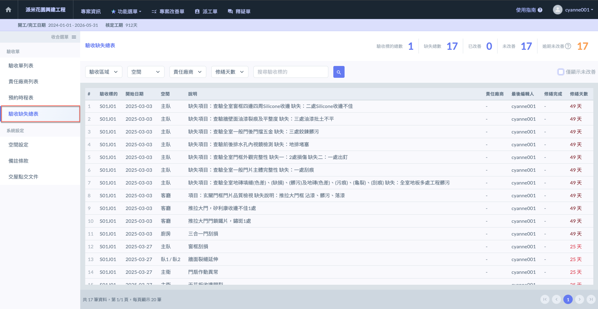
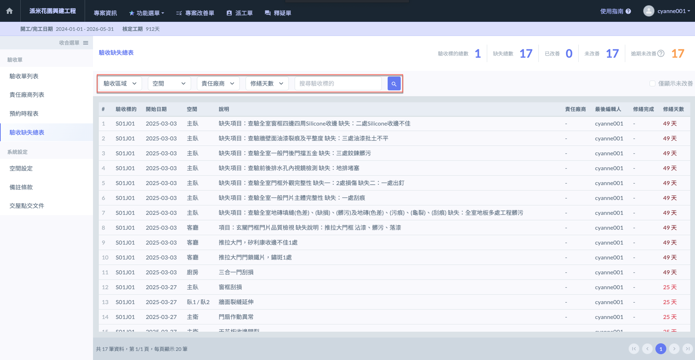
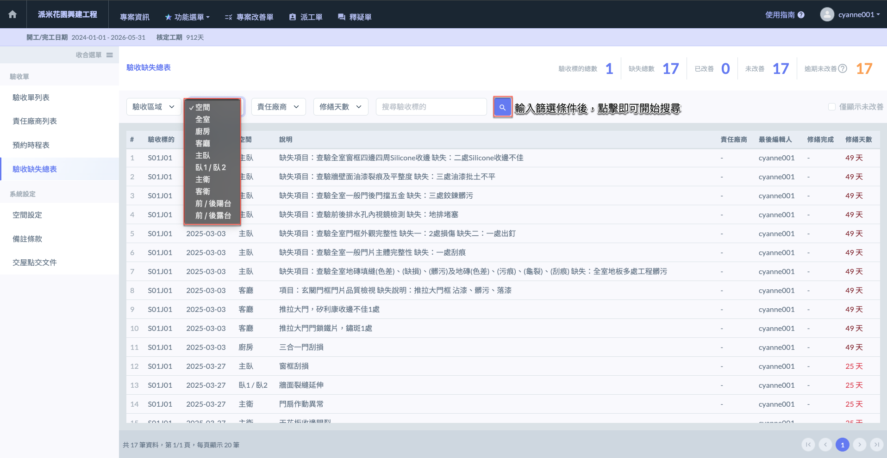
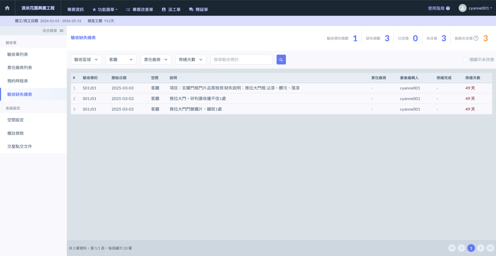
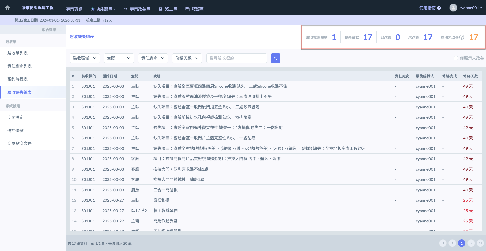

# 驗收缺失總表

<kbd>**驗收缺失總表**</kbd>功能可供使用者統一檢視專案中所有驗收階段所登錄之缺失項目，並提供詳細的改善狀態與追蹤資訊。主要功能說明如下：

1. **缺失項目總覽**\
   系統會彙整顯示該專案內所有的驗收缺失紀錄，並針對每筆缺失提供關鍵資訊，例如：缺失內容、登錄日期、責任廠商、所屬空間與驗收區域等。
2. **修繕天數與改善狀態**\
   每筆缺失項目皆會顯示「修繕天數」，該數值表示缺失登錄至今尚未完成改善的天數。透過此欄位，使用者可快速辨識改善進度是否延宕。系統亦會標示該缺失是否已完成修繕，使使用者一目瞭然。
3. **多條件篩選查詢**\
   提供強大的篩選功能，使用者可依下列條件查詢特定缺失資料：



如：A棟、B棟



如：主臥、廚房、浴室、陽臺等



負責該缺失項目之承攬廠商



自該缺失紀錄至今的經過日數（僅針對未改善項目顯示）



***

## 01｜篩選驗收缺失

如圖一，當總表資料過多時，您可透過<kbd>**驗收區域**</kbd>、<kbd>**空間**</kbd>、<kbd>**責任廠商**</kbd>、<kbd>**修繕天數**</kbd>或直接<kbd>**搜尋驗收標的**</kbd>，篩選欲查詢的驗收缺失項目。



依據您於 [inspection-form-list](../../../bc/acceptance/web-based/inspection-form-list "mention") - 驗收區域管理 設定之資料。



依據您於 [space-settings](../../../bc/acceptance/web-based/system-settings/space-settings "mention") 設定之資料。



依據 [ze-ren-chang-shang-lie-biao](../../../bc/acceptance/web-based/ze-ren-chang-shang-lie-biao "mention") 設定您於之資料。



**「修繕天數」**&#x4FC2;指自該缺失項目之起始日期起，至目前（以系統標準時間為準）所經歷的天數。



如下&#x70BA;**「以空間篩選」**&#x4E4B;範例，選用<kbd>**客廳**</kbd>並搜尋，搜尋成功後如圖三。

 

***

## 02｜缺失資料說明

進入驗收缺失總表頁面後，即可於右上角查看缺失項目統計資料，包括：<kbd>**驗收標的總數**</kbd>、<kbd>**缺失總數**</kbd>、<kbd>**已改善**</kbd>、<kbd>**未改善**</kbd>及<kbd>**逾期未改善**</kbd>。



在您所設定的篩選條件下 (預設為全部)，此驗收缺失列表涵蓋的驗收標的總數，代表這些缺失分別來自多少個不同的驗收標的。



在您所設定的篩選條件下 (預設為全部)，此驗收缺失列表所有缺失項目數量。



在您所設定的篩選條件下 (預設為全部)，此缺失列表中，已被改善完成之缺失項目數量。



在您所設定的篩選條件下 (預設為「全部)，此缺失列表**尚未改善**之缺失項目數量。



當該缺失發送責任廠商後，已超過14天尚未改善完成的驗收缺失。



