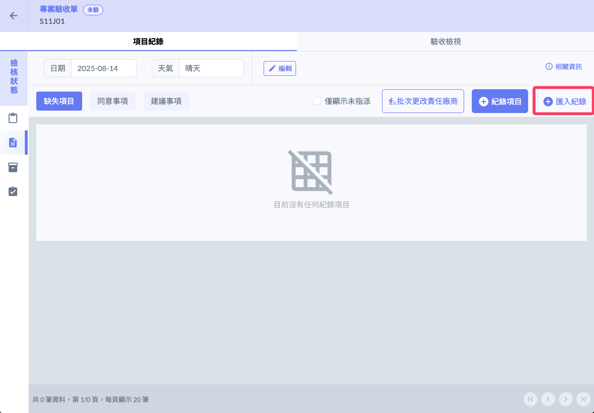
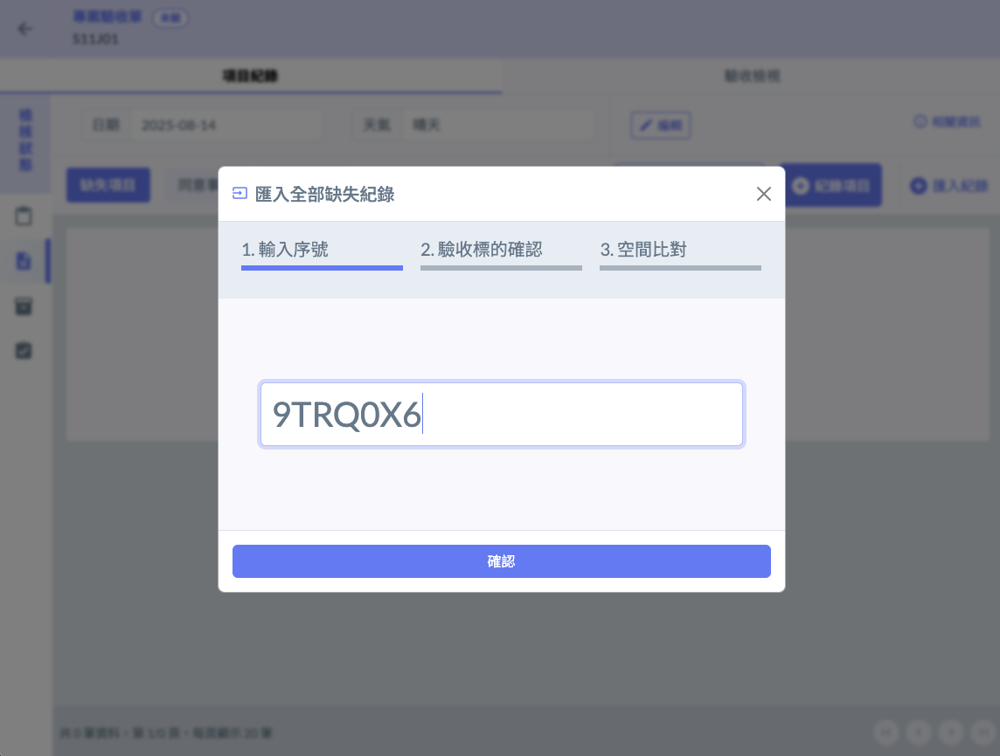
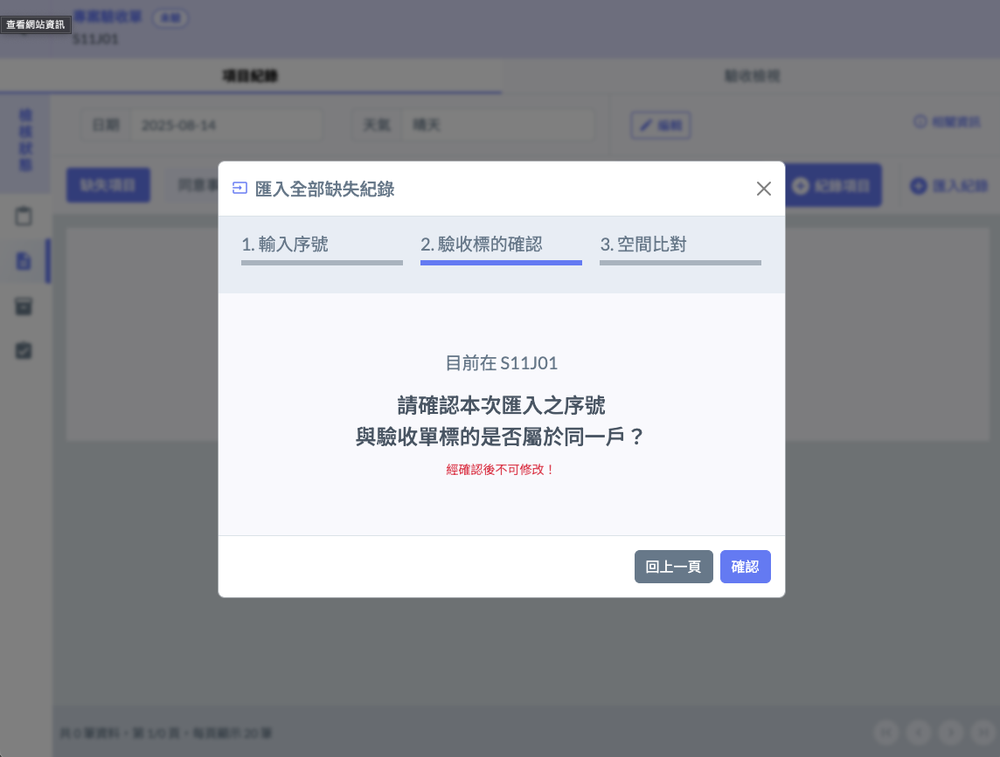
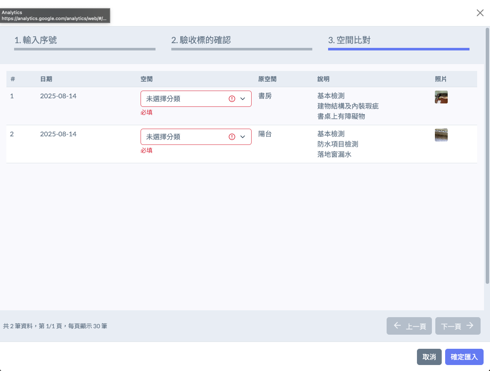
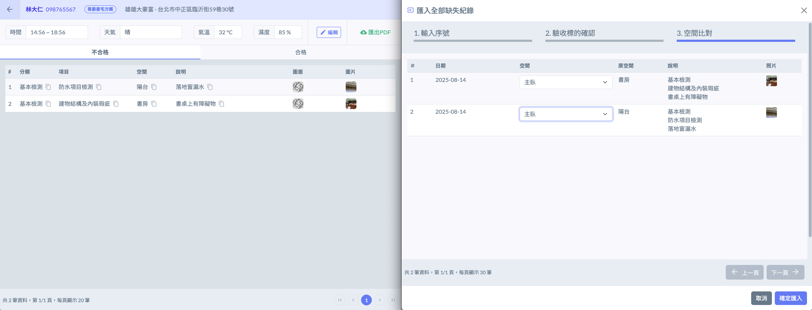
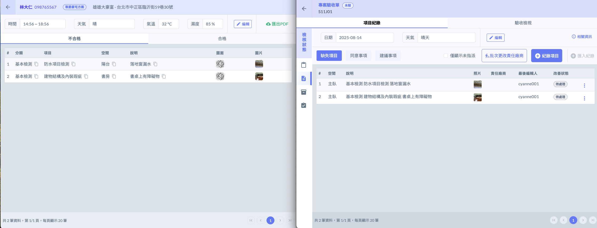

# 整合代驗APP

!!! info
    請參見 『[代客驗屋](../../../his)』 ，可以請客戶的代驗公司直接使用Jobdone的代驗APP功能，驗屋的結果可以直接在系統內匯入。



### 先建立初驗或複驗的資料

只要填寫該戶的檢查日期以及天氣資料，在沒有任何紀錄的情況下，可以直接匯入來自代驗公司的資料。




### 匯入紀錄

輸入代驗公司提供的一次性序號




### 確認是否查驗的標的戶號正確




### 重新核定空間的定義

由於雙方的資料對於分類的方式可能不同，所以可能需要重新核定空間

下圖可以參考兩邊的紀錄結果




### 完成匯入




左邊是代驗公司的紀錄、右邊畫面是建設驗屋匯入的結果。
