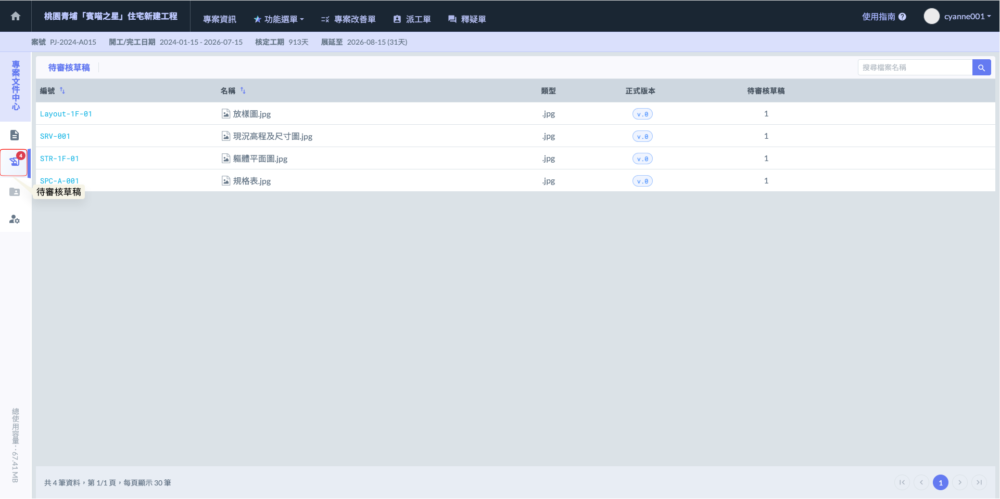
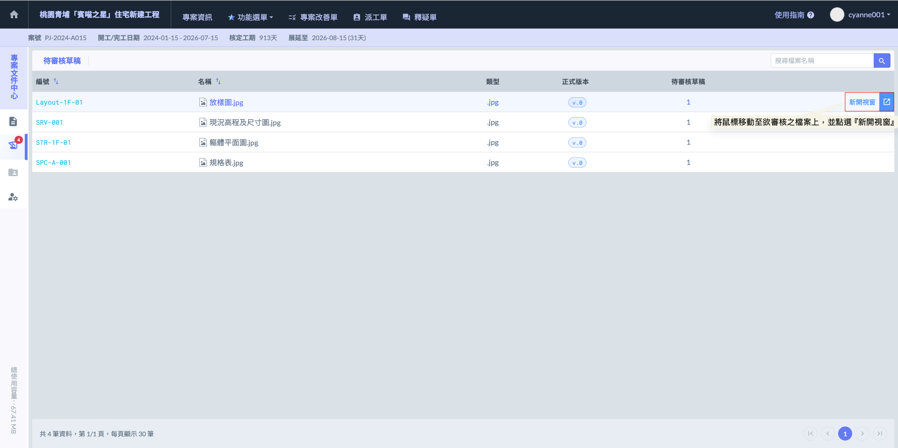
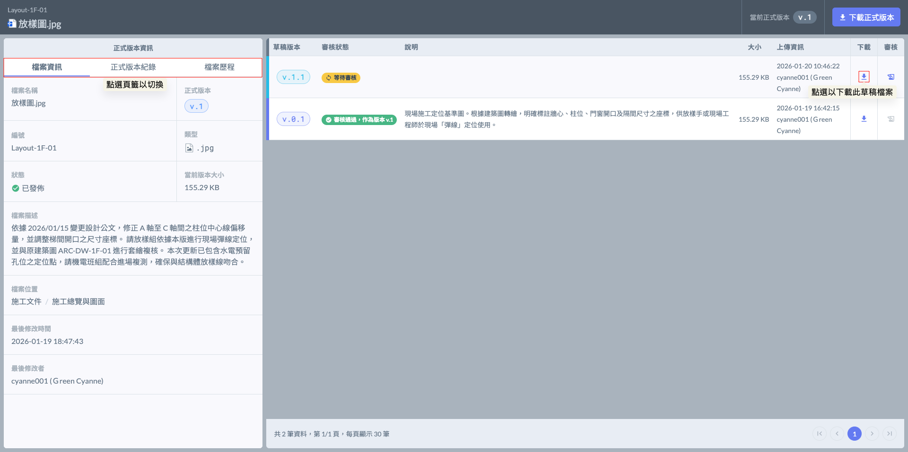
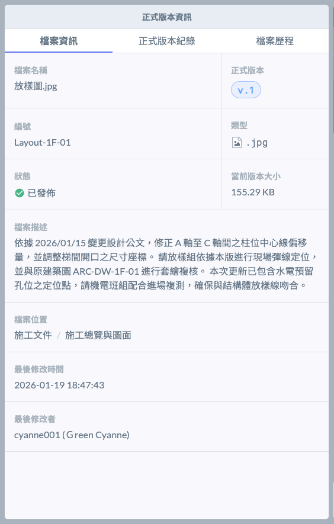
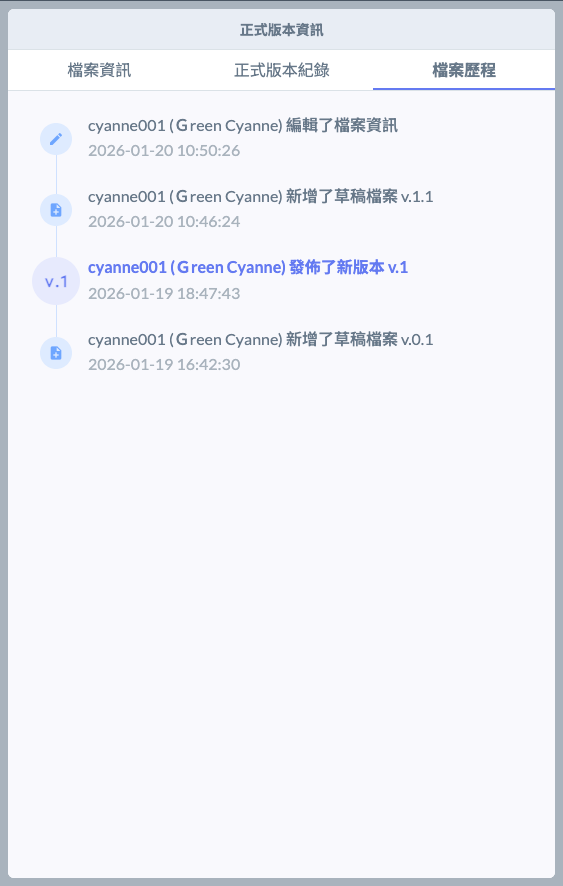
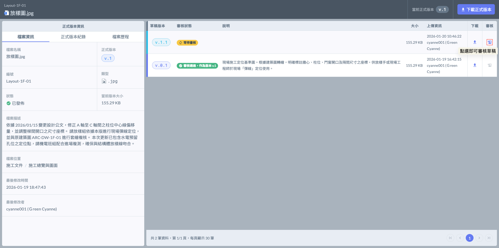
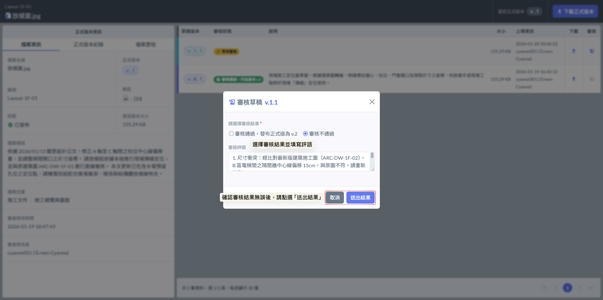

# 待審核草稿

當檔案上傳至設有審核機制的資料夾時，文件初始狀態將標示為「草稿」；須經由審核者逐一確認內容無誤後，方能正式發佈並移入資料夾供專案成員查閱。

審核者具備控管檔案正式版本更新的關鍵權限，確保每一份對外發佈的文件皆為核定版本。若您擔任某一資料夾之審核者，系統將在有檔案上傳至該資料夾時發出通知，您需前往「待審核草稿」專區進行文件的質檢與核可。

### 01｜審核流程說明



#### 選擇審核文件

如圖一，如欲審核文件，請將鼠標移至目標文件並點擊，系統將自動跳轉至該文件的專屬審核頁面。




#### 查看文件資訊

如圖二 - 進入文件審核頁面後，審核者可全面檢視該檔案的完整脈絡，包含檔案基本資訊、歷次正式版本紀錄及詳細檔案歷程。

同時，頁面將同步呈現本次草稿的內容說明與上傳資訊（包含上傳人、確切日期與時間）。審核者可於此頁面直接下載檔案進行細部核對，確認無誤後即可執行審核通過，正式發佈該文件。



提供檔案的完整基本資料檢閱，包含：檔案名稱、檔案大小、所屬位置（資料夾路徑）、最後修改時間及修改者等關鍵資訊，方便審核者在核准前快速確認檔案規格與來源。



詳列該檔案所有已發布的正式版本。透過此紀錄，管理人員能清晰追溯文件的修訂演進，確保專案團隊在不同施工階段皆有完整的歷史依據可供查閱。



系統將自動且詳盡地紀錄該檔案的所有變動軌跡，包含：新增草稿、正式版本發佈的確切日期與時間；若檔案曾被移動至其他資料夾，系統亦會保留移動紀錄與路徑資訊。透過完整的操作歷程，落實專案文件的責任追溯，確保每一筆異動皆有跡可循。



  




#### 審核文件

在「新草稿」的審核欄位中，點擊  圖示即可啟動審查程序。點選後系統將開啟審核視窗，審核者可針對該份草稿執行以下操作：



確認內容無誤後執行，檔案將立即從草稿區移入正式資料夾，並更新為最新版本。

核准時可備註該版本的施作重點或時效性。

> _範例：_ 「圖面尺寸經複核無誤，請現場依此版進行 1F 版底放樣，並注意樑位偏移處。」



若檔案內容有誤、圖說版本不對或資料不全，可予以駁回，檔案將維持在草稿狀態或退回處理。

駁回時必須明確指出錯誤點與修改要求，避免往返溝通。

> _範例：_ 「缺少結構技師簽章，且 A 區鋼筋號數與標單不符，請修正後重新上傳。」



不論核准或駁回，審核者皆可填寫詳細的「審核評語」。

> 所有評語皆會完整留存於檔案歷程中，未來若發生施工爭議或變更設計追加減，這些審核評語將成為釐清「誰在何時核准了什麼內容」的最有力證明。



如圖七，開啟審核視窗後，審核者即可針對該份文件選擇『審核通過』或『審核不通過』之結果，並於下方欄位填寫對應的審核評語，詳細記錄核准依據或駁回原因，確保流程透明且具備追溯性。



