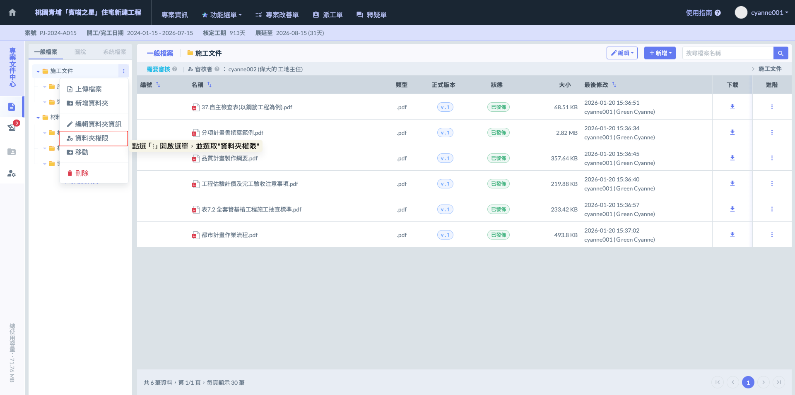
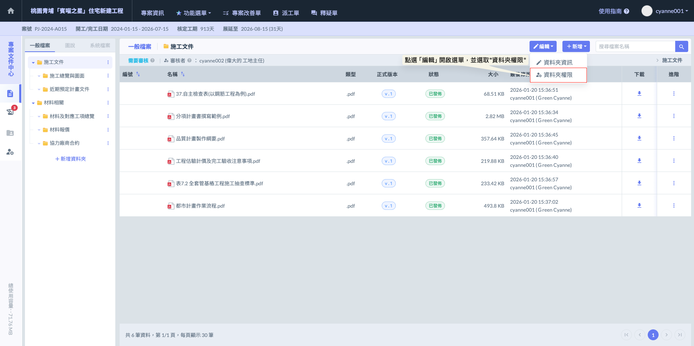
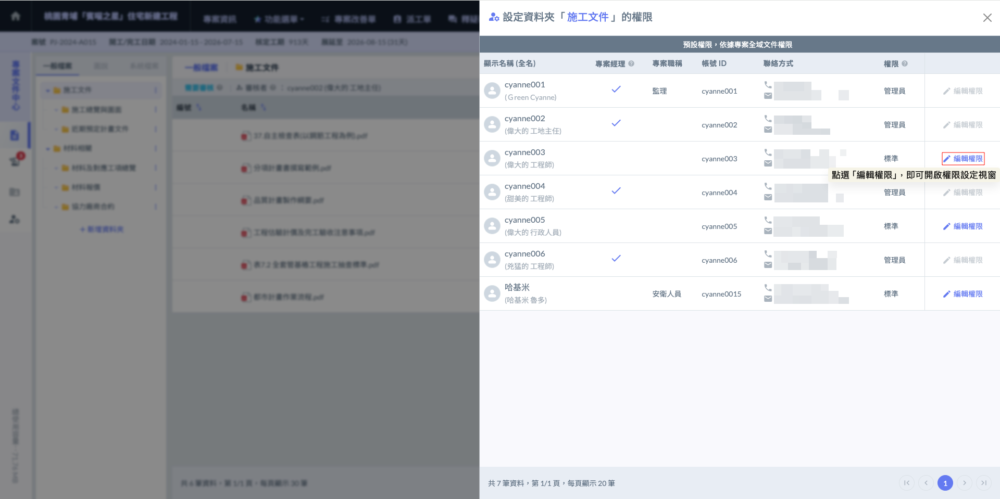
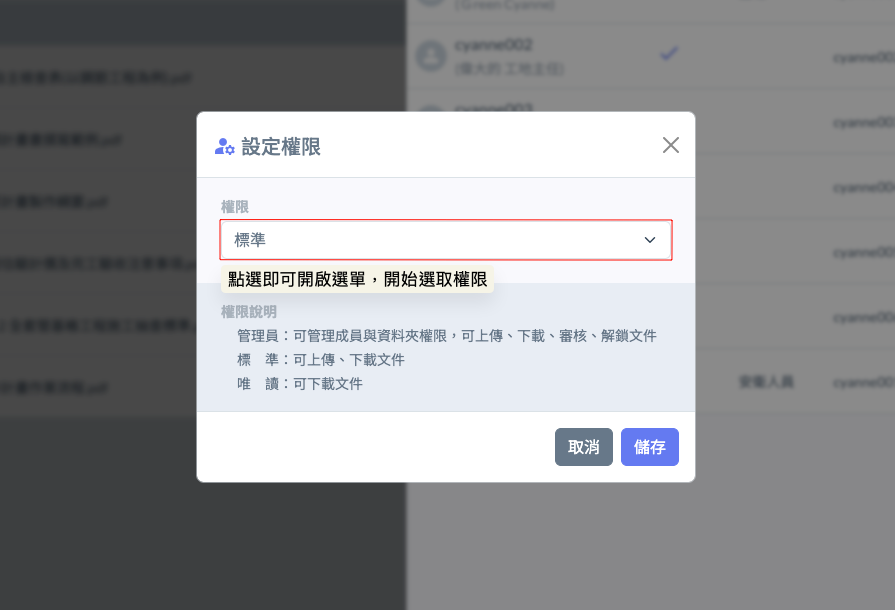
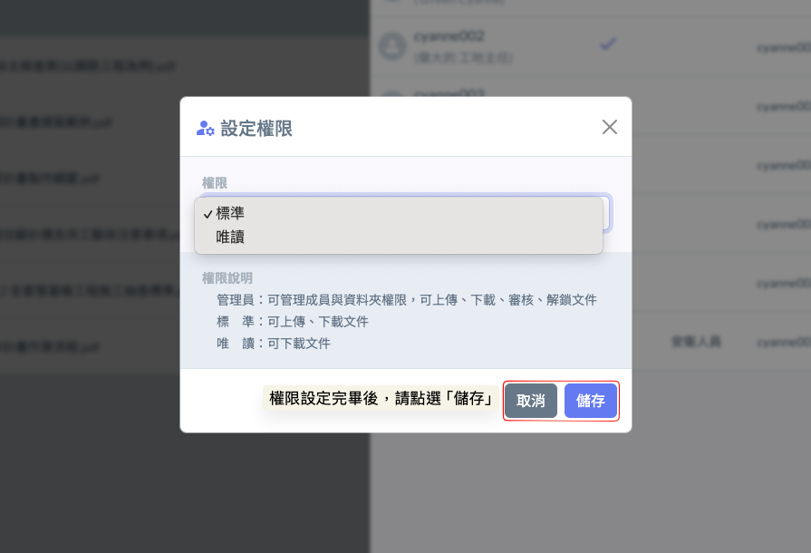

# 單一資料夾權限

『資料夾權限』是指針對特定頂層資料夾內的文件進行精確的訪問控制。這項機制讓管理員能依據專案階段（如：發包期、施作期）、職能部門（如：土木、機電）或成員角色，靈活地調整文件的閱覽與操作範圍。

!!! info
    #### 補充說明
    
    * **預設繼承邏輯：**&#x8CC7;料夾的『預設權限』是依據專案全域文件權限。意即若未手動修改，成員在各資料夾的權限將與其全域設定一致。
    * **修改權限限制：**&#x70BA;確保管理體系之穩定，管理員僅能更動『非管理員』成員的權限。
    * ****頂層控管邏輯：****系統規定僅有『第一層資料夾（頂層資料夾）』能夠更改權限。一但完成設定，該資料夾下方的所有子資料夾均會同步套用。

### 01｜權限編輯流程

欲修改特定資料夾的權限，請執行以下步驟：



#### 選擇資料夾

在『所有檔案』頁面中，管理員可透過以下兩種方式靈活進入權限設定介面：

1. 直接於資料夾列表中，在目標資料夾右側點選  圖示，並選擇  功能。
2. 先點選進入該資料夾，再點擊畫面右上方之  圖示，從選單中選取 。

無論採用哪種方式，皆可針對該第一層資料夾進行精確的成員權限調控。

> 頂層資料夾如下圖範例之：**施工文件**、**材料相關**

 

權限設定畫面如下：




#### 編輯資料夾權限

開啟『設定權限』視窗後，只需點擊權限欄位即可展開選單，並從中選取欲賦予該成員的權限等級。

 



