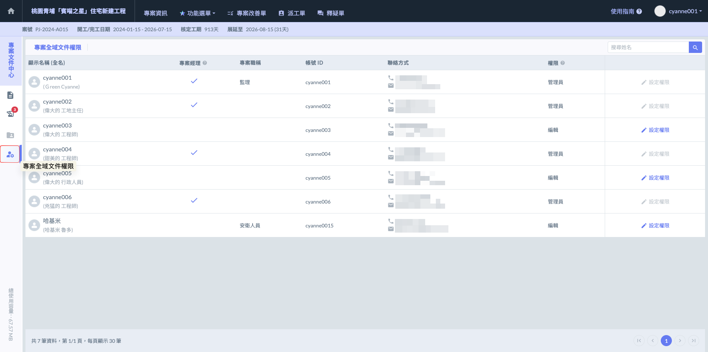
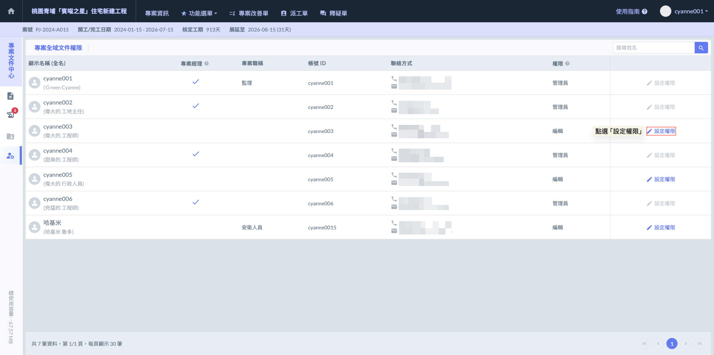
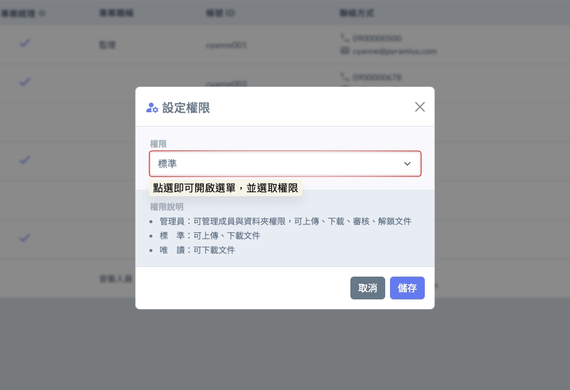
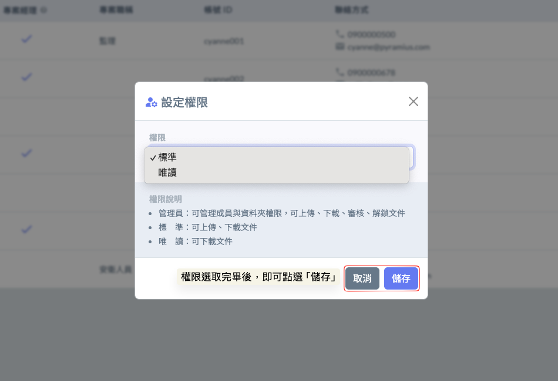

# 專案全域文件權限

「專案全域文件權限」是針對整個****專案範圍內的文件管理所進行的頂層設定****。這套權限架構決定了不同專案成員對於系統內所有文件的存取邊界與操作能力。透過全域權限的配置，管理人員可以精確控管哪些成員具備檢視、編輯或刪除專案文件的權限，確保資訊傳遞的同時兼顧資料安全性。

!!! info
    #### 補充說明
    
    全域設定雖然涵蓋了整個專案，但****頂層資料夾**** ****(Top-level Folder)**** 擁有「獨立權限設定」的功能。這意味著：
    
    * 如果某位成員的全域權限是『唯讀』，但專案需求需要他參與某個特定標案，管理員可以單獨進入相關資料夾，並進行資料夾權限設定，將他的權限提升為『標準』或『管理員』。
    * 反之，若全域設定為『標準』，但針對敏感的合約資料夾，管理員亦可將其權限調降為『唯讀』
    
    ***
    
    在專案的角色配置與權限異動上，系統遵循以下核心邏輯，確保管理權限的嚴謹性與流程設定的彈性：
    
    * **專案經理（PM）之固定權限：** 專案經理在系統中具備恆定的「管理者」權限，擁有對專案文件與架構的最高控管權。為維護管理層級的穩定性，專案經理之間無法互相更動權限，亦無法調降其他專案經理的權限等級。
    * **審核者設定之彈性：** 雖然建議審核者由管理人員擔任，但系統提供高度的彈性設定。即使非專案經理成員（如具備「標準」權限的內業工程師或專業分包商），只要被納入專案成員名單，管理員皆可在建立資料夾時，視實務需求將其指定為該資料夾的『審核者』。

**權限等級定義：**



具備最高權限。可執行全專案文件的建立、刪除、移動，並擁有管理資料夾叢集、指定審核者以及設定他人權限的完整控制權。

> **建議對應職務：**&#x5982;工地主任、專案管理人員等。
>
> **實務場景應用：**&#x8CA0;責定義資料夾架構（如決定要把哪些圖歸類在施工圖叢集），並擁有最終的刪除與歸檔



適用於日常工務執行人員。具備文件上傳與檢視的權限，無法更動資料夾亦無法操作文件。

> **建議對應職務：**&#x5982;現場工程師、內業、品管等。
>
> **實務場景應用：**&#x57F7;行日常的圖說上傳、材料證明報驗、並填寫檔案編號與說明。



僅供查閱使用。成員可即時瀏覽及下載最新版圖說或文件，但無法進行任何上傳、修改或刪除操作，適用於僅需獲取資訊而不參與文件產出的成員。

> **建議對應職務：**&#x5982;業主、建築師、協力廠商班組等
>
> **實務場景應用：**&#x78BA;保他們能隨時抓到最新的『核定版』圖說進行施工或查驗，但無法更動系統內的檔案結構。



***

### 01｜設定權限

如圖一，進入『專案權限管理』畫面後，針對欲設定之人員點選 ，即可開啟權限選單並選取欲賦予的權限等級（如：標準、唯讀）。

在此需特別注意系統的安全保護機制：

!!! warning
    #### ⚠️ 權限更動限制&#x20;
    
    管理員僅具備更動『標準』與『唯讀』人員權限之資格。基於管理安全考量，管理員無法更動其他管理員的權限，亦無法直接刪除其他管理員的權限，亦無法直接刪除其他管理員，以確保專案頂層管理權的穩定性。

開啟『設定權限』視窗後，只需點擊權限欄位即可展開選單，並從中選取欲賦予該成員的權限等級。

 

