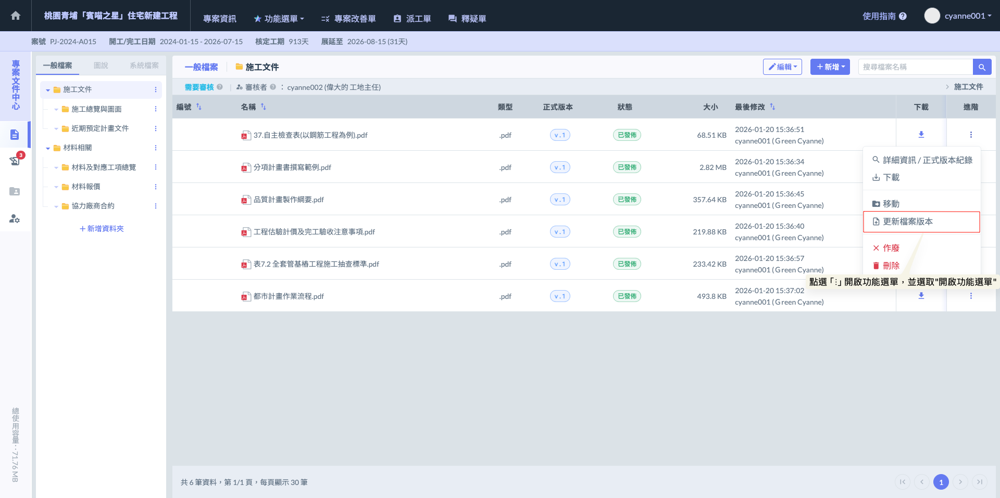
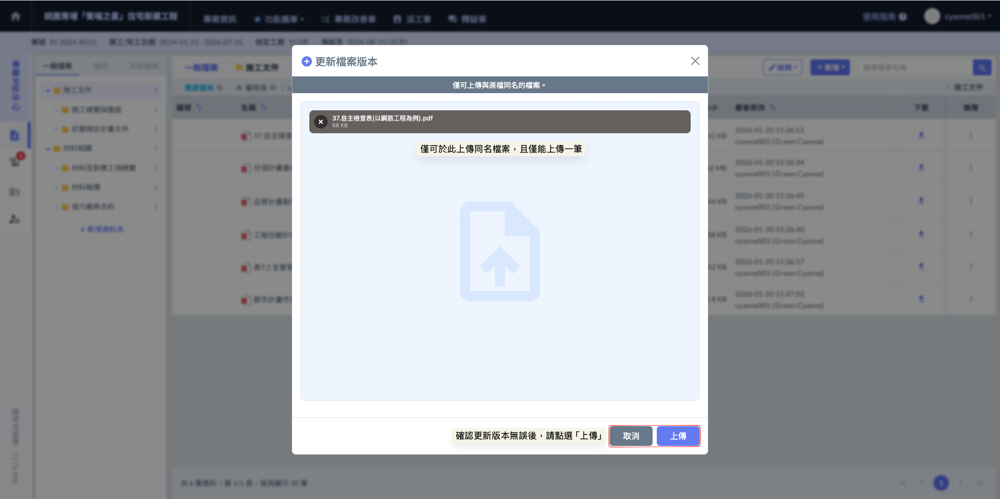
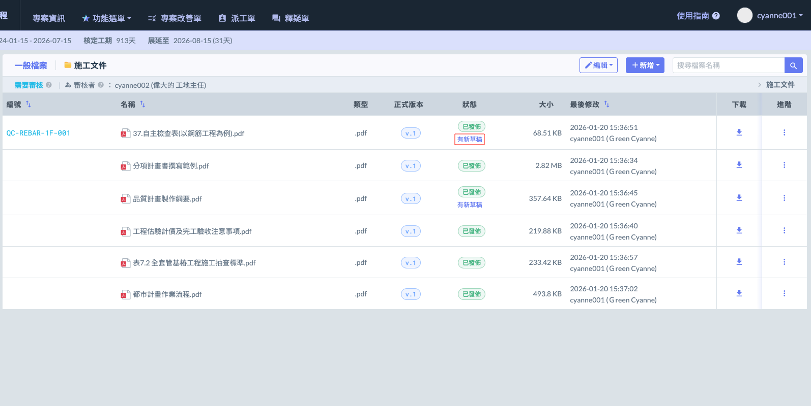
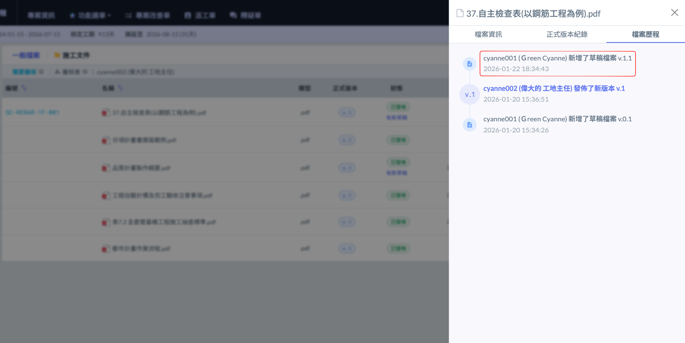
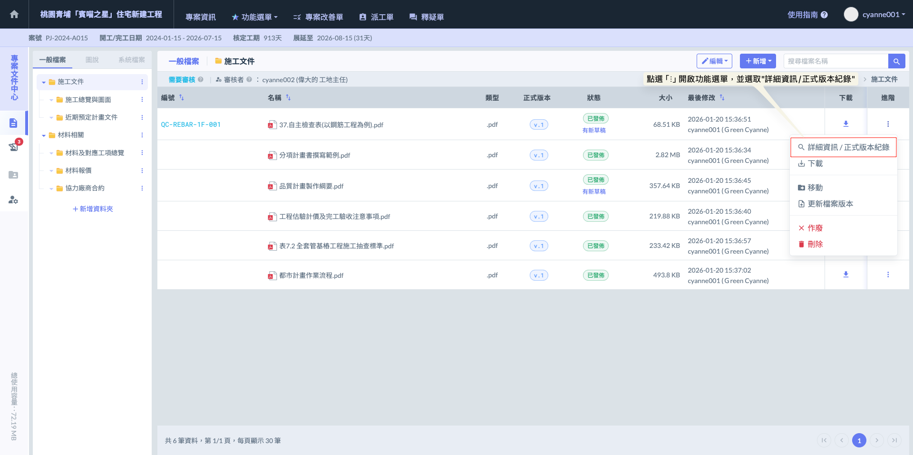
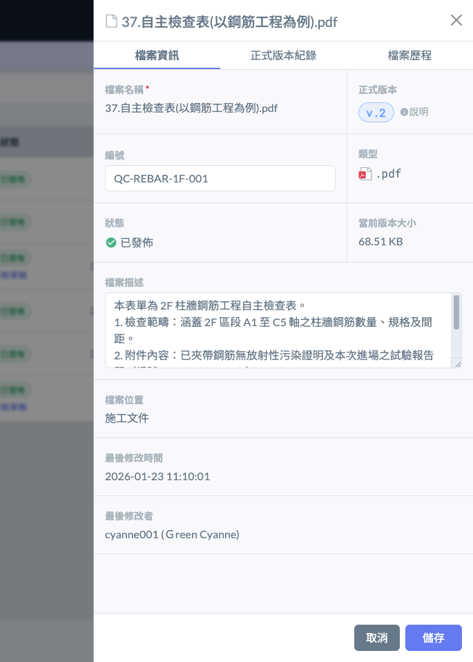
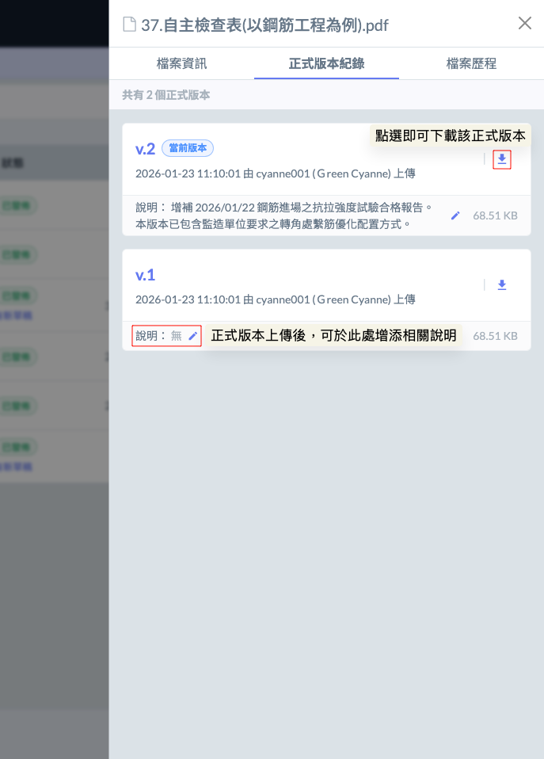
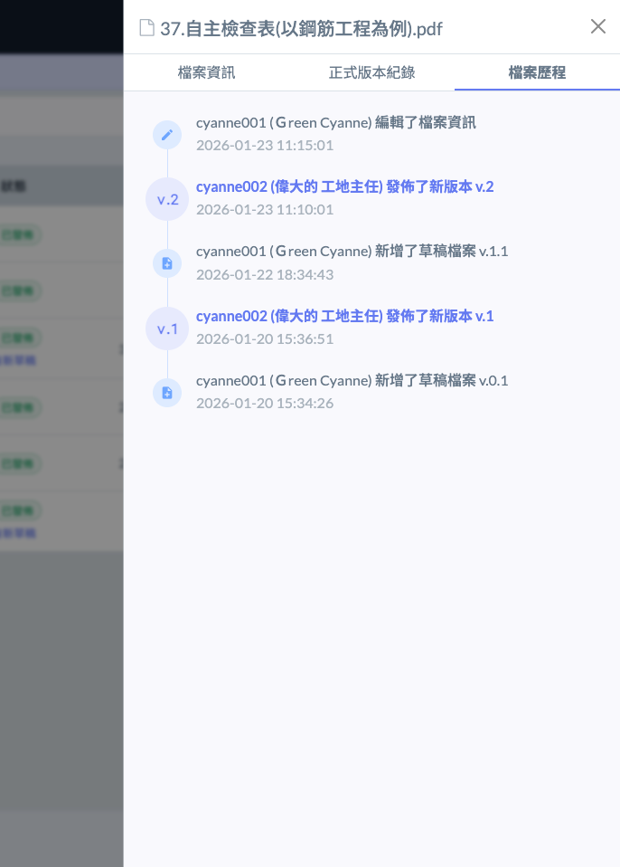

# 檔案版本

### 01｜更新檔案版本

在專案執行過程中，圖說與文件的修正頻率極高。系統提供強大的版本管理功能，確保團隊始終能取得最新資訊，並保留完整的修訂紀錄。

1. **版本判定原則**

* **檔名一致性：**&#x57F7;行版本更新時，『檔案名稱必須保持完全一致』。系統是透過檔名來辨識並歸類為同一文件的不同版本。

***

2. **更新操作方式**

* **主動更新：**&#x5728;欲更新的文件右側，點選『進階』選單中的 ，隨即上傳新版檔案。
* **自動判定：**&#x60A8;亦可直接點選  上傳檔案。只要系統偵測到檔名與現有文件相同，系統將自動判定此為該文件的更新版本，而非重複建立新檔。

!!! info
    #### 💡 提示
    
    系統透過『檔名一致』作為判定的唯一基準。透過此機制，您無需手動刪除就檔，系統會自動將舊版本移入『正式版本紀錄』中，實現無縫的版控更迭。

在開啟『更新檔案版本』視窗後，請務必遵循以下兩項關鍵規則以確保版本演進正確：

1. **檔名必須完全一致：**&#x7CFB;統是以檔名作為版本連結的唯一依據，請確保上傳的檔案名稱與現有檔案完全相同。
2. **單次僅限單一檔案：**&#x7248;本更新採取「一對一」替換機制，每次操作僅能上傳一筆檔案。

如圖二，確認新版本檔案無誤後，點選  按鈕，即可開啟編號及說明填寫視窗。

如圖三，當您將檔案拖曳或選取上傳後，系統會自動跳出檔案資訊編輯視窗。在此步驟中，您可以針對本次上傳的更新檔案，決定是否填寫對應的『檔案編號』與『內容說明』。

如圖四、圖五，若上傳新版本後，發現檔案內容並未立即替換，而是於頁面中顯示  提示，或是在檔案歷程中標註「某人」，即代表該資料夾已啟動審核機制。

在此設定下，您所上傳的檔案將暫時以『草稿』狀態隔離存放，必須經過該資料夾指定的審核者確認並執行『審核通過』後，檔案才會正式覆蓋舊版本並對所有成員發佈。

 

***

### 02｜檔案版本與歷程

若需追溯文件的演進過程或確認操作細節，可透過「詳細資訊」功能進入管理介面。

**操作步驟**

1. 於欲查看的文件右側  欄位，點選  開啟功能選單。
2. 選擇 
3. 進入後，系統將提供三大分頁資訊供您檢閱：



提供檔案的完整基本資料檢閱，包含：檔案名稱、檔案大小、所屬位置（資料夾路徑）、最後修改時間及修改者等關鍵資訊，方便審核者在審核前快速確認檔案規格與來源。



詳列該檔案所有已發布的正式版本。透過此紀錄，管理人員能清晰追蹤文件的修訂演進，確保專案團隊在不同施工階段皆有完整的歷史依據可供查閱。



系統將自動且詳盡地紀錄該檔案的所有變動軌跡，包含新增草稿、正式版本發佈的確切日期與時間；若檔案曾被移動至其他資料夾，系統亦會保留移動紀錄與路徑資訊。透過完整的操作歷程，落實專案文件的責任追溯，確保每一筆異動皆有跡可循。



進入「詳細資訊」頁面後，系統提供檔案資訊、正式版本紀錄、以及檔案歷程三個完整檢視畫面。

!!! info
    #### ⭐ 補充
    
    當檔案正式發佈後，管理人員可於『正式版本紀錄』分頁中，針對歷次上傳的正式版本（包含當前最新的版本以及所有歷史版本）進行版本說明的補強或修訂。透過這項功能，您可以詳細註記個版本的修訂重點或異動原因，確保每一份文件的演進皆具備清晰的文字紀錄供日後查閱。

  

