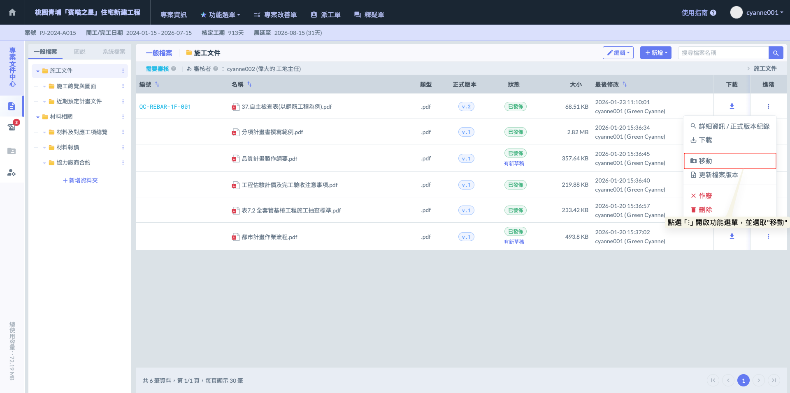
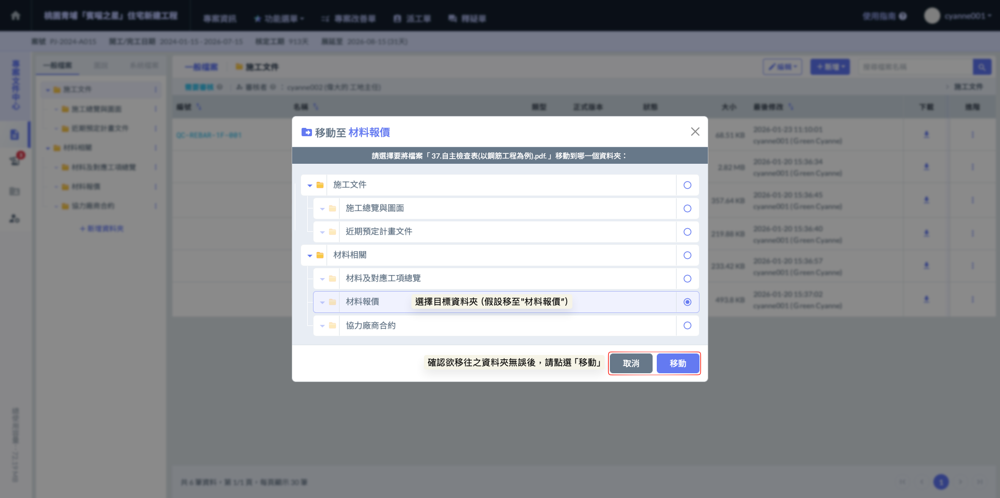
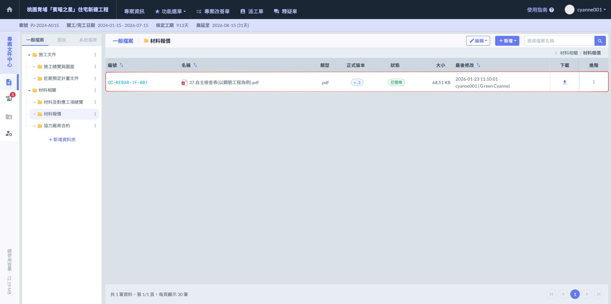
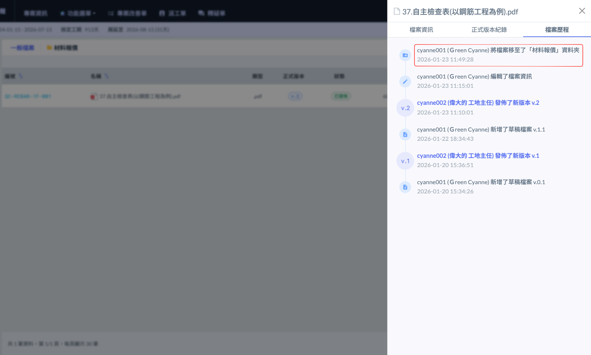
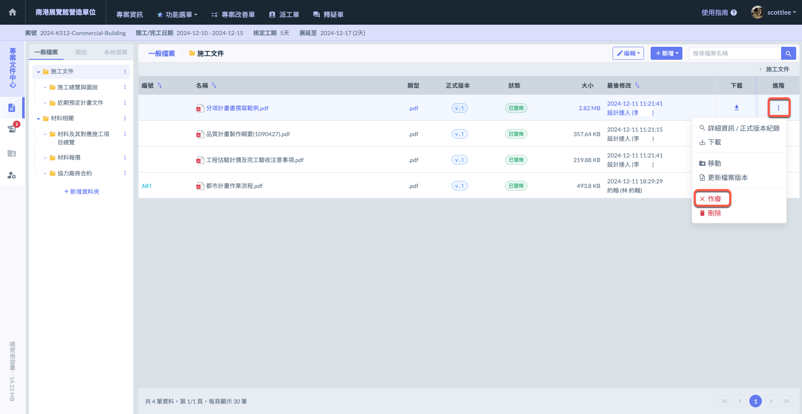
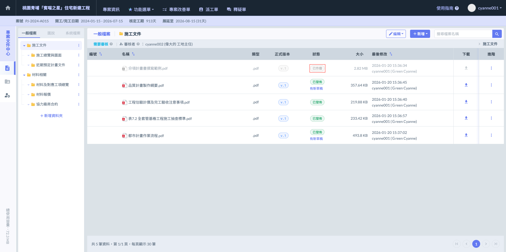
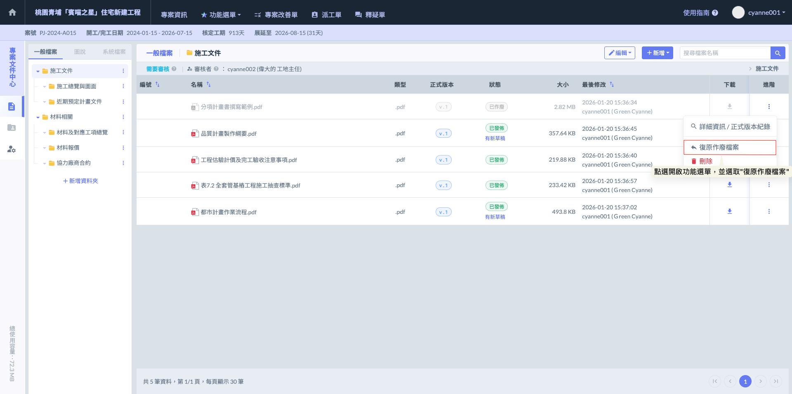
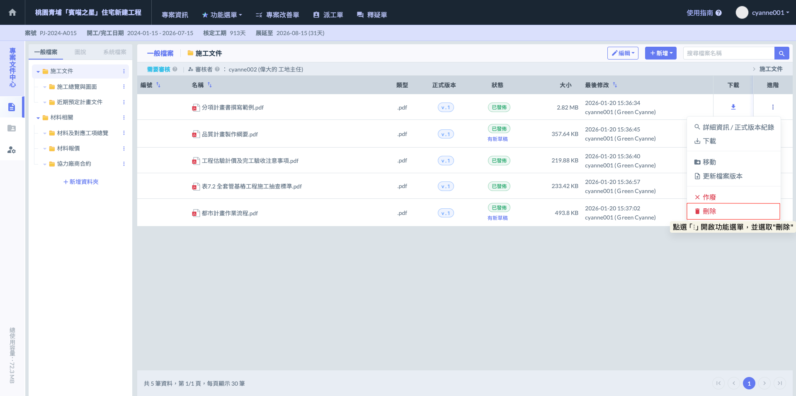

# 檔案移動、作廢與刪除

!!! danger
    #### 檔案異動權限限制
    
    為了確保專案資料的安全與完整性，系統針對具備「破壞性」或「結構變更」的操作設有嚴謹的權限門檻：
    
    * **管理員專屬權限：**&#x50C5;有具備「管理員」權限之人員，能夠執行檔案的移動、作廢及刪除操作。
    * **標準與唯讀人員限制：**&#x975E;管理員成員僅能檢視或上傳檔案，無法隨意更動檔案位置或將其移除，這能有效防止因操作不慎而導致的資料遺失或目錄紊亂。

***

### 01｜檔案移動

若需調整檔案的存放位置，系統提供直覺的搬移功能。

**操作步驟**

1. 於欲移動的文件右側  欄位，點選  開啟功能選單。
2. 選擇  功能。
3. 在彈出的視窗中選擇目標資料夾，確認後即可完成移轉。

!!! warning
    #### 💡 提示
    
    為了維護版控的嚴謹性，檔案無法移至設有『審核者』的資料夾。設有審核機制的資料夾必須透過正規的『上傳草稿』與『審核通過』流程來新增貨更新檔案，以確保每一份文件都經過核定程序。

如圖二，開啟「移動檔案」視窗後，介面將呈現專案內的資料夾樹狀結構。請依序選取欲移往的目標資料夾，在確認路徑無誤後，點選  按鈕即可完成位置變更。

完成畫面如下：

如圖四 - 當檔案移動完畢後，該檔案被移動的完整紀錄也會自動同步於『檔案歷程』中。

管理員可以清楚地查閱到：是哪位成員、在什麼時間點、將檔案從哪個原始路徑移往新的目標路徑。

***

### 02｜檔案作廢

<kbd>**檔案作廢與復原機制 (File Invalidation)**</kbd>

當檔案因過期、錯誤或計畫變更而不再適用時，管理員可執行「作廢」操作。這項機制能確保專案資料夾的整潔，同時保留完整的審核足跡。

<table><thead><tr><th width="154.8690185546875">功能</th><th>說明</th></tr></thead><tbody><tr><td><ol><li>作廢檔案的狀態</li></ol></td><td>

<ul><li><strong>保留紀錄：</strong>檔案被作廢後，並不會從系統中徹底消失，而是轉為「已作廢」狀態。它將保留在原位或特定區域作為歷史紀錄，便於未來隨時進行查詢、追蹤或稽核。</li><li><strong>停止使用：</strong>標示為作廢的檔案將失去活性，無法參與後續的流程處理（如作為最新圖說引用或再次審核），確保現場人員不會誤用過時資料。</li><li><strong>互不干擾：</strong>作廢檔案的存在僅供存查，完全不會影響其他現行檔案或資料夾的正常運作。</li></ul></td></tr><tr><td><ol start="2"><li>靈活的復原機制</li></ol></td><td>
系統考量到實務操作中可能有誤判的情形，因此設計了可逆的操作路徑：
<ul><li><strong>檔案復原：</strong>被作廢之檔案依然可以復原。若後續確認該文件仍有使用需求，管理員可隨時取消作廢狀態，讓檔案恢復至可正常存取與處理的狀態。</li></ul></td></tr></tbody></table>

***

**檔案作廢操作**

若檔案因圖說版本過時、內容有誤或工程計畫變更而不再適用，管理員可透過以下方式執行作廢：

**操作步驟**

1. 於欲處理的文件右側  欄位，點選 ​ 開啟功能選單。
2. 選擇  功能。

執行後，檔案會即時標示為<kbd><mark style="color:$info;">**已作廢**<mark style="color:$info;"></kbd>狀態。此動作僅限管理員執行，確保所有作廢決策皆經過權責人員確認。

完成畫面如下：

***

#### 02 - 1｜復原作廢

系統具備完善的錯誤修正機制。若檔案被誤標記為作廢，或因工程需求變更需要重新啟用該文件，管理員可以隨時執行復原。

**操作步驟**

1. 於標示為已作廢的文件右側  欄位，點選  開啟功能選單。
2. 選擇  功能。
3. 點選後，檔案將立即恢復至作廢前的原始狀態，並可重新參與專案的順曲與處裡。

***

### 03｜檔案刪除

執行「刪除」操作會將檔案從系統中完全移除。與作廢機制不同，刪除屬於不可逆的操作，檔案一旦移除後，將無法再被查詢、追蹤或恢復。

**操作步驟**

1. 於欲移除的文件右側  欄位，點選  開啟功能選單。
2. 選擇  功能。
3. 系統將徹底移除該檔案及其相關紀錄。

!!! danger
    #### ⚠️ 重要提醒
    
    刪除功能僅限『管理員』執行。由於檔案刪除後無法復原，建議在執行前確認該文件是否真的不再需要保留任何紀錄；若僅是版本更迭或暫不使用，建議優先使用****『X 作廢』****功能，以保留日後稽核的足跡。

