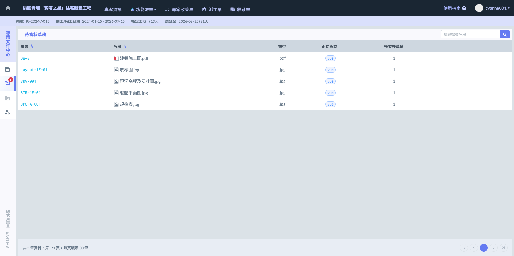

# 一般檔案

### 01｜新增資料夾

在『所有檔案』頁面點擊  即可開啟設定視窗，管理員除了**自定義資料夾名稱**外，還能**指定該資料夾是否需要『審核者』**，藉此啟動審查機制，確保所有檔案在正式上傳前皆經過嚴格把關。

開啟視窗後，勾選『需要審核』即代表該資料夾的上傳檔案均須經過人員查驗；勾選後，管理員可直接從該專案的成員名單中指定負責的審核者。

確認資料夾名稱與審核人員等設定無誤後，點選  即可完成建立。

!!! info
    #### 補充
    
    在建立資料夾時，管理員可從所有專案成員中彈性指定『審核者』，不論該成員具備何權限（管理員/標準/唯獨）皆可擔任。然而，基於實務管理邏輯，強烈建議審核者設定為具備管理員權限之人員，以確保審查流程的專業性與行政作業嚴謹度。

完成畫面如下：

***

#### 01 - 1｜新增子層資料夾

如欲在現有資料夾下建立子資料夾，除了可直接在資料夾列表中，於該資料夾右側點選「⋮」圖示，並選擇 功能外；亦可先進入資料夾內部，再點選畫面右上方之  圖示，選取。

 

開啟新增視窗後，同樣地，您需要填寫資料夾名稱，並依需求勾選是否設置審核機制，即可完成多層級的權限與流程控管。（如下圖範例，於****施工文件****下新增****施工總覽與圖說****）

!!! warning
    #### **❗** 請注意
    
    在建立子資料夾時，系統具備以下管理特性，確保操作效率與控管彈性的平衡：
    
    * **權限自動繼承：**&#x5B50;資料夾會自動繼承上一層（母資料夾）的「資料夾權限」設定（即哪些成員具備管理者、標準或唯讀權限），無需且無法重複設定，確保專案成員在同一叢集下的存取邏輯一致。
    * **審核機制獨立設定：**&#x96D6;然權限採繼承制，但「是否需要審核者」則為各資料夾獨立設定。每個子資料夾均可依據其文件重要性，個別決定是否啟動審核機制，且能指定不同的審核人員，實現更精細的流程控管（例如：結構圖由技師審核，材料報告由品管審核等）。

完成畫面如下：

***

### 02｜上傳檔案

如欲在現有資料夾下上傳檔案，除了可直接在資料夾列表中，於該資料夾右側點選「⋮」圖示，並選擇  功能外；亦可先進入資料夾內部，再點選畫面右上方之  圖示，選取 。

 

在執行檔案上傳時，只需點選頁面中的上傳提示區域，即可從電腦中選取欲匯入的檔案；系統支援多檔案同時上傳，大幅提升處理大量圖說或材料證明的作業效率。選取完畢後，系統會自動進入檔案資訊編輯視窗，供您進一步標註各個檔案的編號與說明。

如圖四，當您將檔案拖曳或選取上傳後，系統會自動跳出檔案資訊編輯視窗。在此步驟中，您可以針對本次上傳的各個檔案，逐一決定是否填寫對應的『檔案編號』與『內容說明』。

在檔案上傳後的處理流程上，系統具備自動化分流機制：



檔案上傳完成後，將直接發佈並呈現在資料夾中，供所有專案成員即時檢閱。



若該資料夾射有審核機制，檔案上傳後將自動移動至審核者的『待審核草稿區』。此時檔案尚未正式生效，須待審核者確認內容並批准後，才會正式移入資料夾對外發布。



以下為審核者專屬的『待審核草稿區』介面：

