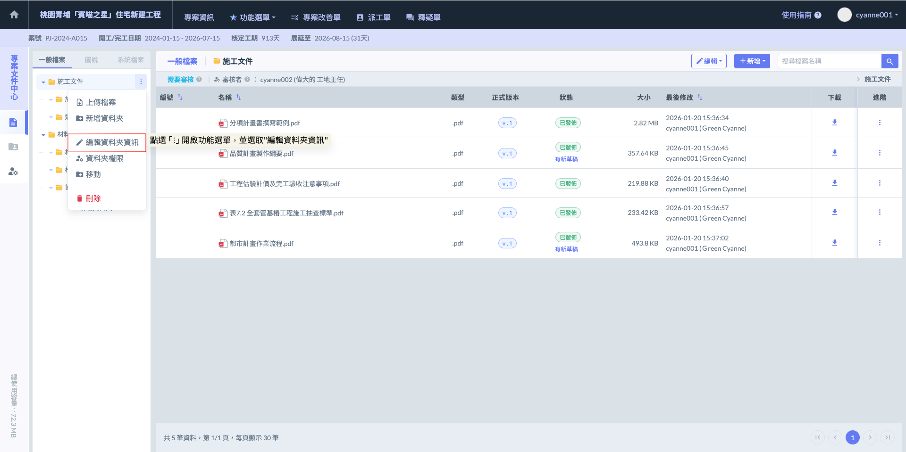
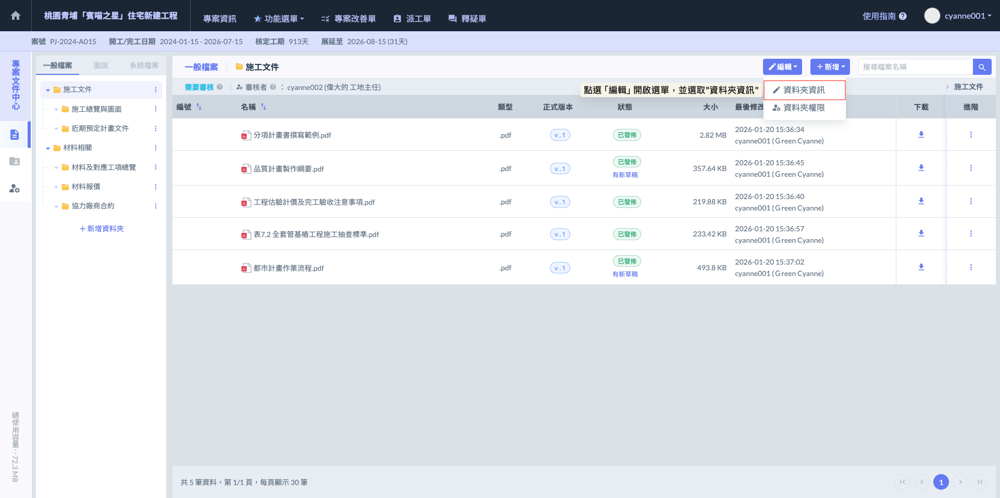
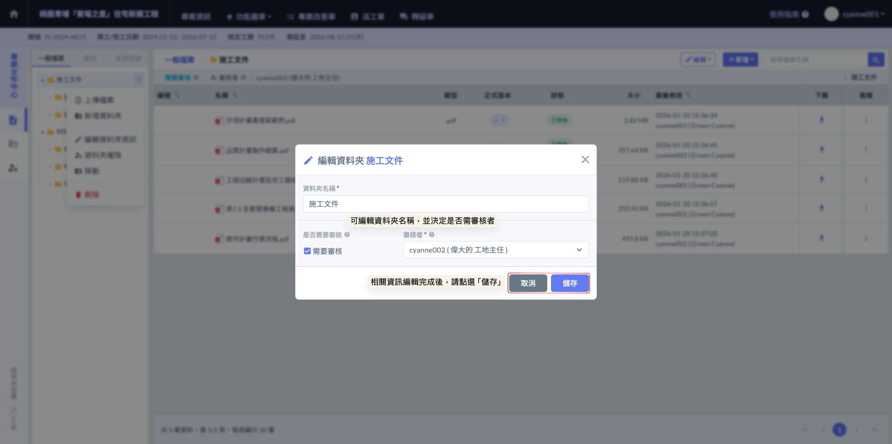
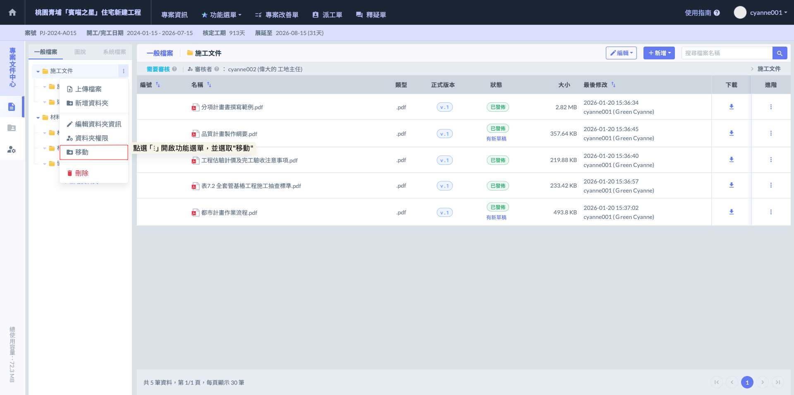
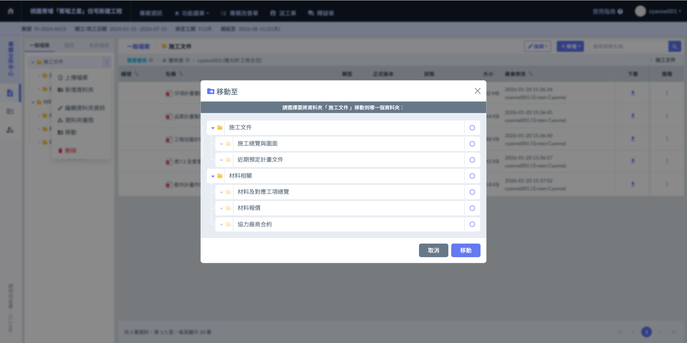
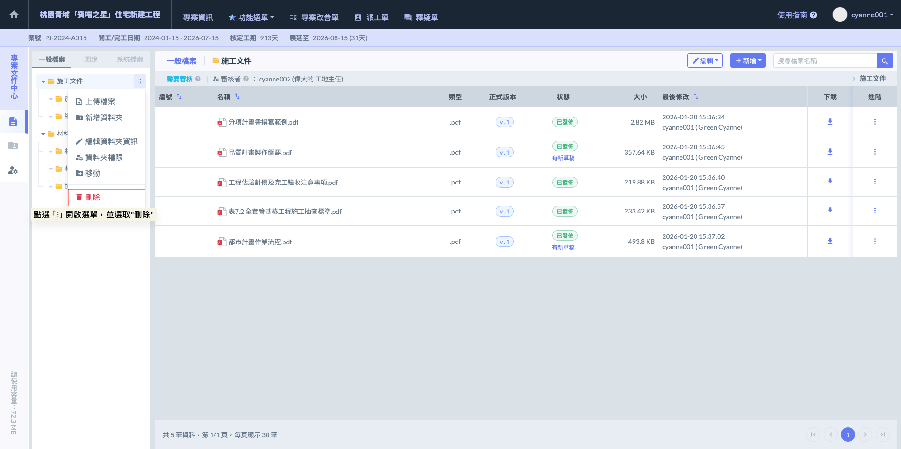

# 資料夾編輯、移動與刪除

!!! danger
    #### 資料夾管理權限與編輯 (Folder Management)
    
    為了維護專案目錄結構的嚴謹性，系統針對資料夾的異動設有高階權限控管。
    
    * **管理員專屬：**&#x50C5;有具備『管理員』權限之人員，能夠執行資料夾的編輯、移動及刪除操作。這能避免非管理人員隨意更動資料夾架構，導致專案文件分類紊亂。

***

### 01｜資料夾編輯

管理員可以隨時調整資料夾的屬性，以符合專案不同階段的需求。



可修改『資料夾名稱』。



可重新指定或更改該資料夾的『審核者設定』。



**操作步驟**

1. &#x20;於資料夾列表，選定欲的資料夾，於右方點擊  開啟功能選單。
2. 選擇選單中的 。
3. 在彈出的視窗中修改名稱或審核者，確認無誤後儲存即可。

(亦可先進入資料夾內部，再點選畫面右上方之  圖示，並選取)

 

開啟新增視窗後，您即可編輯資料夾名稱，並依需求勾選是否設置審核機制，即可完成多層級的權限與流程控管。

***

### 02｜資料夾移動

為了讓專案目錄能隨工程階段靈活調整，管理員可以隨時搬移資料夾位置，優化檔案分類。

**操作步驟**

1. 於資料夾列表，選定欲移動的資料夾，於右方點擊  開啟功能選單。
2. 選擇選單中的  功能。
3. 在彈出的資料夾樹狀結構中，選取欲移往的目標位置。

如圖二，開啟「移動資料」視窗後，介面將呈現專案內的資料夾樹狀結構。請依序選取欲移往的目標資料夾，在確認路徑無誤後，點選  按鈕即可完成位置變更。

!!! danger
    #### 核心規則與限制
    
    * **管理員權限：**&#x50C5;具備「管理員」權限之人員可執行此操作，以維持專案架構穩定。
    * **結構繼承：**&#x8CC7;料夾移動時，其包含的所有子資料夾及內部檔案將同步遷移至新路徑，並完整保留原有的審核設定與歷史紀錄。
    * **邏輯路徑限制：**&#x57FA;於系統邏輯與層級完整性，無法將資料夾移動至「自己」或「自己的子資料夾」下。

***

### 03｜資料夾刪除

執行資料夾刪除是管理目錄結構中最需謹慎的操作，這將涉及整體目錄層級的移除。

**操作步驟**

1. 於資料夾列表，選定欲刪除的資料夾，於右方點擊  開啟功能選單。
2. 選擇選單中的  功能。
3. 系統將執行移除程序。

!!! warning
    #### ⚠️ 重要提醒
    
    ****不可逆的操作****。一旦執行刪除資料夾，其內含的所有文件以及下層子資料夾將會一併被完全移除且無法復原。由於此操作會導致大量資料與歷史紀錄消失，請在執行前務必再次確認該目錄內容是否已全數備份或不再具備留存價值。

