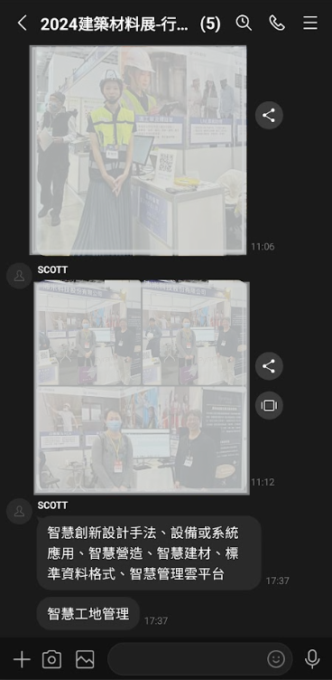
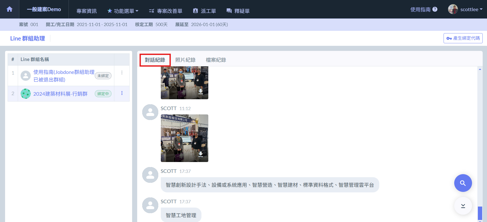
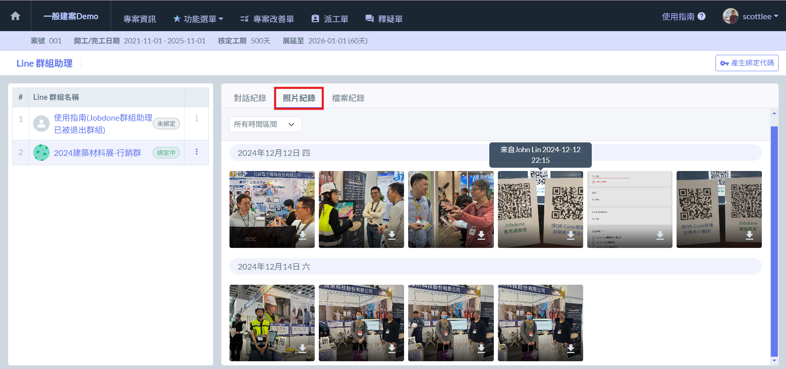
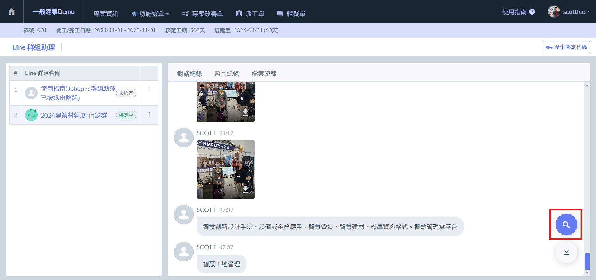
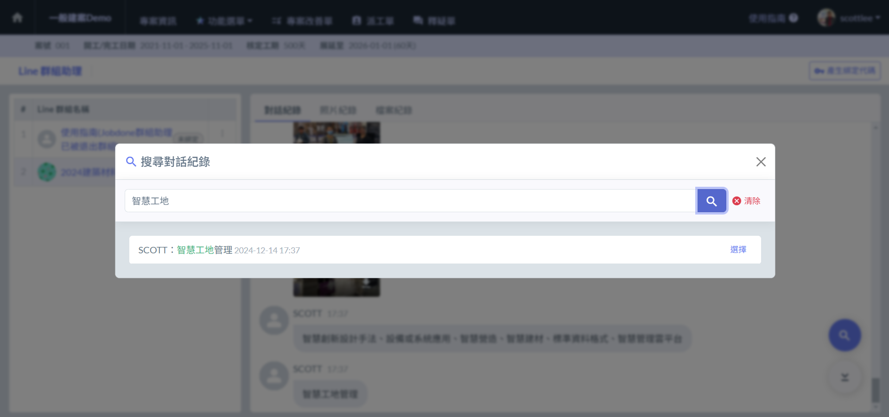
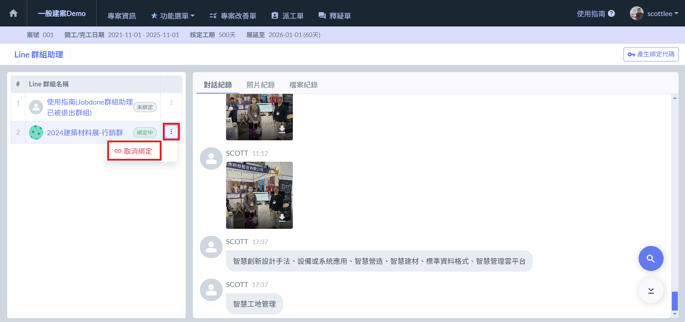

# 群組紀錄

## 紀錄同步

圖一為Line 群組對話紀錄範例 (照片經模糊處理)，紀錄會直接同步&#x65BC;**「Line 群組助理」**&#x4E2D;。

您的對話紀錄 (圖二)、照片紀錄(圖三)及檔案紀錄都一併被記錄於群組助理中。

### 對話紀錄

### 照片記錄

***

## 紀錄搜尋

系統提供搜尋功能，讓您快速找尋欲查看的對話紀錄。

***

## 取消綁定

您可透過將群組助&#x7406;**「移出群組」**&#x6216;**「於網頁上取消綁定」**&#x4E2D;止綁定。

一旦取消綁定後，群組助理將不再紀錄之後任何對話、圖片及檔案，但先前的對話紀錄仍會留存。

!!! tip
    取消綁定後，可再次重新產生綁定代碼，將群組助理綁定於新的群組。

