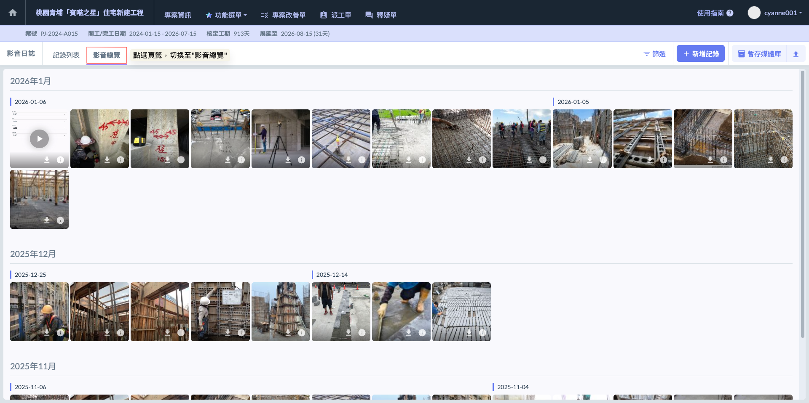
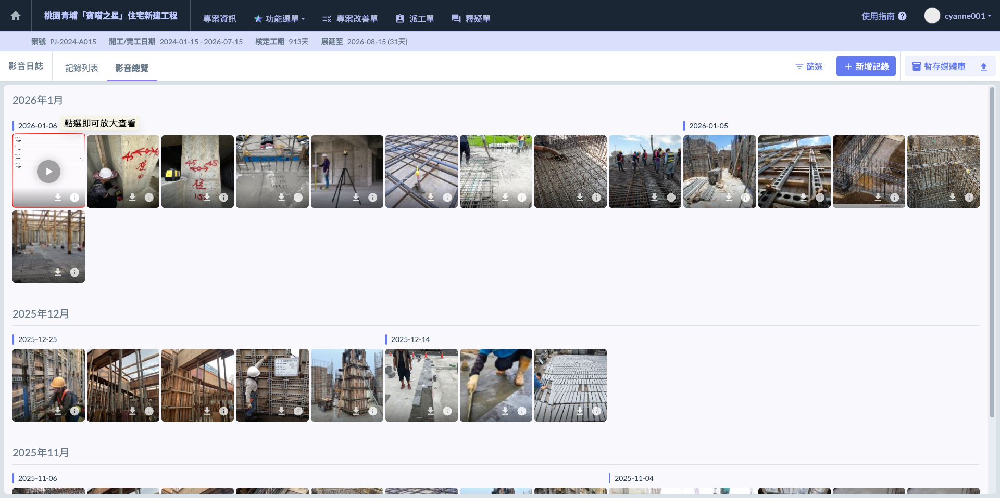
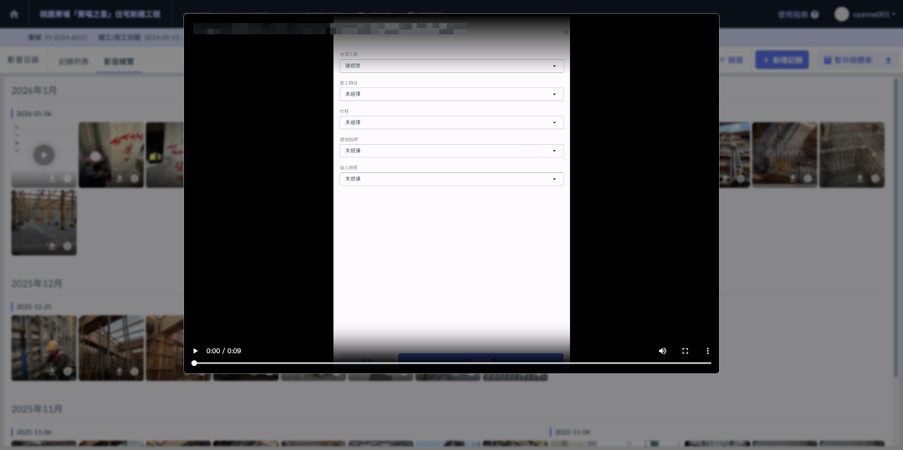
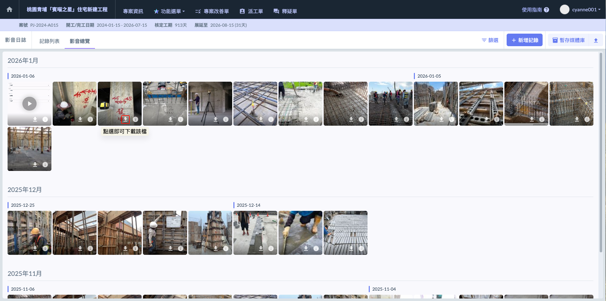
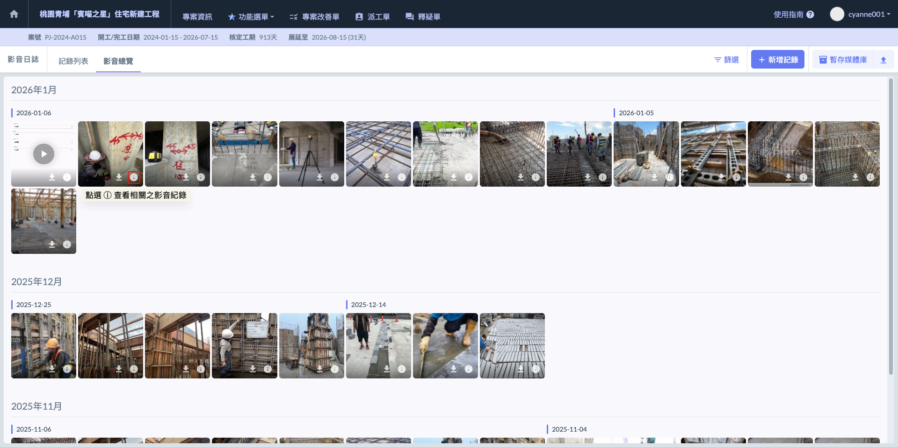
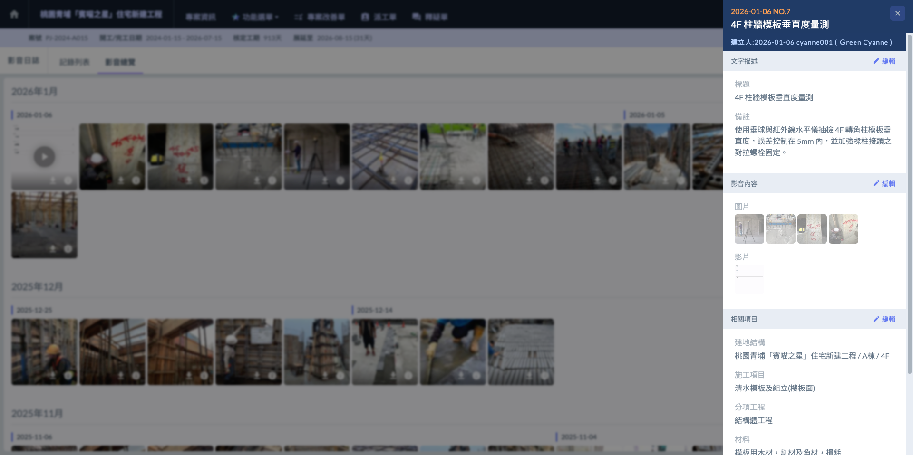
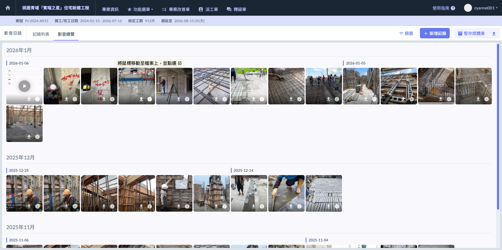
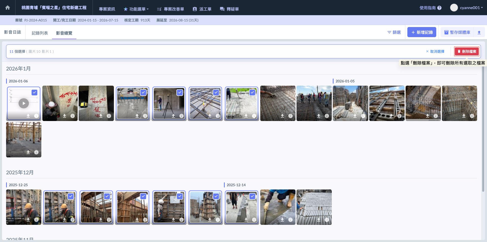

# 影音總覽

## 01｜影音總覽

進入『影音總覽』功能後，系統會以視覺化的方式呈現專案中所有的影像資產。與條列式的紀錄列表不同，影音總覽更強調直觀的影像檢視與時間流向的管理。

以下為『影音總覽』的詳細操作與功能補充：

<table><thead><tr><th width="122.628173828125">特點</th><th>說明</th></tr></thead><tbody><tr><td><strong>月份分區管理</strong></td><td>系統自動將所有影音檔案按「月份」進行大區塊分類，方便您快速滑動滾輪即可回溯不同月份的施工進度。</td></tr><tr><td><strong>同日期聚合</strong></td><td>在同一個月份內，系統會將相同日期所引用的所有影音檔案（包含照片與影片）自動匯聚在一起。這種設計能讓管理人員一眼看出特定日期的現場出勤飽和度與紀錄完整度。</td></tr><tr><td><strong>全媒體呈現</strong></td><td>影音總覽會直接顯示圖檔縮圖與影片預覽點選，讓您不必點進日誌就能直接在畫面上流覽施工細節。</td></tr></tbody></table>

***

### 01 - 1｜查看檔案

系統提供了極為直觀的瀏覽體驗。您無需進入繁瑣的選單，直接點擊頁面中任何一張欲查看之圖檔或影片，內容將直接放大供您檢視。

***

### 01 - 2｜下載檔案

系統提供圖片下載功能，於影音列表中選取欲下載之檔案後，點選該檔案之  圖示，即可將此檔案下載至電腦中。

***

### 01 - 3｜查看/編輯紀錄

將鼠標移至欲查看/編輯之檔案上，點選下方之 ⓘ 圖示，系統即會帶領您直接進入該檔案所對應的影音日誌紀錄中進行查看或細節編輯。

點選 ⓘ 圖示後，即可進入紀錄內部，詳細查看該筆日誌的細部資訊(如文字描述、影音內容及相關項目)。

***

### 01 - 4｜刪除影音檔案

如圖六，將鼠標移至欲刪除之檔案上，該圖檔會浮現  圖示。點選後即可選取該檔案，系統亦支援批次勾選，讓您能一次選取多個檔案後，點選刪除鈕一併移除選取之檔案。

**💡 刪除影音的兩種方式：**



如前所述，直接在影音總覽中透過鼠標移至檔案、勾選並刪除。此方式適合快速清理多張無用的重複影像。



您亦可直接進入特定的紀錄編輯頁面，針對該日誌內的影音內容進行個別編輯。在此模式下，您可以精確挑選哪一張照片需要被移除，或替換為更高清晰度的版本，操作更為細膩。



!!! tip
    刪除檔案僅會刪除該筆紀錄中的影音內容（照片或影片），系統並不會將整個日誌紀錄（如標題、備註、標籤資訊）刪除。這確保了即便影像因錯誤需移除，文字紀錄仍可被保留。

選取檔案並進行批次勾選後，系統會自動統計並提示目前所選取的檔案總數(如：圖片 10、影片 1 )。在確認所選內容無誤後，即可點選  執行批次刪除動作。

此功能雖能大幅提升清理媒體庫的效率，但操作時請務必謹慎，並注意以下核心原則：

!!! danger
    #### ⚠️ 批次刪除注意事項
    
    1. 資料一經刪除即無法復原。系統不設有資源回收桶機制，一旦執行刪除，系統將永久移除該檔案。
    2. 批次刪除雖具便利性，但不可誤刪重要紀錄。執行前，建議再次確認選取的檔案中是否包含已編輯過、帶有重要施工畫記或數據標註的影像。
    3. 勾選時請留意圖檔是否已關連至正式日誌，刪除影像將導致該日誌內容不完整。
    4. **先下載後刪除：** 若不確定未來是否還會用到該圖檔，建議先利用批次下載功能存至本地電腦備份，再執行系統內的刪除作業，以確保資訊安全。

