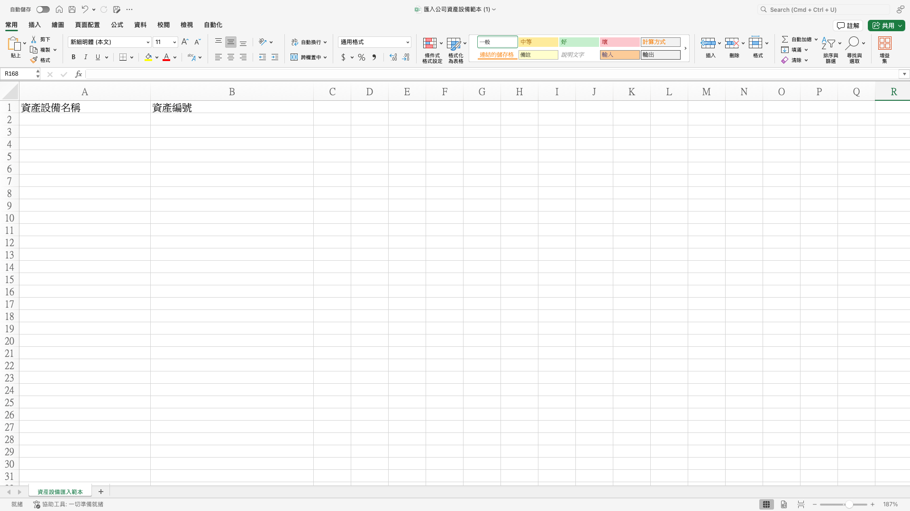
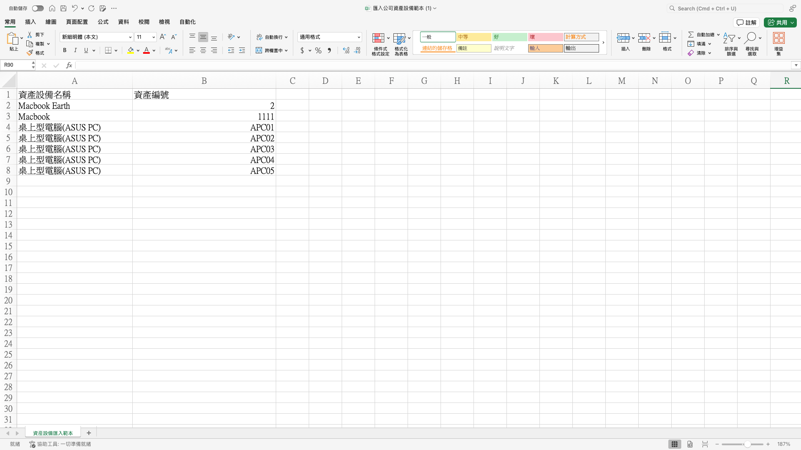
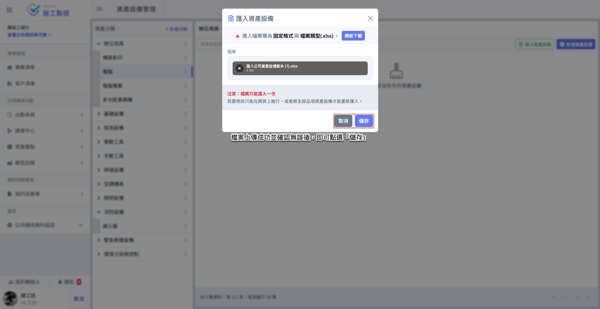
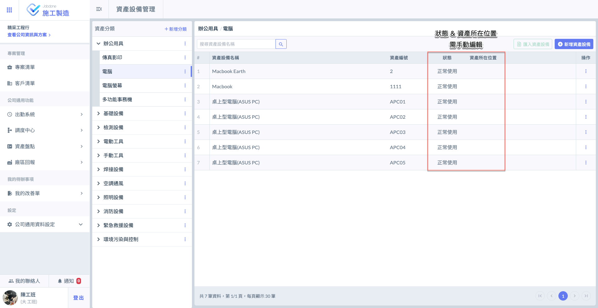

# Excel 匯入資產設備

## 01｜檔案匯入資產



### 下載 Excel 模板

如圖一所示，進入「資產設備管理」主頁面後，請點選右上角之<kbd><mark style="color:green;">**匯入資產設備**<mark style="color:green;"></kbd> ，開啟匯入視窗。

如圖二所示 (點選<kbd><mark style="color:green;">**匯入資產設備**<mark style="color:green;"></kbd>後之畫面)，點選右上方&#x7684;**「下載模板」**，即可下載 Excel 範本。

模板格式如圖三所示，請您依據表格填寫<kbd>**資產設備名稱**</kbd>、<kbd>**資產編號**</kbd>等。




### 填寫資產設備模板

如圖四所示，請您詳細填寫欲新增至該資產分類下的資產設備資料。\
其中，「資產設備名稱」與「資產編號」皆為必填欄位，請務必填寫完整。

!!! danger
    #### 注意事項
    
    1. 僅當尚未新增任何資產設備時，才可使用 Excel 檔案一次匯入所有品項；若已有資產設備，則僅能透過網頁介面進行新增或刪除資產設備資料。
    2. 由於系統需依格式判讀資料，務必使用上述提供的模板，並確實依照指定格式正確填寫。
    3. **您自訂的每個資產分類皆需分別填寫對應的資產模板。**\
       也就是說，每個 Excel 檔案僅對應一個分類下的資產資料，請勿將不同分類的資產混合填寫於同一份檔案中，以確保匯入資料時的正確性與可追溯性。




### 選取資產分類

如圖五所示，新增各資產設備前，請先確認當前所在的資產分類是否正確，以確保資產資料填寫至正確的分類中。

有關切換資產分類之操作，亦可參考下方影片：

{% embed url="https://files.gitbook.com/v0/b/gitbook-x-prod.appspot.com/o/spaces%2FEqUCL3D5WQfpxJw8NL3P%2Fuploads%2FLjlaw2L5B4oSfYPSoDQs%2F%E8%B3%87%E7%94%A2%E8%A8%AD%E5%82%99%E7%AE%A1%E7%90%86%E7%90%86.mp4?alt=media&token=45c25389-d56d-4a14-9054-d617109aaafb" %}
切換資產分類




### 上傳資產設備模板

如圖六所示，進入檔案上傳視窗後，請在上傳區域中選擇您欲上傳的檔案。

!!! danger
    #### 注意事項
    
    1. Excel 匯入功能僅限於尚未新增任何資產設備資料時使用，匯入後即無法再次使用。
    2. 若需變更或新增資產設備資料，請透過系統進行手動編輯。
    3. 由於檔案僅能上傳一次，若需重新匯入 Excel 資料，請先刪除原有所有資料後再進行匯入。

如圖七 \~ 圖八所示，檔案上傳成功並確認內容無誤後，即可點&#x9078;**「儲存」**&#x5B8C;成匯入作業。

 




### 完成畫面

如圖九所示，檔案上傳成功後，資產即會顯示於指定分類下之資產設備管理列表中。

!!! warning
    請注意：資產設備所對應之<kbd>**狀態**</kbd>、<kbd>**資產所在位置**</kbd>等資料，需由您手動編列，無法透過 Excel 匯入。
    
    有關手動編輯之詳細操作流程，請參閱 ➙ [#id-04-1-bian-ji-zi-chan-she-bei](..#id-04-1-bian-ji-zi-chan-she-bei "mention")



