# 公司品項目錄

在工程管理實務中，合約內容往往涵蓋多項施工項目與服務項目，而不同人員在填寫品項時可能出現用字不一致、敘述方式不同等情況，進而造成資料重複、查找困難、對帳不易或統計混亂。

為提升作業效率與資料一致性，Jobdone 提&#x4F9B;**「公司品項目錄」**&#x529F;能，讓公司能夠預先建立各類標準化的品項名稱、分類與屬性，作為後續編列合約品項時的引用基礎。

此功能為整個施工製造流程的品項來源主體，所編列的每一筆品項，皆會作為後續：

* **階段需求單**（如進度推動用料申請）
* **施工單**（現場作業安排與交付）
* **製造單**（指派加工製程與生產）
* **出貨單**（出場/進場控制與配送）

等作業的實體作業對象，亦是未來工程資產與進度管控的資料基礎。

<table><thead><tr><th width="187.136474609375">功能目的</th><th>說明</th></tr></thead><tbody><tr><td>建立標準化品項資料庫</td><td>統一公司內部對服務或產品項目的命名與分類方式，避免重複建檔或語意不清。</td></tr><tr><td>快速帶入合約品項</td><td>建立品項後，在新增合約時可直接引用，減少逐筆輸入時間，提升效率。</td></tr><tr><td>跨專案一致性管理</td><td>所有專案皆可共用此資料庫，確保資料一致、方便統計與後續查核。</td></tr></tbody></table>

!!! warning
    請注意：
    
    1. 品項分類設定為公司層級，所有成員皆可檢視與使用，請由具管理權限者統一維護，避免重複或命名混淆。
    2. 若有不同部門、工種需使用不同分類架構，建議事前協調命名規則與分類邏輯。
    3. 為利系統套用，請盡量使用具辨識性、簡潔且專業的用語命名品項。
    
    有關專案內部之個別品項管理，請參閱 ➙ [item](../project_level/project-management/contract/item "mention")

***

進入施工製造主頁面後，點選「公司通用資料設定」下的<kbd>**公司品項目錄**</kbd> ，即可開始進行相關操作。

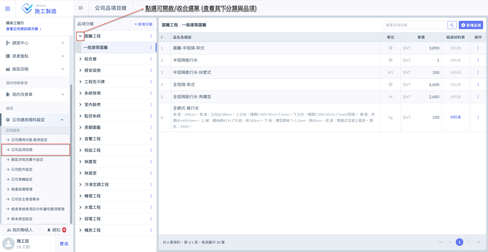

***

## 01｜操作流程說明



### 新增大分類

進入公司品項管理頁面後，點選品項分類欄位右側的<kbd><mark style="color:purple;">**+新增分類**<mark style="color:purple;"></kbd>，即可開啟視窗進行分類設定。

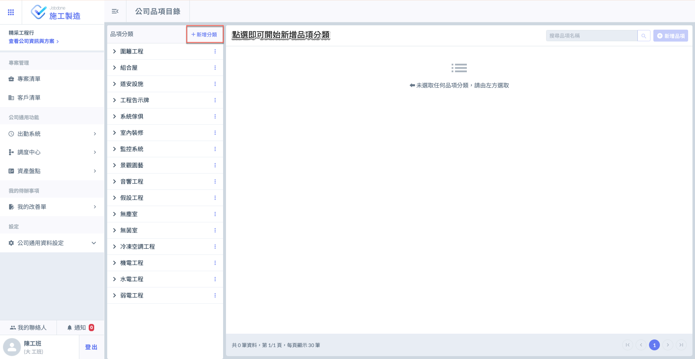 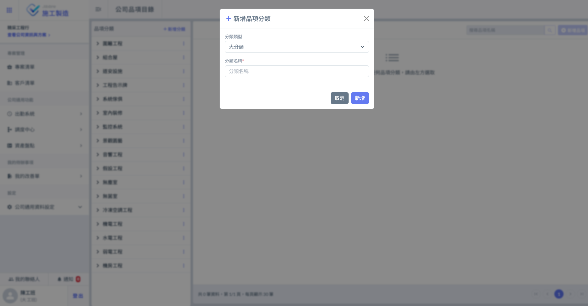

將大分類資料填寫完成並確認無誤後，點&#x9078;**「新增」**，該大分類即會顯示於品項分類列表中。

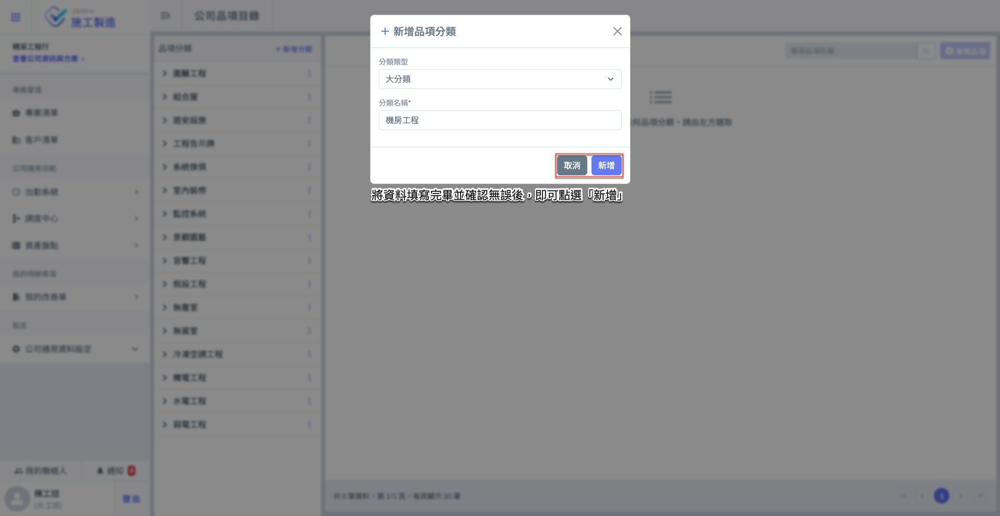 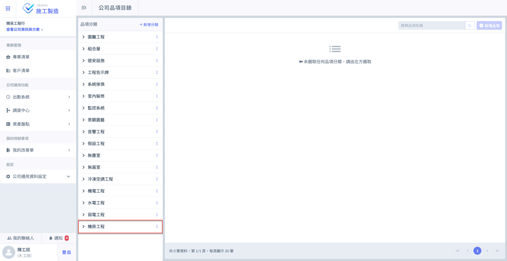




### 新增次分類

系統提供兩種方式新增子分類，分別為：



可直接於品項分類頁面中新增子分類，並選擇對應的大分類。



於特定大分類下點選「+新增子分類」，系統將自動套用所屬大分類，僅需填寫子分類名稱



#### 透過<kbd><mark style="color:purple;">+新增分類<mark style="color:purple;"></kbd>

進入公司品項管理頁面後，點選品項分類欄位右側的<kbd><mark style="color:purple;">**+新增分類**<mark style="color:purple;"></kbd>，即可開啟視窗進行分類設定。

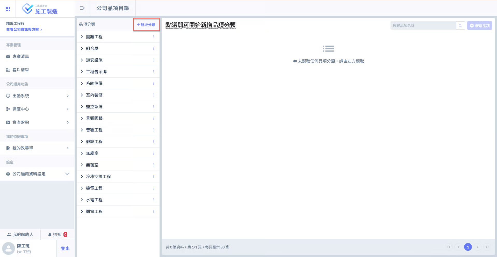

如圖六所示，請點選分類類型欄位，開啟功能選單，並將類型設定&#x70BA;**「次分類」**。

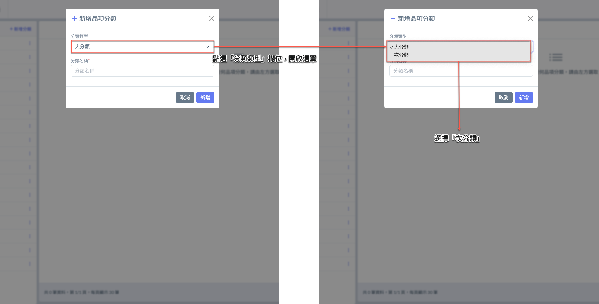

將分類類型設為次分類後，即會顯&#x793A;**「所屬大分類」**&#x6B04;位，點擊即可開啟下拉選單進行選擇。

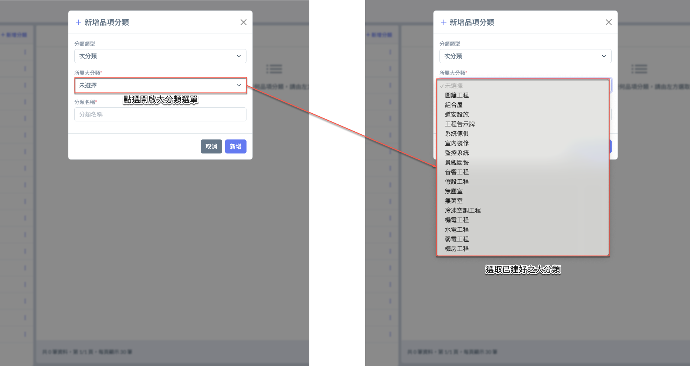

如圖八 \~ 九所示，將資料填寫完畢並確認無誤後，點&#x9078;**「儲存」**，該子分類即顯示於所屬的大分類下。

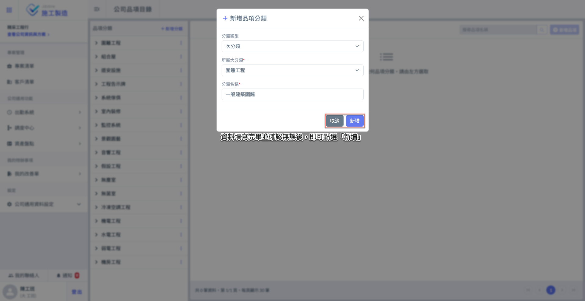 

***

#### 透過大分類新增

於欲新增子分類之大分類右側點&#x9078;**「⋮」**&#x5716;示，即可開啟功能選單。選&#x64C7;**「新增子分類」**&#x9032;行新增操作。

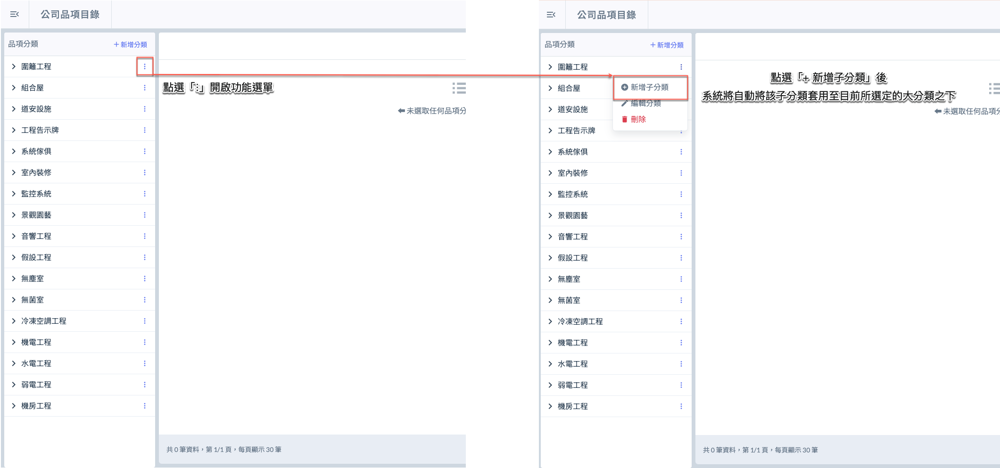

如圖十一 \~ 十二，將資料填寫完畢並確認無誤後，點&#x9078;**「儲存」**，該子分類即顯示於所屬的大分類下。

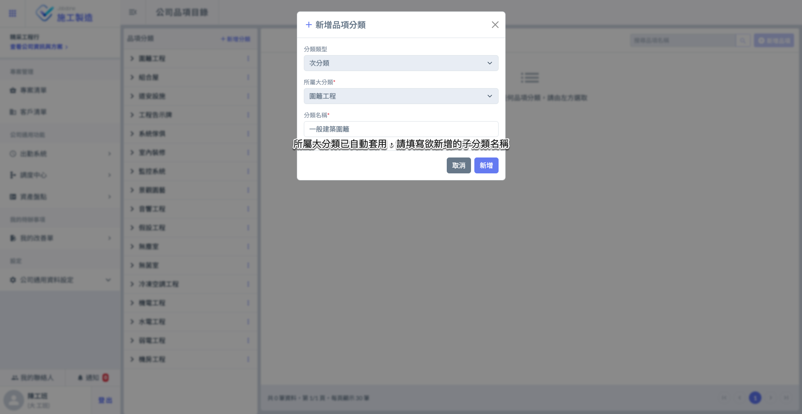 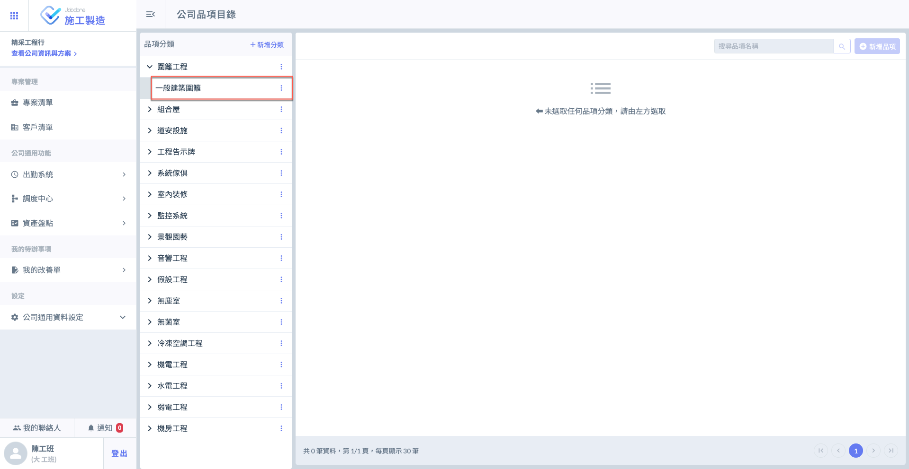




### 新增品項

此處所建立的品項**不限於實體產品**，亦可用來表示各類工程服務，例如可建立「基礎放樣」一式，作為後續合約中的作業項目。

請於新增品項前，先選取欲新增的分類，方可啟&#x7528;**「新增品項」**&#x529F;能，並將品項新增至所選分類下。

!!! danger
    請注意：
    
    1. 品項分類採固定兩階層結構，因此****僅能在第二階層 (子分類) 下建立品項****，不可直接於大分類下新增品項。
    2. 已建立的品項可隨時進行編輯，亦可移動至其他子分類，或透過**複製後編輯**的方式快速建立相似品項，提升建檔效率。
    3. 編輯品項資料前，務必確認您目前所在的分類正確無誤，以避免將品項誤設於錯誤的分類下。

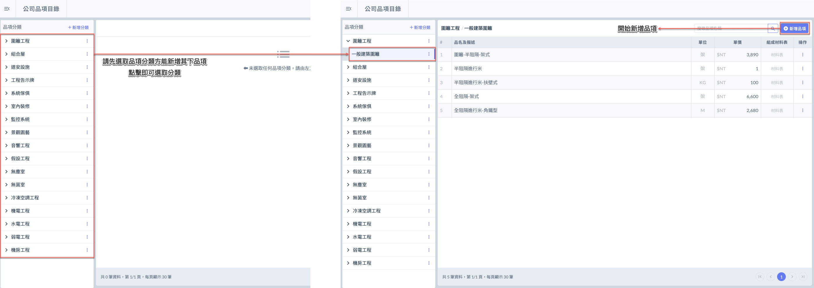

服務項目的單價可依實際情況於合約編列階段進行估價與調整，具備高度彈性。

每筆品項皆可設定以下內容：**品項描述**、**流程設定**及**組成材料需求**



說明用途、施作範圍或技術要求。



指派對應的製作流程與關卡，供製造單與現場管理使用。



可設定該品項所需的組成材料，作為後續材料請領與製造基礎。



如圖十四所示，點選<kbd><mark style="color:purple;">**+新增品項**<mark style="color:purple;"></kbd>後，即可開啟新增視窗，開始填寫公司品項資料。

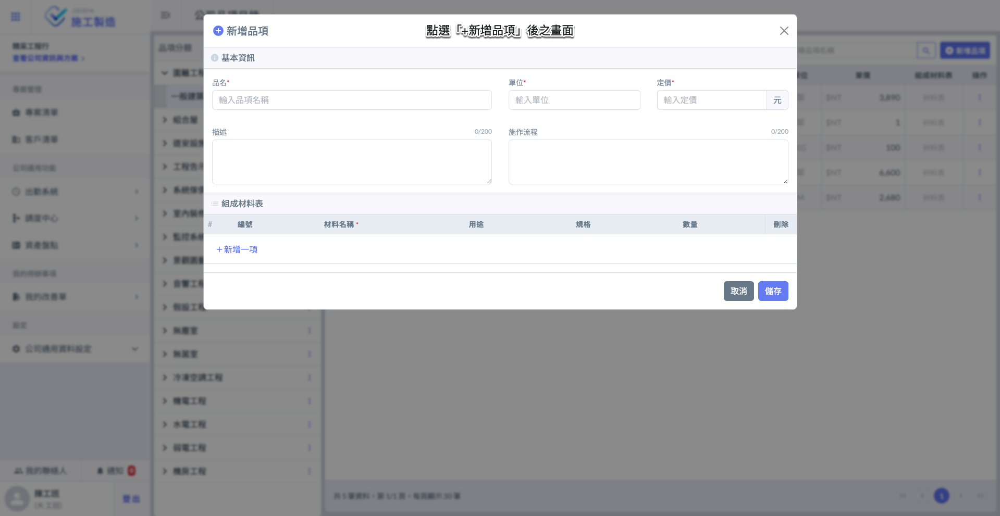

如圖十五 \~ 十六所示，填寫品項資料後，點&#x9078;**「儲存」**&#x5B8C;成設定，該品項即會顯示於品項目錄中。

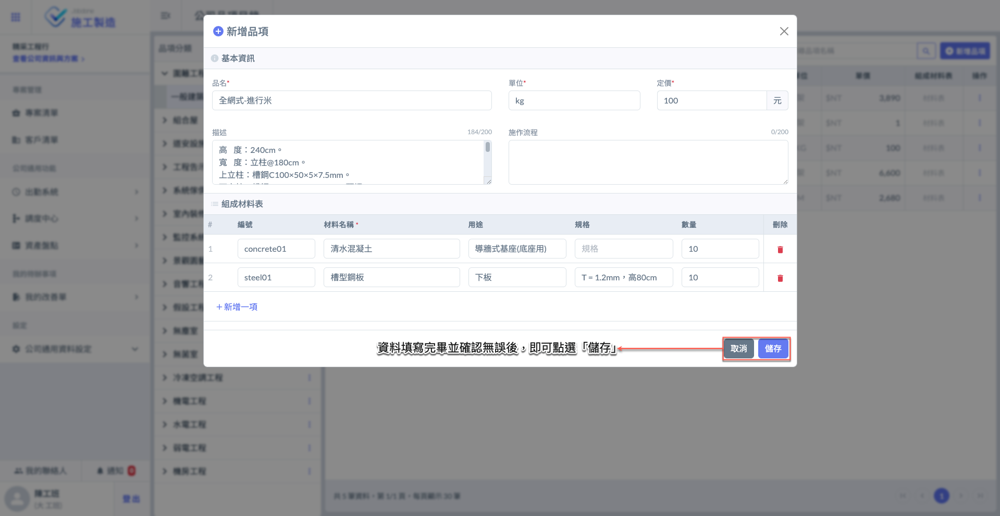 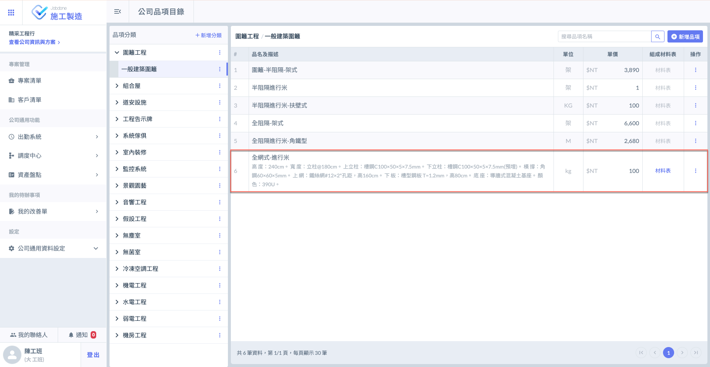




***

## 02｜編輯/刪除大分類

於欲編輯或刪除的大分類右側點&#x9078;**「⋮」**&#x5716;示，即可開啟功能選單，並選擇 <kbd>**編輯分類**</kbd> / <kbd><mark style="color:red;">**刪除**<mark style="color:red;"></kbd>。

!!! warning
    請注意：
    
    此操作將**連同所屬的所有子分類一併刪除**，也就是該分類下的**所有品項資料將同時被移除且無法復原**。\
    請務必在確認不再需要該分類及其內容時再執行，避免造成資料遺失。

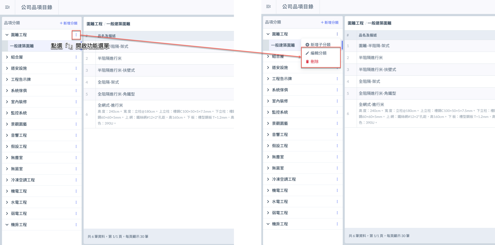

***

## 03｜次(子)分類相關

### 03 - 1｜編輯次分類

如圖一所示，於欲編輯之次分類右側點&#x9078;**「⋮」**&#x5716;示，即可開啟功能選單，並選擇 <kbd>**編輯分類**</kbd> 。

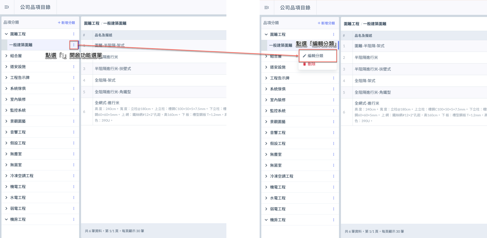

如圖二所示，開啟選單後，點選<kbd>**編輯分類**</kbd>，即可進入編輯畫面，可修改(次)分類名稱並調整所屬大分類。

完成填寫後，請點&#x9078;**「儲存」**&#x4EE5;套用變更。

!!! tip
    當更動指定子分類的所屬大分類時，該子分類下的所有品項也會**一併移動**至新的大分類架構下，請確認變更正確以維持資料組織一致性。

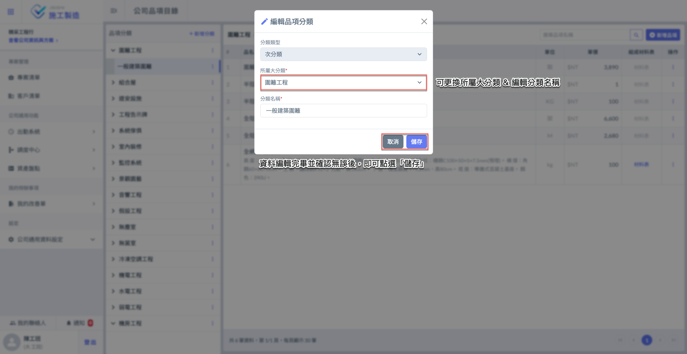

***

### 03 - 2｜刪除次分類

如圖三所示，於欲刪除之次分類右側點&#x9078;**「⋮」**&#x5716;示，即可開啟功能選單，並選擇 <kbd><mark style="color:red;">**刪除**<mark style="color:red;"></kbd>。

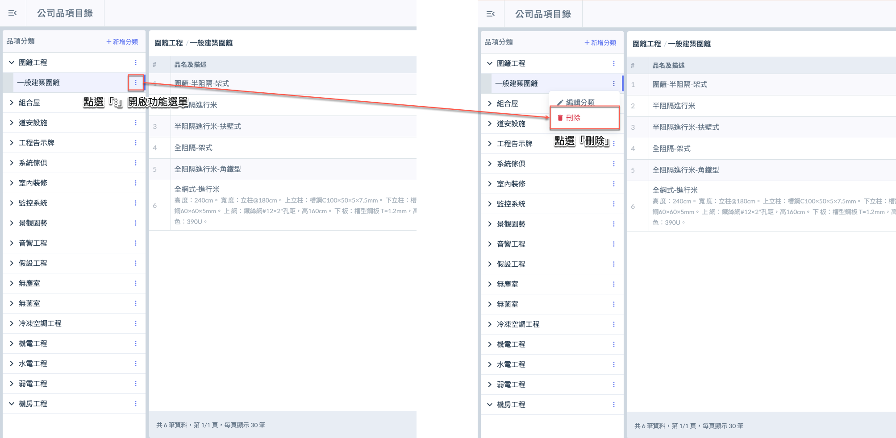

***

## 04｜品項相關

此處所建立的品項**不限於實體產品**，亦可用來表示各類工程服務，例如可建立「基礎放樣」一式，作為後續合約中的作業項目。\
服務項目的單價可依實際情況於合約編列階段進行估價與調整，具備高度彈性。

每筆品項皆可設定以下內容：**品項描述**、**流程設定**及**組成材料需求**



說明用途、施作範圍或技術要求。



指派對應的製作流程與關卡，供製造單與現場管理使用。



可設定該品項所需的組成材料，作為後續材料請領與製造基礎。



!!! tip
    此設計讓品項能涵蓋實體產品與服務項目，並完整對應施工製造流程中所需資訊。

如圖一所示，於欲操作之品項右側點&#x9078;**「⋮」**&#x5716;示 (於操作欄位)，即可開啟功能選單。

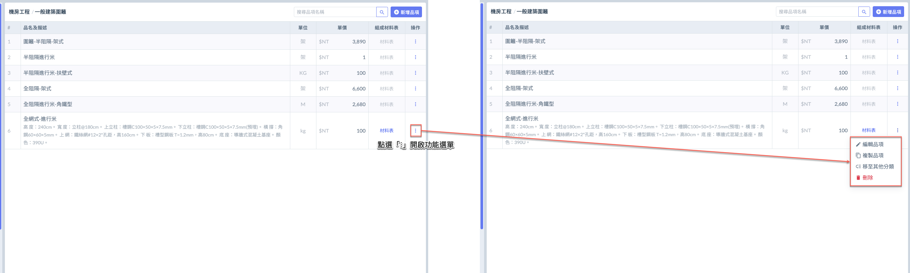

***

### 04 - 1｜編輯品項

如圖二所示，開啟選單後，請點選<kbd>**編輯品項**</kbd>，即可進入編輯畫面，對該品項資料進行修改與更新。

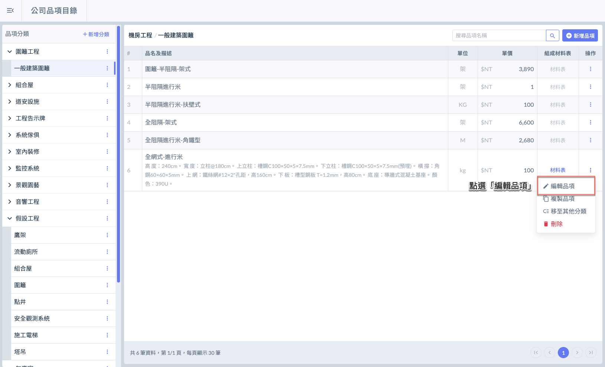

如圖三所示，您可在編輯畫面中修改品項資料。完成修改並確認無誤後，請點&#x9078;**「儲存」**，即可套用變更並更新品項內容。

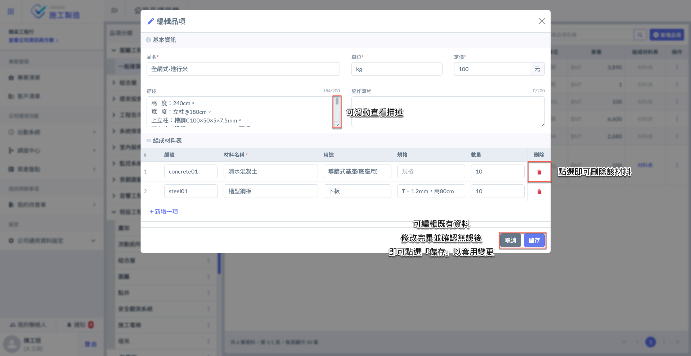

***

### 04 - 2｜複製品項

如圖四 \~ 圖五所示，開啟選單後，請點選<kbd>**複製品項**</kbd>，系統即會於當前分類下複製一份所選品項，您可再進行必要的修改以節省建檔時間。

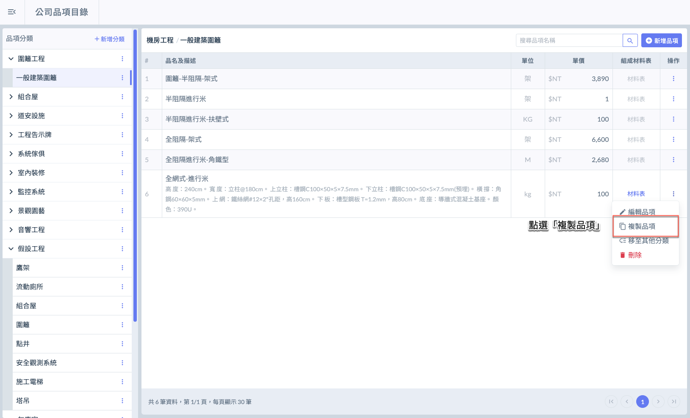

**複製品項功能可協助您******以既有品項資料為基準******，快速建立一筆新的品項。**\ **複製後的品項會完整保留原品項的欄位資料，您可******針對原資料進行修改與調整******，以建立符合需求的新項目，無需從零填寫，提升建檔效率。**

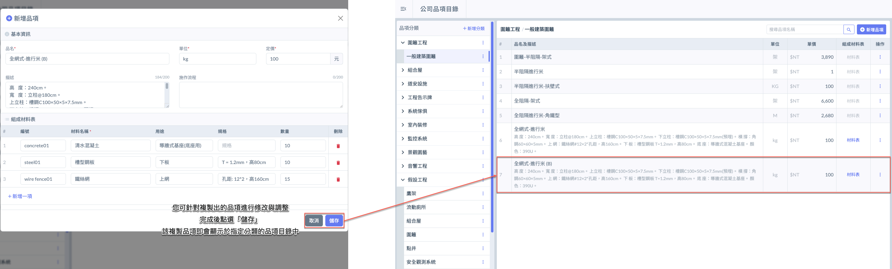

***

### 04 - 3｜移至其他分類

如圖六 \~ 圖七所示，開啟功能選單後，請點選<kbd>**移至其他分類**</kbd>，即可開啟分類選單。

選擇新的分類後，系統將自動將所選品項移動至指定分類下。

!!! tip
    此功能僅提供**單一品項**的分類移動操作。\
    若需將整個子分類下的所有品項**一次性調整所屬分類**，請改由**編輯子分類的所屬大分類**，系統將自動連同其下所有品項一併移動至新分類架構中。
    
    有關一次性調整所屬分類之相關操作，請參閱 ➙ [#id-03-1-bian-ji-ci-fen-lei](#id-03-1-bian-ji-ci-fen-lei "mention")

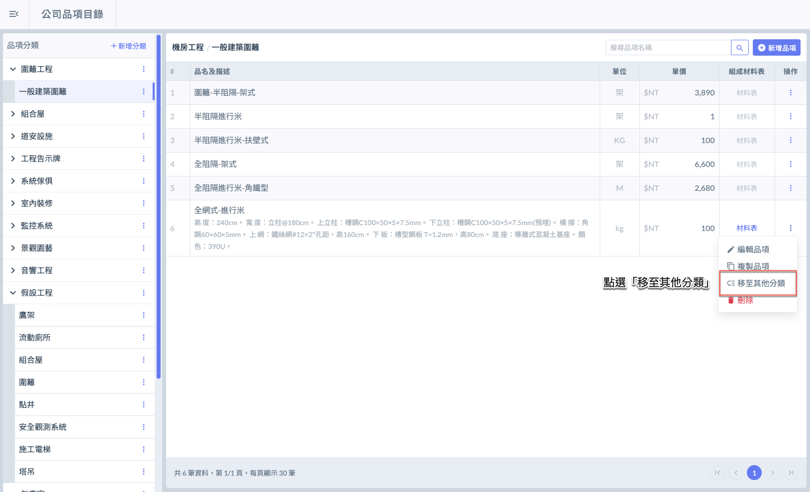

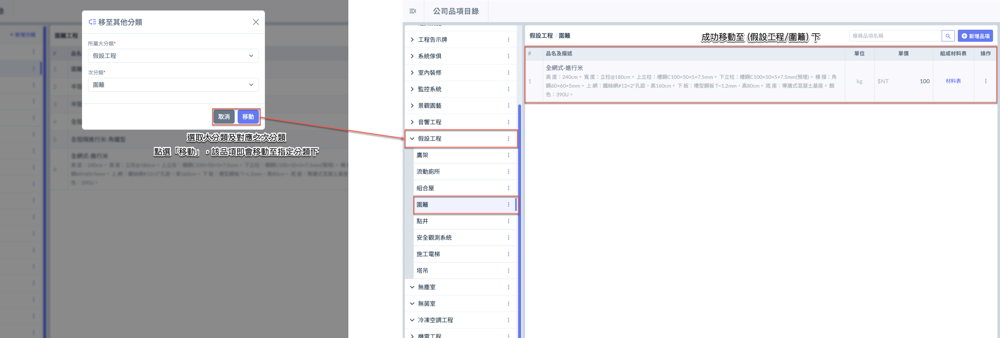

***

### 04 - 4｜刪除品項

如圖八 \~ 圖九所示，開啟選單後，請點選<kbd><mark style="color:red;">**刪除流程**<mark style="color:red;"></kbd>，系統將跳出確認視窗，請再次確認是否刪除。

!!! warning
    請注意：
    
    品項資料與施工單、製造單、出貨單等多項作業密切關聯，
    
    一旦刪除，將導致相關資料無法追溯，且無法復原，可能影響作業紀錄、進度回報與歷程查詢。
    
    建議**僅於確認該品項完全未被使用或不再使用時**，才執行刪除操作，並務必審慎確認。

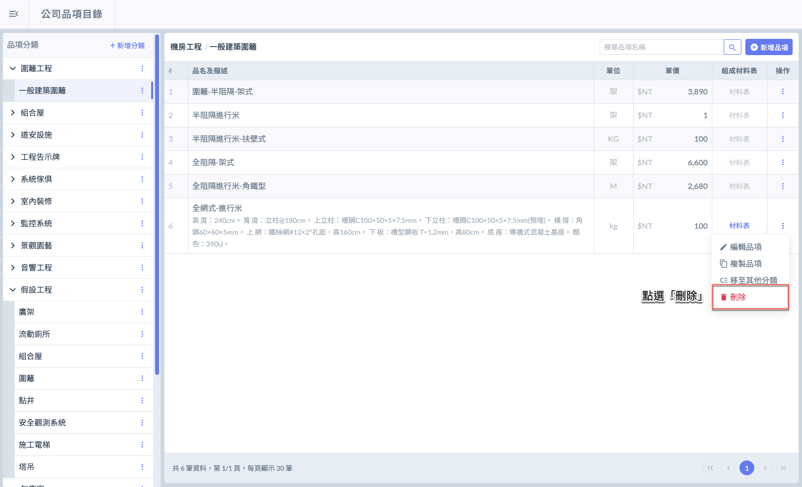 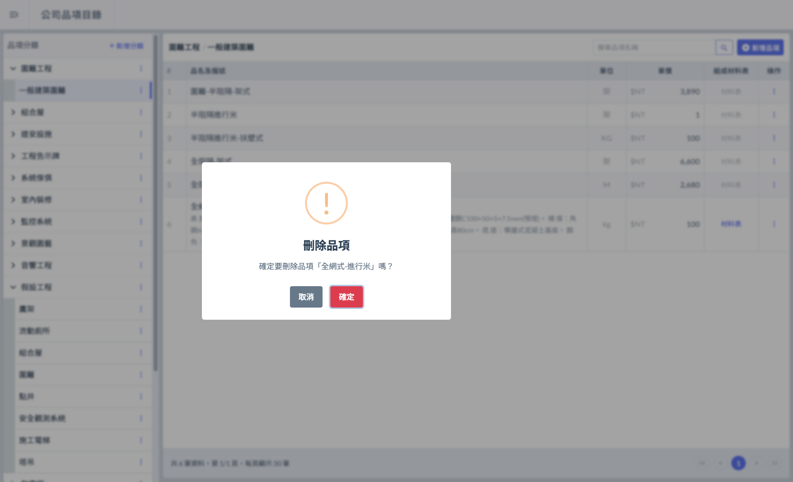

