# 廠區流程及關卡設定

在營建產業中，工程承攬商常面臨零散、多變且高度客製化的作業環境，尤其在非標準化、專案導向的製造流程中，傳統工廠式的生產規劃模式往往不敷使用。

**Jobdone 的施工製造模組**即針對此類型工程情境設計，協助使用者以最簡便的方式建立屬於專案型製造的流程管理架構。

本模組特別適用於下列類型之作業情境：

> 1. 步驟簡單，不須過度拆解工序
> 2. 流程多變，每案每次可能略有不同
> 3. 作業彈性大，內容依現場實況機動調整
> 4. 工序不複雜，無須高度自動化整合
> 5. 專案導向，作業不可套用固定製程模板

!!! danger
    #### 注意事項
    
    此功能主要用於建立製造作業中所需的廠區、流程與關卡資料。您可針對每個廠區，自行設定對應的製程流程與工序（即關卡），以利日後製造單的進度追蹤。
    
    實際的製造進度統計（例如：待辦數量、超時數量等），請參考 ➙ [factory-report](../factory-report "mention")

***

#### 廠區與關卡的設定用途

為了有效對應上述特性，系統提供「**廠區流程及關卡設定**」功能，讓使用者透過簡單的**廠區與關卡設定**，建立一套具彈性且可追蹤的流程架構：



代表施工或製造作業所屬的場域 (如預鑄場、加工區、組裝線等)，作為流程架構的起點。



代表廠區內的單一作業節點或檢核點 (如裁切、焊接、打磨、包裝等)，可依實務需求自由命名與設定。



每個品項通過廠區流程後，皆可進行關卡回報與追蹤，利於記錄製程歷程與完成狀態。

!!! tip
    透過此模組設定，承攬商可依每個專案需求彈性組合流程，不僅可精簡規劃作業，亦可達到以下目的：
    
    1. 建立可追蹤之製程紀錄
    2. 提高廠內作業的標準化程度
    3. 有效支援製造單與出貨單之品項處理
    4. 提供後端驗收、估驗及資產管理依據

***

進入施工製造主頁面後，點選「公司通用資料設定」下的<kbd>**廠區流程及關卡設定**</kbd> ，即可開始進行相關操作。

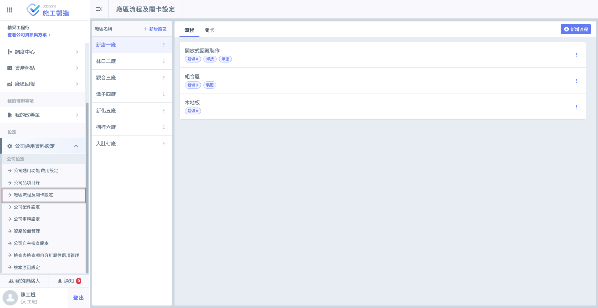

***

## 01｜操作流程說明



### 新增廠區

進入「廠區流程及關卡設定」功能後，點選**廠區名稱**欄位右方的<kbd><mark style="color:purple;">**+新增廠區**<mark style="color:purple;"></kbd>，即可開始建立廠區資料。

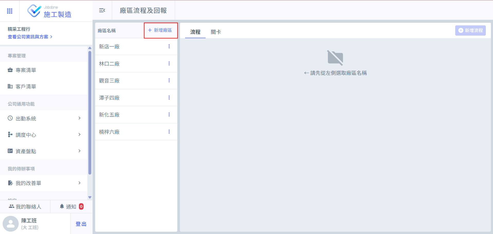 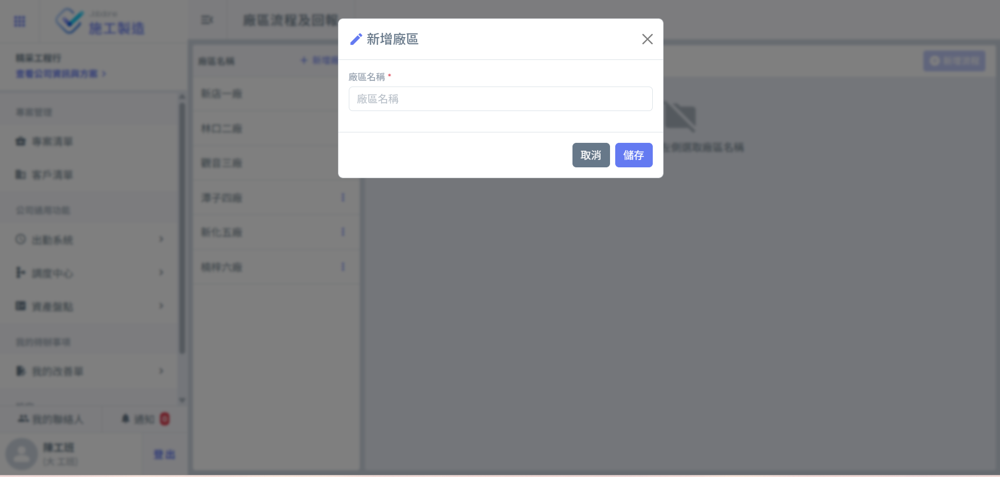

如圖三\~圖四所示，完成廠區資料填寫並確認無誤後，請點&#x9078;**「儲存」**。儲存完成後，即可針對該廠區填寫對應之作業流程。&#x20;

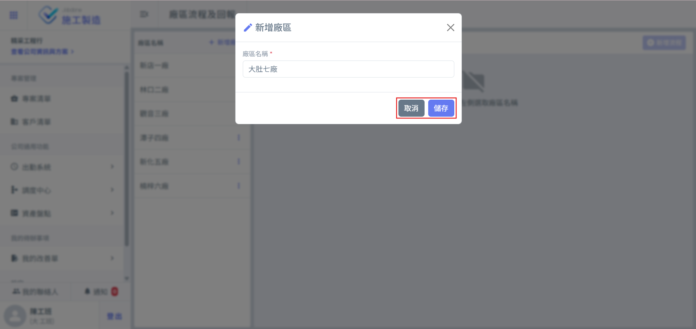 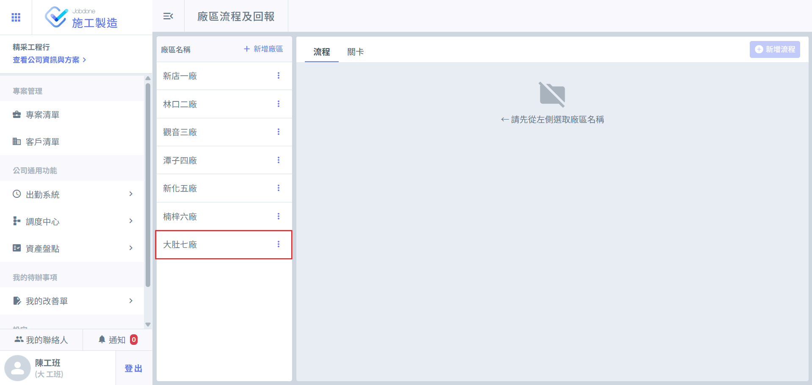




### 新增關卡

如圖五所示，點選廠區後切換至對應的<kbd>**關卡**</kbd>頁面，即可開始新增該廠區的關卡資料。

!!! warning
    請注意編輯關卡資料前，務必確認您目前所在的廠區正確無誤，以避免將關卡誤設於錯誤的廠區下。

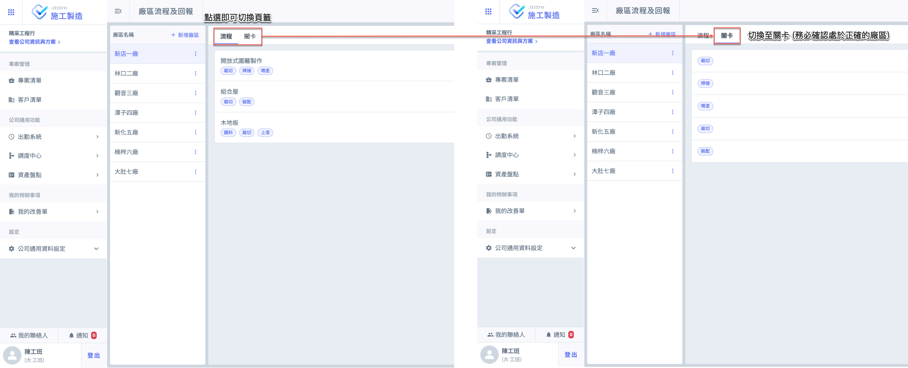

進入關卡頁面後，點選右上方的<kbd><mark style="color:purple;">**+新增關卡**<mark style="color:purple;"></kbd>，即可開啟填寫視窗並輸入關卡名稱。

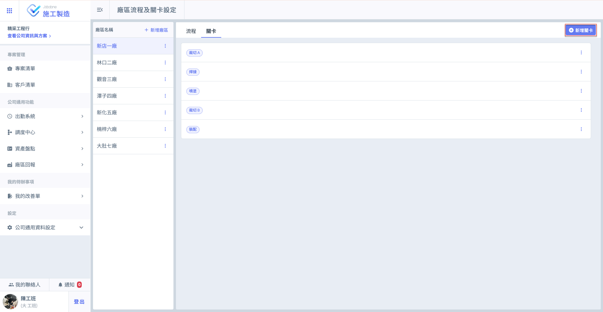 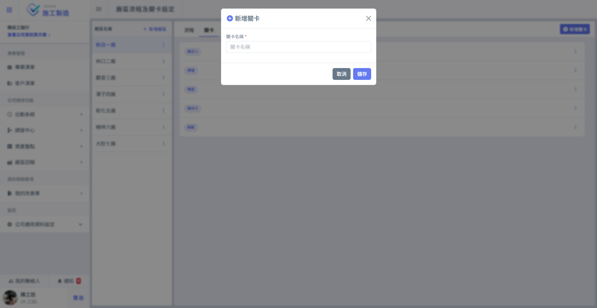

將關卡資料填寫完成並確認無誤後，點&#x9078;**「儲存」**，該關卡即會顯示於所屬廠區下之關卡列表中。

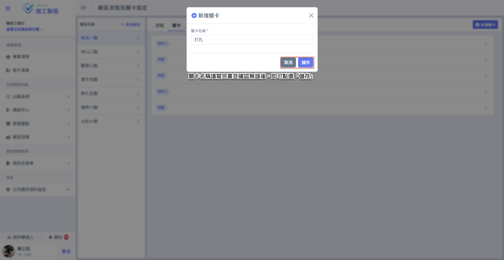 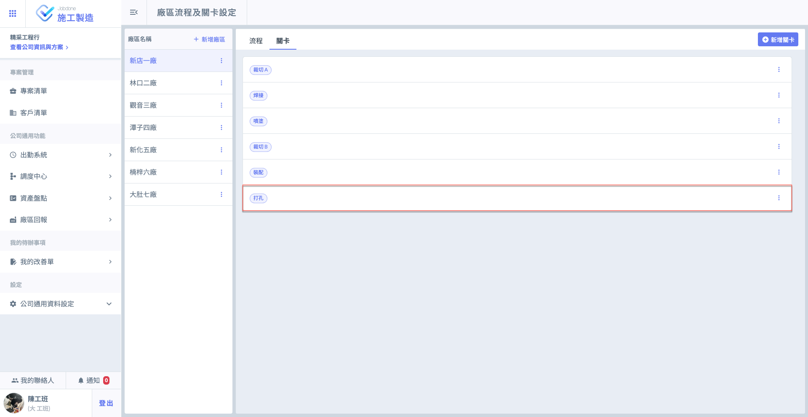




### 新增流程

如圖十 \~ 十一所示，進入流程頁面後，點選右上方的<kbd><mark style="color:purple;">**+新增流程**<mark style="color:purple;"></kbd>，即可開啟新增視窗。

!!! warning
    請注意：
    
    1. 編輯流程資料前，務必確認您目前所在的廠區正確無誤，以避免將流程誤設於錯誤的廠區下。
    2. 編輯流程資料前，務必確認所需使用之關卡已完整建立，否則無法於流程中選擇並指派相應關卡。

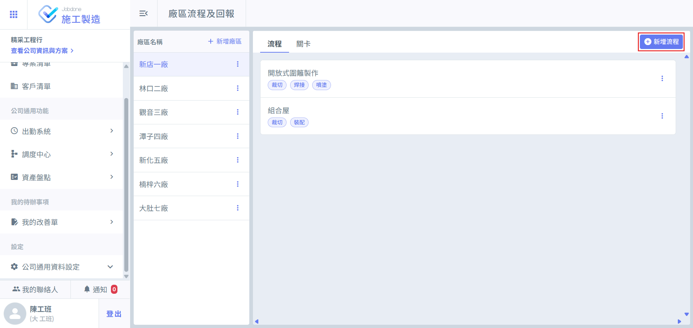 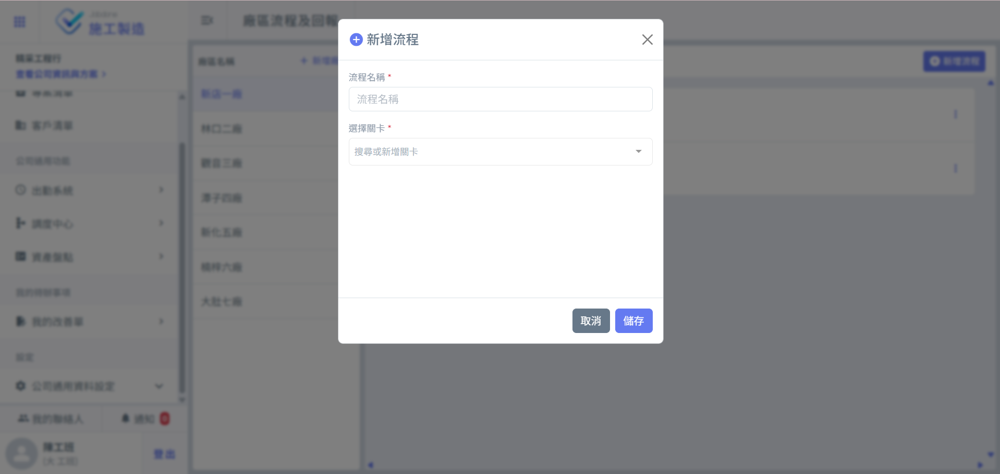

如圖十二 \~ 十三所示，填寫流程名稱後，選擇欲納入的對應關卡後，點&#x9078;**「儲存」**&#x5B8C;成設定。

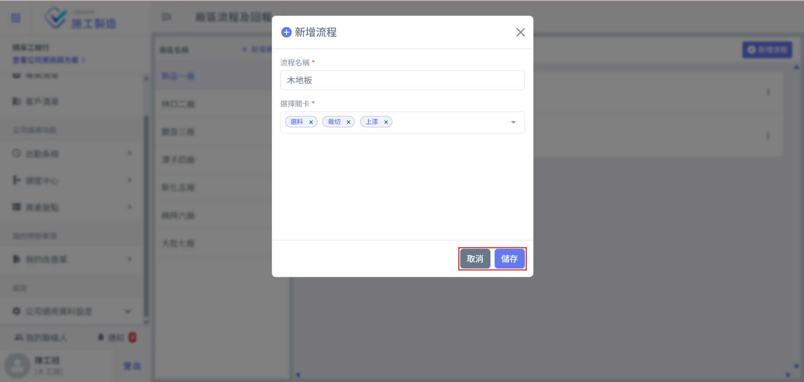 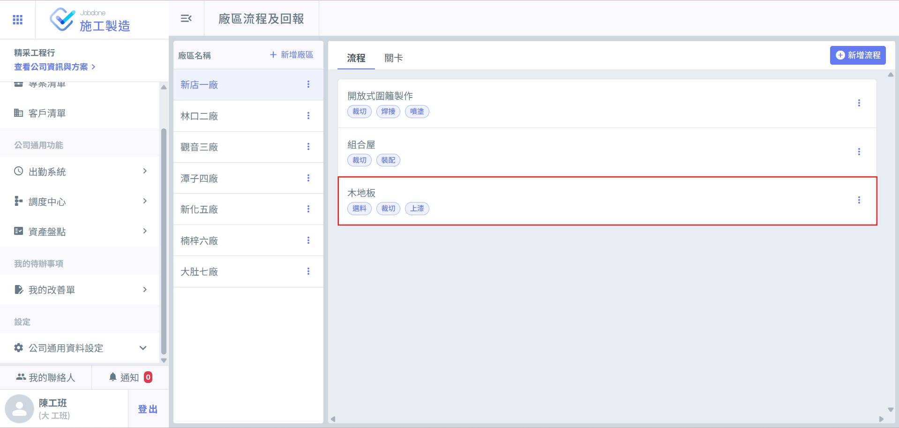




***

## 02｜關卡說明

關卡相當於製程、工序或車間的概念，一個廠區可包含多個不同的關卡。

若同一類型的關卡 ( 例如：<kbd><mark style="color:purple;">**焊接**<mark style="color:purple;"></kbd> )出現在多個廠區中，則需在每個廠區內各自建立<kbd><mark style="color:purple;">**焊接**<mark style="color:purple;"></kbd>關卡。

此外，若同一廠區內存在多個相同類型的關卡，則建議分別命名為「焊接A」、「焊接B」等，以利辨識與管理。

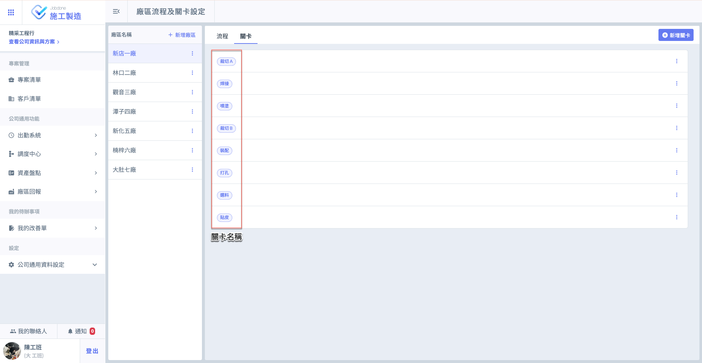

### 02 - 1｜編輯/刪除關卡

於欲編輯或刪除的關卡右側點選「⋮」圖示 (於操作欄位)，即可開啟功能選單，並選擇 <kbd>**編輯關卡**</kbd> / <kbd><mark style="color:red;">**刪除關卡**<mark style="color:red;"></kbd>。

!!! warning
    請注意：關卡一經刪除即無法復原，且相關的未完成製造單統計資料將一併消失，請在操作前務必再次確認。

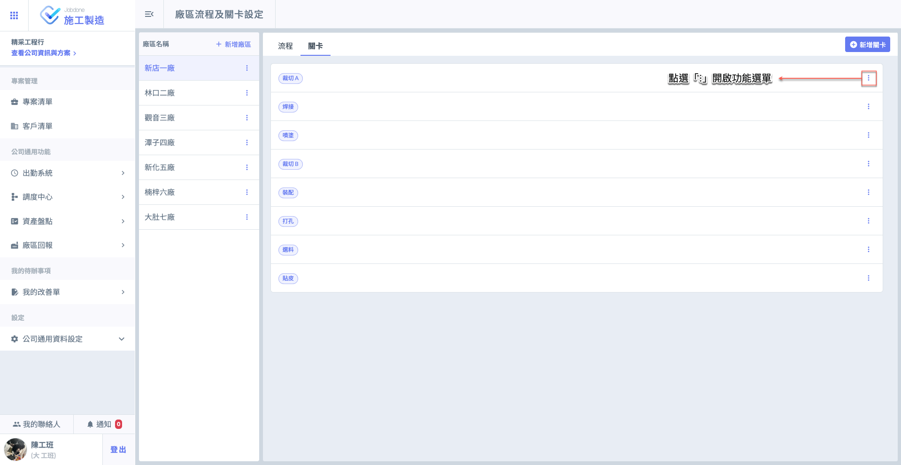 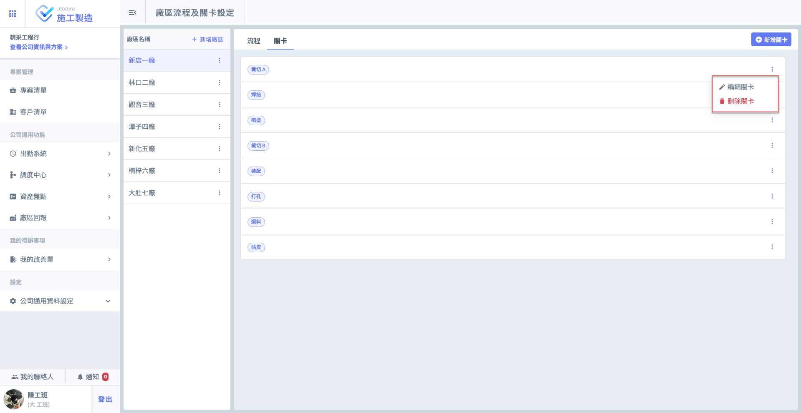

***

## 03｜流程說明

流程是由多個關卡所組成的一個製作流程。在本模組設計中，流程本身**不具固定的先後順序**。\
當您在製造單中指定某個品項所屬的流程時，該流程中所包含的所有關卡將同時呈現，無預設的執行順序。\
實際的製程順序與回報進度，需由現場人員依照實際作業情況自行判斷與執行。

!!! tip
    實際發派製造單時，您可加上相關圖面或附件，供各關卡參考使用，有助於針對不同專案進行彈性調整與作業指引，提升製程準確性與現場執行效率。

如下圖，<kbd><mark style="color:purple;">**土城一廠**<mark style="color:purple;"></kbd>設有兩種製作流程，其中<kbd>**開放式圍籬製作**</kbd>包含三個關卡，<kbd>**組合屋**</kbd>則包含兩個關卡。

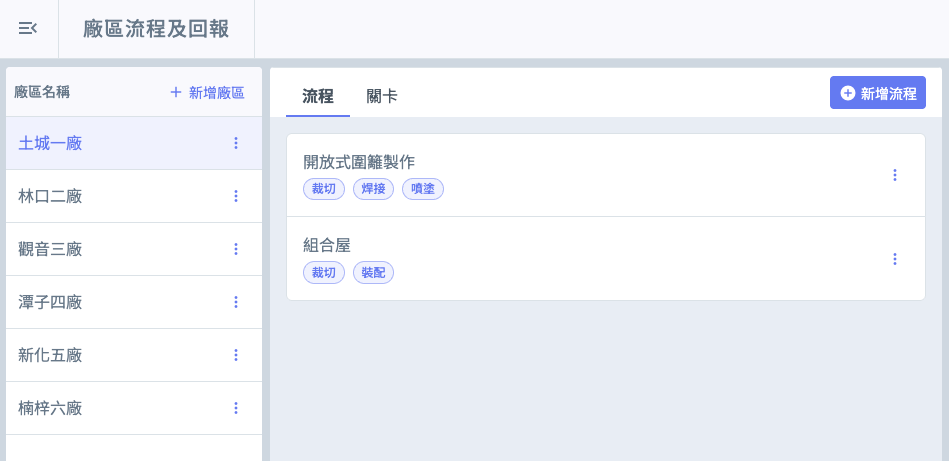

### 03 - 1｜編輯流程

於欲編輯或刪除的流程右側點&#x9078;**「⋮」**&#x5716;示 (於操作欄位)，即可開啟功能選單，並選擇 <kbd>**編輯流程**</kbd> / <kbd><mark style="color:red;">**刪除流程**<mark style="color:red;"></kbd>。

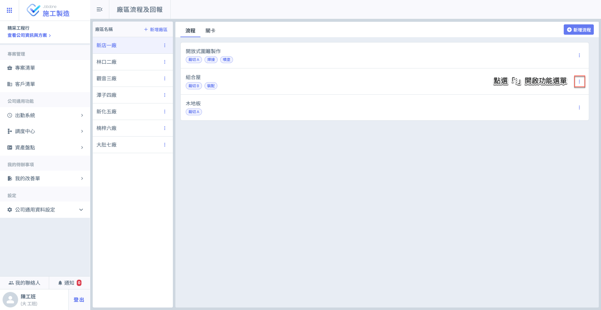

如圖三所示，開啟選單後，點選<kbd>**編輯流程**</kbd>，即可進入編輯畫面，修改流程名稱並調整對應的關卡。

如圖四所示，完成填寫後，請點&#x9078;**「儲存」**&#x4EE5;套用變更。

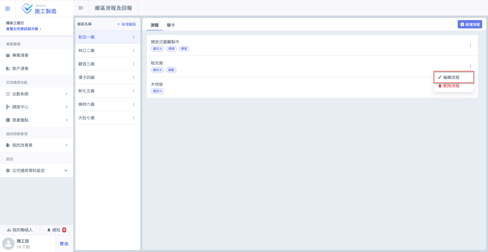 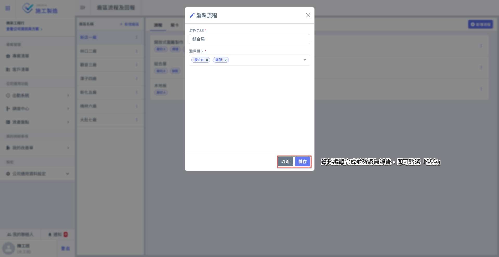

***

### 03 - 2｜刪除流程

開啟選單後，請點選<kbd><mark style="color:red;">**刪除流程**<mark style="color:red;"></kbd>，系統將跳出確認視窗，請再次確認是否刪除。

!!! warning
    請注意：
    
    1. 僅限尚未被使用的流程可進行刪除操作（流程一旦被製造單引用即視為已使用）。
    2. 已被使用的關卡無法刪除，以確保歷程資料完整性與製造紀錄可追溯性。

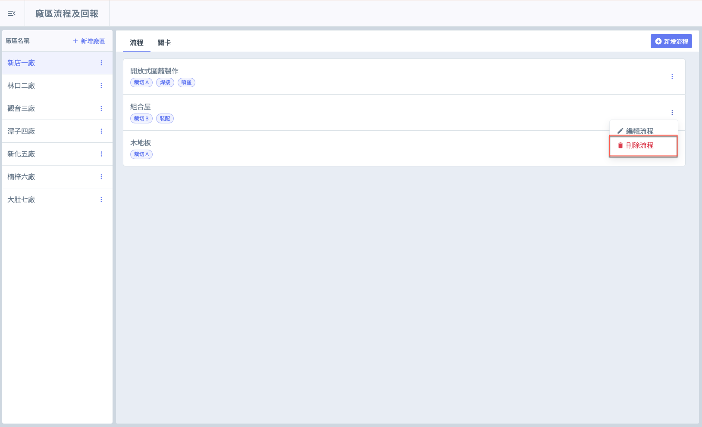 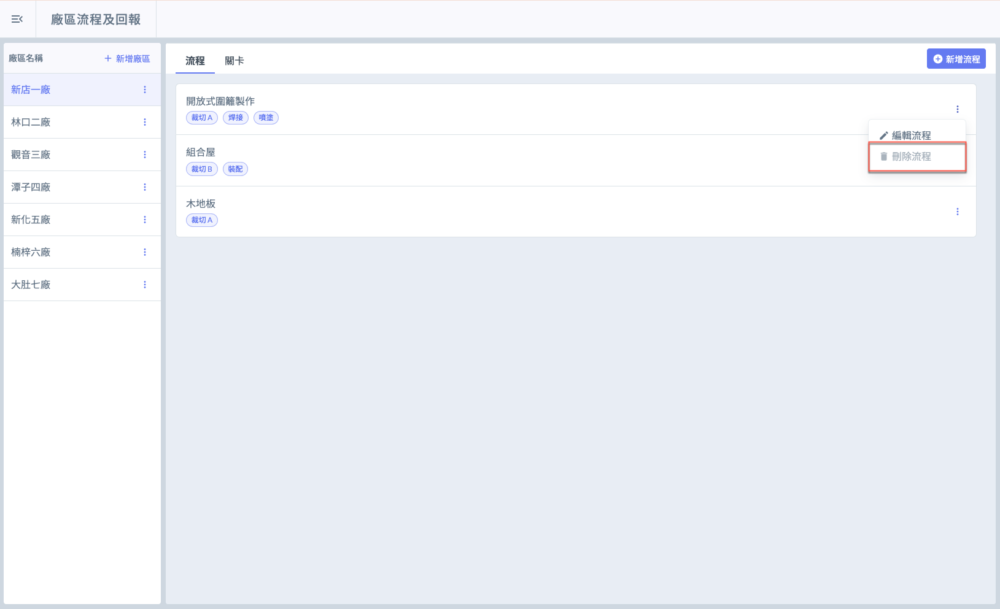

