# 派工任務管理

派工任務管理為全公司層級之派工單統整平台，系統將所有由各專案內施工單所發起的派工單集中於此頁面，方便管理者統一檢視與操作。此功能為現場作業調度與跨案場人力協調的關鍵工具，協助管理者靈活配置資源，提升作業效率與資訊透明度。

請特別注意，****派工單必須由施工單發起，無法獨立建立 (且僅能於調度中心發起)****，以確保施工流程的正確性與可追溯性。

!!! info
    #### 功能說明
    
    透過派工任務管理，您可：
    
    * 瀏覽所有專案中已建立的派工單
    * 編輯派工內容（如派工人員、日期、備註等）
    * 檢視派工單之關聯施工單、圖說、施工品項與配件資訊
    * **直接發起或關聯派車單**，使施工與運輸安排得以即時連動
    * 即時掌握各派工單的進度狀態與回報資料 (派工回報)

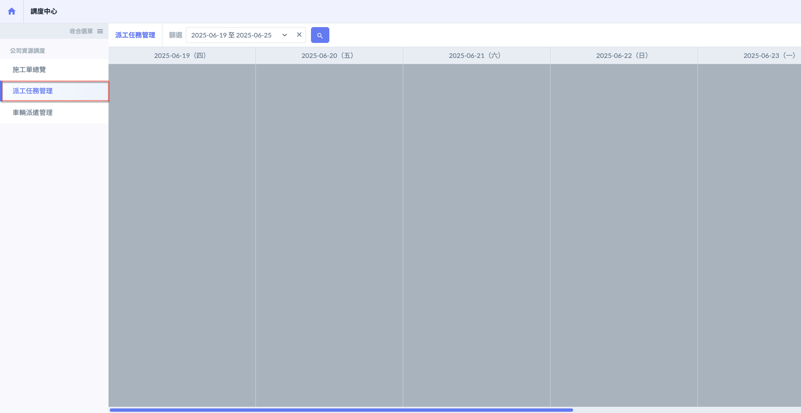

***

## 01｜選取日期

如圖一 \~ 圖二所示，點選日期篩選欄位後，即可開啟月曆表，選擇您欲查詢的日期區間 (系統顯示上限為七天)，方便您快速篩選並查看特定期間內的派工單紀錄。

選定日期後，您即可查找並管理對應日期內所有時段的派工單。

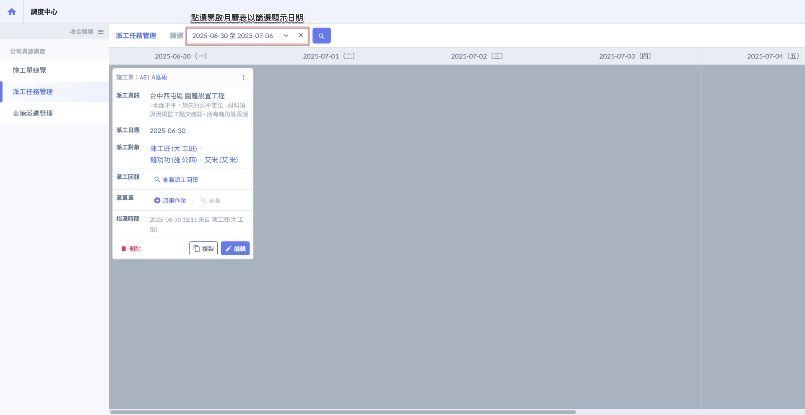 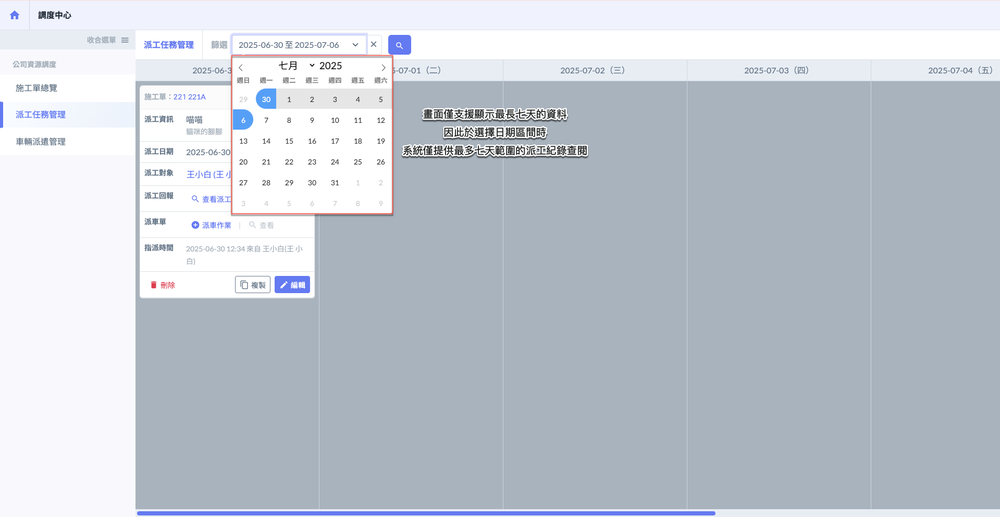

如圖三所示，選定日期並確認無誤後，請點選，系統即會載入並顯示該日期區間所對應之派工單畫面。

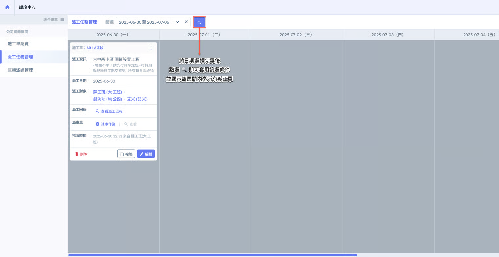

如圖四所示，每次重新選擇日期區間時，建議您先清除原有條件後再重新選取，將可更方便查看資料。

(系統預設會顯示當天起往後一週的派工紀錄)

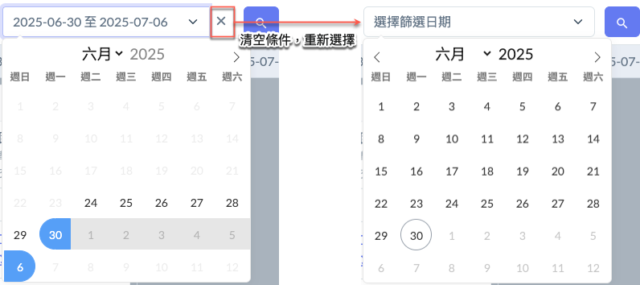

詳細操作流程，亦可參考下方影片：

{% embed url="https://files.gitbook.com/v0/b/gitbook-x-prod.appspot.com/o/spaces%2FEqUCL3D5WQfpxJw8NL3P%2Fuploads%2FkUAKKJdTkYvpbOBNlAaH%2F%E6%B4%BE%E5%B7%A5%E4%BB%BB%E5%8B%99%E7%AE%A1%E7%90%86.mp4?alt=media&token=b725b837-9bd9-4428-92cf-f194ad74a07b" %}
操作範例


***

## 02｜派工單相關

如圖一所示，您可查看派工單之基本資訊，包含：派工日期、對應施工單、派工人員、所屬專案與合約等欄位。可協助您快速掌握各派工任務之安排與對應關聯資料。

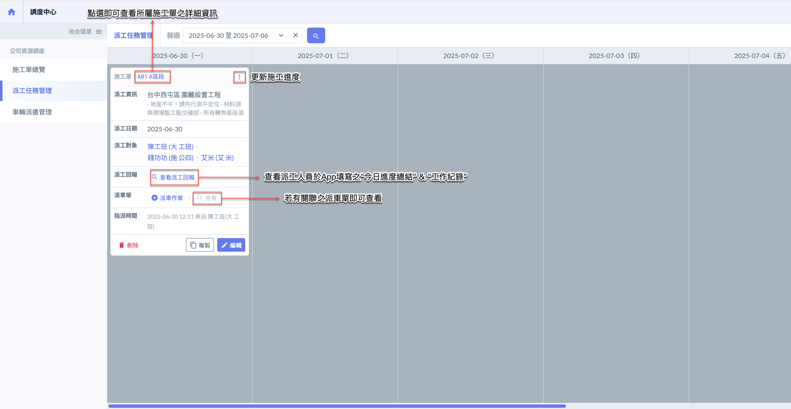

***

### 02 - 1｜編輯派工單

如圖二所示，點選<kbd>**編輯**</kbd>後，即可進入編輯畫面，對該派工單資料進行修改與更新。

如圖三所示，您可在編輯畫面中修改派工單資料。完成修改並確認無誤後，請點&#x9078;**「儲存」**，即可套用變更並更新內容。

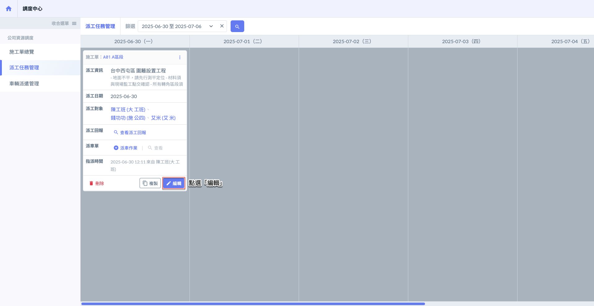 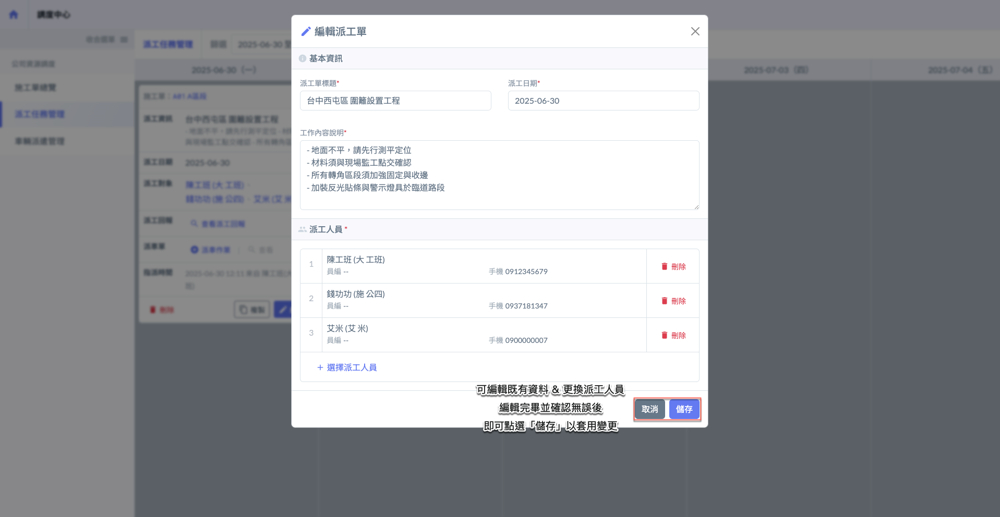

***

### 02 - 2｜複製派工單

如圖四 \~ 圖五所示，點選<kbd>**複製品項**</kbd>後，系統即會複製一份所選派工單，您可再進行必要的修改以節省建檔時間。

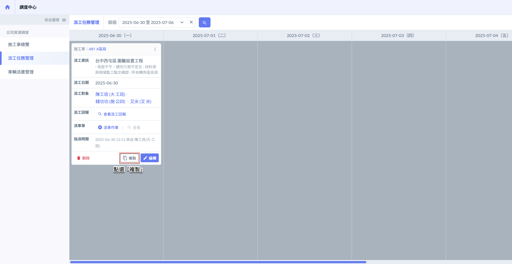

**複製派工單功能可協助您以******既有派工單資料為基準******，快速建立一筆新的派工單。複製後的派工單會完整保留原派工單的欄位資料，您可******針對原資料進行修改與調整******，以建立符合需求的新工單，無需從零填寫，提升建檔效率。**

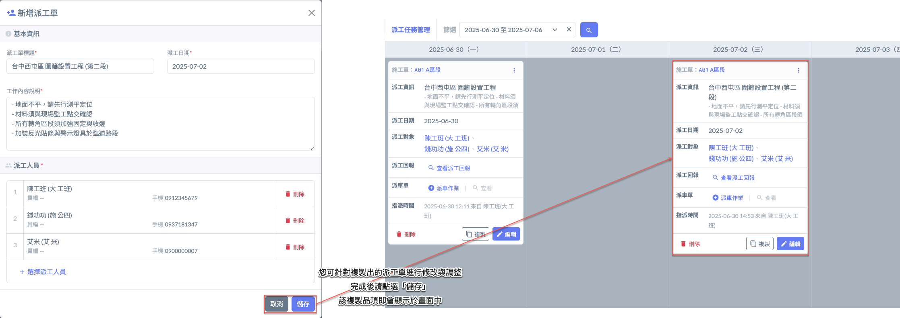

***

### 02 - 3｜刪除派工單

如圖六 \~ 圖七所示，點選<kbd><mark style="color:red;">**刪除**<mark style="color:red;"></kbd>，系統將跳出確認視窗，請再次確認是否刪除。

!!! warning
    請注意：派工單一經刪除即無法復原，所有已填寫之進度總結與工作紀錄亦將一併刪除，且原派工人員將無法再查看此張派工單。刪除前請務必再次確認是否已完成相關資料備份與通知作業。

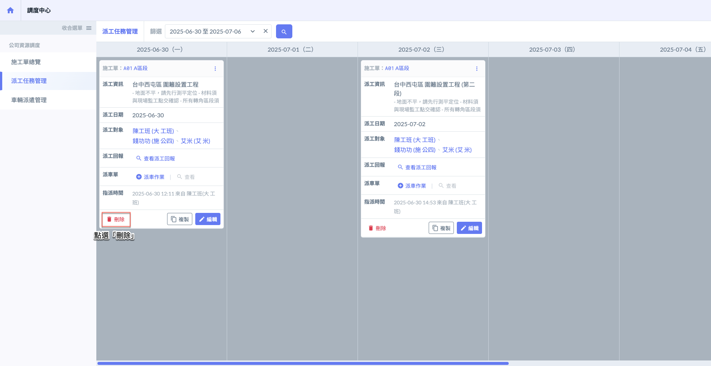 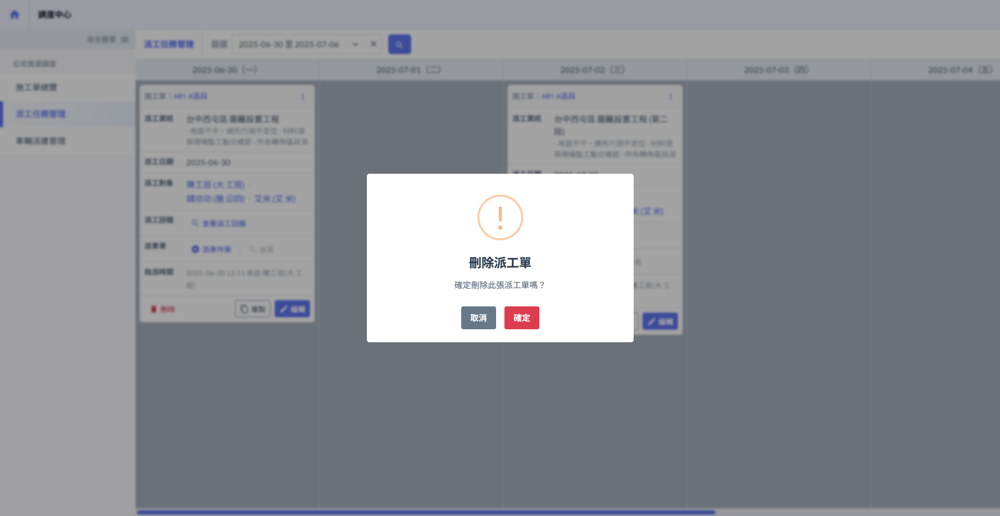

***

### 02 - 4｜查看派工回報

如圖八 \~ 圖九所示，點選派工單中「派工回報」欄位之，即可查看該派工單之所有回報紀錄。    (包含今日進度總結 & 多筆工作紀錄 等資訊)

有關派工人員填寫回報之詳細操作說明，請參閱 ➙ [#gong-zuo-ji-lu](../../app/labor-assignment#gong-zuo-ji-lu "mention")

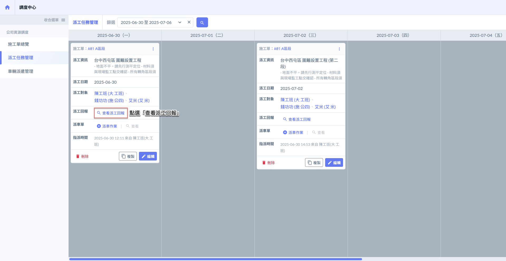 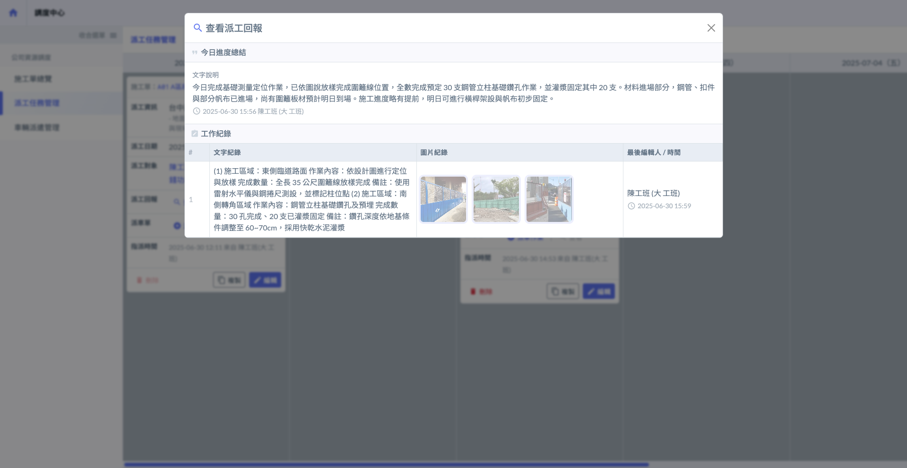

***

## 03｜施工單相關

如圖一所示，點選對應施工單的標題文字，即可查看其詳細資訊，包含施工品項、攜帶配件、圖說附件等相關內容。

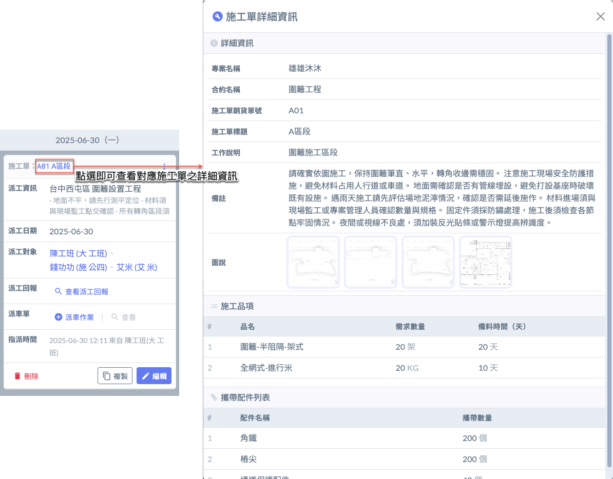

如圖二所示，點選該派工單右上角的「⋮」選單，即可選擇<kbd>**更新施工進度**</kbd>，以變更對應施工單的進度狀態  (如：進行中 ➙ 已完成，或已完成 ➙ 退回進行中)。

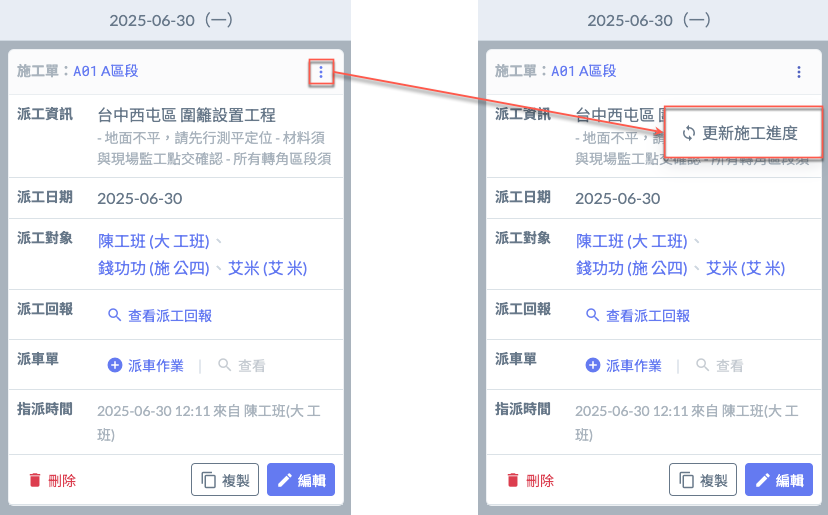

***

## 04｜新增派車單

如圖一 \~ 圖二所示，於派工單之「派車單」欄位點選<kbd><mark style="color:purple;">**+派車作業**<mark style="color:purple;"></kbd>，即可開始新增並建立關聯之派車單。



點選<kbd><mark style="color:purple;">新增派車單<mark style="color:purple;"></kbd>表示直接新增一張**與此派工單關聯**之派車單，您可指派車輛與駕駛人員，並安排指定日期與用途，方便統一管理此次派工所需的運輸安排。



點選<kbd><mark style="color:blue;">**關聯現有派車單**<mark style="color:blue;"></kbd>可將此派工單與已建立之派車單進行關聯。\
請注意，關聯條件需同時符合以下規則：

* 派工單與派車單需屬於**同一專案、同一合約**。
* 若是從「**派工單**」欲關聯派車單，則該派車單必須是由該階段需求所對應之**出貨單所發起**。           (亦即該出貨單也要與派工單同一專案、同一合約)
* 且**派工單與派車單需為同一天**之作業。

如條件符合，即可成功建立關聯，以利施工及出貨流程整合與調度管理。



點選<kbd>**取消**</kbd>表示此次僅**建立派工單**，**暫不與任何派車單關聯**。\
您可於日後視實際需求，再另行新增或關聯派車單，以完成施工調度作業。

此選項適用於尚未確定運輸需求或尚未安排車輛之情境，避免流程綁定過早造成後續調整困難。



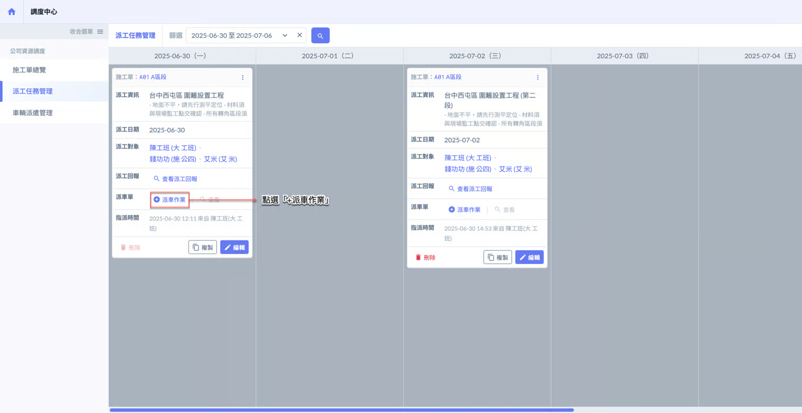 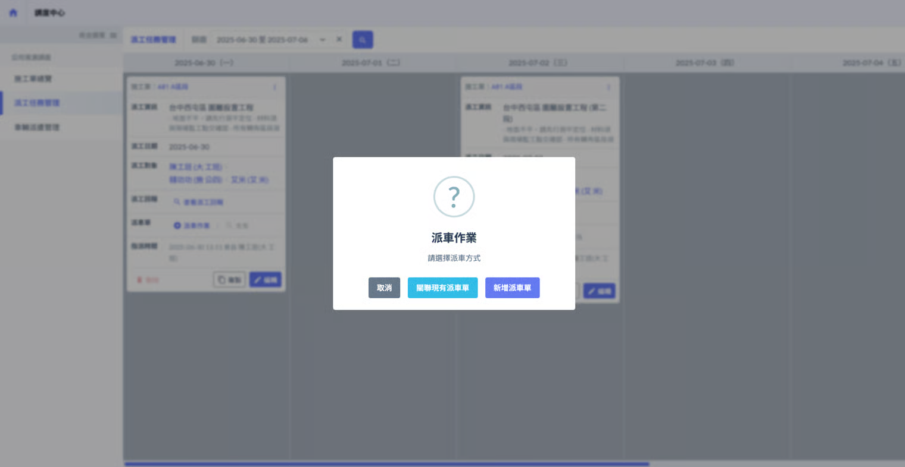

如圖三所示，由派工單建立之派車單，系統將自動帶入對應之專案與合約資訊，無須重複填寫。

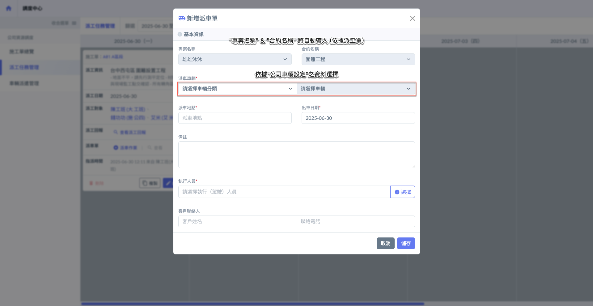

如圖四，當派車單基本資訊填寫完畢後，點選「執行人員」欄位右側的按鈕，即可開啟公司成員清單。您可於清單中選取一位作為駕駛人員，系統亦會依據該日之出勤紀錄，標示出休假狀態之人員，作為參考。

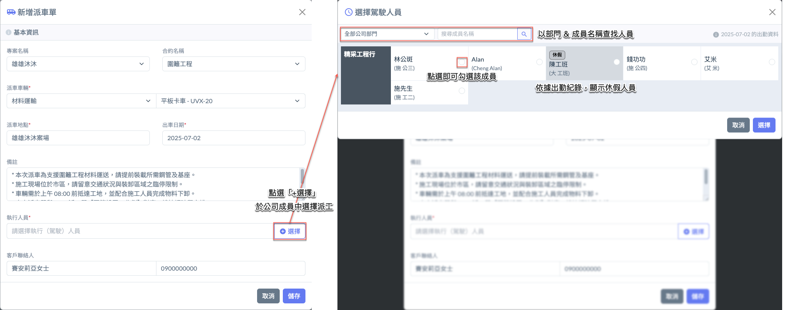

如圖五所示，將駕駛人員選取完畢後，請點選「選擇」按鈕，系統即會將該人員加入至派車單中。待所有派車單資料填寫完成並確認無誤後，即可點選「儲存」，完成派車單建立作業。

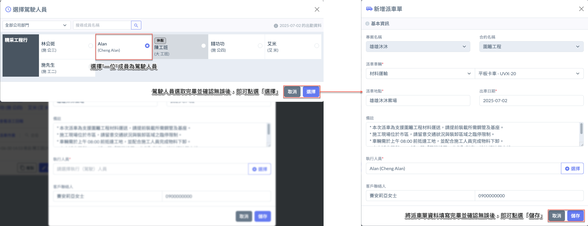

***

### 04 - 1｜查看派車單

點選派工單中「派車單」欄位之按鈕，即可開啟派車紀錄視窗，查看該派工單所關聯之所有派車紀錄。

開啟紀錄視窗後，您可查看該車輛所有派車紀錄 (包含以下資訊：**派車日期**、**相關專案/合約**、**是否關聯派工單/出貨單**、**派車地點**、**執行人**、**客戶聯絡人**等)，方便進行派車歷程查詢與後續管理。

此外，您亦可於操作欄位點選「」圖示，開啟該派車單的詳細資訊頁面，並進行編輯操作。

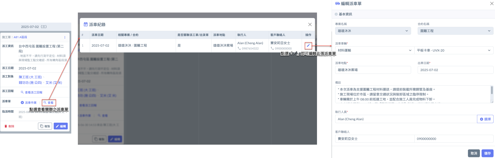
