# 車輛派遣管理

「車輛派遣管理」為公司層級的管理功能，整合全公司所有專案的派車單，讓使用者能集中查看、編輯與管理車輛派遣資訊。進入本功能後，您可依據專案需求篩選指定日期區間內的派車單 (每次最多顯示 7 天)，快速掌握所有派遣排程與執行情況。

!!! info
    #### 功能說明
    
    您可在此頁面執行以下操作：
    
    * 新增派車單
    * 編輯既有派車單內容
    * 刪除不需使用的派車單
    * 查看每筆派車任務之車輛、司機、起訖時間、對應施工/派工單等資訊

此外，若您為派車人員，將可透過 App 查看與自己相關之派車任務，包含日期、車號與任務簡要資訊，但無法於 App 進行任何回報或修改操作，此設計目的為單純呈現任務資訊，協助執行人員掌握工作內容。

有關派車人員之相關說明，請參閱 ➙ [vehicle-dispatch-sheet](../app/vehicle-dispatch-sheet "mention")

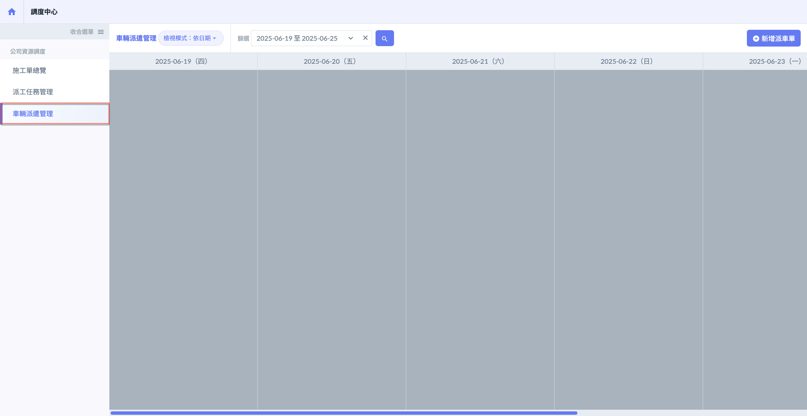

***

## 01｜新增派車單

進入車輛派遣管理主畫面後，點選右上方<kbd><mark style="color:purple;">**+新增派車單**<mark style="color:purple;"></kbd>，即可開啟新增視窗，開始填寫派車單相關資料。

!!! info
    於車輛派遣管理中所建立之派車單，**皆為「獨立派車單」**，表示該派車單**不與任何派工單或出貨單關聯**。\
    但您**仍可選擇對應之專案與合約**，以利後續管理與資料歸屬。

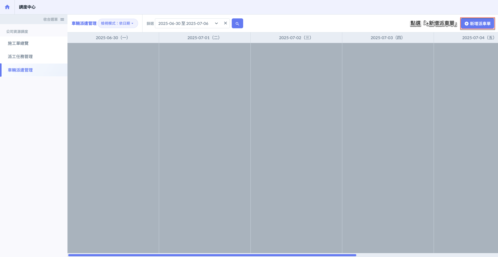 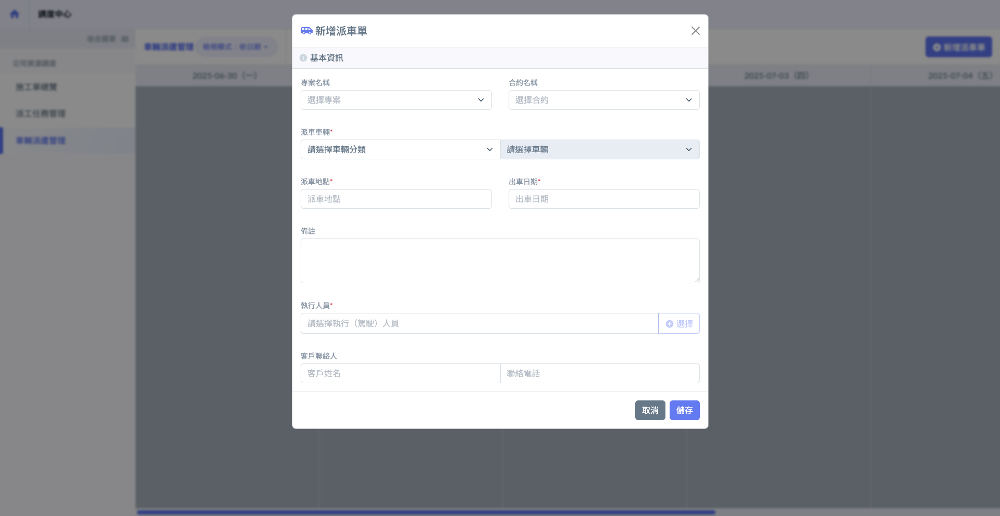

有關派車車輛之設定說明，請參閱 ➙ [vehicle](../../company-configuration/vehicle "mention")

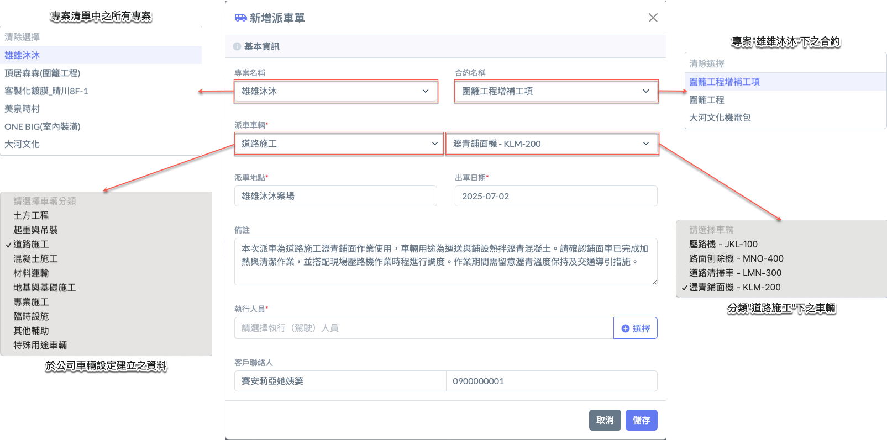

如圖四所示，當派車單基本資訊填寫完成後，請點選「執行人員」欄位右側的按鈕，即可開啟公司成員清單。您可於清單中選取一位作為本次派車的駕駛人員。

系統將同步顯示各成員於**當日的出勤狀態**（如休假），並標示其**當日已被指派的派車次數**，供您作為人力安排與調度之參考。

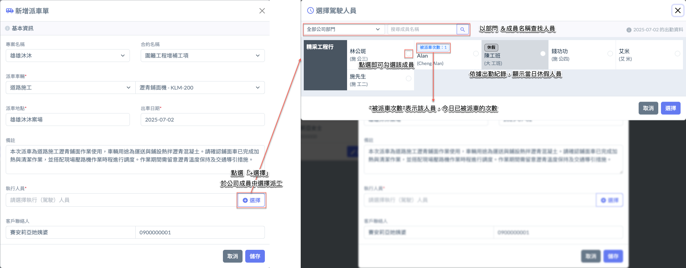

如圖五所示，將駕駛人員選取完畢後，請點選「選擇」按鈕，系統即會將該人員加入至派車單中。待所有派車單資料填寫完成並確認無誤後，即可點選「儲存」，完成派車單建立作業。

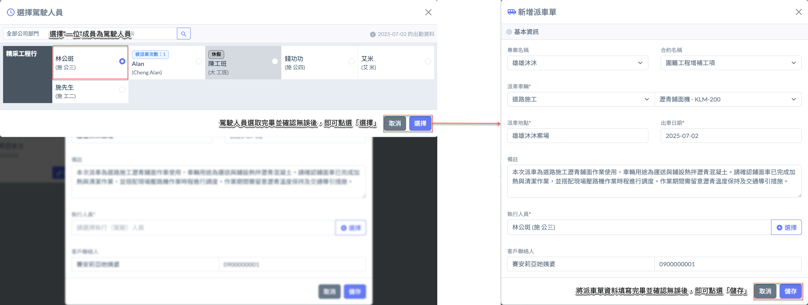

點選「儲存」後，該派車單即成功建立，並將顯示於畫面上。完成畫面如圖六所示：

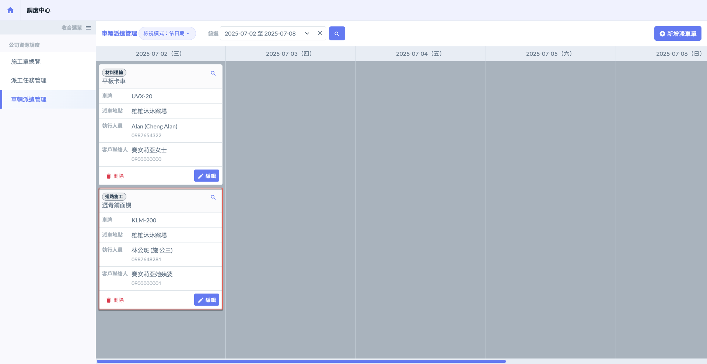

***

## 02｜檢視模式

在 **車輛派遣管理** 中，為有效掌握全公司車輛派遣狀況，系統提供兩種檢視模式：<kbd>**依日期**</kbd> & <kbd>**依車輛**</kbd>

!!! info
    <kbd>**依車輛**</kbd>以車輛為單位，顯示每台車輛的所有派車紀錄，**不需選擇日期區間**，即可直接查閱車輛的派遣歷史與未來任務。



此模式可依據指定日期範圍 (上限為 7 天)，一次檢視 **每日所有派車單的安排情況**。適用於管理者快速掌握近期之車輛調度分布，並對每日排程進行整體檢討與調整。\
您可：

* 查詢指定日期範圍內之所有派車任務
* 檢視各日每輛車的使用狀況與派遣明細
* 點選各派車單進行檢閱、編輯或取消作業



此模式以車輛為單位，整合顯示該車輛之 **所有歷史與未來排程記錄**，讓管理者可針對單一車輛掌握其使用頻率、派遣時段與任務內容。\
您可：

* 一覽公司所有車輛的派遣紀錄（不限時間）
* 查看各車輛的任務分布與閒置時間



進入車輛派遣管理主頁面後，點選<kbd><mark style="color:purple;">**檢視模式**<mark style="color:purple;"></kbd>按鈕，即可開啟選單。請選擇欲使用的模式 (依日期/依車輛)，系統畫面將立即依據所選模式進行切換與顯示。

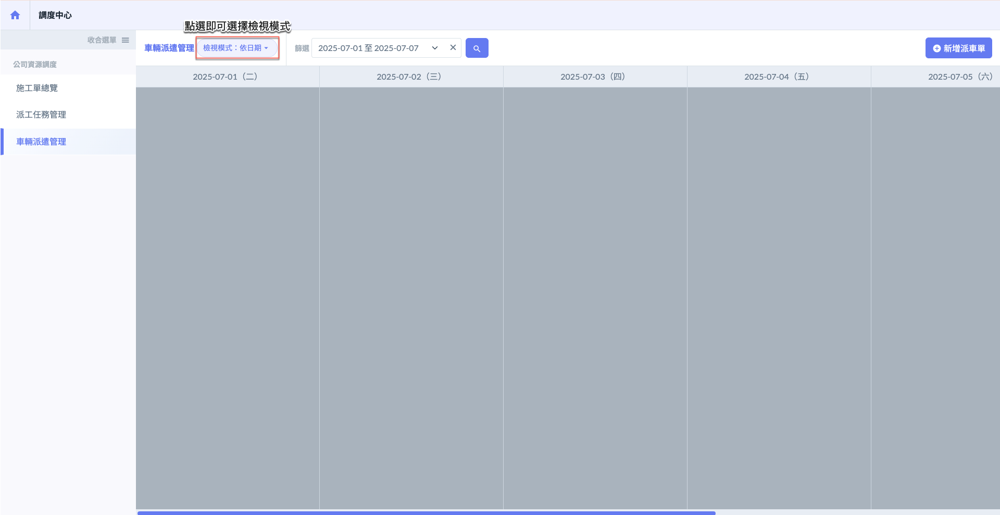 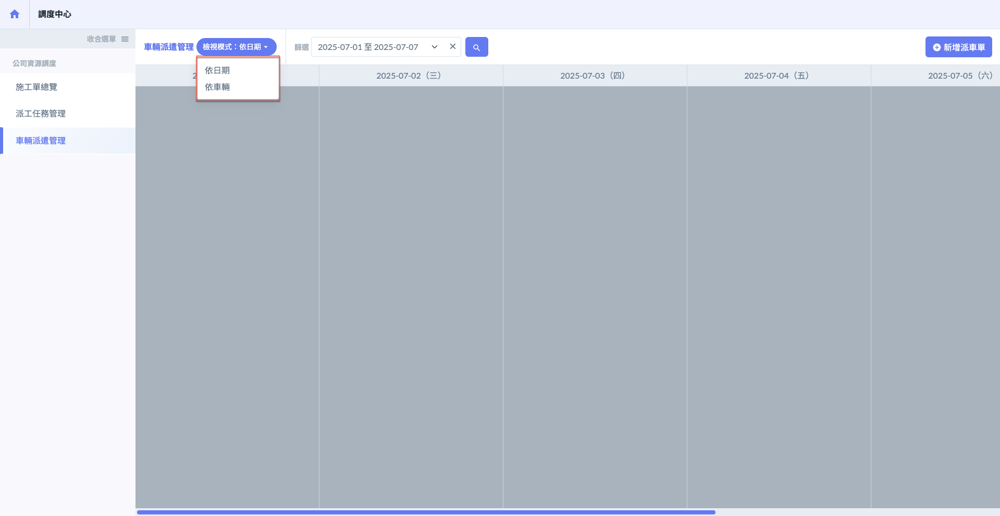

***

### 02 - 1｜依日期

將檢視模式切換為<kbd>**依日期**</kbd>後，畫面將顯示各日期下的所有派車單，如下圖所示。

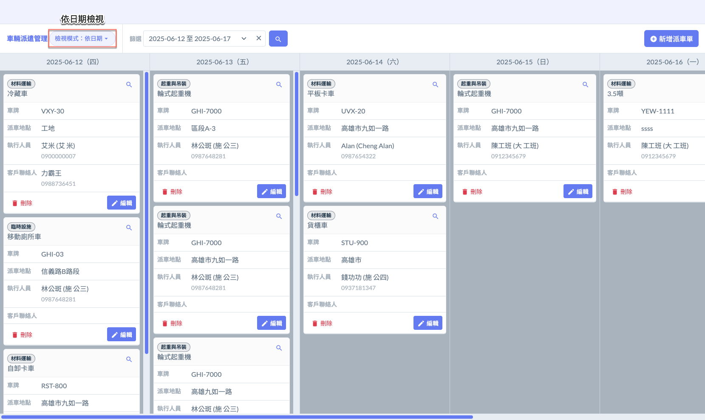

#### 02 - 1 - 1｜查看派車單

如圖一所示，點選欲查看之派車單的圖示，即可開啟視窗，查看該派車單之詳細資訊。

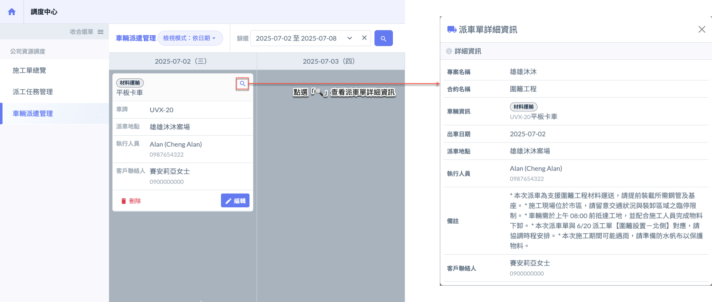

***

#### 02 - 1 - 2｜編輯派車單

如圖二所示，點選欲編輯之派車單的  圖示，即可開啟視窗，編輯該派車單之資訊。

!!! danger
    #### ⚠️ 注意事項
    
    1. 若為**非獨立派車單**（即與派工單或出貨單有所關聯），**編輯時無法更動所屬的專案與合約**。
    2. 編輯派車單時，**雖可調整派車車輛、派車日期及執行人員**等欄位資訊，惟**不建議任意修改**。
    3. 特別提醒：若變更執行人員，**原指派人員將無法再查看此派車單紀錄**。\
       除非確定原派車資料有誤，否則**不建議進行大幅度修改**。

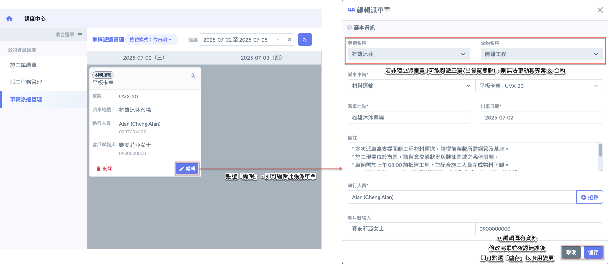

***

#### 02 - 1 - 3｜刪除派車單

如圖三所示，點選欲刪除之派車單的  圖示，系統將跳出確認視窗，請再次確認是否刪除。

!!! warning
    請注意，派車單一經刪除即無法復原，務必謹慎操作。

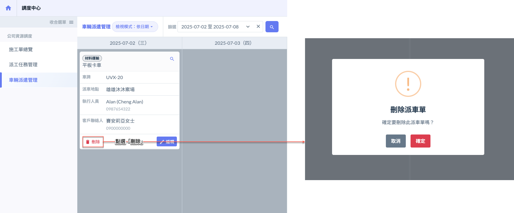

***

### 02 - 2｜依車輛

將檢視模式切換為<kbd><mark style="color:purple;">**依車輛**<mark style="color:purple;"></kbd>後，畫面將顯示所有公司車輛之資訊，如下圖所示。

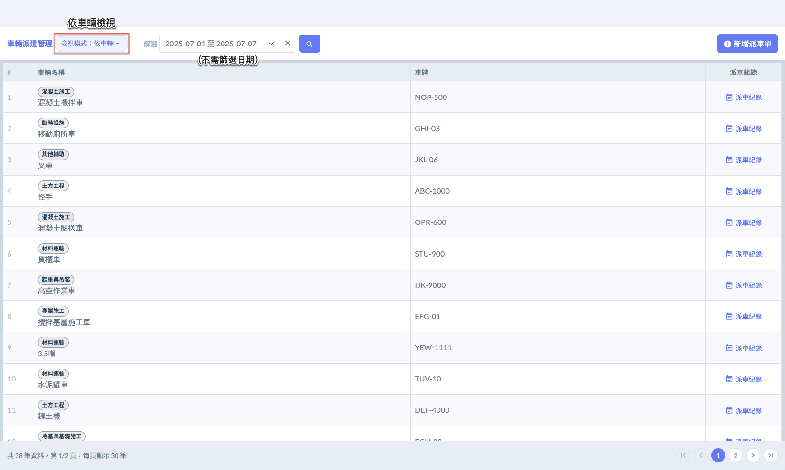

#### 02 - 2 - 1｜查看派車紀錄

如圖一所示，於欲查看紀錄之車輛右側「派車紀錄」欄位點選 ，即可開啟視窗查看該車輛所有派車紀錄，亦可進一步編輯與其相關之所有派車單內容。

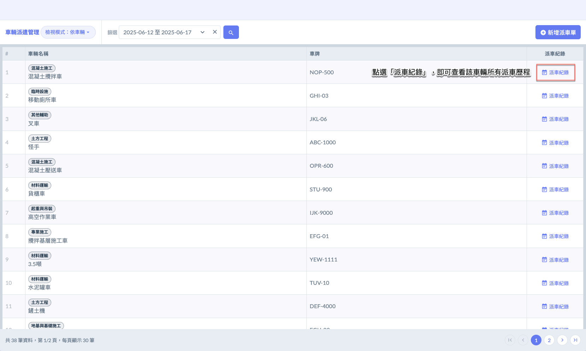

如圖二所示，開啟紀錄視窗後，您可查看該車輛所有派車紀錄 (包含以下資訊：**派車日期**、**相關專案/合約**、**是否關聯派工單/出貨單**、**派車地點**、**執行人**、**客戶聯絡人**等)，方便進行派車歷程查詢與後續管理。

此外，您亦可於操作欄位點選「」圖示，開啟該派車單的詳細資訊頁面，並進行編輯操作。

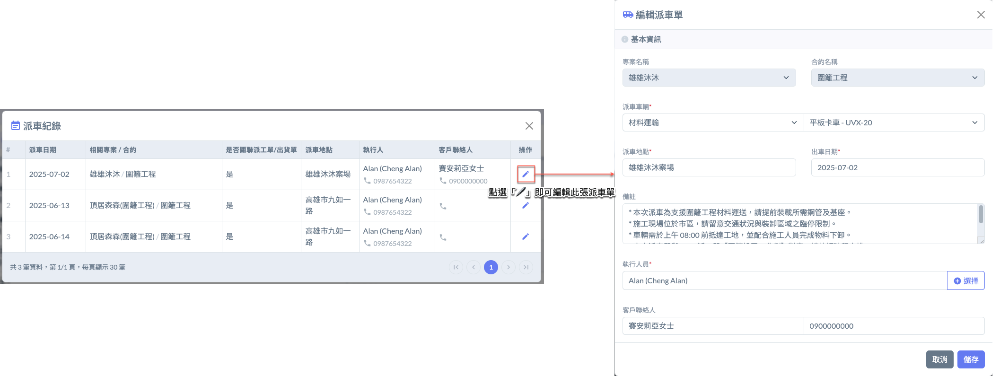
