# 施工單總覽

<kbd>**施工單總覽**</kbd>為調度中心中的核心檢視功能，提供使用者從**公司層級**整體掌握所有專案下的施工任務，無需逐一進入各專案，即可集中管理與派工操作。

<kbd>**施工單總覽**</kbd>與以下功能整合運作：



直接串接各專案的施工單資料來源。



支援由施工單快速產生派工任務。



提供即時人力可用性配對。(於選擇派工/派車人員時，依據出勤紀錄顯示休假的成員)



!!! info
    #### **功能概述**
    
    * **集中檢視所有施工單**\
      系統會自動彙整整個公司所有專案中的施工單資料，包含各單的基本資訊、執行狀態、施工項目、數量、備料進度等。
    * **快速篩選與搜尋**\
      使用者可透過關鍵字、專案名稱、施工狀態（進行中／已完成）、負責人員等條件進行篩選與查找，提高調度效率。
    * **瀏覽與編輯施工單**\
      點選任一筆施工單，即可檢視詳細資訊，如施工圖說、所需配件、施工品項、備註等；如有權限，亦可直接進行編輯與更新。
    * **發送派工單**\
      施工單進入調度流程後，可直接於此頁面產生對應的「派工單」，分派人員並安排執行日程，實現施工流程的即時啟動。

***

透過「調度中心－施工單總覽」，管理者可跨專案、一站式掌握與調度施工任務，提升資源運用效率，確保各項工作得以順利推進。

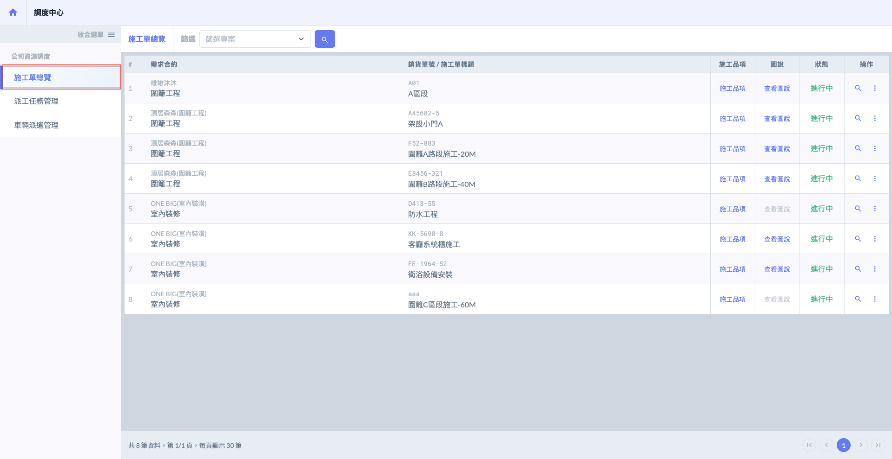

***

## 01｜查看施工單

可於施工單總覽查看所有專案（全公司）之施工單資訊，包含施工單標題、所屬專案與合約、施工品項、施工狀態、攜帶配件、圖說資料等。\
您可透過此總覽頁面快速瀏覽與管理各張施工單，並依需求進行篩選、查閱詳細資訊或發送後續作業。

### 01 - 1｜施工品項

圖一 \~ 圖二所示，點選施工品項欄位中的<kbd><mark style="color:purple;">**施工品項**<mark style="color:purple;"></kbd>，即可開啟並查看該施工單所對應的品項列表，內容包含品項名稱、需求數量及備料時間等詳細資訊。

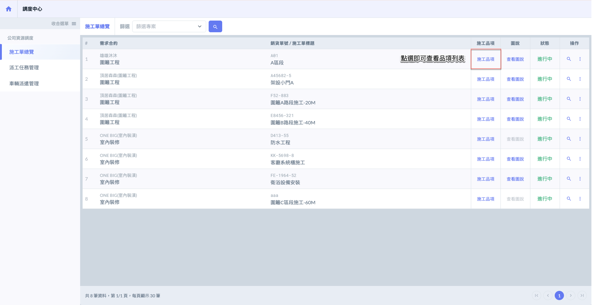 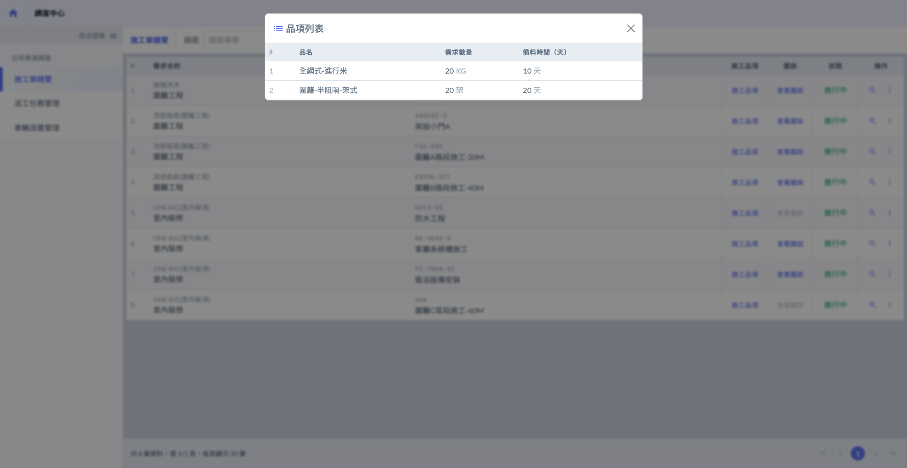

***

### 01 - 2｜圖說

如圖三 \~ 圖四所示，點選圖說欄位中的<kbd><mark style="color:purple;">**查看圖說**<mark style="color:purple;"></kbd>，即可開啟並瀏覽該施工單所對應的圖說檔案列表。

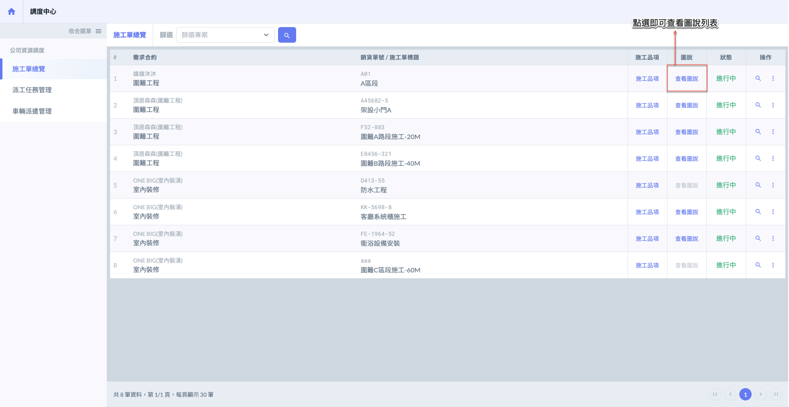 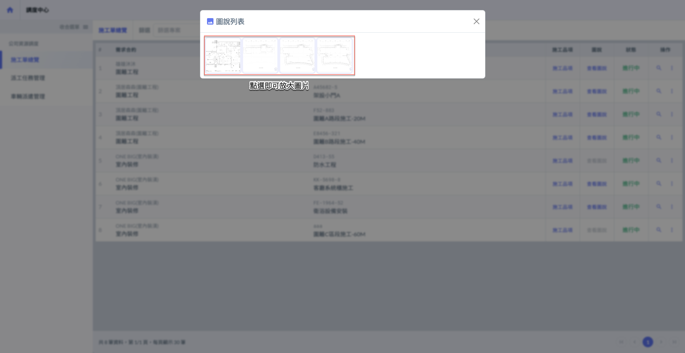

***

### 01 - 3｜施工單詳細資訊

如圖五 \~ 圖六所示，點選操作欄位中的「」，即可檢視施工單詳細資訊，包括施工內容、施工品項、攜帶配件等相關資料。

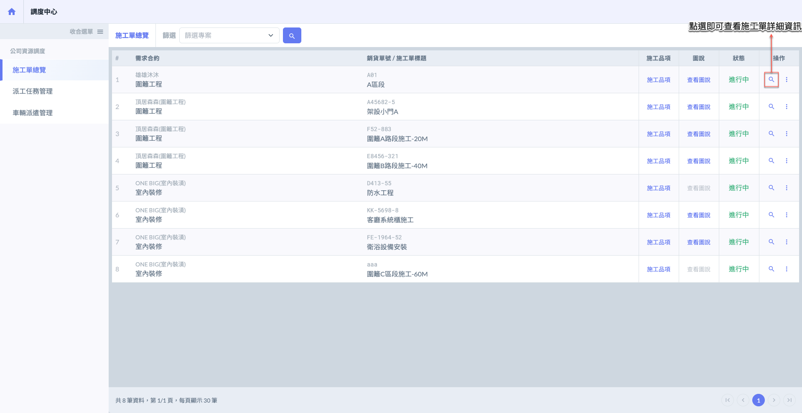 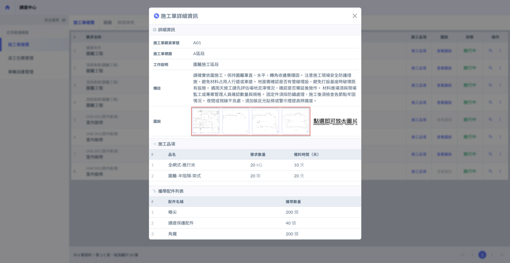

***

## 02｜其他相關操作

於欲操作的施工單右側點&#x9078;**「⋮」**&#x5716;示 (於操作欄位)，即可開啟功能選單，並選擇<kbd>**編輯施工單**</kbd>/<kbd>**更新施工進度**</kbd>/<kbd>**新增派工單**</kbd> /<kbd><mark style="color:red;">**刪除施工單**<mark style="color:red;"></kbd>。

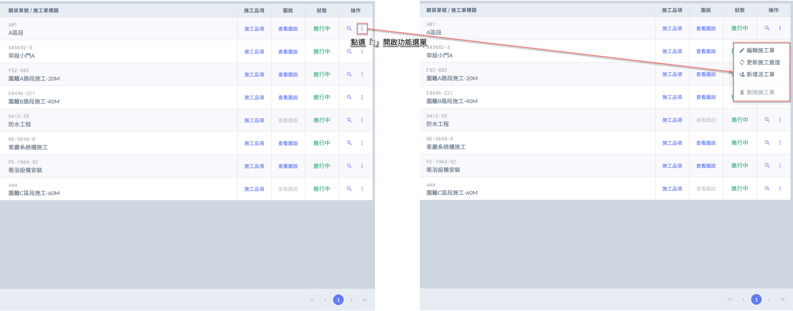

***

### 02 - 1｜編輯施工單

如圖二，於欲編輯之施工單右側點&#x9078;**「⋮」**&#x5716;示 (於操作欄位)，即可開啟功能選單，並選擇<kbd>**編輯施工單**</kbd> 。

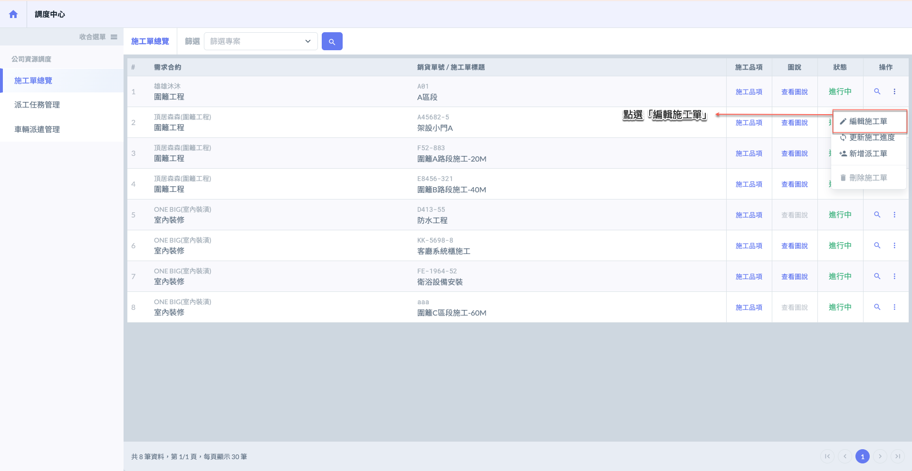

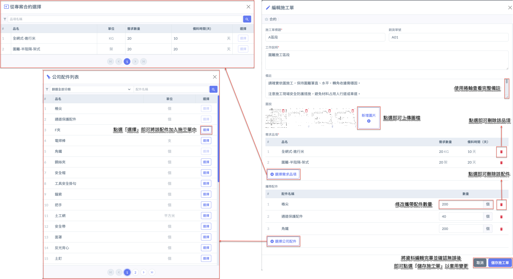

***

### 02 - 2｜更新施工進度

您可透過「更新施工進度」功能，將該施工單的狀態切換為<kbd>**已完成**</kbd>或<kbd><mark style="color:green;">**進行中**<mark style="color:green;"></kbd>，以符合實際執行狀況。



當施工項目實際執行完畢，且回報資料（如：今日總結、工作紀錄、照片等）已填寫無誤，即可將該筆施工單狀態更新為<kbd>**已完成**</kbd>，以利專案後續估驗及結案作業。



若發現已設定為<kbd>**已完成**</kbd>的施工單尚有遺漏作業、回報錯誤或需追加補工內容，可手動退回至<kbd><mark style="color:green;">**進行中**<mark style="color:green;"></kbd>狀態，重新編輯與派工。



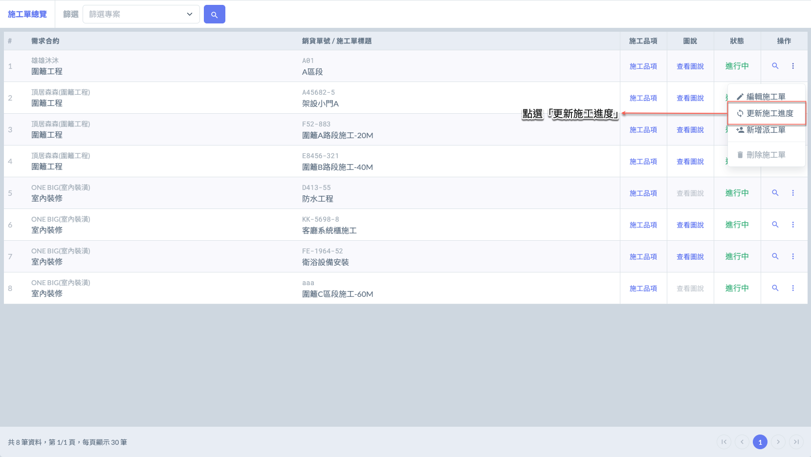

 

***

### 02 - 3｜新增派工單

於欲新增派工單之施工單右側點&#x9078;**「⋮」**&#x5716;示 (於操作欄位)，即可開啟功能選單，並選擇<kbd>**新增派工單**</kbd> 。

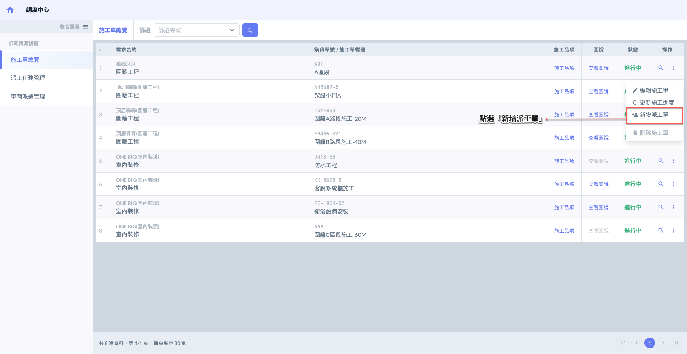 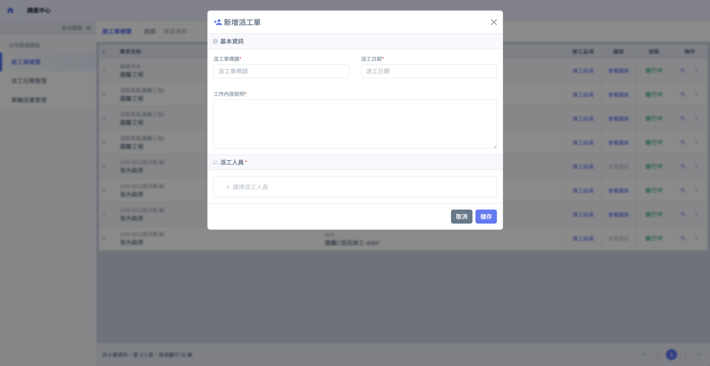

將派工單基本資訊填寫完畢後，請點選<kbd><mark style="color:purple;">**+選擇派工人員**<mark style="color:purple;"></kbd>，即可開啟選單並開始挑選欲指派的公司成員。

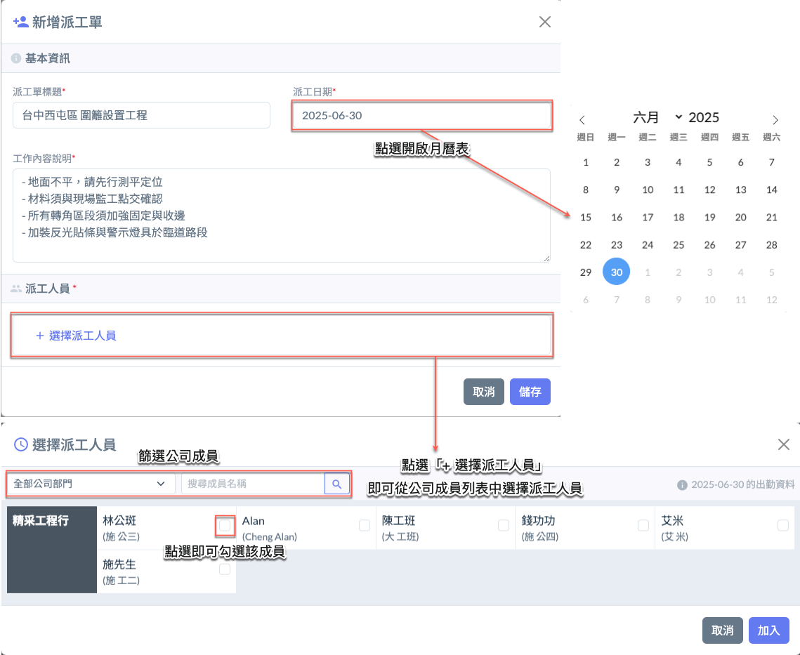

將派工人員選取完畢並確認無誤後，請點&#x9078;**「加入」**，系統即會將所選成員加入至派工單中。接著，點&#x9078;**「儲存」**&#x5373;可完成派工單的建立。

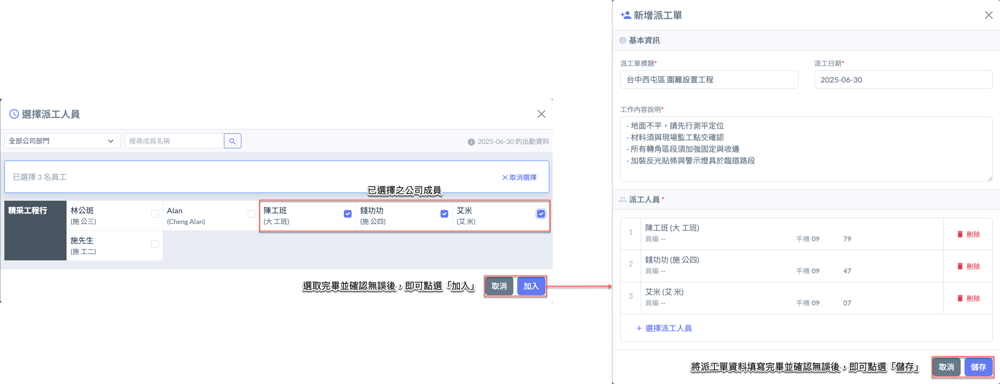

將派工單新增完成後，系統將自動跳出視窗，詢問您是否需同時建立派車單。您可依實際需求，從以下三種選項中擇一操作：



點選<kbd><mark style="color:purple;">**新增派車單**<mark style="color:purple;"></kbd>表示直接新增一張**與此派工單關聯**之派車單，您可指派車輛與駕駛人員，並安排指定日期與用途，方便統一管理此次派工所需的運輸安排。



點選<kbd><mark style="color:blue;">**關聯現有派車單**<mark style="color:blue;"></kbd>可將此派工單與已建立之派車單進行關聯。\
請注意，關聯條件需同時符合以下規則：

* 派工單與派車單需屬於**同一專案、同一合約**。
* 若是從「**派工單**」欲關聯派車單，則該派車單必須是由該階段需求所對應之**出貨單所發起**。           (亦即該出貨單也要與派工單同一專案、同一合約)
* 且**派工單與派車單需為同一天**之作業。

如條件符合，即可成功建立關聯，以利施工及出貨流程整合與調度管理。



點選<kbd>**取消**</kbd>表示此次僅**建立派工單**，**暫不與任何派車單關聯**。\
您可於日後視實際需求，再另行新增或關聯派車單，以完成施工調度作業。

此選項適用於尚未確定運輸需求或尚未安排車輛之情境，避免流程綁定過早造成後續調整困難。



***

### 02 - 4｜刪除施工單

如圖十二 \~ 圖十三，於欲刪除之施工單右側點&#x9078;**「⋮」**&#x5716;示 (操作處)，即可開啟選單，並選擇<kbd><mark style="color:red;">**刪除施工單**<mark style="color:red;"></kbd> 。

系統將跳出確認視窗，請再次確認是否刪除。

!!! warning
    請注意：僅限尚未關聯任何派工單之施工單，方可進行刪除操作。

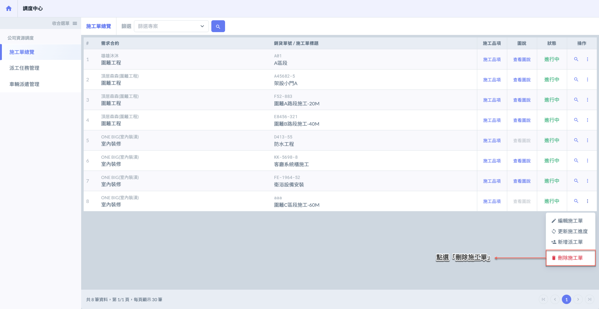 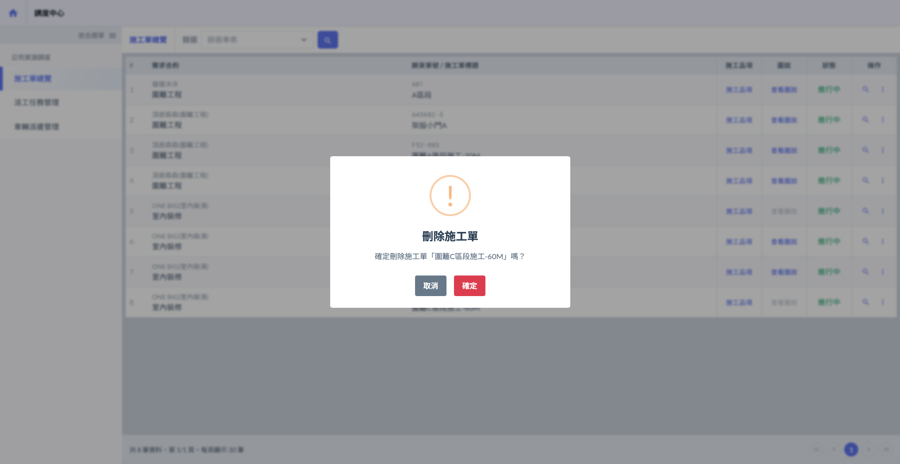

圖十四所示為「不可刪除」之施工單範例，表示該施工單已建立關聯之派工單，因此系統將禁止進行刪除操作。如需移除，請先確認是否解除與所有派工單的關聯後再進行處理。

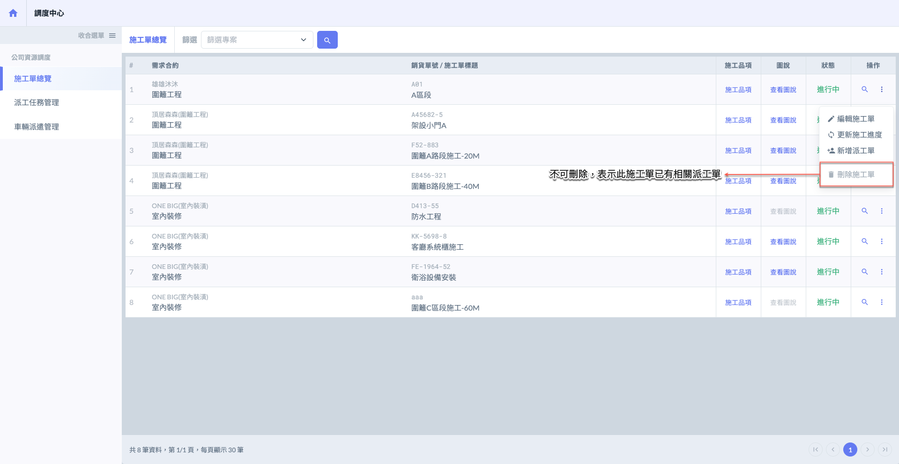
