# 編輯階段需求單

於「階段需求列表」中，請先選擇欲編輯的階段需求項目，進入後即可查看該階段需求單的完整內容，包含其所對應之需求品項、施工單、製造單與出貨單等相關資訊。

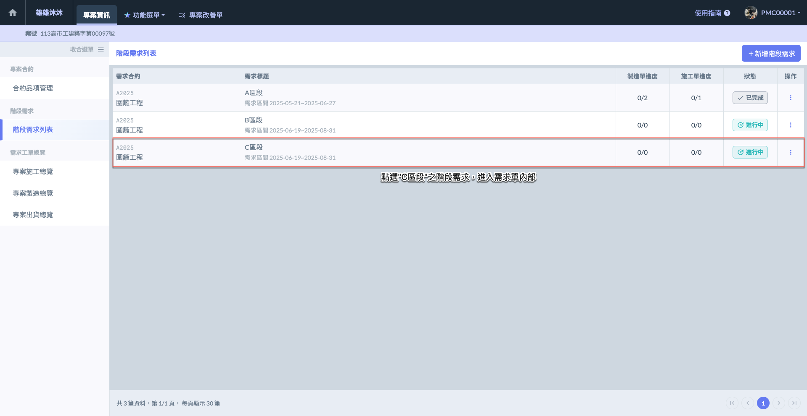

階段需求單畫面如下圖所示，畫面上將顯示該階段需求所涵蓋的主要資訊區塊，包含：



所屬合約、需求區間、備註、狀態及最後編輯人等。



列出本階段內所有需求品項，可查看品名、需求數量、製作完成量、驗收完成量、備料時間、材料表、圖說等。



點選切換，可查看該階段下對應的各類作業單。



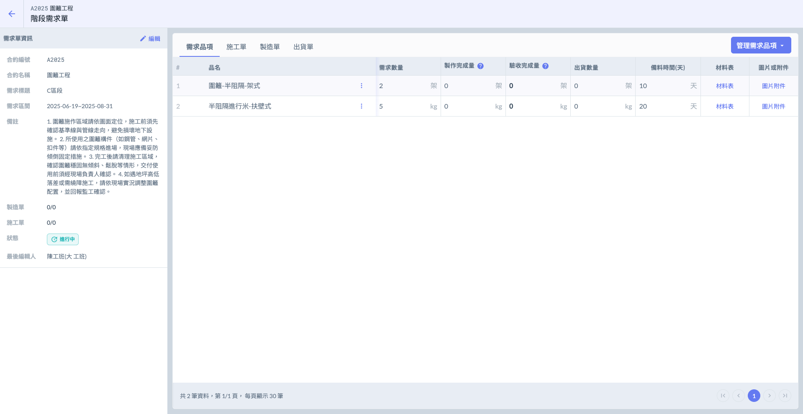

***

## 01｜需求品項相關

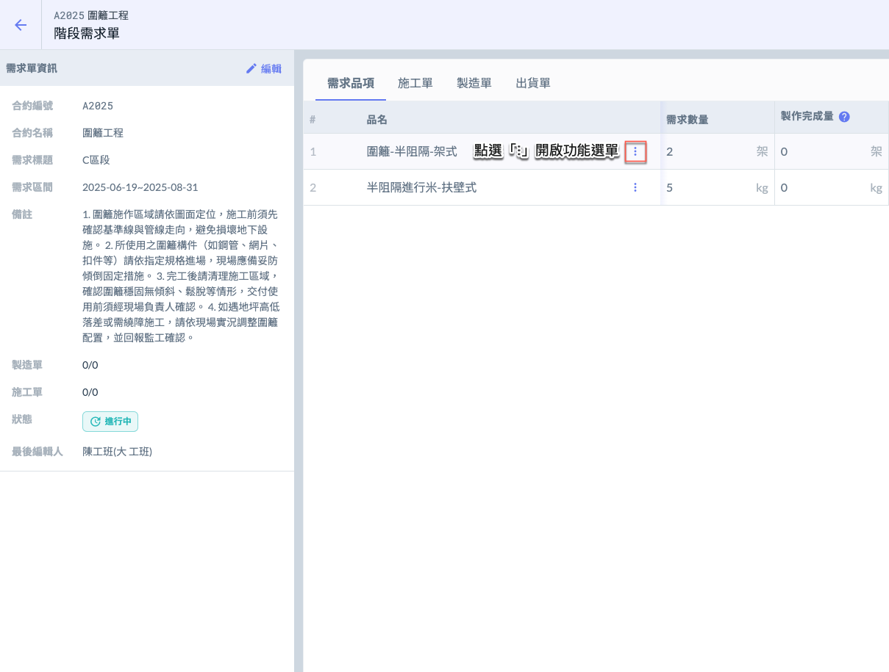 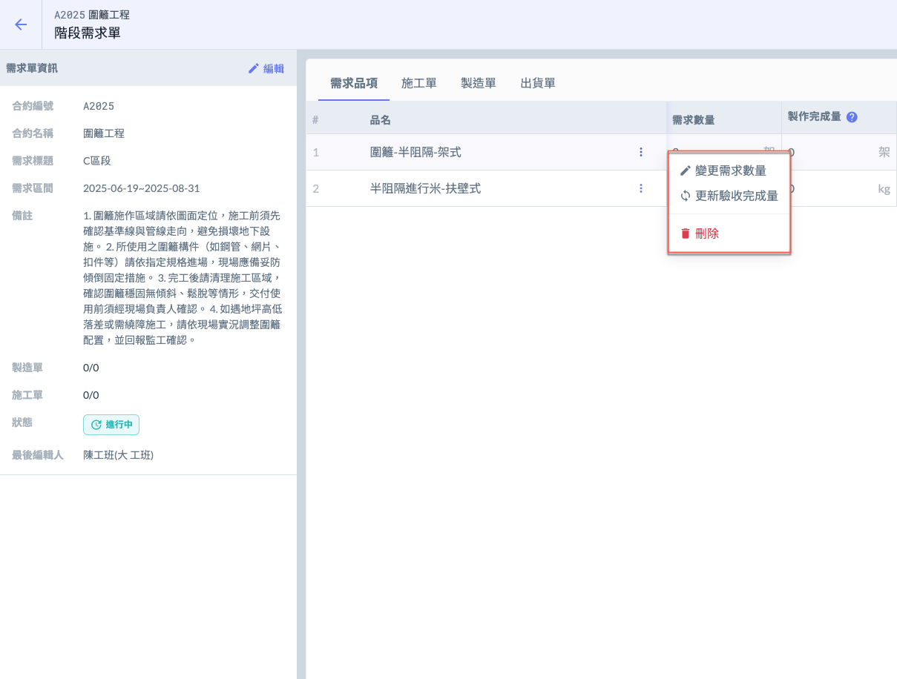

### 01 - 1｜查看材料表 & 圖片附件

材料表與圖片或附件欄位說明：



* 若顯示為「」，表示該品項已建立其組成材料，點選<kbd><mark style="color:purple;">材料表<mark style="color:purple;"></kbd>即可查看詳細內容。
* 若顯示為「」，表示該品項尚未建立其組成材料。



* 若顯示為「」，表示該品項已有上傳的圖片或附件說明，點選<kbd><mark style="color:purple;">圖片附件<mark style="color:purple;"></kbd>即可預覽。
* 若顯示為「」，表示該品項尚未上傳任何圖片或附件。



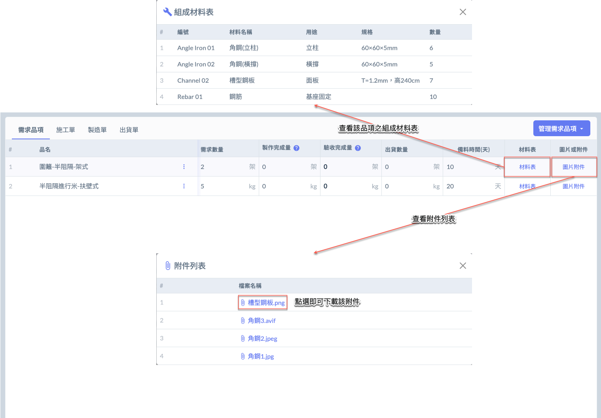

***

### 01 - 2｜變更需求數量

此功能可調整階段需求單中各品項的需求數量，僅影響階段需求顯示，不影響原合約數量。

!!! info
    #### 常見使用情境
    
    * 工程實際施作範圍縮小或擴增
    * 原填寫數量錯誤需修正
    * 因應變更設計或現場狀況微調需求 
    
    **此功能******僅影響畫面上所顯示的數值******，並不會自動回寫或影響原始合約內容、施工單、製造單或出貨單等。**

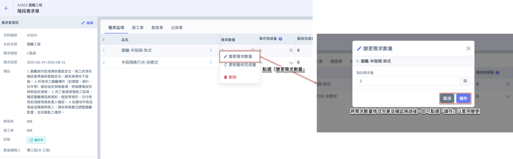

***

### 01 - 3｜更新驗收完成量

此功能用於填寫每項需求品項最終完成並經驗收確認之實際數量。\
適用於已完成施工、製造、出貨及派工流程的項目。

!!! info
    #### 常見使用情境
    
    * 工程驗收時確認實際完成數量
    * 部分施工未通過驗收，僅填寫通過數量
    * 分批驗收，逐次補登已完成部分

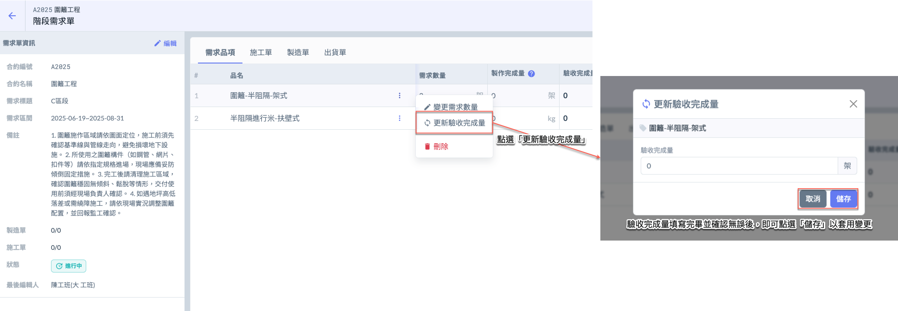

***

### 01 - 4｜刪除需求品項

如圖所示，開啟選單後，請點選<kbd><mark style="color:red;">**刪除**<mark style="color:red;"></kbd>，系統將跳出確認視窗，請再次確認是否刪除。

!!! danger
    #### ⚠️ 注意事項
    
    **僅限尚未被使用於任何施工單、製造單或出貨單**之需求品項，方可執行刪除操作。\
    亦即，該需求品項不得已有後續工序紀錄，否則系統將限制刪除以避免資料遺失與作業錯誤。
    
    建議在建立階段需求後，**尚未進入後續流程前**，先行確認各項品項是否正確。

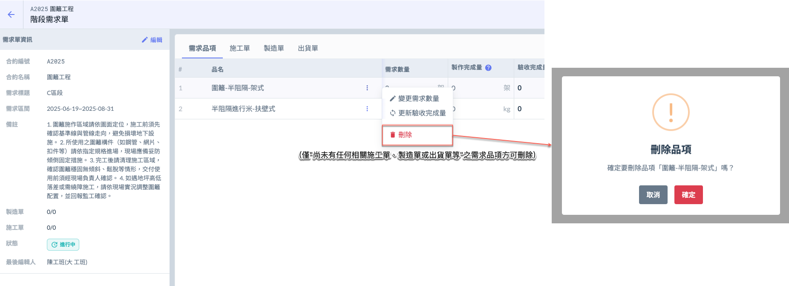

***

## 02｜施工單相關

於需求單管理介面上方，點選頁籤  (<kbd>**需求品項**</kbd>/<kbd>**施工單**</kbd>/<kbd>**製造單**</kbd>/<kbd>**出貨單**</kbd>) 即可切換不同頁面。\
請先將頁面切換至<kbd>**施工單**</kbd>，再進行新增、編輯等後續操作。

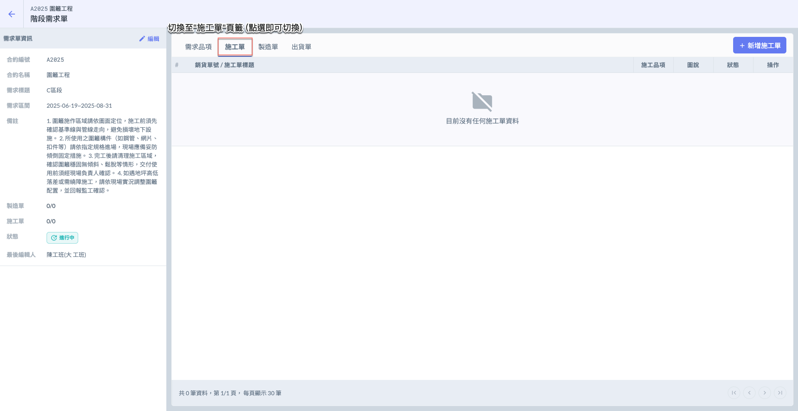

### 02 - 1｜新增施工單

進入施工單頁面後，請點選右上方的<kbd><mark style="color:purple;">**+新增施工單**<mark style="color:purple;"></kbd>按鈕，即可開啟新增視窗，開始填寫施工單基本資料。

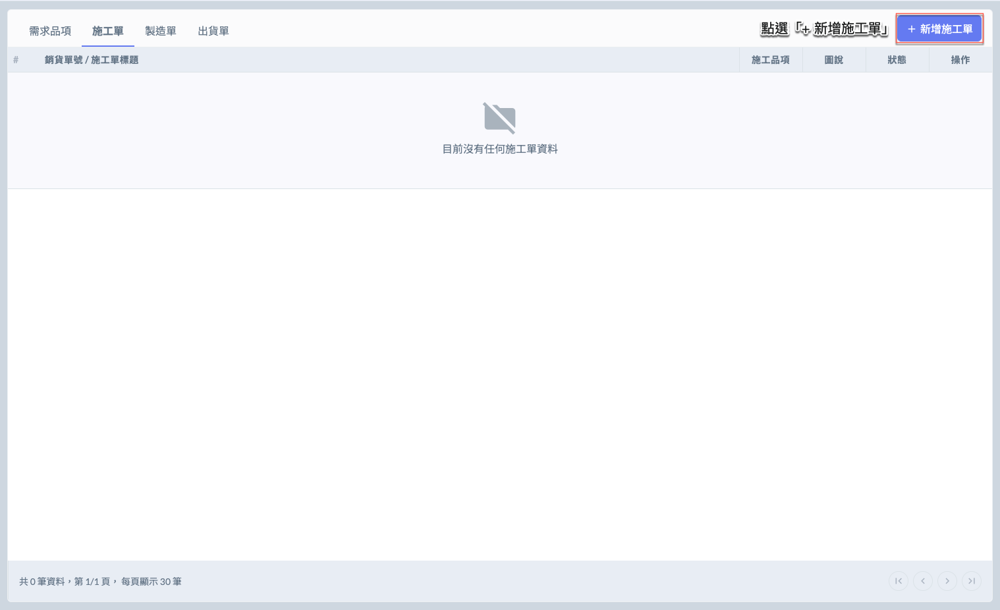 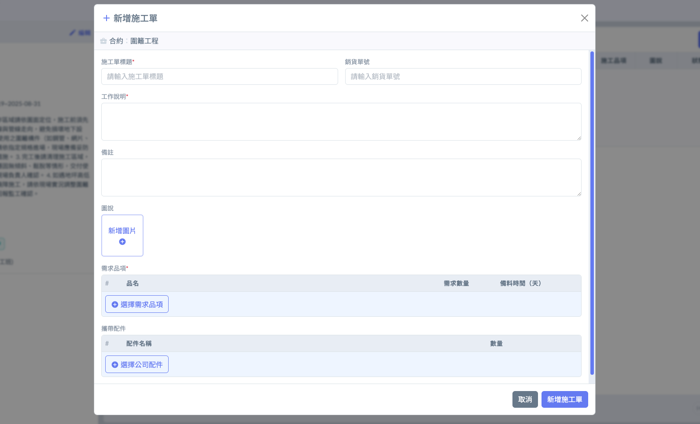

### 02 - 2｜查看施工單

### 02 - 3｜編輯施工單

### 02 - 4｜更新施工進度

### 02 - 5｜刪除施工單

## 03｜製造單相關

於需求單管理介面上方，點選頁籤  (<kbd>**需求品項**</kbd>/<kbd>**施工單**</kbd>/<kbd>**製造單**</kbd>/<kbd>**出貨單**</kbd>) 即可切換不同頁面。\
請先將頁面切換至<kbd>**製造單**</kbd>，再進行新增、編輯等後續操作。

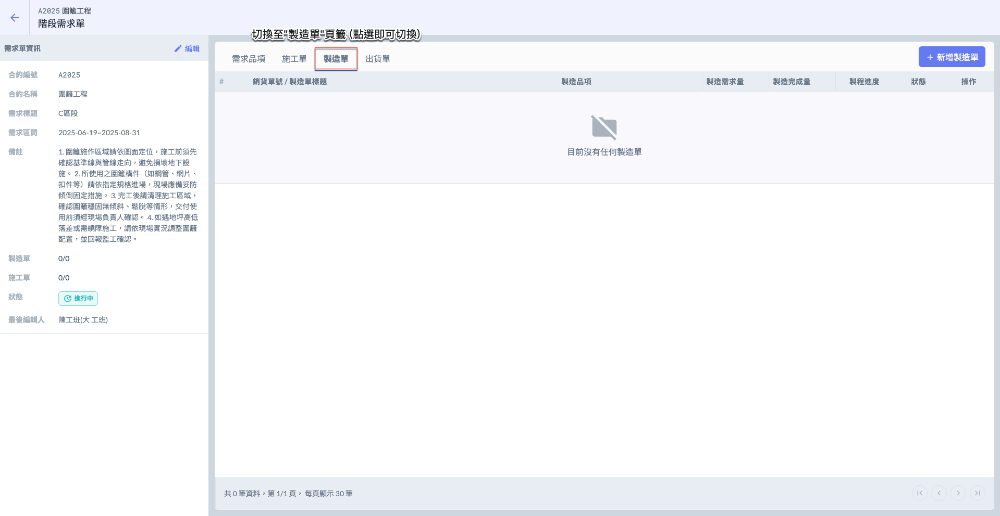

### 03 - 1｜新增製造單

進入製造單頁面後，請點選右上方的<kbd><mark style="color:purple;">**+新增製造單**<mark style="color:purple;"></kbd>按鈕，即可開啟新增視窗，開始填寫製造單基本資料。

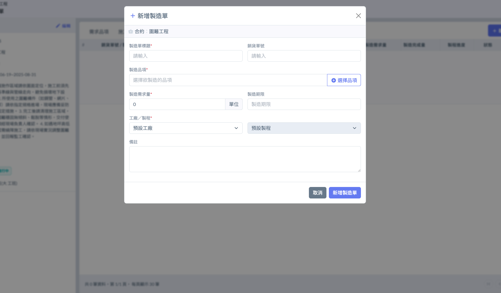 

### 03 - 2｜查看製造單

### 03 - 3｜編輯製造單

### 03 - 4｜更新製造進度

### 03 - 5｜刪除製造單

## 04｜出貨單相關

於需求單管理介面上方，點選頁籤  (<kbd>**需求品項**</kbd>/<kbd>**施工單**</kbd>/<kbd>**製造單**</kbd>/<kbd>**出貨單**</kbd>) 即可切換不同頁面。\
請先將頁面切換至<kbd>**出貨單**</kbd>，再進行新增、編輯等後續操作。

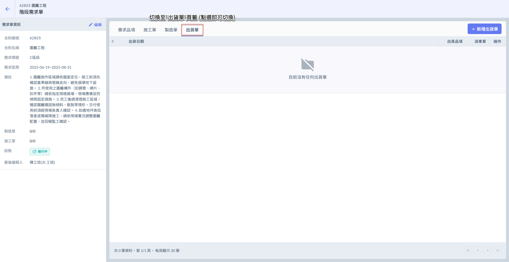

### 04 - 1｜新增出貨單

進入出貨單頁面後，請點選右上方的<kbd><mark style="color:purple;">**+新增出貨單**<mark style="color:purple;"></kbd>按鈕，即可開啟新增視窗，開始填寫出貨單基本資料。

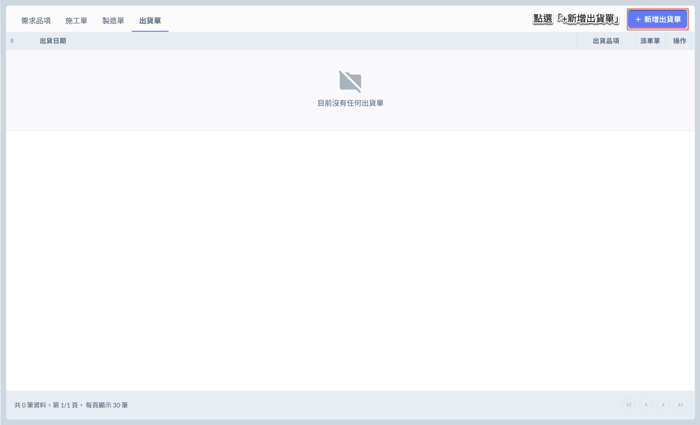 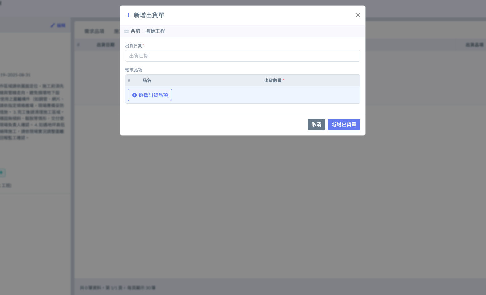

### 04 - 2｜編輯出貨單

### 04 - 3｜發起派車單

### 04 - 4｜關聯現有派車單

### 04 - 5｜刪除出貨單
