# 階段需求列表

在大型或複雜的工程合約中，常無法一次完成所有工作，因此會根據現場條件、工期安排或進度排程，分階段建立需求單，並逐步執行與追蹤各階段作業。

**階段需求單**是專案合約執行過程中的核心作業指派單據，目的在於將一整份工程合約中的工作內容，依實際需求拆分為多個階段任務，以利分批進場、分期施工、逐步驗收與估驗計價。

!!! info
    #### 📌 功能重點
    
    * 每一張階段需求單，對應合約中一部分的品項與數量
    * 每一階段具有**獨立的執行期限**與交付標的
    * 可選擇從合約中帶入品項，或**自行新增額外項目**
    
    ***
    
    建立後，可進一步開立：
    
    * **施工單**：指派現場施工作業
    * **製造單**：啟動工廠或預製加工流程
    * **出貨單**：安排材料或製品的配送出貨

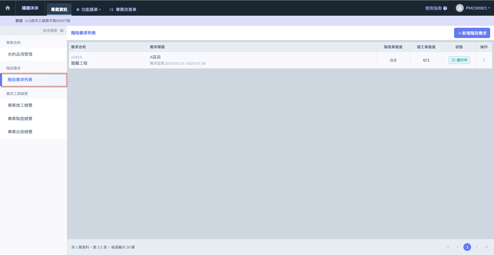

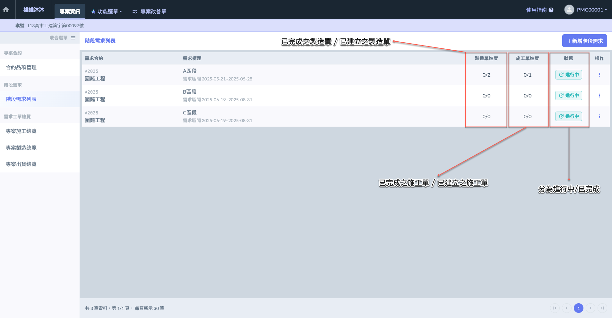

***

## 01｜新增階段需求

進入**階段需求列表**頁面後，點選右上方的<kbd><mark style="color:purple;">**+新增階段需求**<mark style="color:purple;"></kbd>，即可開啟新增視窗，填寫階段需求相關資料。

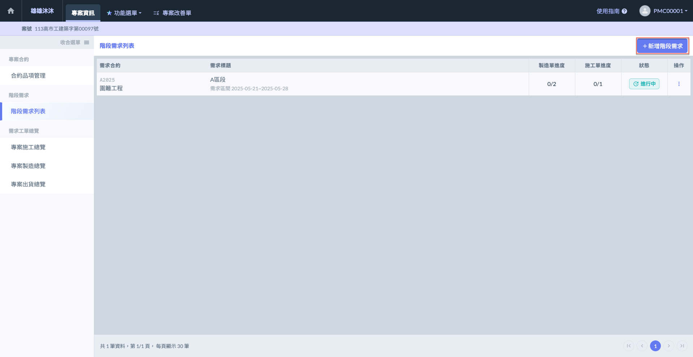 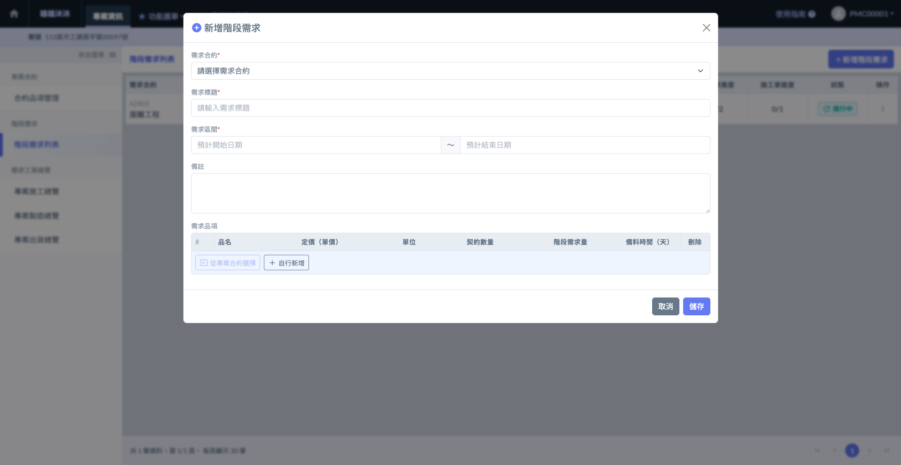

進入新增畫面後，請先選擇該需求所對應的合約。點&#x9078;**「需求合約」**&#x6B04;位，即可開啟選單並選取對應合約。

!!! info
    可選取的合約資料，依據您於「合約品項管理」中所建立之專案合約。
    
    有關合約管理之詳細操作流程，請參閱 ➙ [contract](contract "mention")

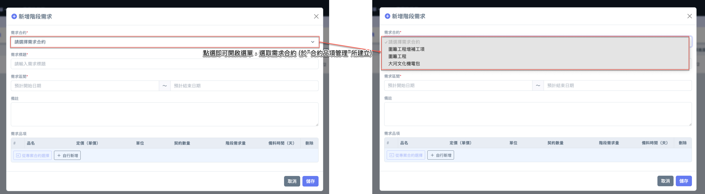

***

## 01 - 1｜需求品項

系統提供兩種方法，讓您在建立階段需求單時選取對應的需求品項：



可直接帶入已建立於合約中的品項，並依實際需求調整數量。



若有臨時性或額外需求，可手動輸入品項名稱與數量，作為額外指派項目。



#### 01 - 1 - 1｜專案合約選擇 (品項)

如圖四所示，將其餘需求資料 (含：需求合約、標題、日期區間、備註等) 填寫完成後。

即可&#x65BC;**「需求品項」**&#x6B04;位中點選從<kbd><mark style="color:purple;">**專案合約選擇**<mark style="color:purple;"></kbd>，選擇欲納入本次階段需求的品項。

!!! danger
    #### 注意事項
    
    已於其他階段需求單中選用過的合約品項，將無法於其他階段需求中再次選擇。
    
    每筆合約品項僅能於一張階段需求單中使用，若需在不同階段重複使用，請於原合約中新增對應品項 / (自行新增)

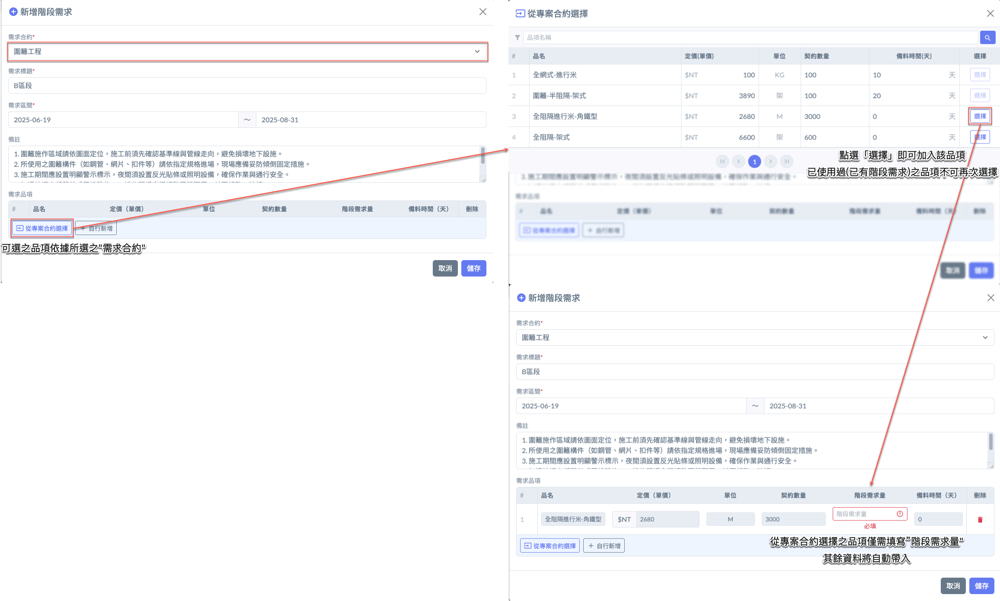

***

#### 01 - 1 - 2｜自行新增 (品項)

若您欲新增不屬於合約中的項目，亦可於填寫完其他必要資料後，點選<kbd>**+自行新增**</kbd>開始新增多筆需求品項。

即可手動輸入**品項名稱**、**定價**、**單位**、**契約數量**、**階段需求量**及**備料時間**等資訊。

將所有資料填寫完畢並確認無誤後，即可點&#x9078;**「儲存」**。

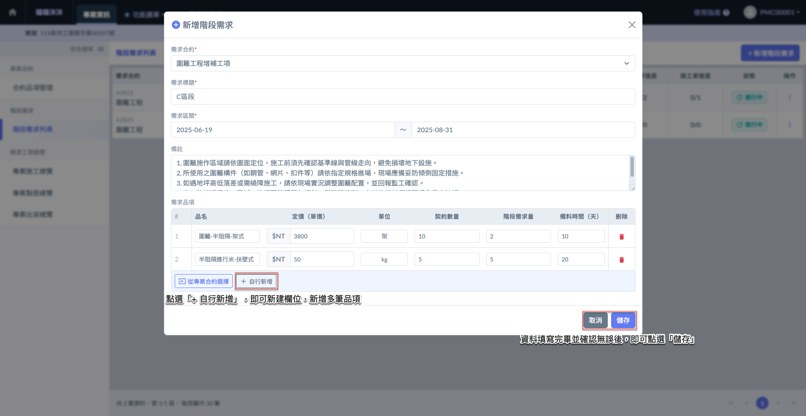

***

## 02｜其他相關操作

於欲操作之階段需求單右側點&#x9078;**「⋮」**，即可開啟功能選單，並選擇<kbd>**編輯階段需求**</kbd>/<kbd>**更新需求狀態**</kbd>/<kbd><mark style="color:red;">**刪除**<mark style="color:red;"></kbd>。

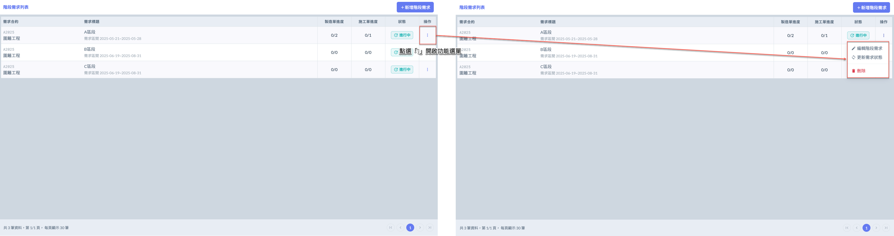

***

### 02 - 1｜編輯階段需求

如圖二，於欲編輯之階段需求右側點&#x9078;**「⋮」**&#x5716;示 (於操作欄位)，即可開啟功能選單，並選擇<kbd>**編輯階段需求**</kbd> 。

如圖三，進入編輯畫面後，可修改需求資料 (包括：標題、區間及備註)，但不可修改對應之需求合約。

修改完畢並確認無誤後，請點&#x9078;**「儲存」**&#x4EE5;套用變更。

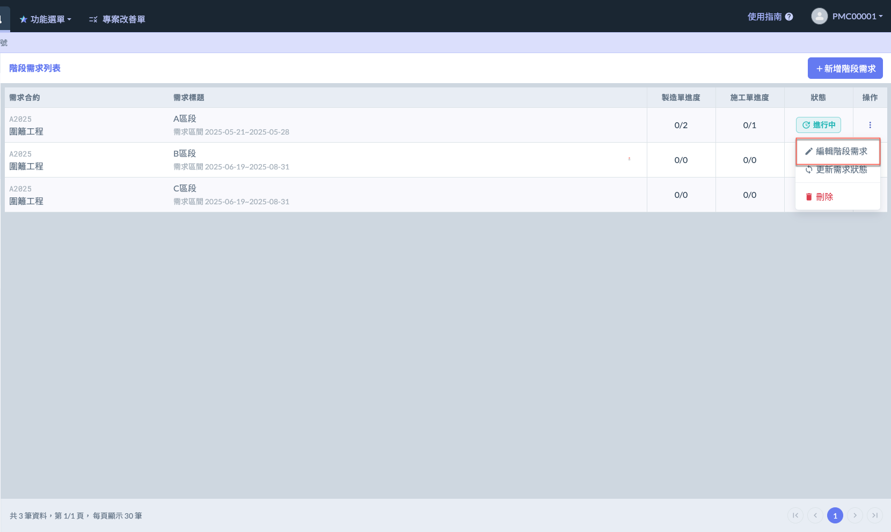 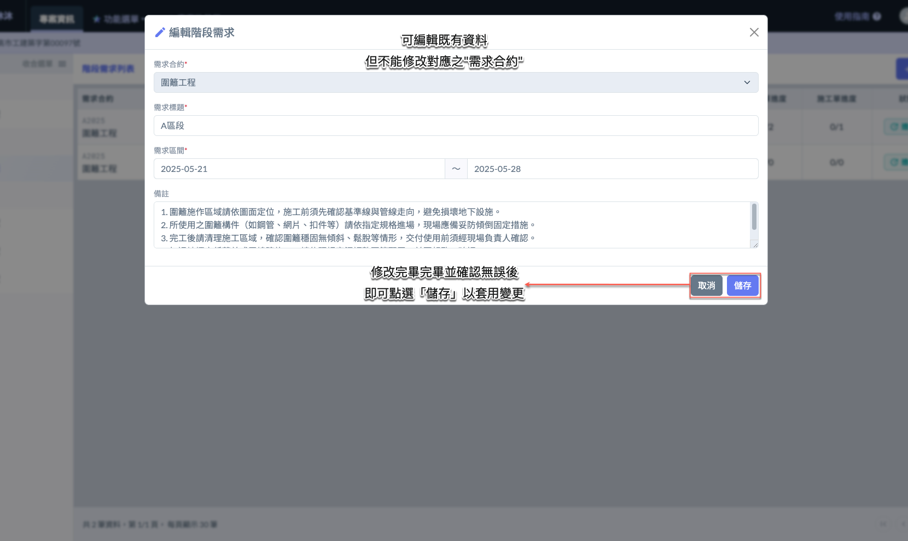

***

### 02 - 2｜更新需求狀態

您可透過「更新需求狀態」功能，將該階段需求單的狀態切換為<kbd>**已完成**</kbd>或<kbd><mark style="color:blue;">**進行中**<mark style="color:blue;"></kbd>，以符合實際執行狀況。



代表該階段所有作業流程皆已完成，進入結案或審核階段。



如仍需補登施工、製造或出貨作業，可重新開啟階段。



!!! info
    #### 🛠 狀態切換的施作條件與建議情境
    
    **將階段需求設為「已完成」的情境**&#x20;
    
    當以下條件皆達成時，建議將該階段標註為已完成：
    
    * 該階段所對應之**施工單皆已完成並填報回傳**
    * 所屬的**製造單已完成製程與流程回報**
    * 所有**出貨單已確認完成配送**，數量與狀態無誤
    * 該階段不再新增施工、製造、出貨任務
    * 已完成現場確認或初步驗收，可進入對帳／結算作業
    
    ***
    
    **將階段需求重設為「進行中」的情境**
    
    若該階段已結案但出現以下情形，可恢復為進行中：
    
    * **補充施作需求** (如漏項、業主變更、追加工程)
    * **製造項目遺漏或需調整流程關卡**
    * **出貨作業尚有遺漏或錯誤需要修正**
    * **實際執行與系統紀錄不符，需要補登或更正**

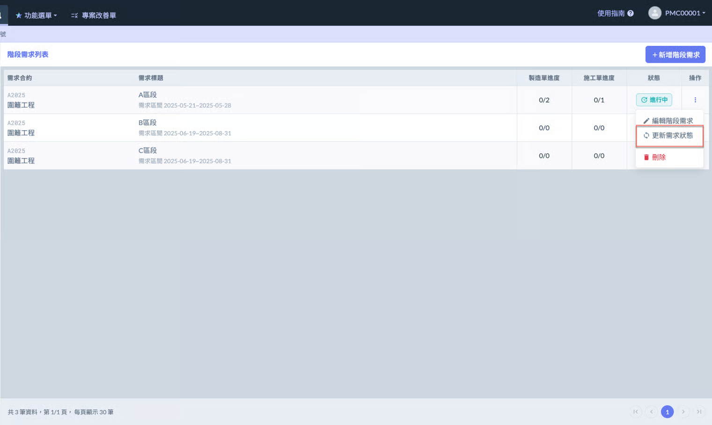

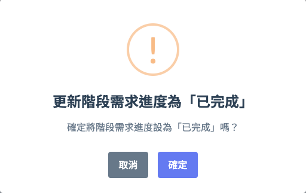 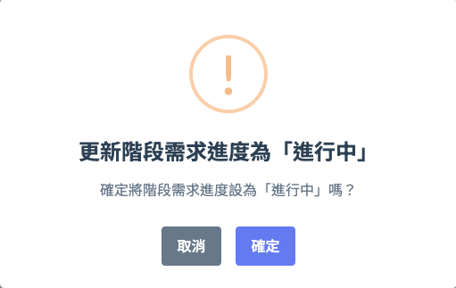

***

### 02- 3｜刪除階段需求

如圖七 \~ 圖八所示，開啟選單後，請點選<kbd><mark style="color:red;">**刪除**<mark style="color:red;"></kbd>，系統將跳出確認視窗，請再次確認是否刪除。

!!! danger
    #### 注意事項
    
    您可刪除不再需要的階段需求單，系統將一併刪除該階段底下所建立的所有施工單、製造單、出貨單等資料。
    
    此操作將永久移除所有相關紀錄，請務必謹慎確認。
    
    ***
    
    * **刪除為不可復原動作**\
      刪除階段需求單後，該階段及其所屬的所有作業單據 (包含施工單、製造單、出貨單) 將**一併刪除且無法復原**，不保留任何紀錄。
    
    ***
    
    * **將影響進度紀錄與統計資料**\
      如該階段已參與進度回報、施工紀錄、派工、出貨等作業，刪除後將導致統計資料與追蹤紀錄產生落差。
    
    ***
    
    * **僅建議在以下情境使用刪除功能**\
      建立錯誤或重複的階段需求單\
      測試資料不應納入正式紀錄\
      專案取消或作業內容已重組，原階段不再使用

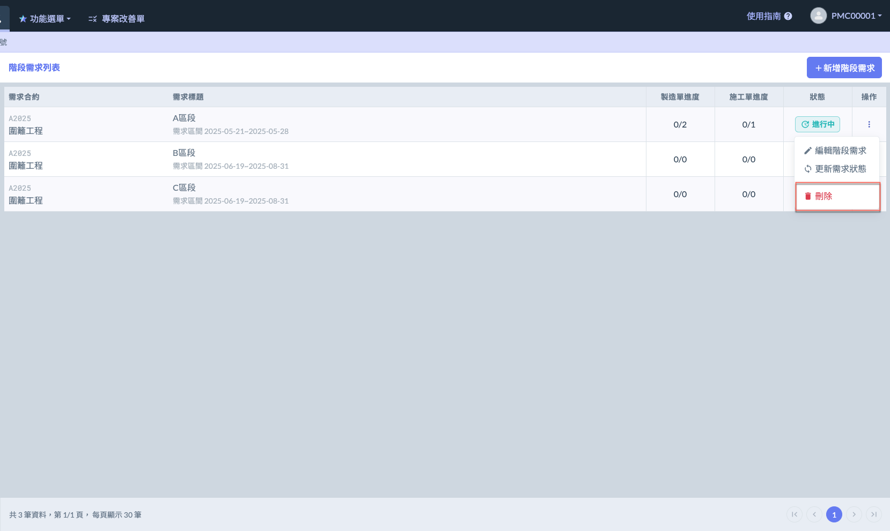 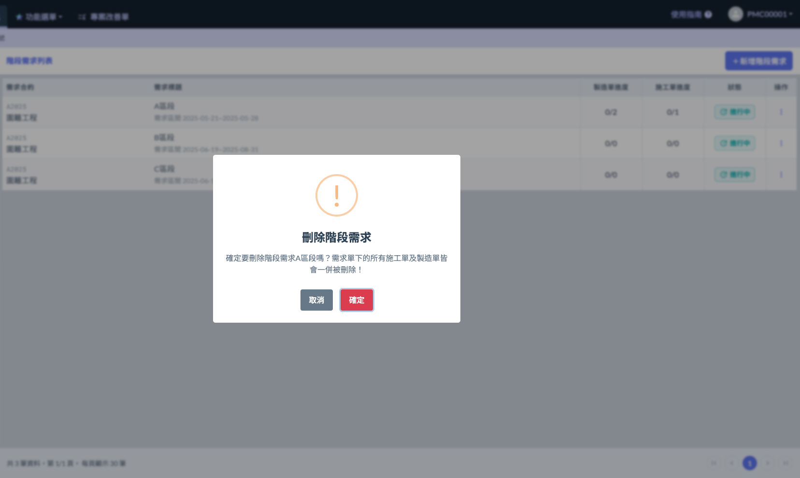

