# 代客驗屋APP



### 收到派工通知。可事先指派或臨時修改。

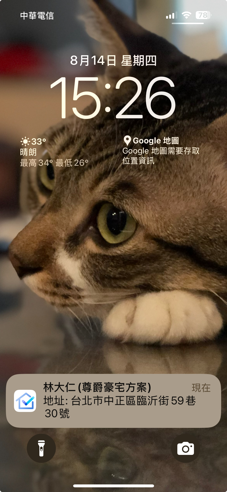




### 進入APP首頁 > 待驗任務

&#x20; 預設右上方 『我的任務』，只會看到指給自已的工作。可以切換為 『全部任務』

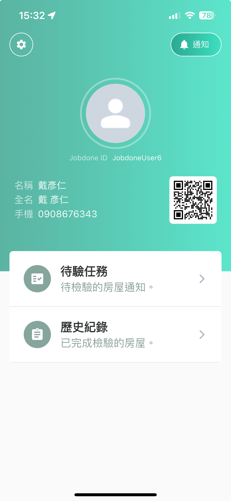 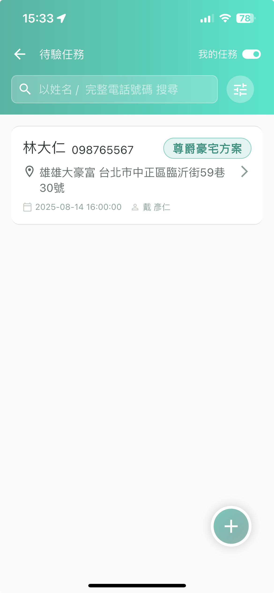 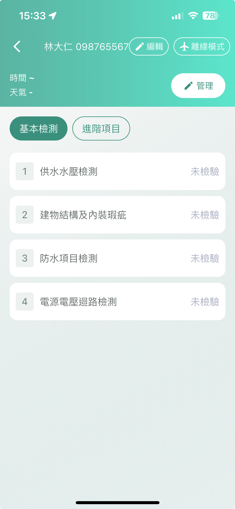




### 開始檢查

!!! info
    只要新成屋的網路訊號不佳，建議在開始檢查前，直接進入 『離線模式』。

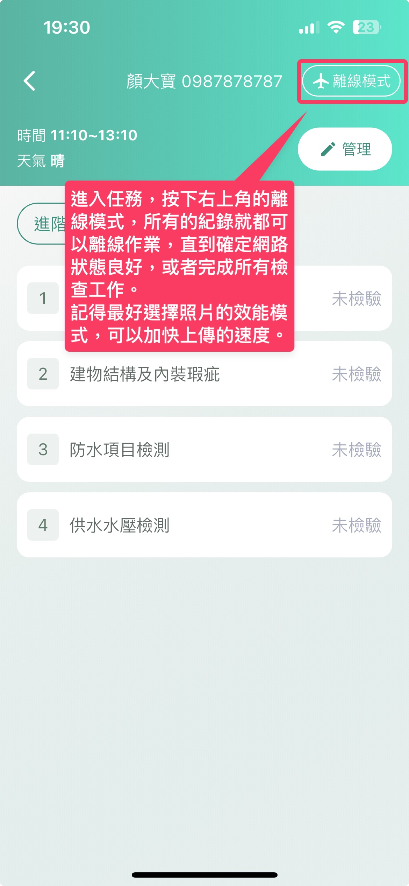

紀錄的方式有：拍照、選擇圖片、選擇影片、語音轉文字紀錄。

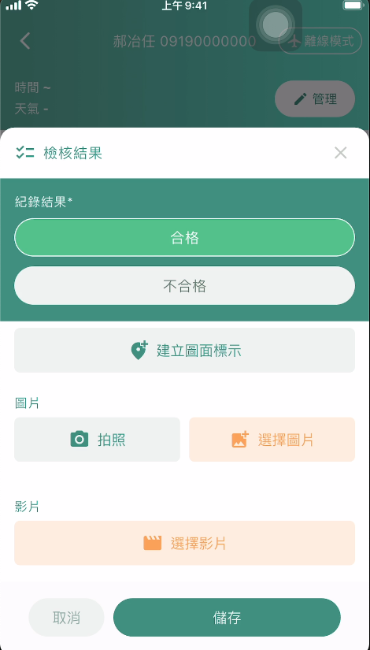

* 進入該檢查任務，可以直接選擇離線模式執行。
* 逐項選擇合格、不合格的紀錄，每一項都可以作多筆紀錄。
* 每筆紀錄可以選擇空間、圖面、拍照、影片上傳，以及用打字或語音作說明。

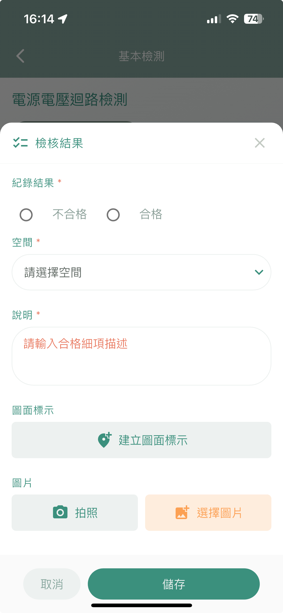 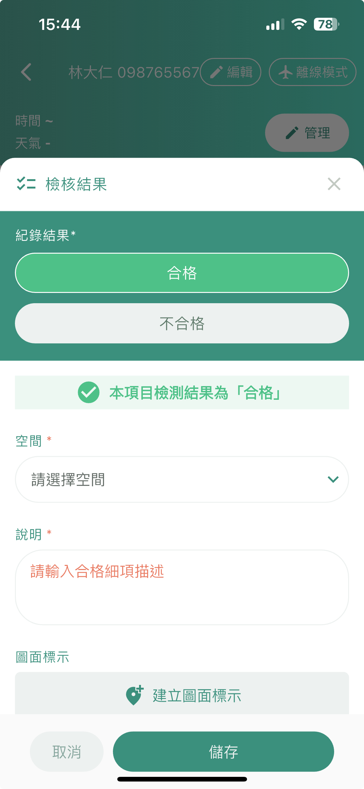 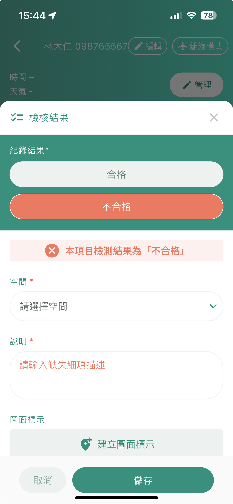




### 天氣紀錄以及新增自訂分類

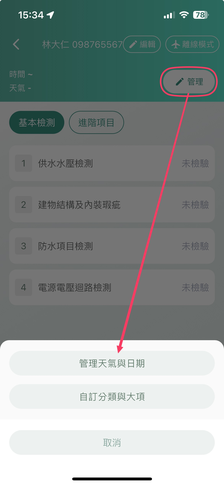

* **天氣紀錄包含記錄檢查的開始時間跟結束時間**

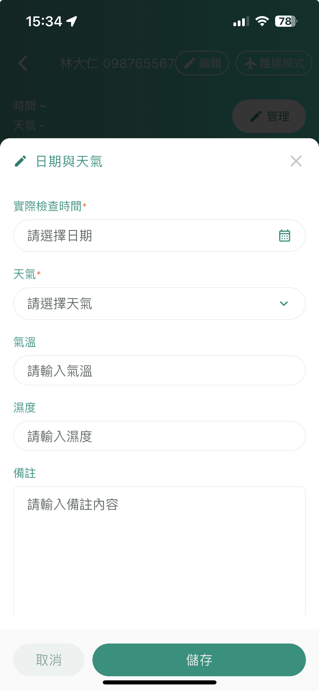

* **可以現場增加新分類以及檢查項目，新增分類會出現在右邊標籤。**

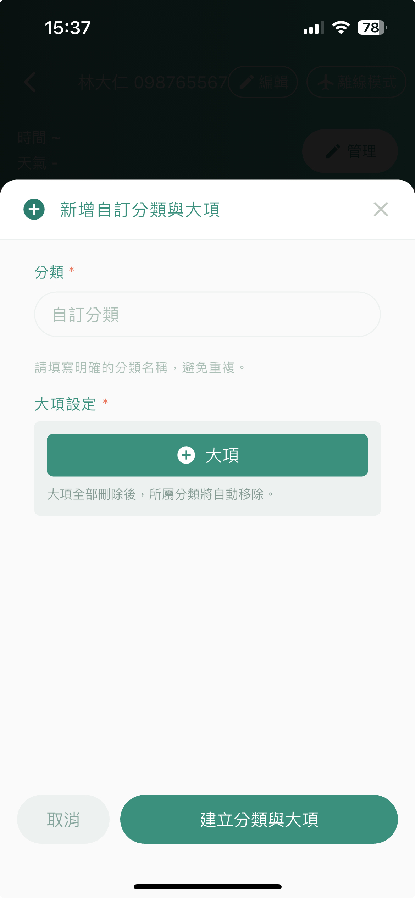 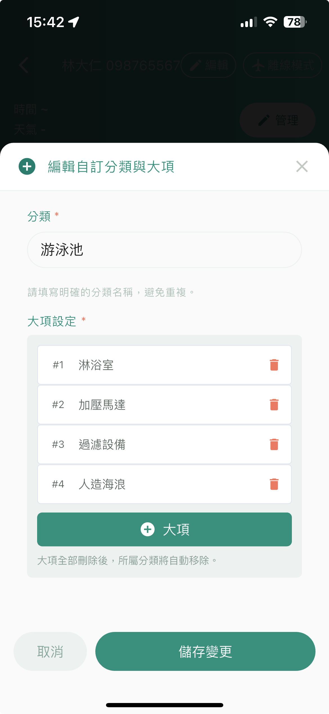 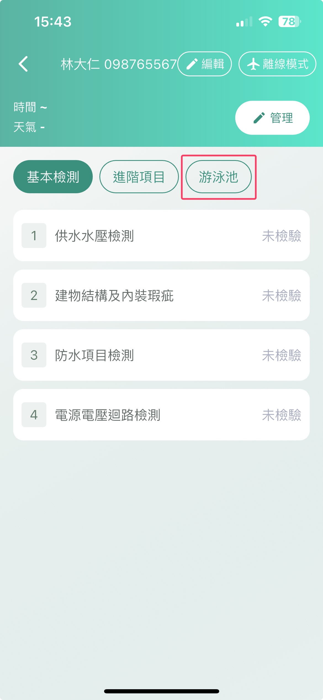




### 離線操作：萬一手機收訊不良時，不會影響驗屋紀錄的工作

* 所有離線操作的紀錄，會在檢測列表顯示有 『離線紀錄』。
* 全部檢查完成後，按下右上方的 「離線模式」，APP會自動連線，並告知有未上傳資料。
* 將離線項目全數上傳。
* 等待上載完成，所有離線項目會顯示為 「合格」 或 「不合格」。

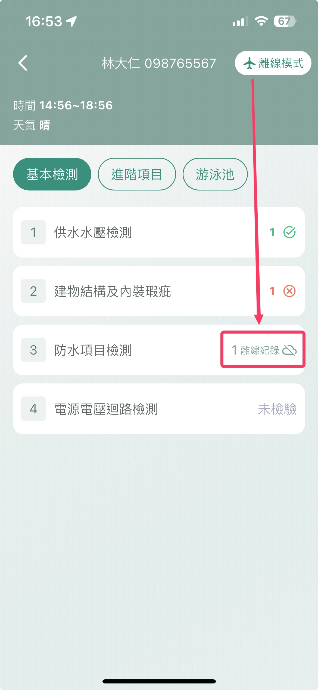 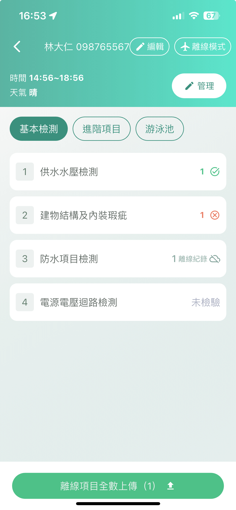 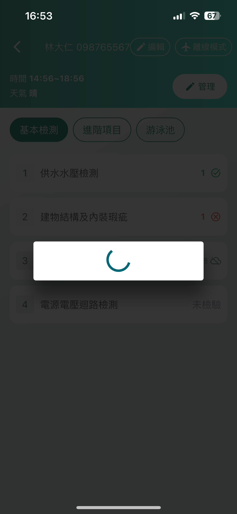 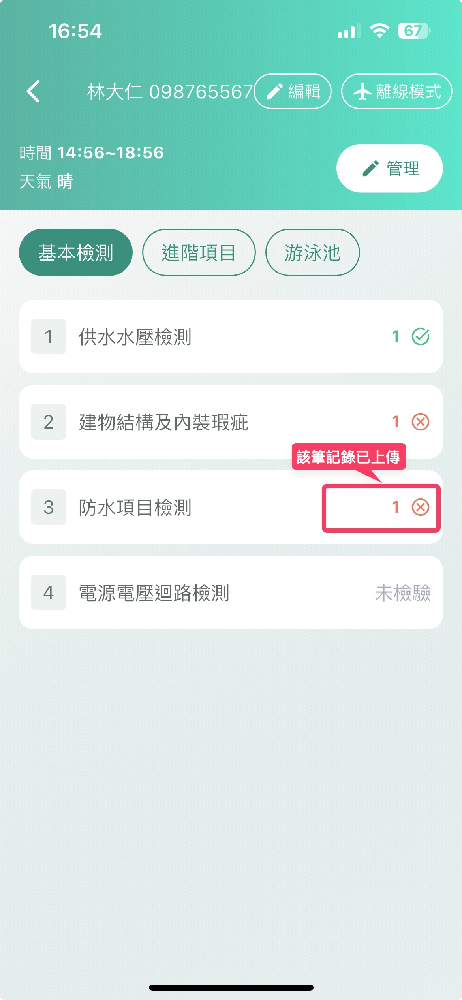



