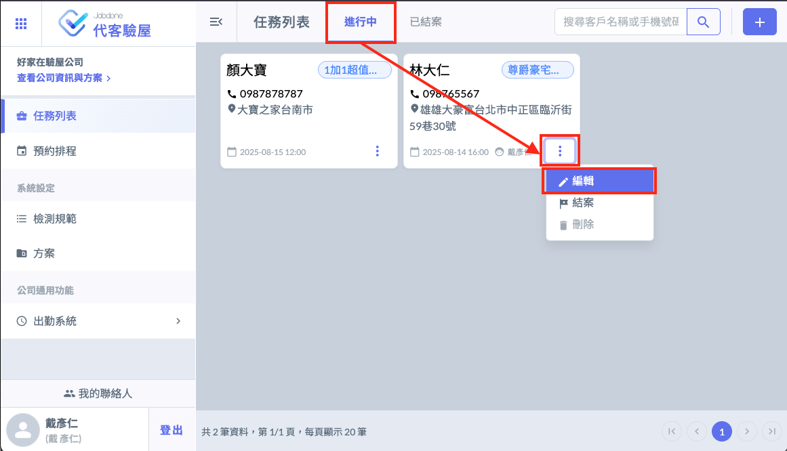
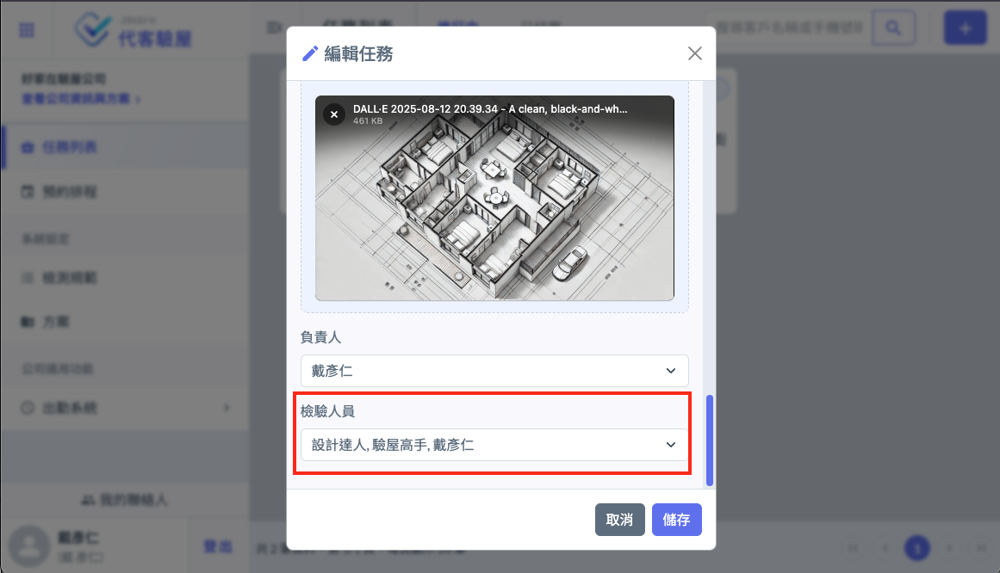
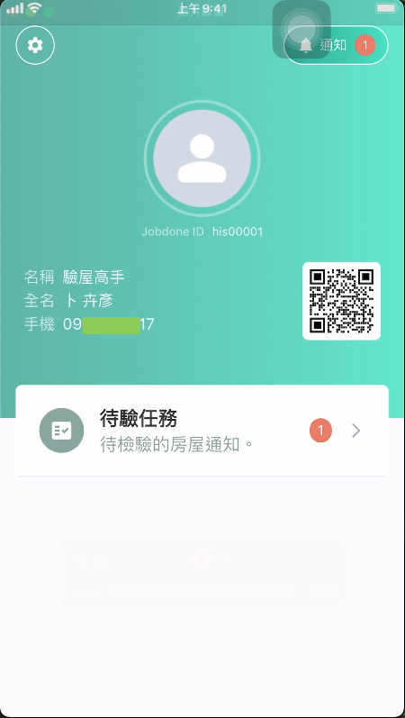
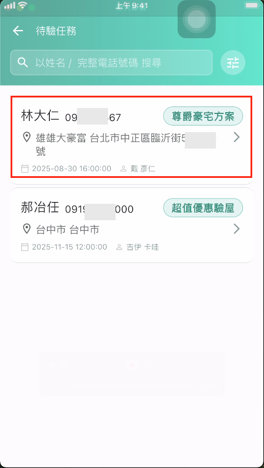
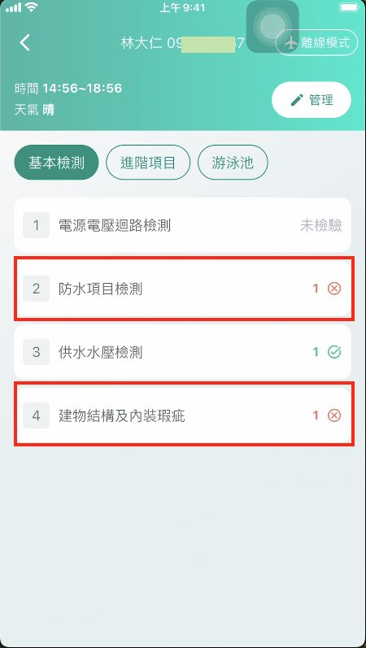
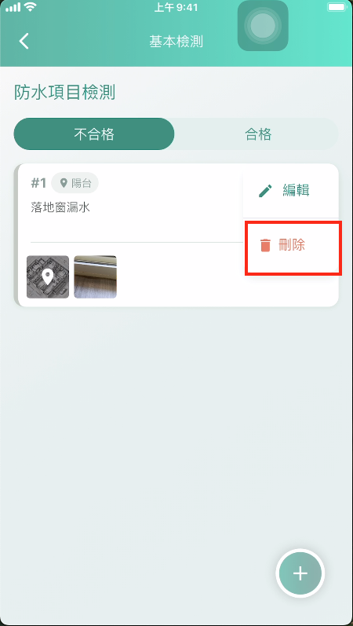
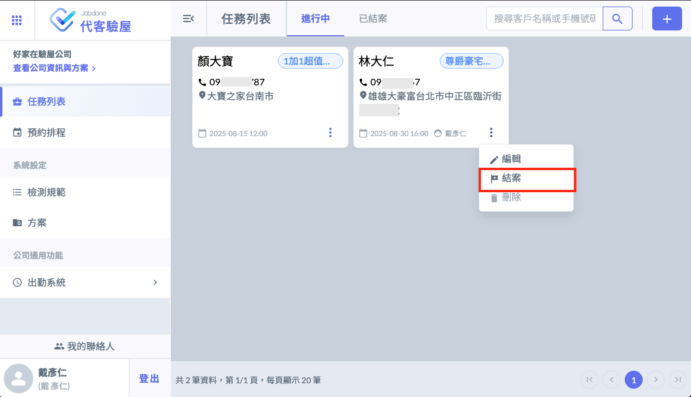
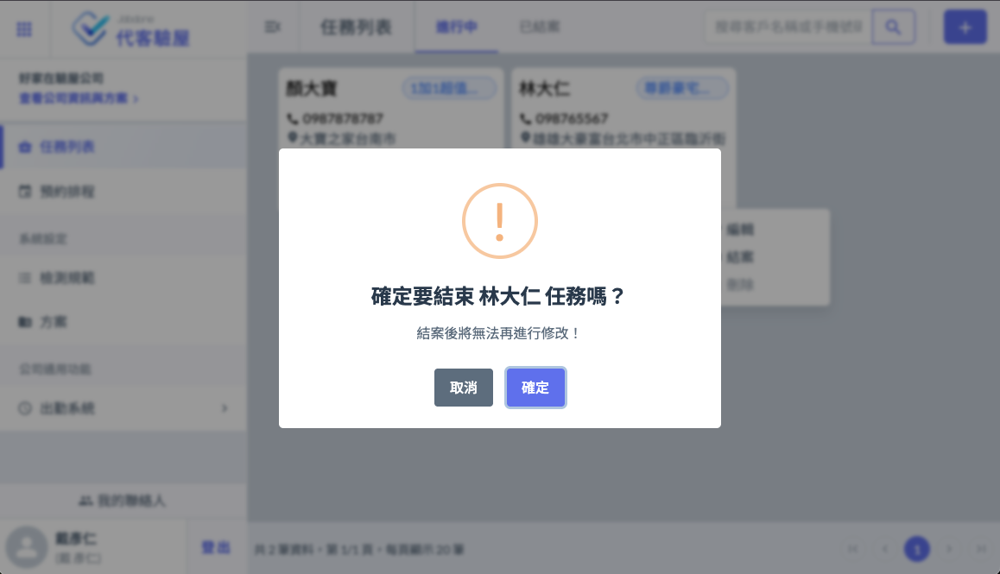
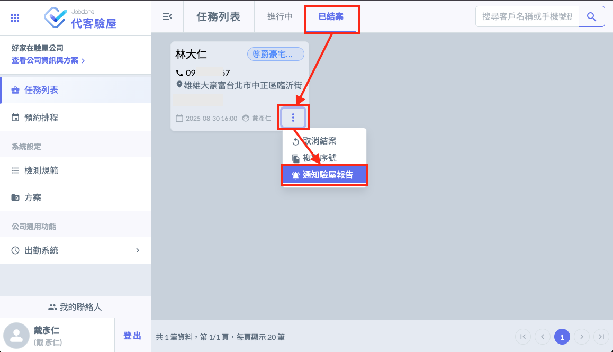

# 複驗工作

## 複驗內容1：針對先前缺失項目進行檢測確認。

1. 複驗之前：請記得將已經結案的案子 『取消結案』，因為要針對前一次初驗的缺失內容進行複測。（之前設定結案，是為了提交驗屋報告給屋主，這次取消結案是為了要執行「複驗」比對缺失項目是否有改善)

2. 在「進行中」的頁籤下，點選「編輯」按鈕，記得修改複驗的日期時間，順便查看一下這次要執行複驗的人員是否有異動，如果有新成員，記得要將他們的帳號選擇進來。

3. 驗屋人員打開Jobdone代客驗屋APP，點選「待驗任務」按鈕，選擇複驗的專案。

4. 針對初驗有缺失的項目進行複驗。

5. 如果缺失已經改善。就刪除不合格的紀錄，改成合格。如果還是不合格，也可以編輯這次不合格的原因。

6. 逐項完成複驗檢測工作。最終確認資料紀錄無誤之後，回到Web管理介面將本次複驗按下「結案」按鈕。

7. 接下來就可以移到「已結案」的頁籤，按下「通知驗屋報告」寄發email給客戶觀看線上驗屋報告。

## 複驗內容2：將複驗當作重新檢驗

此種做法比較嚴謹，針對原本的檢測項目再次重新檢測過一次，除了複驗當時初驗不合格的項目之外，也擔心建設公司的工班在維修過程產生新的瑕疵問題。

您可以考量：客戶的時間、預算是否值得重新全部再檢驗一次。或者針對初驗不合格事項做複驗，這兩種做法都可以。如果您有更好的建議做法也可以發訊息留言給我們，我們也會將此議題作為功能優化的參考。謝謝！
