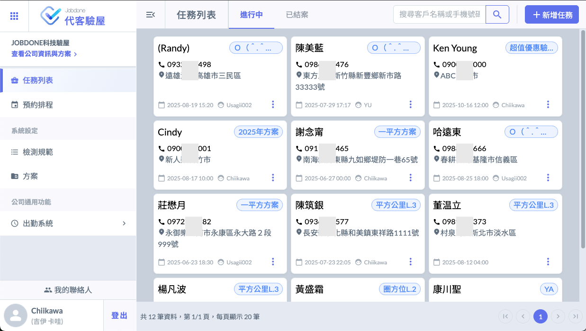
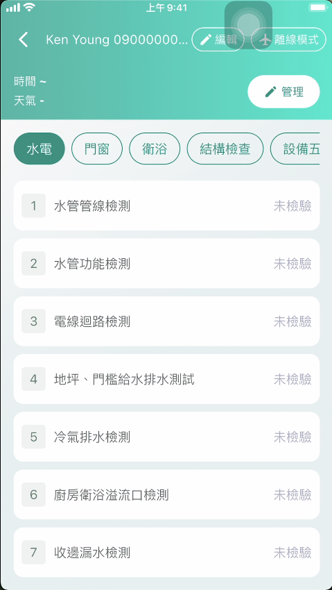

# 基本概念

!!! warning
    Jobdone代客驗屋是一套可以多人協同作業的工具平台，費用上只有管理者帳號需要付費，使用Jobdone驗屋APP的用戶可以免費使用。您可以委派給其它外部的人員協助檢測任務，他們只要下載APP，就可以接收任務進行回報。

> Jobdone代客驗屋的功能區分為：系統管理(Web功能)與現場驗屋(APP功能）
>
> 1. **系統管理**：在Web介面上執行，包含：預約客戶、設計驗屋方案、規劃檢測項目及標準、工作分派、編輯驗屋報告、線上驗屋報告預覽、寄送線上驗屋報告給屋主等功能。
> 2. **現場驗屋**：使用APP進行檢測紀錄、拍照、錄影，將檢測紀錄同步回傳到Jobdone驗屋系統。

## Web功能：Jobdone代客驗屋系統管理

所有的基本設定，包含公司的服務方案 (產品)、檢測規範、預約、跟任務 (客戶的案件) ，都需要在Web上設定。檢查結果的檢視也在Web上查看、複製。

## APP功能：現場驗屋檢測紀錄

所有的現場檢查工作，都在APP進行，可以多人執行同一個案件、可以****離線****進行。完成後上傳至雲端後台。

APP下載掃描QR Code，或到AppStore、Google Play搜尋『代客驗屋』。

