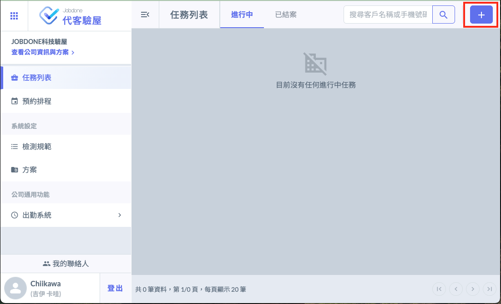
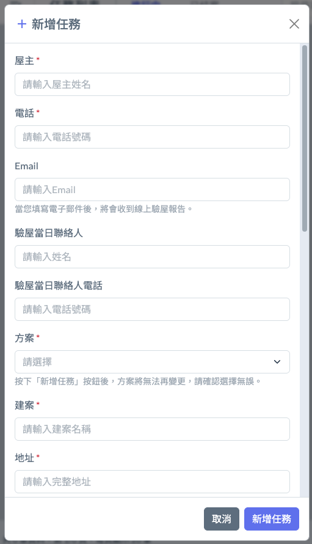
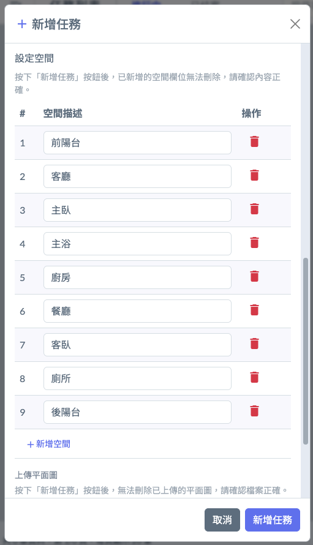
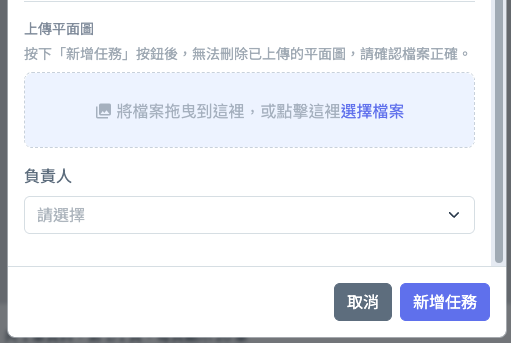

# 任務列表

> ### 接受客戶委託即為驗屋系統的  「任務」

* 任務包含接單的所有基本資訊，以及客戶選擇的方案。
* 輸入方案、預計驗屋時間。之後隨時可以修改。
* 設定空間，以該物件的設計圖面定義空間。
* 上傳平面圖，可以在檢查時進行缺失標示。
* 空間標示。依照該案的房型，在這裏可預先設定好空間，如客廳、主臥等。
* 負責人只能選擇具有購買授權可以進入Web後台的人員。

操作步驟：

1. 請點選畫面右上方的 『 ＋ 』 新增任務。

2. 填寫 『新增任務』：屋主、電話（行動電話）是必填的，因為在驗屋現場要聯絡屋主的必要資訊。Email資料雖然是非必填，如果您希望可以直接Email通知屋主線上查看驗屋報告，Email就是必要的資訊。

3. 設定空間：請依照屋主委托的房屋狀況填寫，系統會自動帶出預設值，您可以自由刪除不必要的項目。

4. 選擇負責人之後，按下 『新增任務』按鈕。

5. 下個單元會介紹『預約排程』，跟屋主約好驗屋時間之後，要確認當天有空一起過去驗屋的人手。
