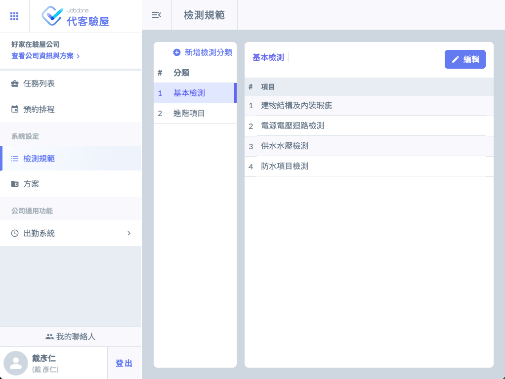
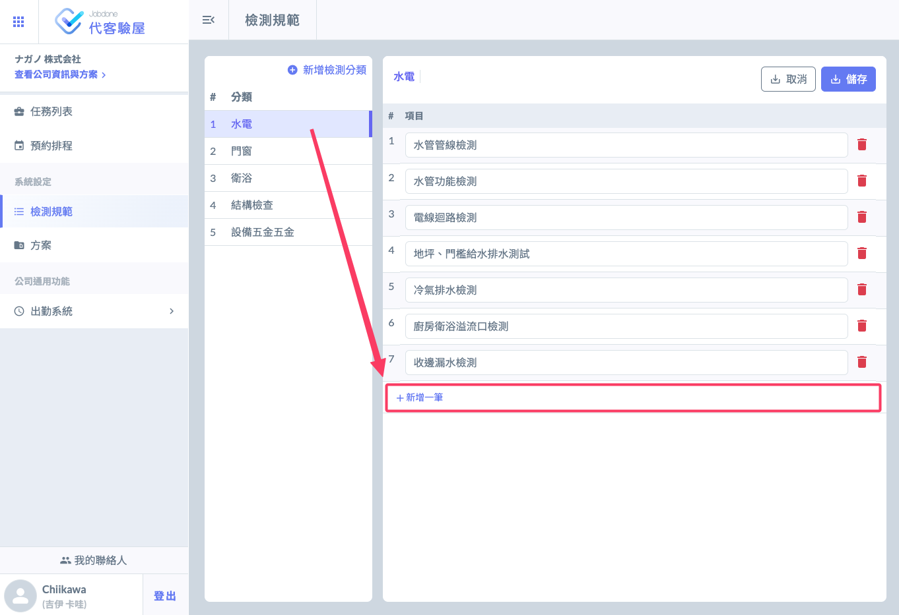
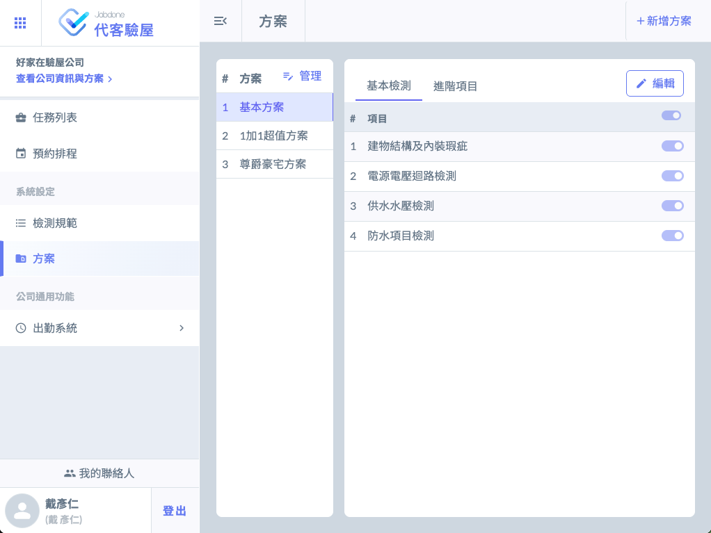
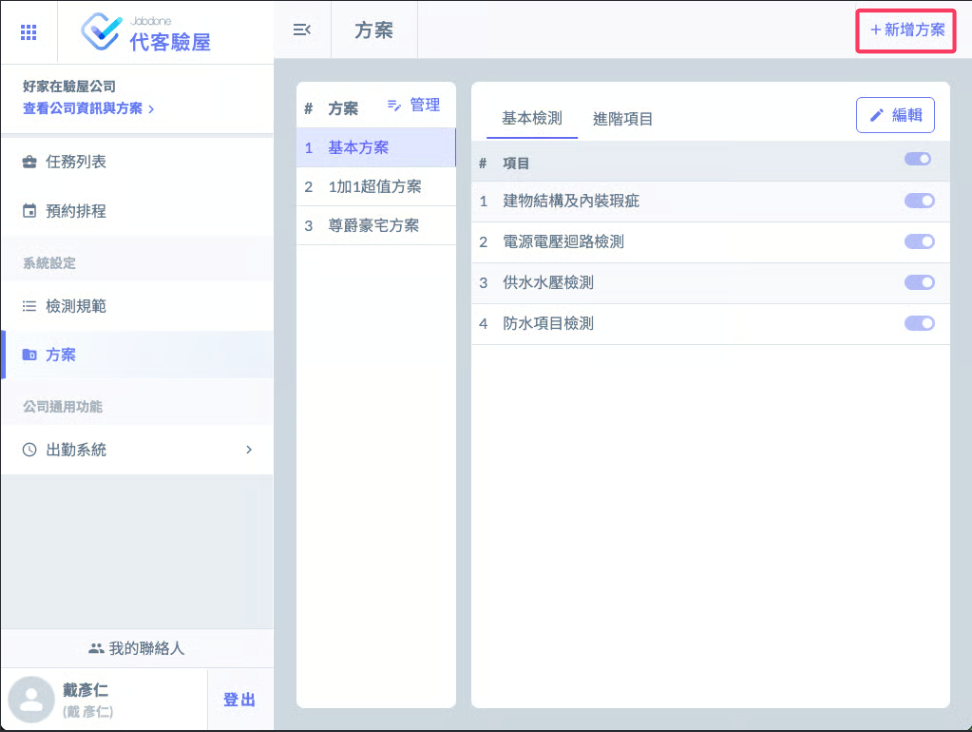

# 系統設定

系統設定分為 ****『方案』**** 與****『檢測規範』**** 兩項。

> ### 方案：就是跟屋主收費的套餐。
>
> ### 檢測規範：就是驗屋檢查的項目內容。

***

您可以依據您的專業來設定檢測項目（檢測規範），也可以參考網路上友商的檢查項目，無論如何優先建立好分類之後，再編輯詳細的檢查項目。（此時，先別急著建立方案）



### 編輯建立檢測規範

在檢測方案下，先新增檢測分類。選擇分類後，進入分類下的編輯模式，可以新增多檢測項目名稱。




### 編輯方案，並從檢測規範選擇內容

在右上方選擇『新增方案』，在該方案下，會列出所有的檢測項目，以開關的方式，決定方案下是否要包含這些檢測項目。




## 操作說明：

* 檢測規範一定要先建立好，之後新增「方案」時才會「套用」這些檢測規範。如果您很直覺的先建立方案，之後你會發現每一筆檢測規範（項目）都要重新建立。總之，先建立「檢測規範」之後再來選「方案」準沒錯。
