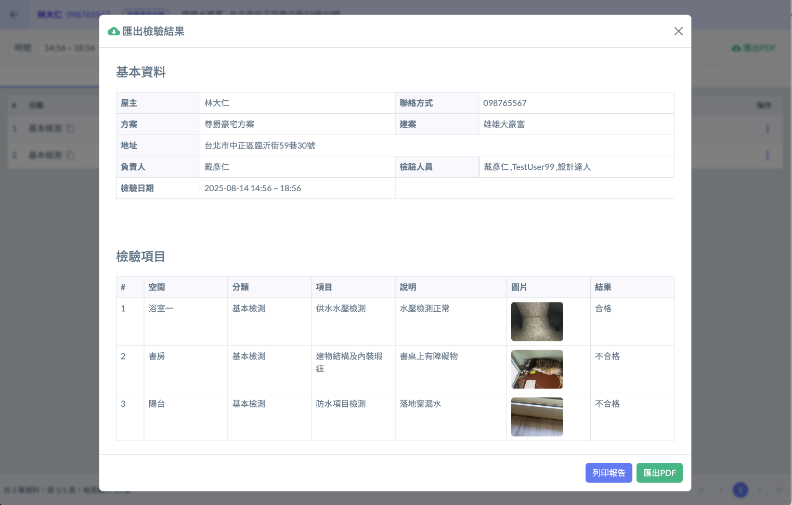
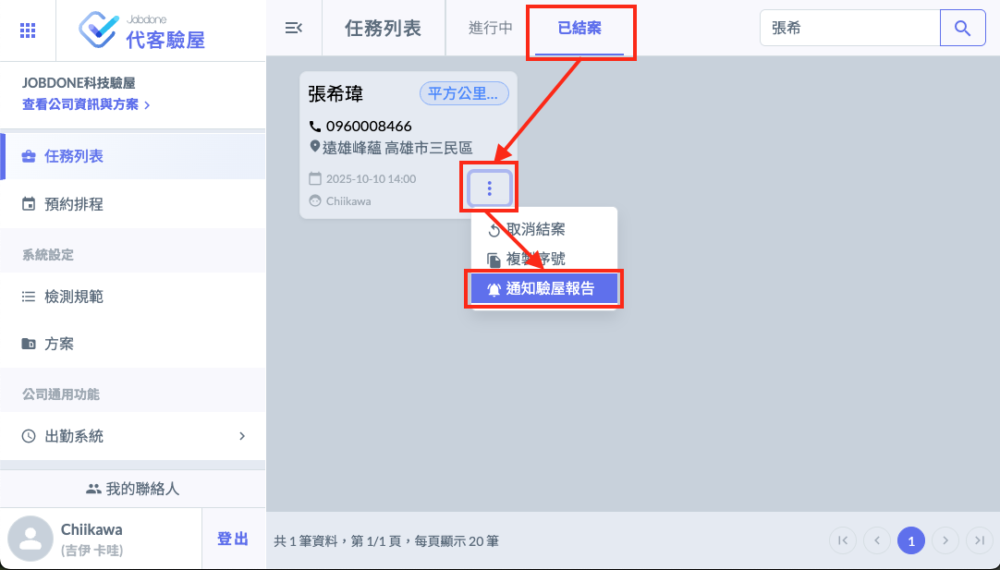
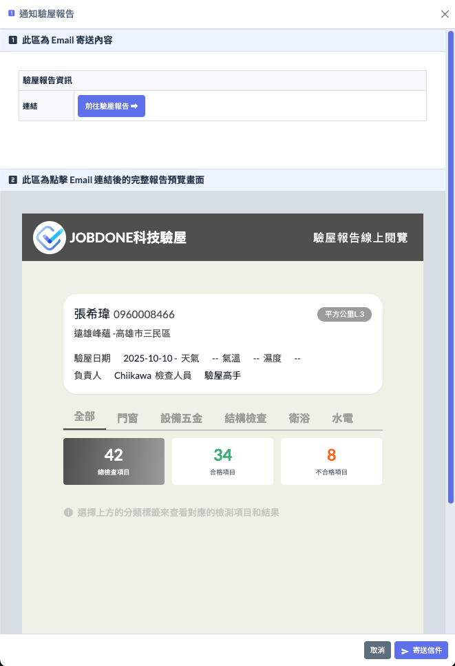
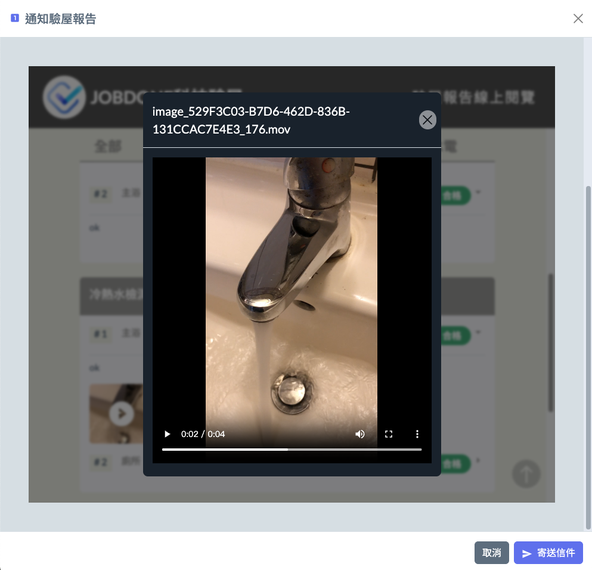

# 驗屋報告

#### 過去六年來，5\~8天交付驗屋報告是很正常的事。

過去傳統驗屋完成後需要5\~8天的時間，才能交付驗屋報告。因為回公司彙整驗屋報告是一件非常繁瑣的工作，助理小妹要將每一位工程師提供的照片、檢驗紀錄彙整成一份精美的驗屋報告，總是需要花費半天以上的時間。也有專門幫驗屋公司做驗屋報告的個人工作室，一份驗屋報告收費500\~800元不等。所以花個5-8天交付驗屋報告是很平常的事。

#### 但是，從2025年Jobdone驗屋APP上線之後，改寫驗屋報告交付的歷史。遠雄晴川 168戶、遠雄幸福成 2,454戶全面使用Jobdone驗屋系統，驗屋工作完成『立刻』提供驗屋報告給屋主簽收，無論初驗、複驗、交屋都是同樣的效率。

如果您的屋主還是喜歡紙本驗屋報告。驗屋完成＝驗屋報告完成，Jobdone可以直接產生PDF檔列印

#### 線上驗屋報告：已成為驗屋市場的主流。

1. 在Jobdone代客驗屋管理介面的任務列表右邊，選擇 『已結案』的頁籤，針對要發出線上驗屋報告的客戶，點選『通知驗屋報告』的按鈕。

2. 就可以預覽屋主看到的驗屋報告內容。確認內容沒有問題，就可以按下『寄送郵件』的按鈕。

3. 屋主不只可以看到清晰的照片之外，還可以看到實際檢測的影片，效果比紙本的驗屋報告更加精緻且環保，對於手機不離身的現代人而言，在手機上就可以查看驗屋報告結果，其實更加方便也是市場趨勢。

