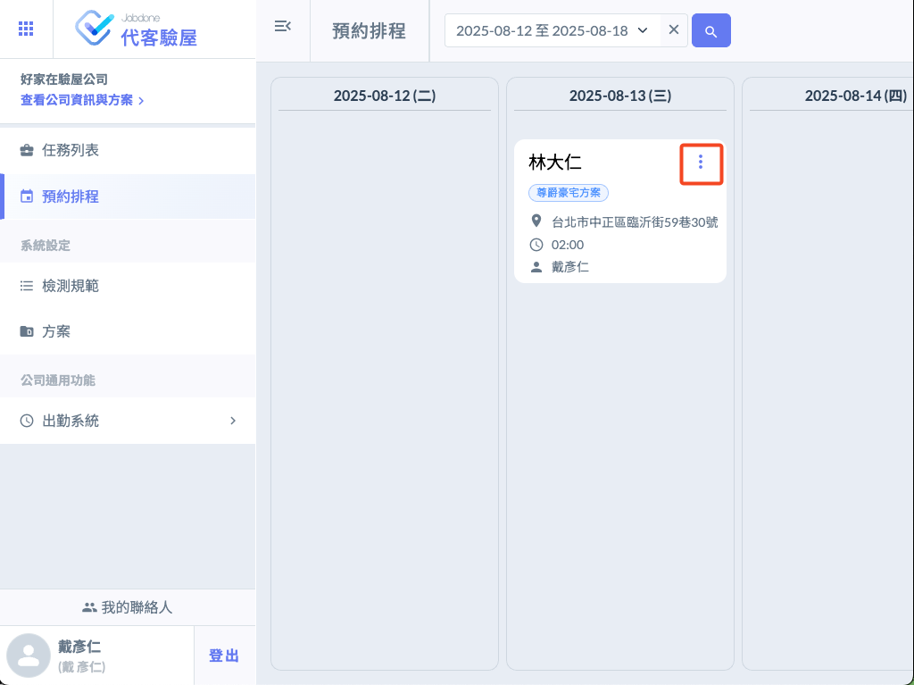
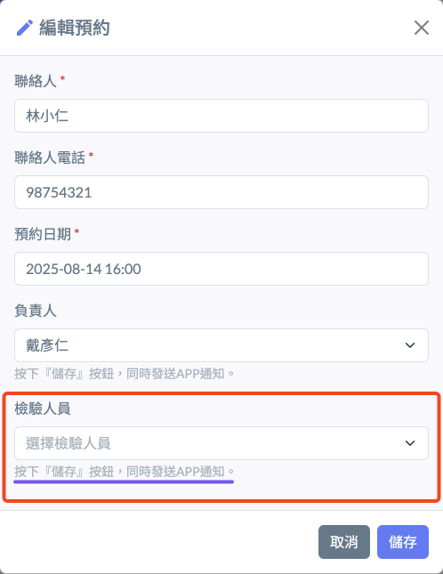
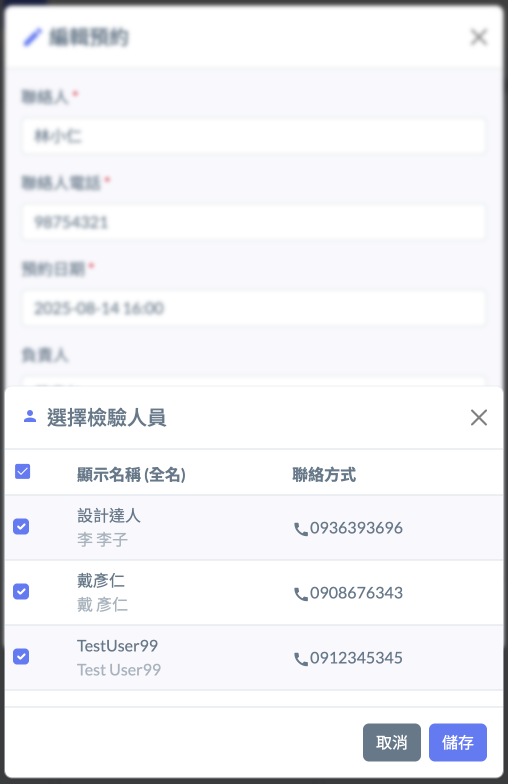

# 預約排程

> ### 任務中的預約時間，會直接出現在排程表

* 可以在預約排程中清楚的看到每天所排定的工作量以及地點。
* 從排程中，可以直接修改時間、驗屋當日聯絡人、聯絡人電話。
* 可以在預約時間到之前，指派檢驗人員。

#### 非預約相關的其它資訊修改需要到 [『任務列表』 ](ren-wu-lie-biao)下進行。

#### 選擇要指派到現場的檢驗人員

!!! info
    所有公司下的成員、或者有加入聯絡人的人員都可以被指派。沒有購買授權的檢驗人員只能使用APP執行檢查工作。

#### 被指派者會立刻收到APP通知

