# 註冊Jobdone代客驗屋



#### 下載：安裝Jobdone代客驗屋APP

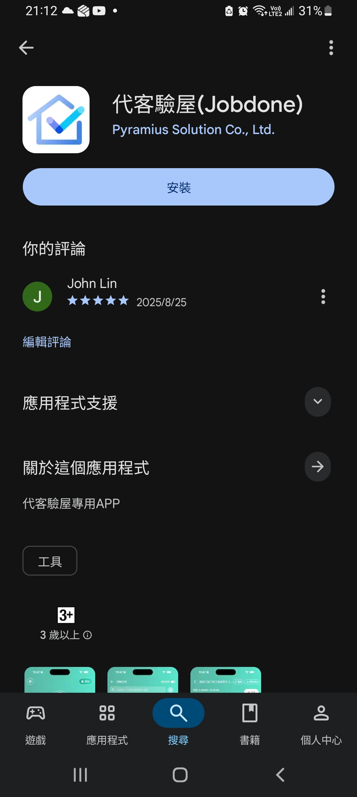




#### 註冊：按下「註冊」按鈕註冊帳號




#### 註冊ID、密碼、勾選並同意隱私聲明、按下「註冊」按鈕。

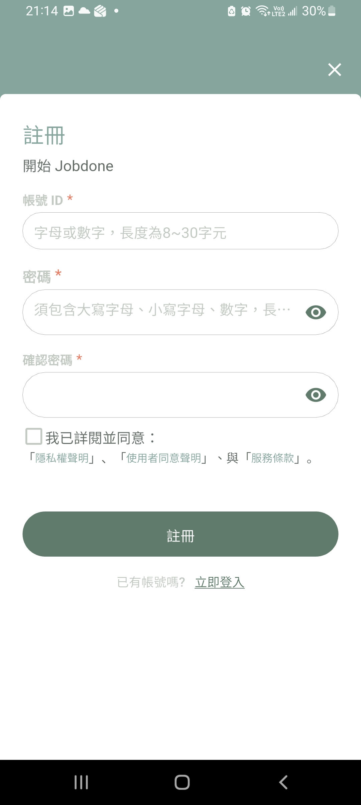




#### 輸入您的手機號碼，按下「驗證手機」按鈕。

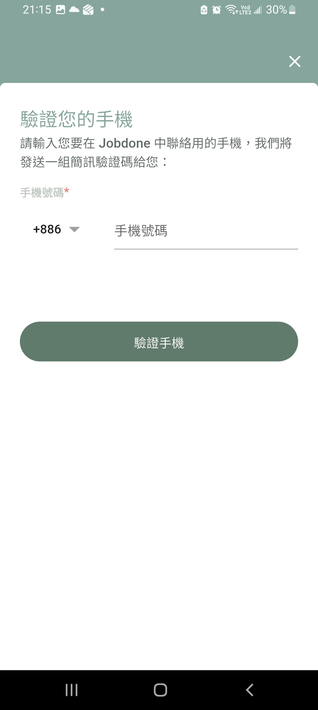




#### 驗證通過就會看到Jobdone代客驗屋APP首頁，表示註冊成功。

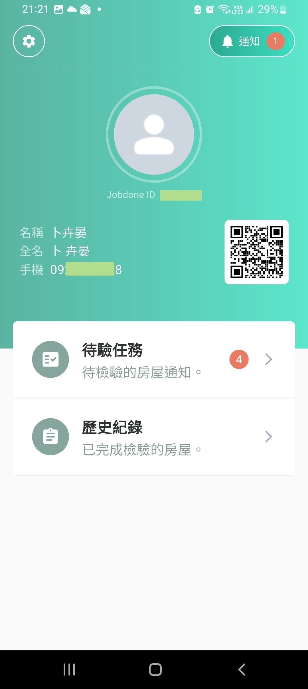




#### 此時，Jobdone代客驗屋APP應該沒有資料可以使用。所以我們需要登入到Jobdone網站，進行驗屋工作的設定。請使用「電腦的瀏覽器」連結到 https://www.jobdone.cc&#x20;

#### 點選右上角的『註冊/登入Jobdone』按鈕。







#### 將剛才註冊的帳號及密碼登入Jobdone系統，按下「登入」按鈕。

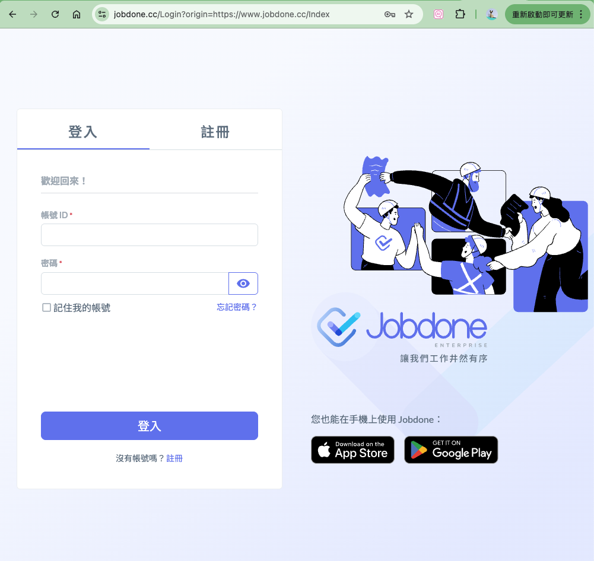



#### 登入進來需要先建立公司，請選擇『建立公司，申請試用』按鈕。

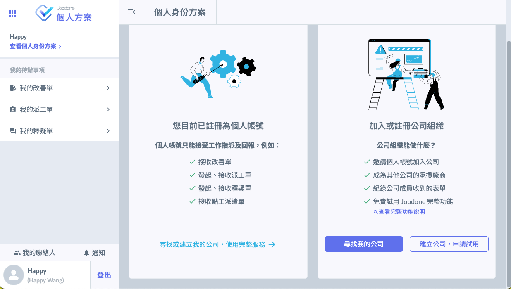

#### 選擇公司適用的模組，請選擇『代客驗屋』，按下建立公司按鈕。

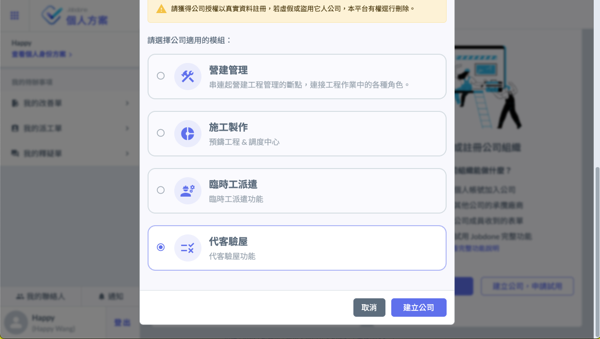

#### 公司建立完成會出現以下畫面，請按下『申請免費試用』

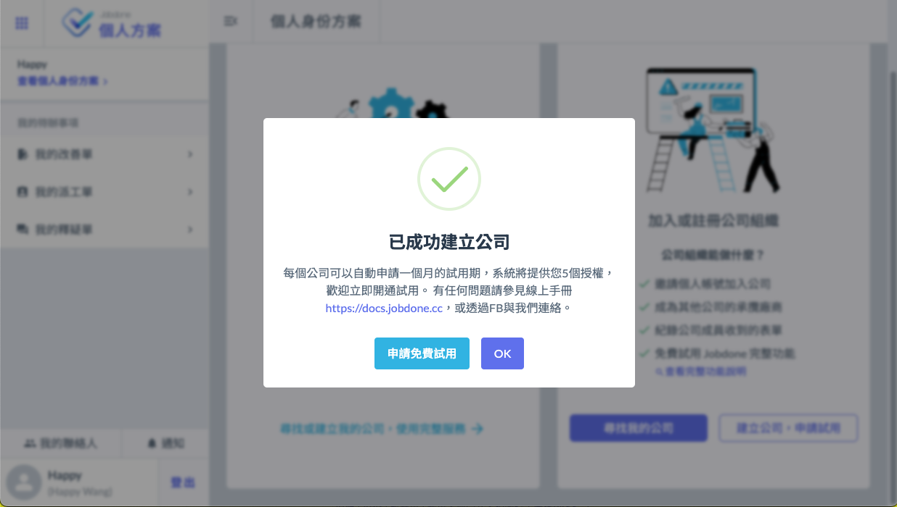

#### 此時會提供30天的免費試用期

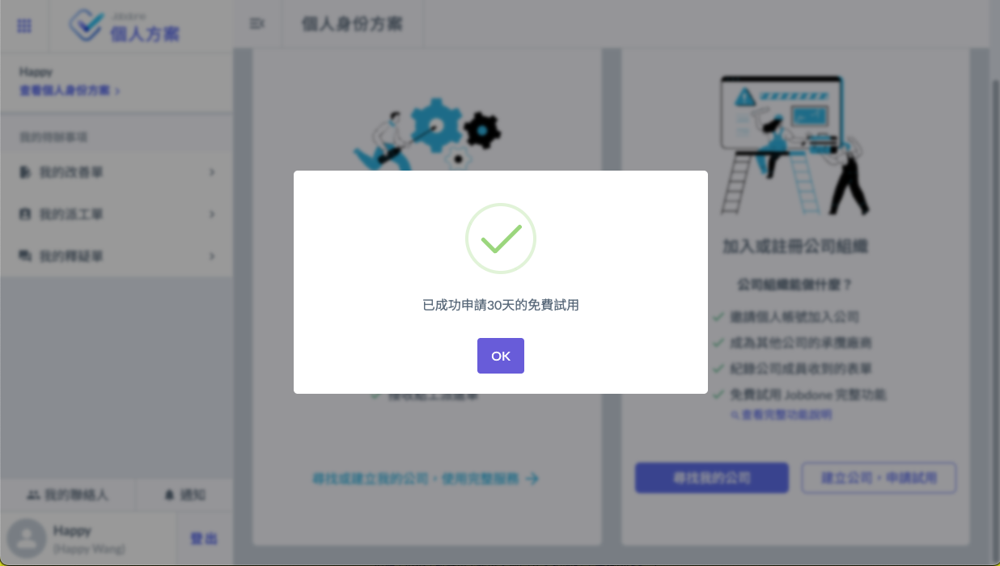

#### 接下來會看到免費試用的期限，請點選左上角的『九個點』，選擇『Jobdone客驗屋』

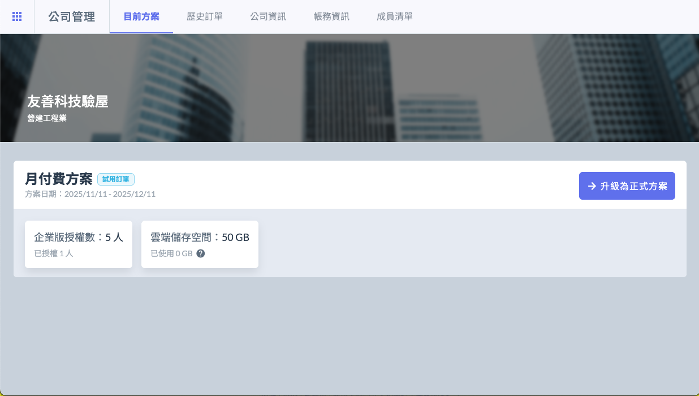

#### 就會看到以下操作畫面，下一個章節將介紹系統設定。

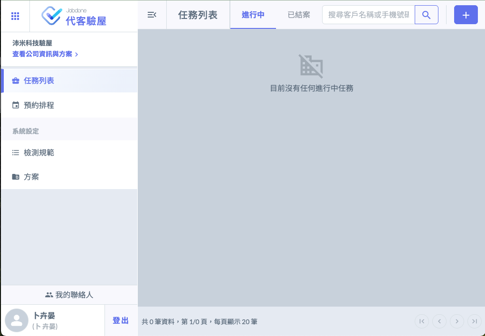


