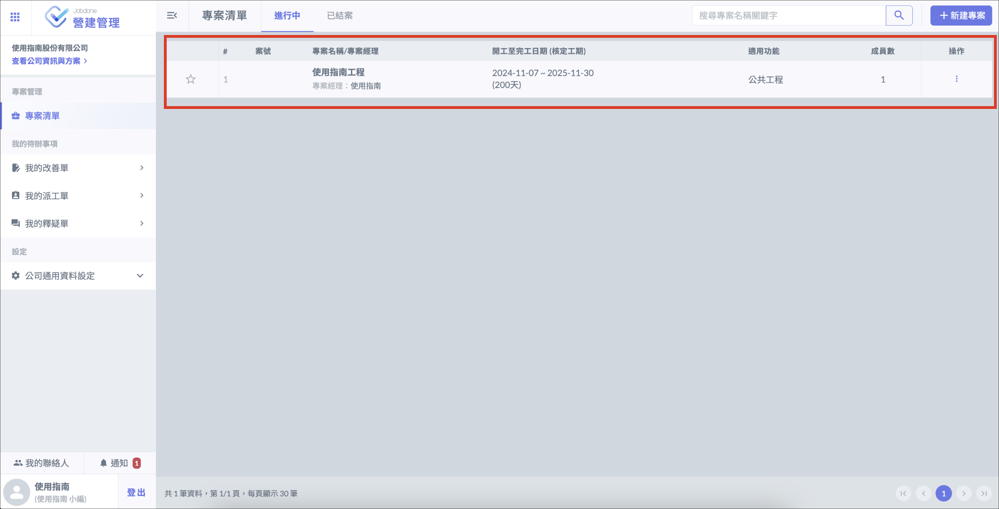
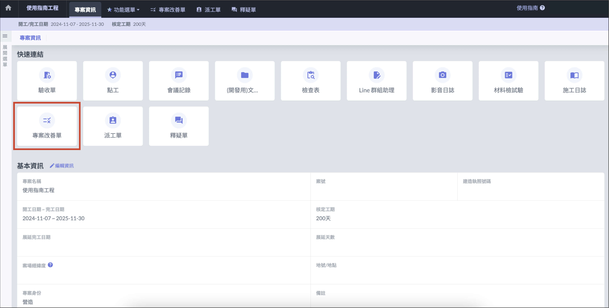
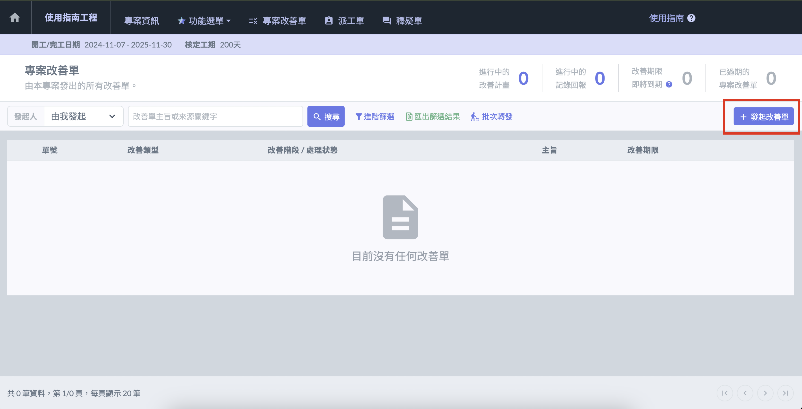
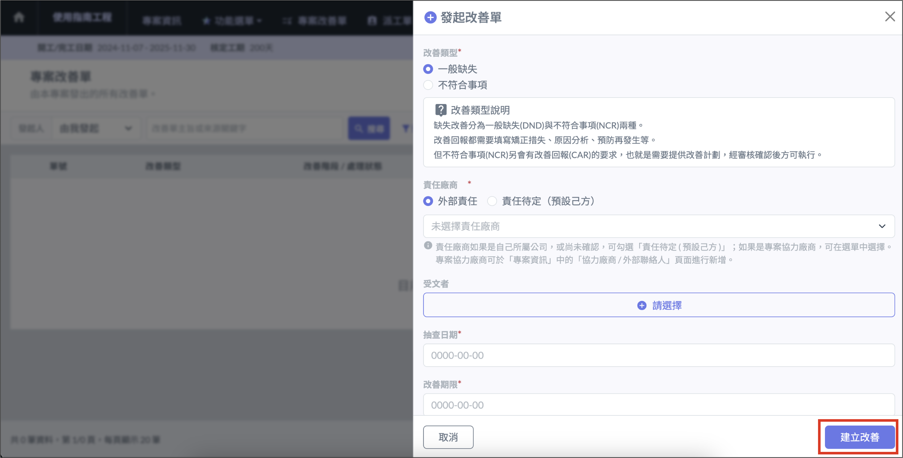
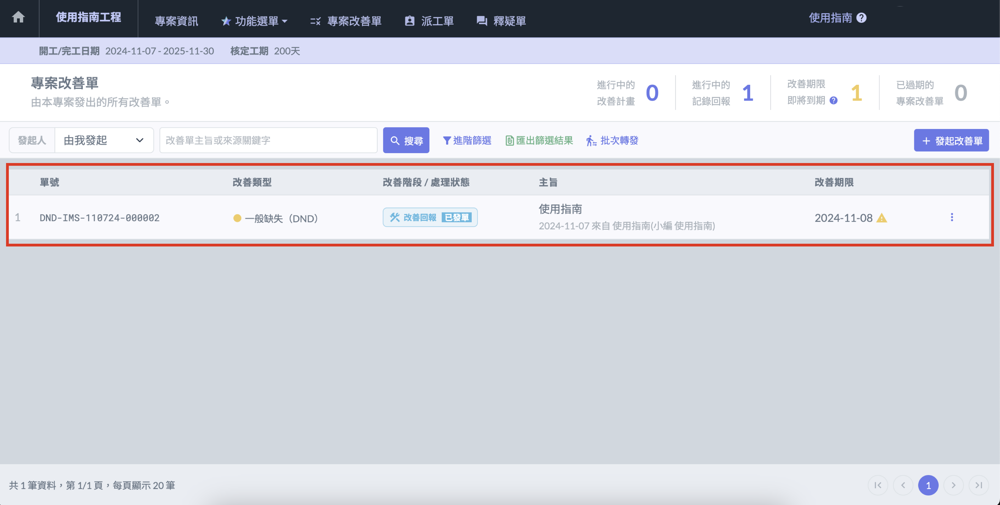

# 改善單

## 發起改善單

!!! info
    需要先完成前置作業中的[**建立公司專案**](qian-zhi-zuo-ye/jian-li-gong-si-zhuan-an)，才可發起改善單。

在專案清單中選擇公司專案，點選 「 專案改善單 」 進入改善單介面，選擇右上角 「 ＋發起改善單 」，填寫內容後，即可發起改善單。

## 查看改善單回報

進入改善單介面後，即可看見改善單的回報情形，點擊指定改善單可查閱更詳細的內容。

## 更多改善單功能

關於填寫改善單回報、工地主任審核等更多功能，請參考[**我的改善單**](../account/corrective_action)及[**專案改善單**](../project_level/corrective)。
