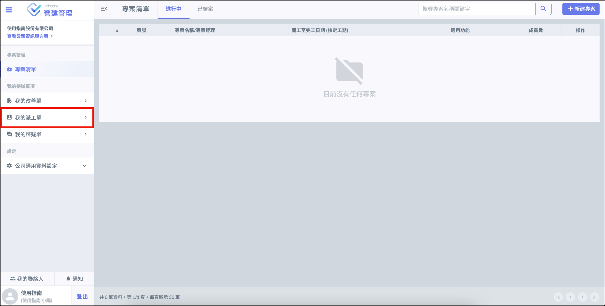
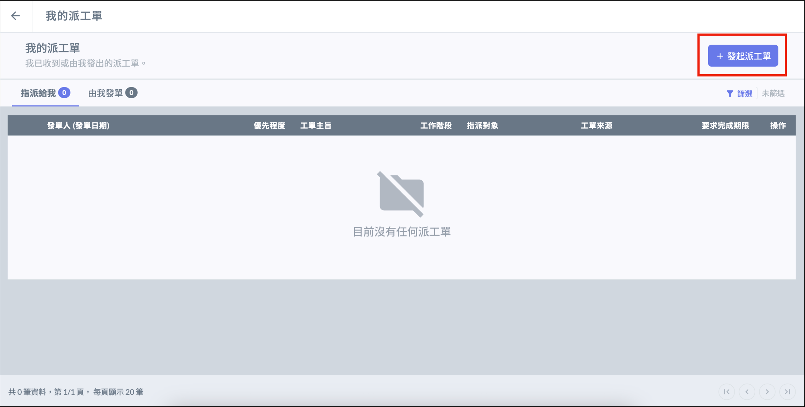
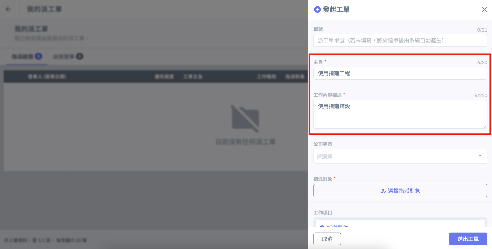
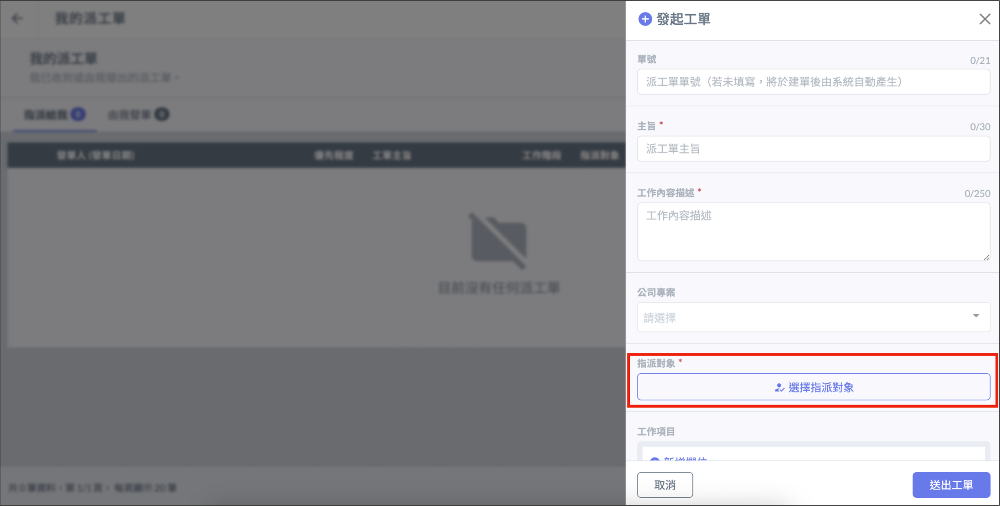
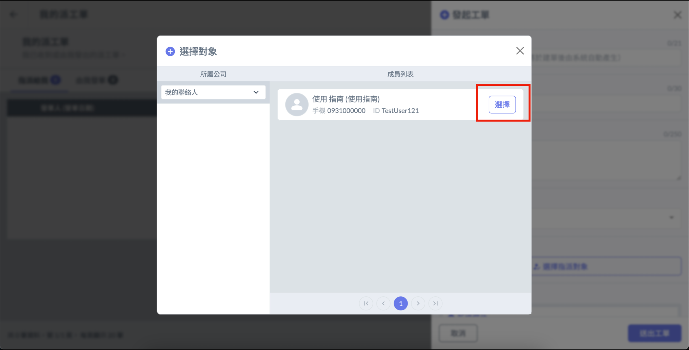
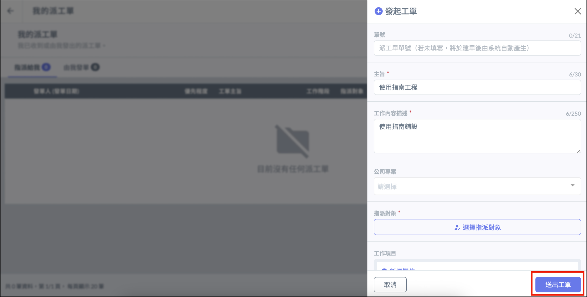

# 派工單

派工單功能用於指派個人負責執行的工作，並可要求指派對象完成後回報完成情況。

登入帳號後，在系統畫面中選擇 「 我的派工單 」 進入派工單介面。

# 發起一般派工單

選擇右上角的 「 ＋發起派工單 」，填寫派工單內容欄位，點選 「 選擇指派對象 」，選擇派工對象後即可送出工單。

!!! warning
    需先將要指派的對象[加入聯絡人]()，才能在派工單中選取。

# 發起專案派工單

如果要將派工單歸類在公司專案下，可在填寫欄位時選擇 「 公司專案 」。

!!! warning
    需要先[建立公司專案]()後，才可以在派工單中選取。

# 查看派工單回報

在我的派工單中選擇 「 由我發單 」 介面，即可看到該派工單的回報情況。

