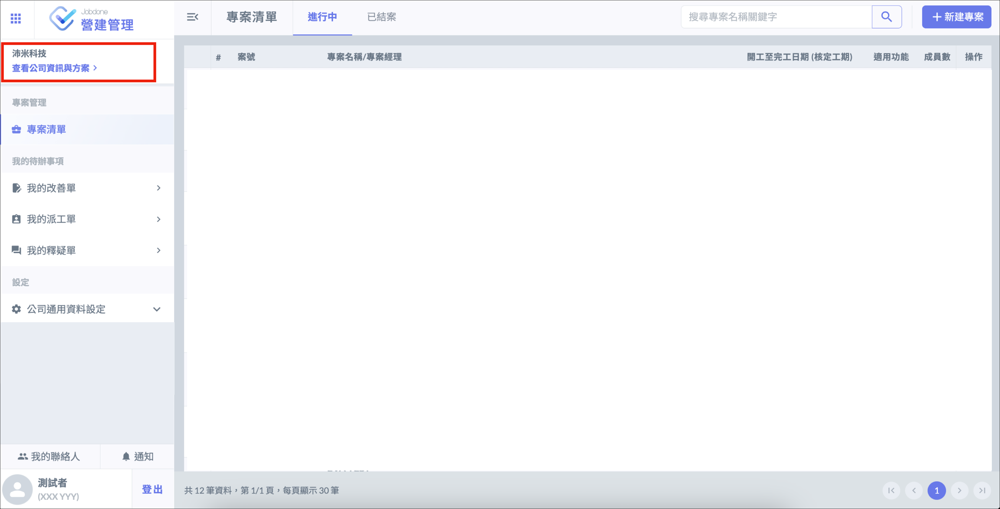

# 功能授權

!!! warning
    公司多數功能需授權才能使用，開始操作 Jobdone 前務必先完成此步驟。

# 指派授權

建立或加入公司後，點選 「 查看公司資訊與方案 」，選擇 「 成員清單 」，在要授權的成員旁邊點選 「** ⋮ **」，將 「 企業版模組 」 一欄打開後點選 「 儲存 」。

!!! info
    擁有 [帳號管理權限]() 的公司成員才可以指派授權。

