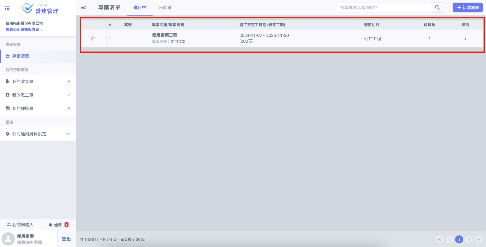
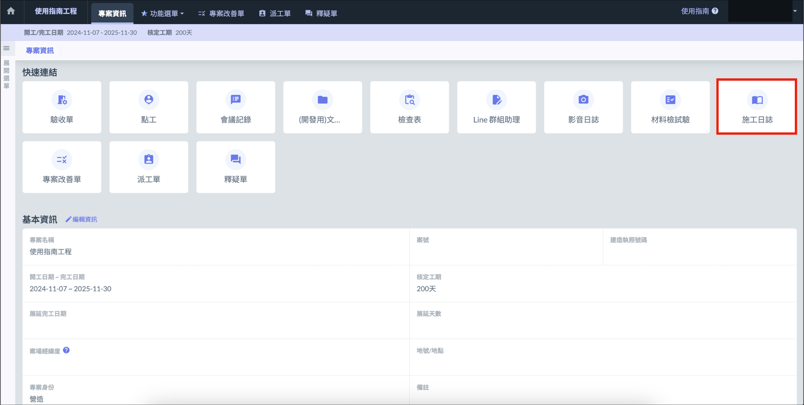
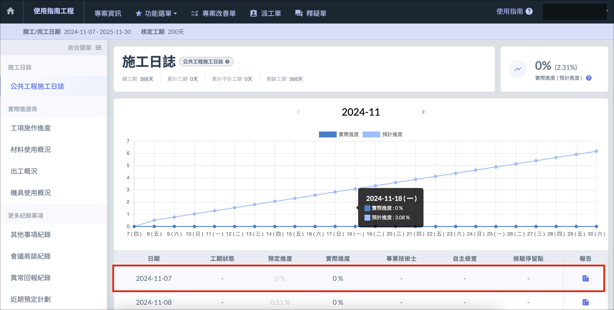
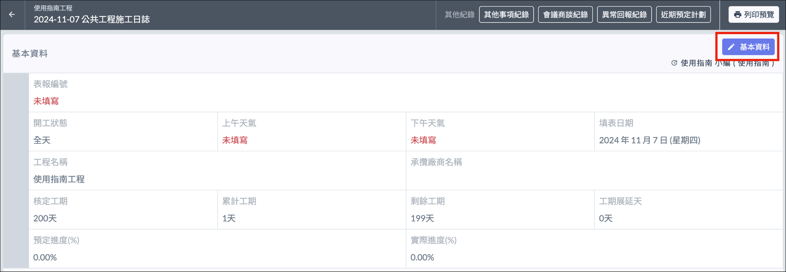

# 選擇施工日誌類型

首次登入施工日誌時，需選擇施工日誌的類型，可選擇 「 標準版 」 或 「 精簡版 」。

- 標準版：符合公共工程會標準版本的施工日誌，含實際進度表及更多紀錄事項，填寫施工概況、材料等日誌內容須先至專案設定中進行設定。
- 精簡版：僅包含更多紀錄事項，不含實際進度表，填寫施工概況、材料等內容直接進行填寫即可。

# 施工日誌介面

選擇想要建立施工日誌的專案，進入專案介面後點選 「 施工日誌 」，即可進入施工日誌介面。

# 填寫基本資訊

1. 進入施工日誌介面後，選擇想要填寫的日期
2. 點選右上角 「 基本資料 」，填寫開工狀態 ( 必填 )、表報編號、上午天氣、下午天氣等資訊，完成後點選 「 儲存變更 」。

