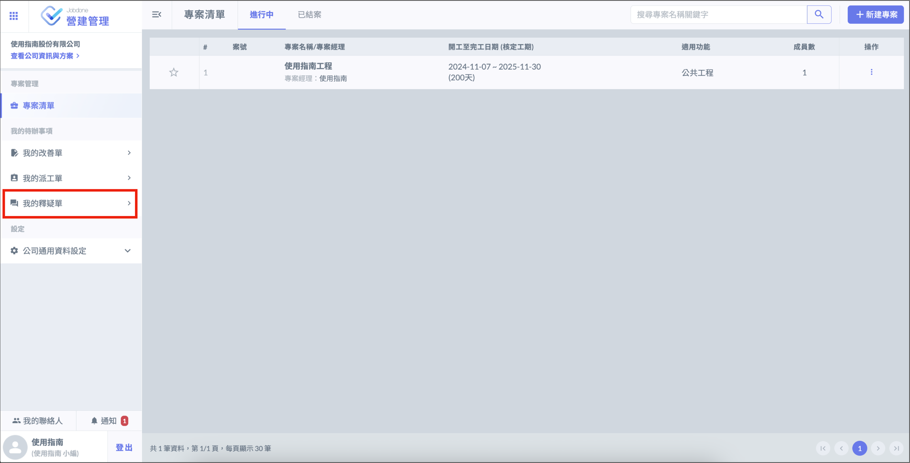
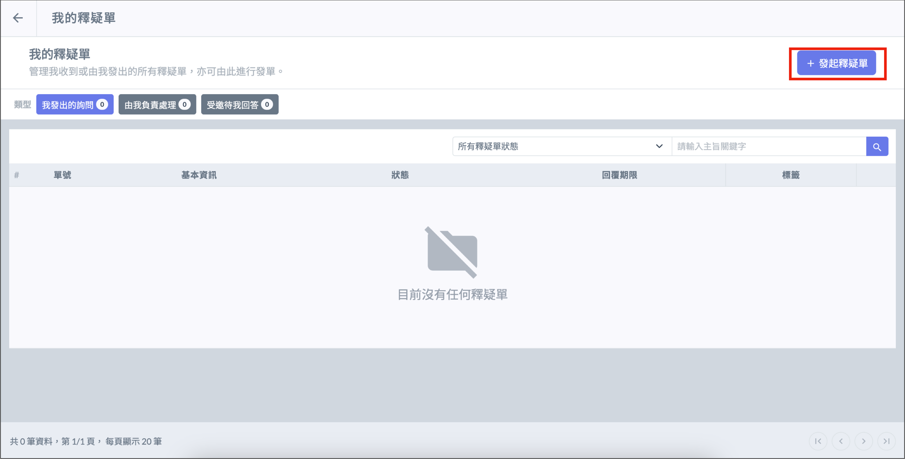
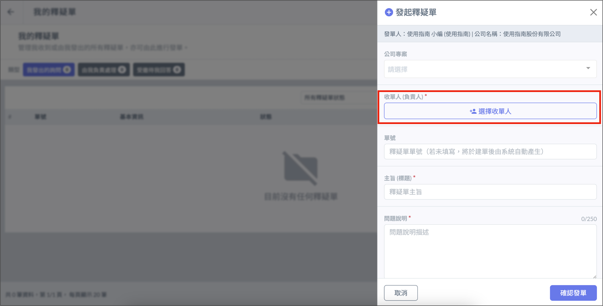
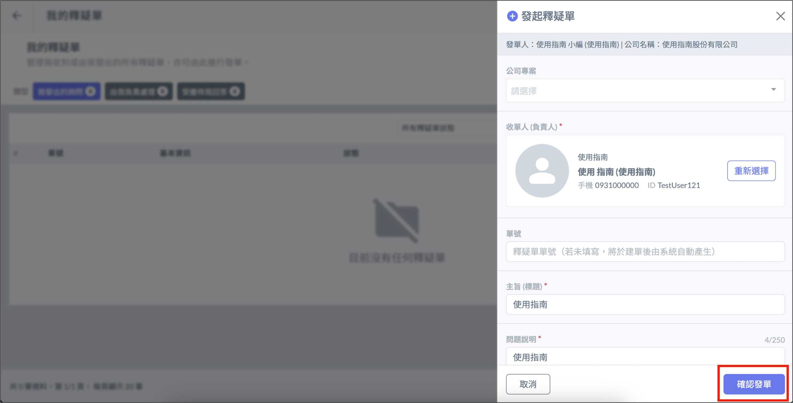
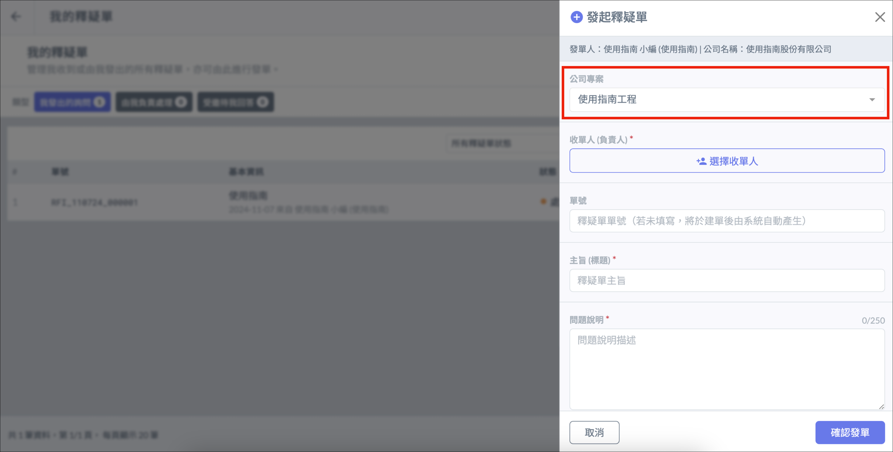

# 釋疑單

釋疑單又稱工詢單 ( 工程詢問單 )，當施工過程中需取得授權，或是有即時事項需要溝通或詢問，就可以發起釋疑單。以獲得有決定權的回覆並留下紀錄。

登入帳號後，在系統畫面中選擇 「 我的釋疑單 」 進入釋疑單介面。

# 發起釋疑單

選擇右上角 「 ＋發起釋疑單 」 ，填寫釋疑單內容欄位，點選 「 選擇指派對象 」，選擇收單人後點選 「 確認發單 」 即可送出釋疑單。

!!! warning
    需先將收單人[加入聯絡人]()，才能在釋疑單中選取。

# 專案釋疑單

如果要將改善單歸類在公司專案下，可在填寫欄位時選擇 「 公司專案 」。

!!! warning
    需要先[建立公司專案]()後，才可以在釋疑單中選取。

# 查看釋疑單

進入改善單介面後，即可看見釋疑單的回報情形，點擊指定釋疑單可查閱更詳細的內容。

